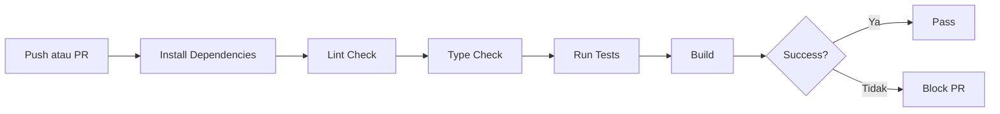
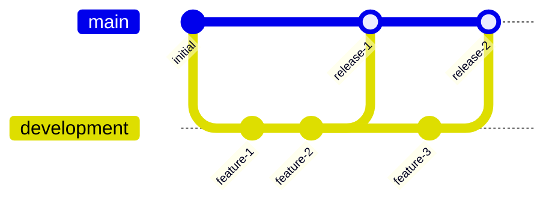

# Development Guide

## Linter dan Formatter

### Backend (Python)

| Tool | Purpose |
|------|---------|
| Ruff | Linter dan formatter (mengganti Flake8, Black, isort) |
| mypy | Type checker |
| pytest | Testing framework |

### Frontend (TypeScript)

| Tool | Purpose |
|------|---------|
| ESLint | Linter |
| Prettier | Formatter |
| Vitest | Testing framework |

---

## Pre-commit Hooks

Hooks yang dijalankan sebelum commit:

- Format check
- Lint check
- Type check
- Test (untuk changed files)

---

## CI/CD Pipeline

GitHub Actions workflow dijalankan pada:
- Push ke branch `main` dan `development`
- Pull request ke branch `main` dan `development`

### Stages



---

## Scripts

### Frontend Scripts

| Command | Deskripsi |
| ------- | --------- |
| `npm run dev` | Jalankan development server |
| `npm run build` | Build production |
| `npm run lint` | Jalankan ESLint |
| `npm run lint:fix` | Fix ESLint errors |
| `npm run format` | Jalankan Prettier |
| `npm run format:check` | Check format |
| `npm run typecheck` | TypeScript type check |
| `npm run test` | Run tests |
| `npm run test:coverage` | Run tests with coverage |

### Backend Scripts

| Command | Deskripsi |
| ------- | --------- |
| `uvicorn app.main:app --reload` | Jalankan development server |
| `ruff check .` | Run Ruff linter |
| `ruff format .` | Format dengan Ruff |
| `mypy app/` | Run mypy type check |
| `pytest` | Run Python tests |
| `pytest --cov=app` | Run tests with coverage |
| `alembic upgrade head` | Run migrations |

---

## Branch Strategy



| Branch | Keterangan |
|--------|------------|
| main | Production-ready code |
| development | Active development |

---

## Commit Convention

Format: `type(scope): description`

| Type | Keterangan |
|------|------------|
| feat | New feature |
| fix | Bug fix |
| docs | Documentation |
| style | Code style |
| refactor | Code refactoring |
| test | Testing |
| chore | Maintenance |

**Contoh:**
- `feat(photo): add photo upload functionality`
- `fix(auth): handle null response from token validation`
- `docs(readme): update setup instructions`

---

## File Structure

```
scalp-analytics/
├── .github/
│   └── workflows/
│       └── development.yml       # CI/CD pipeline
├── .husky/
│   ├── pre-commit                # Pre-commit hooks
│   └── commit-msg                 # Commit message validation
├── backend/
│   ├── app/
│   ├── tests/
│   ├── alembic/
│   ├── pyproject.toml            # Ruff, mypy, pytest config
│   ├── requirements.txt          # Production dependencies
│   └── requirements-dev.txt      # Development dependencies
├── frontend/
│   ├── app/
│   ├── components/
│   ├── hooks/
│   ├── lib/
│   ├── types/
│   ├── .eslintrc.json            # ESLint config
│   ├── .prettierrc               # Prettier config
│   ├── tsconfig.json             # TypeScript config
│   └── package.json              # Dependencies
├── Documentation/
│   ├── PRD.md
│   ├── MVP.md
│   ├── ROADMAP.md
│   ├── ARCHITECTURE.md
│   ├── TECH-STACK.md
│   ├── DATABASE-SCHEMA.md
│   ├── API-DESIGN.md
│   ├── USER-FLOW.md
│   └── AI-TRAINING.md
├── README.md
├── AGENTS.md
└── DEVELOPMENT.md
```

---

## Code Review Checklist

### Sebelum Submit PR

- [ ] Code mengikuti style guide
- [ ] Lint check passing
- [ ] Type check passing
- [ ] Tests passing
- [ ] Tidak ada commented code
- [ ] Tidak ada console.log atau print debugging
- [ ] Dokumentasi diupdate jika perlu

### Review Guidelines

- Pastikan code mudah dibaca
- Periksa apakah ada code duplication
- Validasi error handling
- Periksa security concerns
- Pastikan tests cukup

---

## Testing Guidelines

### Backend Testing

```python
# Contoh test structure
import pytest
from unittest.mock import AsyncMock, MagicMock
from app.services.photo_service import PhotoService

@pytest.fixture
def photo_service():
    photo_repo = MagicMock()
    ai_service = MagicMock()
    return PhotoService(photo_repo, ai_service)

@pytest.mark.asyncio
async def test_upload_and_analyze(photo_service):
    # Arrange
    user_id = UUID("test-uuid")
    image_data = b"fake_image"
    angle = PhotoAngle.FRONT
    
    # Act
    result = await photo_service.upload_and_analyze(user_id, image_data, angle)
    
    # Assert
    assert result is not None
```

### Frontend Testing

```typescript
// Contoh test structure
import { render, screen } from '@testing-library/react'
import { PhotoUpload } from './PhotoUpload'

describe('PhotoUpload', () => {
  it('renders upload button', () => {
    render(<PhotoUpload onUpload={jest.fn()} />)
    expect(screen.getByRole('button')).toBeInTheDocument()
  })
})
```

---

## Security Checklist

| Item | Checklist |
|------|-----------|
| Input Validation | Semua input divalidasi dengan Pydantic / Zod |
| Authentication | JWT dengan expiry time |
| Authorization | Role-based access control |
| Password | Hash dengan bcrypt |
| Secrets | Environment variables, tidak di-commit |
| HTTPS | Wajib di production |
| SQL Injection | Gunakan ORM / parameterized queries |
| XSS | Sanitize user input |