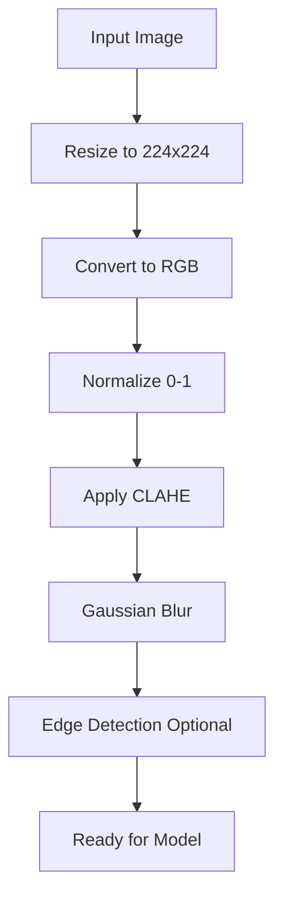
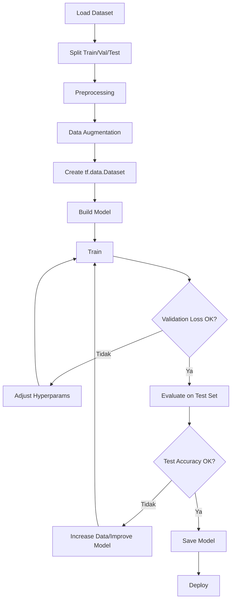
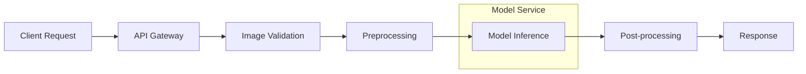
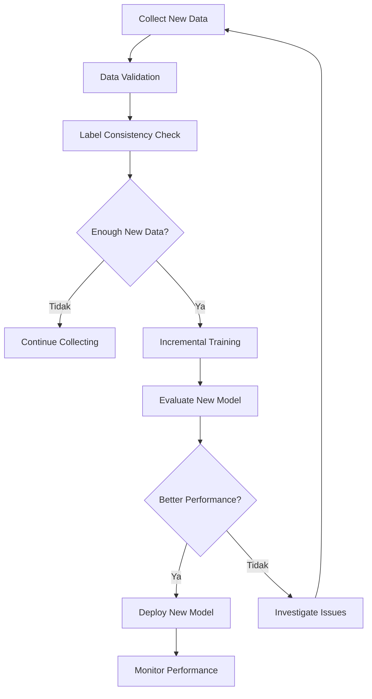
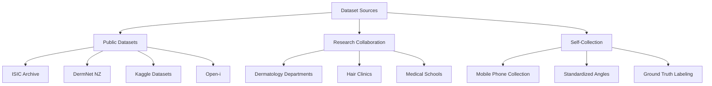
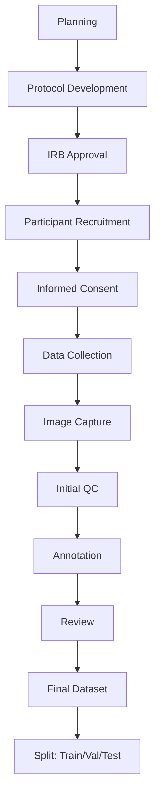

# AI Model Training Guide

## Informasi Dokumen

| Field | Nilai |
|-------|-------|
| **Proyek** | Scalp Analytics |
| **Model** | Hair Density CNN |

---

## 1. Gambaran Umum

### 1.1 Tujuan Model
Model AI digunakan untuk menganalisis foto kulit kepala dan menghitung persentase kepadatan rambut. Model ini menggunakan Convolutional Neural Network (CNN) yang di-train pada dataset foto kulit kepala.

### 1.2 Arsitektur Model

```mermaid
flowchart LR
    subgraph "Input"
        A[Image 224x224x3]
    end
    
    subgraph "Preprocessing"
        B[Resize & Normalize]
        C[Noise Reduction]
        D[Contrast Enhancement]
    end
    
    subgraph "Feature Extraction"
        E[MobileNetV2 Base]
        F[Global Average Pooling]
    end
    
    subgraph "Classification Head"
        G[Dense 128 ReLU]
        H[Dropout 0.3]
        I[Dense 64 ReLU]
        J[Dense 1 Sigmoid]
    end
    
    subgraph "Output"
        K[Density 0-100%]
    end
    
    A --> B --> C --> D
    D --> E --> F
    F --> G --> H --> I --> J
    J --> K
```



---

## 2. Persiapan Dataset

### 2.1 Struktur Dataset

```
dataset/
├── train/
│   ├── frontal/
│   │   ├── high_density/
│   │   ├── medium_density/
│   │   └── low_density/
│   ├── top/
│   │   ├── high_density/
│   │   ├── medium_density/
│   │   └── low_density/
│   └── side/
│       ├── high_density/
│       ├── medium_density/
│       └── low_density/
├── validation/
│   └── [same structure as train]
└── test/
    └── [same structure as train]
```

### 2.2 Kriteria Dataset

| Kriteria | Persyaratan |
|----------|-------------|
| Jumlah Data | Minimum 1.000 gambar per sudut |
| Resolusi | Minimum 720p, direkomendasikan 1080p |
| Format | JPEG, PNG |
| Variasi Pencahayaan | Indoor, outdoor, flash |
| Variasi Kondisi | Berbagai tingkat kebotakan |
| Anotasi | Persentase kepadatan (ground truth) |

### 2.3 Ground Truth Annotation

```python
# Contoh format annotation CSV
# filename, angle, density_percentage, confidence

front_001.jpg,front,85.5,0.95
front_002.jpg,front,72.3,0.88
top_001.jpg,top,78.1,0.92
side_001.jpg,side,81.0,0.90
```

---

## 3. Preprocessing Pipeline

### 3.1 Langkah Preprocessing



### 3.2 Implementasi Preprocessing

```python
# ai/preprocessing/image_processor.py
import cv2
import numpy as np
from PIL import Image
from typing import Tuple

class ImagePreprocessor:
    """
    Preprocessor untuk foto kulit kepala sebelum input ke model.
    """
    
    def __init__(self, target_size: Tuple[int, int] = (224, 224)):
        self.target_size = target_size
    
    def preprocess(self, image_path: str) -> np.ndarray:
        """
        Preprocess gambar untuk input model.
        
        Args:
            image_path: Path ke file gambar
            
        Returns:
            Numpy array siap untuk model (1, 224, 224, 3)
        """
        image = self._load_image(image_path)
        image = self._resize(image)
        image = self._apply_clahe(image)
        image = self._normalize(image)
        image = self._add_batch_dimension(image)
        return image
    
    def _load_image(self, path: str) -> np.ndarray:
        """Load gambar dan konversi ke RGB."""
        image = cv2.imread(path)
        if image is None:
            raise ValueError(f"Tidak dapat load gambar: {path}")
        return cv2.cvtColor(image, cv2.COLOR_BGR2RGB)
    
    def _resize(self, image: np.ndarray) -> np.ndarray:
        """Resize gambar ke target size."""
        return cv2.resize(image, self.target_size, interpolation=cv2.INTER_LINEAR)
    
    def _apply_clahe(self, image: np.ndarray) -> np.ndarray:
        """Apply CLAHE untuk enhancement kontras."""
        lab = cv2.cvtColor(image, cv2.COLOR_RGB2LAB)
        l, a, b = cv2.split(lab)
        clahe = cv2.createCLAHE(clipLimit=2.0, tileGridSize=(8, 8))
        l = clahe.apply(l)
        lab = cv2.merge([l, a, b])
        return cv2.cvtColor(lab, cv2.COLOR_LAB2RGB)
    
    def _normalize(self, image: np.ndarray) -> np.ndarray:
        """Normalize pixel values ke [0, 1]."""
        return image.astype(np.float32) / 255.0
    
    def _add_batch_dimension(self, image: np.ndarray) -> np.ndarray:
        """Add batch dimension untuk model input."""
        return np.expand_dims(image, axis=0)
    
    def detect_hair_regions(self, image: np.ndarray) -> np.ndarray:
        """
        Deteksi region rambut menggunakan edge detection.
        
        Returns:
            Mask dari region rambut terdeteksi
        """
        gray = cv2.cvtColor(image, cv2.COLOR_RGB2GRAY)
        blurred = cv2.GaussianBlur(gray, (5, 5), 0)
        edges = cv2.Canny(blurred, 50, 150)
        contours, _ = cv2.findContours(edges, cv2.RETR_EXTERNAL, cv2.CHAIN_APPROX_SIMPLE)
        mask = np.zeros_like(gray)
        cv2.drawContours(mask, contours, -1, (255), thickness=cv2.FILLED)
        return mask
```

---

## 4. Model Architecture

### 4.1 Architecture Definition

```python
# ai/models/hair_density_model.py
import tensorflow as tf
from tensorflow.keras import layers, models
from typing import Tuple

class HairDensityModel:
    """
    CNN Model untuk prediksi kepadatan rambut.
    Menggunakan transfer learning dengan MobileNetV2 backbone.
    """
    
    def __init__(self, input_shape: Tuple[int, int, int] = (224, 224, 3)):
        self.input_shape = input_shape
        self.model = self._build_model()
    
    def _build_model(self) -> tf.keras.Model:
        """
        Build model architecture.
        
        Returns:
            Compiled Keras model
        """
        # Base model dengan pre-trained weights
        base_model = tf.keras.applications.MobileNetV2(
            input_shape=self.input_shape,
            include_top=False,
            weights='imagenet'
        )
        
        # Freeze base model layers
        base_model.trainable = False
        
        # Build custom head
        model = models.Sequential([
            base_model,
            layers.GlobalAveragePooling2D(),
            layers.Dense(128, activation='relu'),
            layers.Dropout(0.3),
            layers.Dense(64, activation='relu'),
            layers.Dense(1, activation='sigmoid')  # Output: 0-1-> 0-100%
        ])
        
        # Compile model
        model.compile(
            optimizer=tf.keras.optimizers.Adam(learning_rate=0.001),
            loss='mean_squared_error',
            metrics=['mae', 'mse']
        )
        
        return model
    
    def train(
        self,
        train_data: tf.data.Dataset,
        val_data: tf.data.Dataset,
        epochs: int = 50,
        callbacks: list = None
    ) -> tf.keras.callbacks.History:
        """
        Train model dengan data.
        
        Args:
            train_data: Training dataset
            val_data: Validation dataset
            epochs: Number of training epochs
            callbacks: List of callbacks
            
        Returns:
            Training history
        """
        return self.model.fit(
            train_data,
            validation_data=val_data,
            epochs=epochs,
            callbacks=callbacks or []
        )
    
    def predict(self, image: np.ndarray) -> float:
        """
        Prediksi kepadatan rambut dari gambar.
        
        Args:
            image: Preprocessed image array
            
        Returns:
            Density percentage (0-100)
        """
        prediction = self.model.predict(image)
        return float(prediction[0][0] * 100)
    
    def save(self, path: str):
        """Save model ke file."""
        self.model.save(path)
    
    def load(self, path: str):
        """Load model dari file."""
        self.model = tf.keras.models.load_model(path)
```

### 4.2 Model Summary

```
Model: "sequential"
┌─────────────────────────────────────────────────────────────────┐
│ Layer (type)                   │ Output Shape       │ Param #   │
├─────────────────────────────────────────────────────────────────┤
│ mobilenetv2_1.00_224 (Functio)│ (None, 7, 7, 1280)  │ 2,257,984  │
│ nal)│                        │             │
├─────────────────────────────────────────────────────────────────┤
│ global_average_pooling2d (Glob│ (None, 1280)       │ 0          │
│ alAveragePooling2D)             │                    │            │
├─────────────────────────────────────────────────────────────────┤
│ dense (Dense)                   │ (None, 128)       │ 163,968    │
├─────────────────────────────────────────────────────────────────┤
│ dropout (Dropout)              │ (None, 128)       │ 0          │
├─────────────────────────────────────────────────────────────────┤
│ dense_1 (Dense)                 │ (None, 64)        │ 8,256      │
├─────────────────────────────────────────────────────────────────┤
│ dense_2 (Dense)                 │ (None, 1)         │ 65         │
└─────────────────────────────────────────────────────────────────┘

Total params: 2,430,273 (9.27 MB)
Trainable params: 172,289 (657.32 KB)
Non-trainable params: 2,257,984 (8.62 MB)
```

---

## 5. Training Pipeline

### 5.1 Training Flow



### 5.2 Training Script

```python
# ai/training/train.py
import tensorflow as tf
from tensorflow.keras.preprocessing.image import ImageDataGenerator
from tensorflow.keras.callbacks import ModelCheckpoint, EarlyStopping, ReduceLROnPlateau
import os

class ModelTrainer:
    """
    Trainer untuk hair density model.
    """
    
    def __init__(self, data_dir: str, model_dir: str):
        self.data_dir = data_dir
        self.model_dir = model_dir
        self.img_size = (224, 224)
        self.batch_size = 32
    
    def create_data_generators(self):
        """
        Create data generators dengan augmentation.
        """
        train_datagen = ImageDataGenerator(
            rescale=1./255,
            rotation_range=20,
            width_shift_range=0.2,
            height_shift_range=0.2,
            shear_range=0.2,
            zoom_range=0.2,
            horizontal_flip=True,
            fill_mode='nearest'
        )
        
        val_datagen = ImageDataGenerator(rescale=1./255)
        
        train_generator = train_datagen.flow_from_directory(
            os.path.join(self.data_dir, 'train'),
            target_size=self.img_size,
            batch_size=self.batch_size,
            class_mode='input',  # Regression
            shuffle=True
        )
        
        val_generator = val_datagen.flow_from_directory(
            os.path.join(self.data_dir, 'validation'),
            target_size=self.img_size,
            batch_size=self.batch_size,
            class_mode='input',
            shuffle=False
        )
        
        return train_generator, val_generator
    
    def get_callbacks(self):
        """
        Define training callbacks.
        """
        return [
            ModelCheckpoint(
                filepath=os.path.join(self.model_dir, 'best_model.h5'),
                monitor='val_loss',
                save_best_only=True,
                verbose=1
            ),
            EarlyStopping(
                monitor='val_loss',
                patience=10,
                verbose=1,
                restore_best_weights=True
            ),
            ReduceLROnPlateau(
                monitor='val_loss',
                factor=0.5,
                patience=5,
                verbose=1
            )
        ]
    
    def train(self, epochs: int = 50):
        """
        Run training pipeline.
        """
        # Create model
        model = HairDensityModel().model
        
        # Create data generators
        train_gen, val_gen = self.create_data_generators()
        
        # Train
        history = model.fit(
            train_gen,
            validation_data=val_gen,
            epochs=epochs,
            callbacks=self.get_callbacks()
        )
        
        return history
    
    def evaluate(self, model_path: str, test_dir: str):
        """
        Evaluate model on test set.
        """
        model = tf.keras.models.load_model(model_path)
        
        test_datagen = ImageDataGenerator(rescale=1./255)
        test_generator = test_datagen.flow_from_directory(
            test_dir,
            target_size=self.img_size,
            batch_size=self.batch_size,
            class_mode='input',
            shuffle=False
        )
        
        results = model.evaluate(test_generator)
        print(f"Test Loss: {results[0]}")
        print(f"Test MAE: {results[1]}")
        
        return results
```

### 5.3 Menjalankan Training

```bash
# Setup environment
cd ai/
python -m venv venv
source venv/bin/activate
pip install -r requirements.txt

# Prepare dataset
python scripts/prepare_dataset.py --input raw_data/ --output dataset/

# Run training
python training/train.py --data-dir dataset/ --model-dir models/ --epochs 50

# Evaluate model
python training/evaluate.py --model-path models/best_model.h5 --test-dir dataset/test/

# Export for production
python scripts/export_model.py --model-path models/best_model.h5 --output models/production/
```

---

## 6. Evaluation Metrics

### 6.1 Metrics yang Digunakan

| Metric | Deskripsi | Target |
|--------|-----------|--------|
| MAE (Mean Absolute Error) | Rata-rata error absolut | < 5% |
| MSE (Mean Squared Error) | Rata-rata error kuadrat | < 25 |
| R² Score | Koefisien determinasi | > 0.85 |
| Confidence Score | Model confidence | > 0.80 |

### 6.2 Evaluation Script

```python
# ai/evaluation/metrics.py
import numpy as np
from sklearn.metrics import mean_absolute_error, mean_squared_error, r2_score

class ModelEvaluator:
    """
    Evaluator untuk model metrics.
    """
    
    def __init__(self, model, test_data):
        self.model = model
        self.test_data = test_data
        self.predictions = None
        self.ground_truth = None
    
    def evaluate(self):
        """
        Hitung semua metrics.
        """
        # Get predictions
        self.predictions = self.model.predict(self.test_data)
        self.ground_truth = self._get_ground_truth()
        
        # Calculate metrics
        mae = mean_absolute_error(self.ground_truth, self.predictions)
        mse = mean_squared_error(self.ground_truth, self.predictions)
        r2 = r2_score(self.ground_truth, self.predictions)
        
        return {
            'mae': mae,
            'mse': mse,
            'rmse': np.sqrt(mse),
            'r2': r2
        }
    
    def generate_confusion_by_threshold(self, threshold: float = 5.0):
        """
        Generate confusion matrix berdasarkan threshold error.
        """
        errors = np.abs(self.predictions - self.ground_truth)
        correct = (errors < threshold).sum()
        incorrect = (errors >= threshold).sum()
        
        return {
            'correct': correct,
            'incorrect': incorrect,
            'accuracy': correct / (correct + incorrect)
        }
```

---

## 7. Model Deployment

### 7.1 Model Serving



### 7.2 FastAPI Integration

```python
# backend/app/infrastructure/ai/hair_density_service.py
from fastapi import UploadFile
import numpy as np
from PIL import Image
import io
from ai.models.hair_density_model import HairDensityModel
from ai.preprocessing.image_processor import ImagePreprocessor

class HairDensityService:
    """
    Service untuk analisis kepadatan rambut.
    """
    
    def __init__(self, model_path: str):
        self.model = HairDensityModel()
        self.model.load(model_path)
        self.preprocessor = ImagePreprocessor()
    
    async def analyze(self, file: UploadFile) -> dict:
        """
        Analisis foto dan kembalikan hasil.
        
        Args:
            file: Uploaded image file
            
        Returns:
            Analysis result dictionary
        """
        # Load image
        image_bytes = await file.read()
        image = Image.open(io.BytesIO(image_bytes))
        image_array = np.array(image)
        
        # Preprocess
        preprocessed = self.preprocessor.preprocess(image_array)
        
        # Predict
        density = self.model.predict(preprocessed)
        
        # Calculate confidence
        confidence = self._calculate_confidence(preprocessed)
        
        return {
            'density_percentage': round(density, 2),
            'confidence_score': round(confidence, 2),
            'detected_regions': self._count_regions(image_array)
        }
    
    def _calculate_confidence(self, preprocessed: np.ndarray) -> float:
        """
        Hitung confidence score berdasarkan variasi prediksi.
        """
        # Multiple predictions with augmentation
        predictions = []
        for _ in range(5):
            pred = self.model.predict(preprocessed)
            predictions.append(pred)
        
        # Lower variance = higher confidence
        variance = np.var(predictions)
        confidence = 1.0 - (variance / 100.0)  # Normalize
        return max(0.0, min(1.0, confidence))
    
    def _count_regions(self, image: np.ndarray) -> int:
        """
        Hitung region rambut terdeteksi.
        """
        mask = self.preprocessor.detect_hair_regions(image)
        contours, _ = cv2.findContours(
            mask, cv2.RETR_EXTERNAL, cv2.CHAIN_APPROX_SIMPLE
        )
        return len(contours)
```

---

## 8. Monitoring & Maintenance

### 8.1 Model Performance Monitoring

| Metric | Frekuensi Monitoring | Alert Threshold |
|--------|---------------------|-----------------|
| Prediction Latency | Real-time | > 5 seconds |
| Error Rate | Real-time | > 5% |
| MAE on New Data | Weekly | > 7% |
| Model Drift | Monthly | >10% deviation |

### 8.2 Model Retraining



### 8.3 Retraining Trigger

- Kumpulan data baru melebihi 500 sampel
- MAE pada data baru > threshold
- Detected concept drift
- Scheduled quarterly retraining

---

## 9. Best Practices

### 9.1 Data Quality
- Pastikan variasi pencahayaan yang cukup
- Include berbagai tingkat kebotakan
- Anotasi konsisten oleh multiple annotators
- Validasi ground truth dengan expert dermatologist

### 9.2 Model Training
- Gunakan early stopping untuk prevent overfitting
- Implement cross-validation untuk robust evaluation
- Track eksperimen dengan MLflow atau similar
- Save checkpoints secara regular

### 9.3 Production Deployment
- Load model saat startup, bukan per request
- Implement caching untuk predictions yang sama
- Monitor latency dan error rate
- Implement fallback untuk edge cases

---

## 10. Troubleshooting

### 10.1 Common Issues

| Issue | Possible Cause | Solution |
|-------|----------------|----------|
| Low Accuracy | Data kurang variatif | Augmentasi data, koleksi lebih banyak |
| Overfitting | Model terlalu kompleks | Tambah dropout, simplify architecture |
| Low Confidence | Image quality buruk | Improve preprocessing, reject low quality |
| Slow Inference | Model terlalu besar | Quantization, use lighter model |

### 10.2 Performance Optimization

```python
# Quantization untuk inference lebih cepat
import tensorflow as tf

def quantize_model(model_path: str, output_path: str):
    """
    Quantize model untuk inference lebih cepat.
    """
    model = tf.keras.models.load_model(model_path)
    converter = tf.lite.TFLiteConverter.from_keras_model(model)
    converter.optimizations = [tf.lite.Optimize.DEFAULT]
    tflite_model = converter.convert()
    
    with open(output_path, 'wb') as f:
        f.write(tflite_model)
```

---

## 11. Resources

### 11.1 Referensi
- [TensorFlow Documentation](https://www.tensorflow.org/api_docs)
- [MobileNetV2 Paper](https://arxiv.org/abs/1801.04381)
- [Transfer Learning Guide](https://www.tensorflow.org/tutorials/images/transfer_learning)

## 12. Data Sources dan Referensi

### 12.1 Dataset Utama untuk Training

#### 12.1.1 Dataset Hair Loss dan Alopecia

| Dataset | Deskripsi | Jumlah Gambar | Labels | Link |
|---------|-----------|---------------|--------|------|
| **Bald Women Dataset** | Alopecia images wanita dari top dan front | 500+ | 3 classes (Ludwig Scale) | https://github.com/UniData-Medical/bald-women-dataset |
| **HAIRGO Dataset** | Hair loss risk prediction dataset | 1000+ | Risk levels | https://github.com/Helen-ZHOU-3253/HAIRGO-A-Machine-Learning-Model-for-Hair-Loss-Risk-Prediction-and-Early-Assessment |
| **ISIC Archive** | International Skin Imaging Collaboration | 100,000+ | Dermoscopy labels | https://challenge.isic-archive.com/ |
| **HAM10000** | Human Against Machine - Skin Lesion | 10,015 | 7 lesion types | https://dataverse.harvard.edu/dataset.xhtml?persistentId=doi:10.7910/DVN/DBW86T |
| **SD-198** | Skin Disease 198 Dataset | 6,583 | 198 skin conditions | https://www.kaggle.com/datasets/wanderdust/skin-lesion-analyze-dataset |
| **DermNet NZ** | Dermatology Image Library | 20,000+ | Skin conditions | https://dermnetnz.org/ |

#### 12.1.2 Dataset Kulit Kepala dan Rambut

| Dataset | Deskripsi | Keterangan | Link |
|---------|-----------|------------|------|
| **Scalp Images Dataset** | Close-up scalp images | Multiple scalp conditions | Kaggle: scalp-images-dataset |
| **Hair Follicle Dataset** | Microscopic hair images | Follicle analysis | Available upon request from dermatology departments |
| **Dandruff Detection Dataset** | Scalp dandruff images | Classification: normal, mild, moderate, severe | Research institutions collaboration needed |

#### 12.1.3 Dataset Alternatif dan Terkait

| Dataset | Deskripsi | Potensi Penggunaan | Link |
|---------|-----------|-------------------|------|
| **CelebA-HQ** | High-quality celebrity faces | Hairline extraction | http://mmlab.ie.cuhk.edu.hk/projects/CelebA.html |
| **FFHQ** | Flickr-Faces-HQ Dataset | Hair pattern analysis | https://github.com/NVlabs/ffhq-dataset |
| **Skin Lesion Analysis** | ISIC Challenge datasets | Transfer learning | https://challenge.isic-archive.com/data/ |
| **Medical Imaging Datasets** | Open-i, PubMed Central | Hair-related images | https://openi.nlm.nih.gov (via NCBI API) |

### 12.2 Referensi Ilmiah

#### 12.2.1 Penelitian Kebotakan dan Analisis Rambut

| Referensi | Judul | Deskripsi | Link |
|-----------|-------|-----------|------|
| Norwood OT (1975) | Male pattern baldness: classification and incidence | Klasifikasi Norwood Scale | Southern Medical Journal, 1975 |
| Ludwig E (1977) | Classification of the types of androgenetic alopecia | Klasifikasi Ludwig Scale | British Journal of Dermatology, 1977 |
| Hamilton JB (1951) | Patterned loss of hair in man | Studi awal pattern hair loss | Ann N Y Acad Sci, 1951 |
| Olsen EA et al. (2005) | Hair density in Norwood pattern | Hair density analysis | J Am Acad Dermatol, 2005 |
| Whiting DA (2004) | Diagnostic and predictive value of trichograms | Trichogram analysis | Dermatol Ther, 2004 |
| Ramos PM, Miot HA (2022) | Female Pattern Hair Loss: A Clinical Review | Review FPHL | Dermatol Ther, 2022 |
| Hillmer AM et al. (2005) | Genetic variation in the human androgen receptor gene | Studi genetik | Hum Mol Genet, 2005 |

#### 12.2.2 Deep Learning untuk Analisis Kesehatan

| Referensi | Judul | Deskripsi | Link |
|-----------|-------|-----------|------|
| Esteva A et al. (2017) | Dermatologist-level classification of skin cancer with deep neural networks | CNN untuk dermatologi | Nature, 2017 |
| Tschandl P et al. (2018) | Skin lesion analysis toward melanoma detection | ISIC Challenge | arXiv:1803.04150 |
| Codella NCF et al. (2018) | Deep learning, sparse representation for skin lesion analysis | ISIC 2017 Challenge | ISIC 2017 |
| Litjens G et al. (2017) | A survey on deep learning in medical image analysis | Review CNN medis | Med Image Anal, 2017 |

#### 12.2.3 Model Architecture

| Referensi | Judul | Deskripsi | Link |
|-----------|-------|-----------|------|
| Sandler M et al. (2018) | MobileNetV2: Inverted Residuals and Linear Bottlenecks | Efficient CNN architecture | arXiv:1801.04381 |
| He K et al. (2016) | Deep Residual Learning for Image Recognition | ResNet architecture | CVPR 2016 |
| Tan M, Le Q (2019) | EfficientNet: Rethinking Model Scaling for CNNs | Efficient scaling | ICML 2019 |

### 12.3 Standar Klasifikasi Medis

#### 12.3.1 Norwood Scale (Pria)

| Stage | Karakteristik | Density (%) | Deskripsi |
|-------|---------------|------------|-----------|
| Stage 0 | No hair loss | >85% | Tidak ada kerontokan |
| Stage 1 | Minimal temple recession | 80-85% | Kerontokan minimal di pelipis |
| Stage 2 | Noticeable temple recession | 70-80% | Pelipis terlihat mundur |
| Stage 3 | Deep temple recession | 60-70% | Vertex mulai menipis |
| Stage 3V | Vertex thinning | 55-65% | Vertex area thinning |
| Stage 4 | Significant vertex thinning | 50-60% | Area vertex signifikan |
| Stage 5 | Large vertex balding area | 40-50% | Vertex besar |
| Stage 6 | Vertex and front merging | 30-40% | Vertex dan front menyatu |
| Stage 7 | Most severe pattern | <30% | Parah, horseshoe pattern |

#### 12.3.2 Ludwig Scale (Wanita)

| Stage | Karakteristik | Density (%) | Deskripsi |
|-------|---------------|------------|-----------|
| Stage 0 | No hair loss | >85% | Tidak ada kerontokan |
| Stage 1 | Mild thinning at crown | 75-85% | Penipisan minimal di crown |
| Stage 2 | Moderate crown thinning | 60-75% | Penipisan moderate |
| Stage 3 | Severe crown thinning | <60% | Penipisan parah |

#### 12.3.3 Scalp Condition Classification

| Kondisi | Karakteristik | Tanda Visual |
|---------|---------------|--------------|
| Oily Scalp (Seborrhea) | Produksi sebum berlebih | Kulit mengkilap, pori besar |
| Dry Scalp | Kekurangan minyak | Kulit kering, mengelupas, gatal |
| Seborrheic Dermatitis | Inflamasi kulit kepala | Kemerahan, ketombe, gatal |
| Dandruff | Pityrosporum ovale | Ketombe putih/kuning |
| Psoriasis | Autoimmune | Patch tebal, bersisik |
| Folliculitis | Inflamasi folikel | Pustula, kemerahan |

### 12.4 Nutrisi untuk Kesehatan Rambut

#### 12.4.1 Nutrisi Esensial

| Nutrisi | RDA | Sumber Utama | Fungsi untuk Rambut |
|---------|-----|--------------|---------------------|
| Protein | 0.8-1.2g/kg | Telur, ikan, daging, kacang | Komponen keratin |
| Zinc | 8-11 mg | Daging, kacang, biji-bijian | Pertumbuhan folikel |
| Iron | 8-18 mg | Bayam, daging merah, kacang | Oksigenasi folikel |
| Biotin (B7) | 30-100 mcg | Telur, almond, kacang | Produksi keratin |
| Vitamin D | 600-2000 IU | Salmon, telur, suplemen | Pertumbuhan folikel baru |
| Vitamin B12 | 2.4 mcg | Daging, telur, suplemen | Pembentukan sel darah merah |
| Vitamin E | 15 mg | Almond, bayam, minyak | Antioksidan |
| Omega-3 | 1000-3000 mg | Salmon, walnut, chia seed | Anti-inflamasi |
| Vitamin C | 65-90 mg | Jeruk, paprika, brokoli | Absorpsi iron |
| Folate (B9) | 400 mcg | Sayuran hijau, kacang | Pembelahan sel |

#### 12.4.2 Sumber Data Nutrisi

| Database | URL | Keterangan |
|----------|-----|------------|
| **USDA FoodData Central** | https://fdc.nal.usda.gov | Database nutrisi resmi AS, 8000+ makanan |
| **Tabel Komposisi Pangan Indonesia** | https://www.gizi.kemkes.go.id atau https://pom.go.id | DB nutrisi makanan Indonesia |
| **Nutritionix API** | https://nutritionix.com | API nutrisi komersial |
| **FatSecret API** | https://platform.fatsecret.com | Food database API |
| **Open Food Facts** | https://world.openfoodfacts.org | Database makanan open source |
| **USDA Branded Food Products** | https://fdc.nal.usda.gov/download-datasets.html | Produk branded |

### 12.5 Lokasi Dataset Spesifik

#### 12.5.1 Dataset untuk Hair Density



#### 12.5.2 Sumber Dataset dan Akses

| Sumber | Tipe Data | Prosedur Akses | Cost |
|--------|-----------|----------------|------|
| ISIC Archive | Dermoscopy images | Download langsung | Free |
| DermNet NZ | Clinical images | Web scraping atau request | Free |
| Open-i | Medical images + metadata | API access | Free |
| Kaggle | Various datasets | Kaggle account | Free |
| Clinical Partners | Scalp photos | IRB + Data sharing agreement | Varies |
| Self-Collection | User uploads | App deployment | Development cost |

#### 12.5.3 Catatan Penting tentang Dataset

**Ketersediaan Dataset:**
- Dataset publik dapat berubah atau dipindahkan dari waktu ke waktu
- Selalu verifikasi ketersediaan dataset sebelum mulai training
- Simpan salinan lokal dataset yang sudah didownload

**Alternatif jika Dataset Tidak Tersedia:**
1. **SD-198**: Gunakan ISIC Archive atau cari di Kaggle dengan keyword "skin disease"
2. **Dataset Hair Loss**: Cari di Kaggle dengan keyword "alopecia", "hair loss", "scalp"
3. **Self-Collection**: Kumpulkan data sendiri dengan protokol yang jelas
4. **Transfer Learning**: Gunakan pre-trained model dari dataset serupa

**Rekomendasi Sumber Dataset Alternatif:**
| Platform | URL | Keterangan |
|---------|-----|------------|
| Kaggle Datasets | https://www.kaggle.com/datasets | Berbagai dataset kesehatan kulit|
| Papers With Code | https://paperswithcode.com/datasets | Dataset dengan benchmark |
| Hugging Face Datasets | https://huggingface.co/datasets | Dataset untuk ML |

### 12.6 Data Augmentation Strategies

#### 12.6.1 Teknik Augmentasi untuk Hair Images

```python
# augmentation_strategies.py
import albumentations as A
from albumentations.pytorch import ToTensorV2

# Augmentasi untuk training
train_transforms = A.Compose([
    # Geometric
    A.RandomRotate90(p=0.5),
    A.HorizontalFlip(p=0.5),
    A.VerticalFlip(p=0.3),
    A.ShiftScaleRotate(shift_limit=0.1, scale_limit=0.1, rotate_limit=15, p=0.5),
    
    # Color & Lighting
    A.RandomBrightnessContrast(brightness_limit=0.2, contrast_limit=0.2, p=0.5),
    A.HueSaturationValue(hue_shift_limit=10, sat_shift_limit=20, val_shift_limit=20, p=0.5),
    A.CLAHE(clip_limit=4.0, p=0.3),
    
    # Noise & Blur
    A.GaussNoise(var_limit=(10, 50), p=0.3),
    A.GaussianBlur(blur_limit=(3, 7), p=0.2),
    
    # Quality
    A.ImageCompression(quality_lower=85, quality_upper=100, p=0.3),
    
    # Hair-specific
    A.CoarseDropout(max_holes=20, max_height=20, max_width=20, p=0.2),  # Simulate hair loss patches
    A.RandomShadow(shadow_roi=(0, 0, 1, 1), p=0.2),
    
    ToTensorV2()
])

# Transformasi validasi
val_transforms = A.Compose([
    A.Resize(224, 224),
    A.Normalize(mean=[0.485, 0.456, 0.406], std=[0.229, 0.224, 0.225]),
    ToTensorV2()
])
```

#### 12.6.2 Synthetic Data Generation

| Teknik | Deskripsi | Use Case |
|--------|-----------|----------|
| GAN-based | Generate synthetic scalp images | Augment minority classes |
| MixUp | Mix two images | Improve generalization |
| CutMix | Cut and paste regions | Dense classification |
| Copy-Paste | Copy hair regions | Increase diversity |
| Style Transfer | Simulate different lighting | Real-world variation |

### 12.7 Ground Truth Annotation Guidelines

#### 12.7.1 Annotation Protocol

```markdown
## Hair Density Annotation Protocol

### Equipment Requirements
1. Standardized lighting setup (D65 light source)
2. Fixed camera distance (30 cm from scalp)
3. Five standard angles: front, top, left, right, custom
4. Resolution: minimum 720p

### Annotation Steps
1. Clean scalp area, remove oil/gel
2. Take photo at standard angle
3. Mark hair regions using polygon tool
4. Calculate density percentage:
   - Total pixels in ROI
   - Hair pixels (threshold-based)
   - Density = (hair_pixels / total_pixels) * 100

### Density Classification
| Range | Category | Stage |
|-------|----------|-------|
| >85% | Normal | 0 |
| 70-85% | Minimal Loss | 1-2 |
| 50-70% | Moderate Loss | 3-4 |
| 30-50% | Advanced Loss | 5-6 |
| <30% | Severe Loss | 7 |

### Inter-Annotator Agreement
- Minimum Kappa score: 0.80
- Required annotators: 3 dermatologists
- Disagreement resolution: consensus discussion
```

### 12.8 Data Collection Methodology

#### 12.8.1 Prosedur Pengumpulan Data



#### 12.8.2 Kriteria Penerimaan Data

| Kriteria | Persyaratan | Alasan |
|---------|-------------|--------|
| Resolusi | Minimal720p (1280x720) | Detail folikel terlihat |
| Lighting | Tidak ada shadow berlebih | Konsistensi analisis |
| Focus | Sharp focus pada area | Akurasi deteksi |
| Angle | Sudut standar | Konsistensi perbandingan |
| Background | Kontras dengan rambut | Kemudahan segmentasi |
| Cleanliness | Kulit kepala bersih | Tidak ada artifact |

### 12.9 Referensi dan DOI

#### 12.9.1 Paper Utama dengan DOI

```
Medical Imaging References:

1. Esteva, A., Kuprel, B., Novoa, R. A., Ko, J., Swetter, S. M., 
   Blau, H. M., & Thrun, S. (2017). Dermatologist-level classification 
   of skin cancer with deep neural networks. Nature, 542(7639), 115-118.
   DOI: 10.1038/nature21056

2. Tschandl, P., Rosendahl, C., & Kittler, H. (2018). The HAM10000 
   dataset, a large collection of multi-source dermatoscopic images 
   of common pigmented skin lesions. Scientific Data, 5, 180161.
   DOI: 10.1038/sdata.2018.161

3. Codella, N. C., Nguyen, Q. B., Pankanti, S., Gutman, D., Helba, B., 
   Halpern, A., & Smith, J. R. (2017). Deep learning, sparse and 
   transfer learning for skin lesion classification. ISIC Challenge, 2017.

4. Litjens, G., Kooi, T., Bejnordi, B. E., Setio, A. A. A., Ciompi, F., 
   Ghafoorian, M., ... & Sánchez, C. I. (2017). A survey on deep 
   learning in medical image analysis. Medical Image Analysis, 42, 60-88.
   DOI: 10.1016/j.media.2017.07.005

Hair Loss Specific:

5. Norwood, O. T. (1975). Male pattern baldness: classification and 
   incidence. Southern Medical Journal, 68(11), 1359-1365.
   DOI: 10.1097/00007611-197511000-00002

6. Ludwig, E. (1977). Classification of the types of androgenetic 
   alopecia (common baldness) occurring in the female sex. 
   British Journal of Dermatology, 97(3), 247-254.
   DOI: 10.1111/j.1365-2133.1977.tb06867.x

7. Ramos, P. M., & Miot, H. A. (2022). Female pattern hair loss: 
   A clinical review. Dermatologic Therapy, 35(7), e15371.
   DOI: 10.1111/dth.15371

Architecture References:

8. Sandler, M., Howard, A., Zhu, M., Zhmoginov, A., & Chen, L. C. (2018). 
   MobileNetV2: Inverted residuals and linear bottlenecks. 
   Proceedings of the IEEE CVPR, 4510-4520.
   DOI: 10.1109/CVPR.2018.00474

9. He, K., Zhang, X., Ren, S., & Sun, J. (2016). Deep residual learning 
   for image recognition. CVPR 2016, 770-778.
   DOI: 10.1109/CVPR.2016.90
```

### 12.10 Tools dan Libraries

#### 12.10.1 Machine Learning Frameworks

| Library | Versi | Kegunaan | Link |
|---------|-------|----------|------|
| TensorFlow | 2.12+ | Model training | https://www.tensorflow.org |
| PyTorch | 2.0+ | Alternative framework | https://pytorch.org |
| OpenCV | 4.8+ | Image preprocessing | https://opencv.org |
| Albumentations | 1.3+ | Data augmentation | https://albumentations.ai |
| scikit-learn | 1.3+ | Metrics dan utilities | https://scikit-learn.org |
| NumPy | 1.24+ | Numerical operations | https://numpy.org |
| Pandas | 2.0+ | Data manipulation | https://pandas.pydata.org |
| Matplotlib | 3.7+ | Visualization | https://matplotlib.org |

#### 12.10.2 Model Zoo dan Pre-trained Weights

| Model | Backbone | Weights | Kegunaan |
|-------|-----------|---------|----------|
| EfficientNet-B0 | Pre-trained | ImageNet | Transfer learning |
| ResNet-50 | Pre-trained | ImageNet | Feature extraction |
| MobileNetV2 | Pre-trained | ImageNet | Efficient inference |
| EfficientNetV2 | Pre-trained | ImageNet | Balanced performance |

---

## 13. Contributing

Untuk kontribusi model dan perbaikan, silakan mengikuti panduan:

1. Fork repository
2. Buat branch untuk fitur/perbaikan
3. Jalankan training dengan konfigurasi yang sama
4. Benchmark hasil terhadap model existing
5. Submit pull request dengan dokumentasi hasil