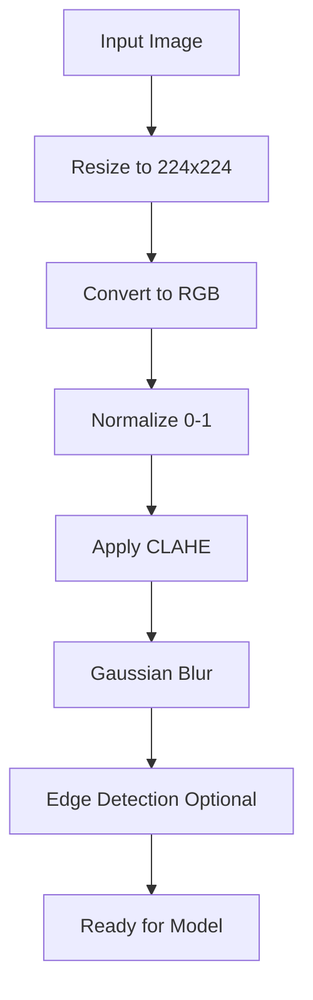
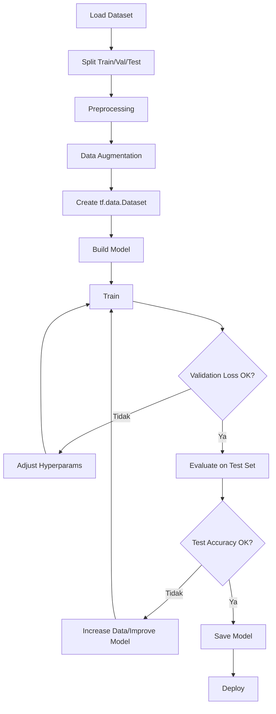
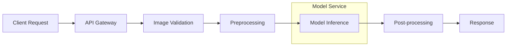
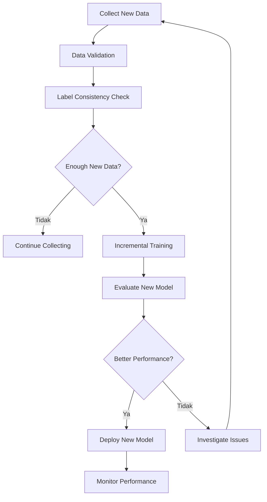
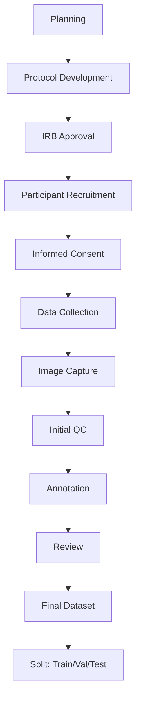

# AI Model Training Guide

## Informasi Dokumen

| Field | Nilai |
|-------|-------|
| **Proyek** | Scalp Analytics |
| **Model** | Hair Density CNN |

---

## 1. Gambaran Umum

### 1.1 Tujuan Model
Model AI digunakan untuk menganalisis foto kulit kepala dan menghitung persentase kepadatan rambut. Model ini menggunakan Convolutional Neural Network (CNN) yang di-train pada dataset foto kulit kepala.

### 1.2 Arsitektur Model


```mermaid
flowchart LR
    subgraph "Input"
        A[Image 224x224x3]
    end
    
    subgraph "Preprocessing"
        B[Resize & Normalize]
        C[Noise Reduction]
        D[Contrast Enhancement]
    end
    
    subgraph "Feature Extraction"
        E[MobileNetV2 Base]
        F[Global Average Pooling]
    end
    
    subgraph "Classification Head"
        G[Dense 128 ReLU]
        H[Dropout 0.3]
        I[Dense 64 ReLU]
        J[Dense 1 Sigmoid]
    end
    
    subgraph "Output"
        K[Density 0-100%]
    end
    
    A --> B --> C --> D
    D --> E --> F
    F --> G --> H --> I --> J
    J --> K
```

---

## 2. Persiapan Dataset

### 2.1 Struktur Dataset

```
dataset/
├── train/
│   ├── frontal/
│   │   ├── high_density/
│   │   ├── medium_density/
│   │   └── low_density/
│   ├── top/
│   │   ├── high_density/
│   │   ├── medium_density/
│   │   └── low_density/
│   └── side/
│       ├── high_density/
│       ├── medium_density/
│       └── low_density/
├── validation/
│   └── [same structure as train]
└── test/
    └── [same structure as train]
```

### 2.2 Kriteria Dataset

| Kriteria | Persyaratan |
|----------|-------------|
| Jumlah Data | Minimum 1.000 gambar per sudut |
| Resolusi | Minimum 720p, direkomendasikan 1080p |
| Format | JPEG, PNG |
| Variasi Pencahayaan | Indoor, outdoor, flash |
| Variasi Kondisi | Berbagai tingkat kebotakan |
| Anotasi | Persentase kepadatan (ground truth) |

### 2.3 Ground Truth Annotation

```python
# Contoh format annotation CSV
# filename, angle, density_percentage, confidence

front_001.jpg,front,85.5,0.95
front_002.jpg,front,72.3,0.88
top_001.jpg,top,78.1,0.92
side_001.jpg,side,81.0,0.90
```

---

## 3. Preprocessing Pipeline

### 3.1 Langkah Preprocessing


```mermaid
flowchart TD
    A[Input Image] --> B[Resize to 224x224]
    B --> C[Convert to RGB]
    C --> D[Normalize 0-1]
    D --> E[Apply CLAHE]
    E --> F[Gaussian Blur]
    F --> G[Edge Detection Optional]
    G --> H[Ready for Model]
```

### 3.2 Implementasi Preprocessing

```python
# ai/preprocessing/image_processor.py
import cv2
import numpy as np
from PIL import Image
from typing import Tuple

class ImagePreprocessor:
    """
    Preprocessor untuk foto kulit kepala sebelum input ke model.
    """
    
    def __init__(self, target_size: Tuple[int, int] = (224, 224)):
        self.target_size = target_size
    
    def preprocess(self, image_path: str) -> np.ndarray:
        """
        Preprocess gambar untuk input model.
        
        Args:
            image_path: Path ke file gambar
            
        Returns:
            Numpy array siap untuk model (1, 224, 224, 3)
        """
        image = self._load_image(image_path)
        image = self._resize(image)
        image = self._apply_clahe(image)
        image = self._normalize(image)
        image = self._add_batch_dimension(image)
        return image
    
    def _load_image(self, path: str) -> np.ndarray:
        """Load gambar dan konversi ke RGB."""
        image = cv2.imread(path)
        if image is None:
            raise ValueError(f"Tidak dapat load gambar: {path}")
        return cv2.cvtColor(image, cv2.COLOR_BGR2RGB)
    
    def _resize(self, image: np.ndarray) -> np.ndarray:
        """Resize gambar ke target size."""
        return cv2.resize(image, self.target_size, interpolation=cv2.INTER_LINEAR)
    
    def _apply_clahe(self, image: np.ndarray) -> np.ndarray:
        """Apply CLAHE untuk enhancement kontras."""
        lab = cv2.cvtColor(image, cv2.COLOR_RGB2LAB)
        l, a, b = cv2.split(lab)
        clahe = cv2.createCLAHE(clipLimit=2.0, tileGridSize=(8, 8))
        l = clahe.apply(l)
        lab = cv2.merge([l, a, b])
        return cv2.cvtColor(lab, cv2.COLOR_LAB2RGB)
    
    def _normalize(self, image: np.ndarray) -> np.ndarray:
        """Normalize pixel values ke [0, 1]."""
        return image.astype(np.float32) / 255.0
    
    def _add_batch_dimension(self, image: np.ndarray) -> np.ndarray:
        """Add batch dimension untuk model input."""
        return np.expand_dims(image, axis=0)
    
    def detect_hair_regions(self, image: np.ndarray) -> np.ndarray:
        """
        Deteksi region rambut menggunakan edge detection.
        
        Returns:
            Mask dari region rambut terdeteksi
        """
        gray = cv2.cvtColor(image, cv2.COLOR_RGB2GRAY)
        blurred = cv2.GaussianBlur(gray, (5, 5), 0)
        edges = cv2.Canny(blurred, 50, 150)
        contours, _ = cv2.findContours(edges, cv2.RETR_EXTERNAL, cv2.CHAIN_APPROX_SIMPLE)
        mask = np.zeros_like(gray)
        cv2.drawContours(mask, contours, -1, (255), thickness=cv2.FILLED)
        return mask
```

---

## 4. Model Architecture

### 4.1 Architecture Definition

```python
# ai/models/hair_density_model.py
import tensorflow as tf
from tensorflow.keras import layers, models
from typing import Tuple

class HairDensityModel:
    """
    CNN Model untuk prediksi kepadatan rambut.
    Menggunakan transfer learning dengan MobileNetV2 backbone.
    """
    
    def __init__(self, input_shape: Tuple[int, int, int] = (224, 224, 3)):
        self.input_shape = input_shape
        self.model = self._build_model()
    
    def _build_model(self) -> tf.keras.Model:
        """
        Build model architecture.
        
        Returns:
            Compiled Keras model
        """
        # Base model dengan pre-trained weights
        base_model = tf.keras.applications.MobileNetV2(
            input_shape=self.input_shape,
            include_top=False,
            weights='imagenet'
        )
        
        # Freeze base model layers
        base_model.trainable = False
        
        # Build custom head
        model = models.Sequential([
            base_model,
            layers.GlobalAveragePooling2D(),
            layers.Dense(128, activation='relu'),
            layers.Dropout(0.3),
            layers.Dense(64, activation='relu'),
            layers.Dense(1, activation='sigmoid')  # Output: 0-1-> 0-100%
        ])
        
        # Compile model
        model.compile(
            optimizer=tf.keras.optimizers.Adam(learning_rate=0.001),
            loss='mean_squared_error',
            metrics=['mae', 'mse']
        )
        
        return model
    
    def train(
        self,
        train_data: tf.data.Dataset,
        val_data: tf.data.Dataset,
        epochs: int = 50,
        callbacks: list = None
    ) -> tf.keras.callbacks.History:
        """
        Train model dengan data.
        
        Args:
            train_data: Training dataset
            val_data: Validation dataset
            epochs: Number of training epochs
            callbacks: List of callbacks
            
        Returns:
            Training history
        """
        return self.model.fit(
            train_data,
            validation_data=val_data,
            epochs=epochs,
            callbacks=callbacks or []
        )
    
    def predict(self, image: np.ndarray) -> float:
        """
        Prediksi kepadatan rambut dari gambar.
        
        Args:
            image: Preprocessed image array
            
        Returns:
            Density percentage (0-100)
        """
        prediction = self.model.predict(image)
        return float(prediction[0][0] * 100)
    
    def save(self, path: str):
        """Save model ke file."""
        self.model.save(path)
    
    def load(self, path: str):
        """Load model dari file."""
        self.model = tf.keras.models.load_model(path)
```

### 4.2 Model Summary

```
Model: "sequential"
┌─────────────────────────────────────────────────────────────────┐
│ Layer (type)                   │ Output Shape       │ Param #   │
├─────────────────────────────────────────────────────────────────┤
│ mobilenetv2_1.00_224 (Functio)│ (None, 7, 7, 1280)  │ 2,257,984  │
│ nal)│                        │             │
├─────────────────────────────────────────────────────────────────┤
│ global_average_pooling2d (Glob│ (None, 1280)       │ 0          │
│ alAveragePooling2D)             │                    │            │
├─────────────────────────────────────────────────────────────────┤
│ dense (Dense)                   │ (None, 128)       │ 163,968    │
├─────────────────────────────────────────────────────────────────┤
│ dropout (Dropout)              │ (None, 128)       │ 0          │
├─────────────────────────────────────────────────────────────────┤
│ dense_1 (Dense)                 │ (None, 64)        │ 8,256      │
├─────────────────────────────────────────────────────────────────┤
│ dense_2 (Dense)                 │ (None, 1)         │ 65         │
└─────────────────────────────────────────────────────────────────┘

Total params: 2,430,273 (9.27 MB)
Trainable params: 172,289 (657.32 KB)
Non-trainable params: 2,257,984 (8.62 MB)
```

---

## 5. Training Pipeline

### 5.1 Training Flow


```mermaid
flowchart TD
    A[Load Dataset] --> B[Split Train/Val/Test]
    B --> C[Preprocessing]
    C --> D[Data Augmentation]
    D --> E[Create tf.data.Dataset]
    E --> F[Build Model]
    F --> G[Train]
    G --> H{Validation Loss OK?}
    H -->|Tidak| I[Adjust Hyperparams]
    I --> G
    H -->|Ya| J[Evaluate on Test Set]
    J --> K{Test Accuracy OK?}
    K -->|Tidak| L[Increase Data/Improve Model]
    L --> G
    K -->|Ya| M[Save Model]
    M --> N[Deploy]
```

### 5.2 Training Script

```python
# ai/training/train.py
import tensorflow as tf
from tensorflow.keras.preprocessing.image import ImageDataGenerator
from tensorflow.keras.callbacks import ModelCheckpoint, EarlyStopping, ReduceLROnPlateau
import os

class ModelTrainer:
    """
    Trainer untuk hair density model.
    """
    
    def __init__(self, data_dir: str, model_dir: str):
        self.data_dir = data_dir
        self.model_dir = model_dir
        self.img_size = (224, 224)
        self.batch_size = 32
    
    def create_data_generators(self):
        """
        Create data generators dengan augmentation.
        """
        train_datagen = ImageDataGenerator(
            rescale=1./255,
            rotation_range=20,
            width_shift_range=0.2,
            height_shift_range=0.2,
            shear_range=0.2,
            zoom_range=0.2,
            horizontal_flip=True,
            fill_mode='nearest'
        )
        
        val_datagen = ImageDataGenerator(rescale=1./255)
        
        train_generator = train_datagen.flow_from_directory(
            os.path.join(self.data_dir, 'train'),
            target_size=self.img_size,
            batch_size=self.batch_size,
            class_mode='input',  # Regression
            shuffle=True
        )
        
        val_generator = val_datagen.flow_from_directory(
            os.path.join(self.data_dir, 'validation'),
            target_size=self.img_size,
            batch_size=self.batch_size,
            class_mode='input',
            shuffle=False
        )
        
        return train_generator, val_generator
    
    def get_callbacks(self):
        """
        Define training callbacks.
        """
        return [
            ModelCheckpoint(
                filepath=os.path.join(self.model_dir, 'best_model.h5'),
                monitor='val_loss',
                save_best_only=True,
                verbose=1
            ),
            EarlyStopping(
                monitor='val_loss',
                patience=10,
                verbose=1,
                restore_best_weights=True
            ),
            ReduceLROnPlateau(
                monitor='val_loss',
                factor=0.5,
                patience=5,
                verbose=1
            )
        ]
    
    def train(self, epochs: int = 50):
        """
        Run training pipeline.
        """
        # Create model
        model = HairDensityModel().model
        
        # Create data generators
        train_gen, val_gen = self.create_data_generators()
        
        # Train
        history = model.fit(
            train_gen,
            validation_data=val_gen,
            epochs=epochs,
            callbacks=self.get_callbacks()
        )
        
        return history
    
    def evaluate(self, model_path: str, test_dir: str):
        """
        Evaluate model on test set.
        """
        model = tf.keras.models.load_model(model_path)
        
        test_datagen = ImageDataGenerator(rescale=1./255)
        test_generator = test_datagen.flow_from_directory(
            test_dir,
            target_size=self.img_size,
            batch_size=self.batch_size,
            class_mode='input',
            shuffle=False
        )
        
        results = model.evaluate(test_generator)
        print(f"Test Loss: {results[0]}")
        print(f"Test MAE: {results[1]}")
        
        return results
```

### 5.3 Menjalankan Training

```bash
# Setup environment
cd ai/
python -m venv venv
source venv/bin/activate
pip install -r requirements.txt

# Prepare dataset
python scripts/prepare_dataset.py --input raw_data/ --output dataset/

# Run training
python training/train.py --data-dir dataset/ --model-dir models/ --epochs 50

# Evaluate model
python training/evaluate.py --model-path models/best_model.h5 --test-dir dataset/test/

# Export for production
python scripts/export_model.py --model-path models/best_model.h5 --output models/production/
```

---

## 6. Evaluation Metrics

### 6.1 Metrics yang Digunakan

| Metric | Deskripsi | Target |
|--------|-----------|--------|
| MAE (Mean Absolute Error) | Rata-rata error absolut | < 5% |
| MSE (Mean Squared Error) | Rata-rata error kuadrat | < 25 |
| R² Score | Koefisien determinasi | > 0.85 |
| Confidence Score | Model confidence | > 0.80 |

### 6.2 Evaluation Script

```python
# ai/evaluation/metrics.py
import numpy as np
from sklearn.metrics import mean_absolute_error, mean_squared_error, r2_score

class ModelEvaluator:
    """
    Evaluator untuk model metrics.
    """
    
    def __init__(self, model, test_data):
        self.model = model
        self.test_data = test_data
        self.predictions = None
        self.ground_truth = None
    
    def evaluate(self):
        """
        Hitung semua metrics.
        """
        # Get predictions
        self.predictions = self.model.predict(self.test_data)
        self.ground_truth = self._get_ground_truth()
        
        # Calculate metrics
        mae = mean_absolute_error(self.ground_truth, self.predictions)
        mse = mean_squared_error(self.ground_truth, self.predictions)
        r2 = r2_score(self.ground_truth, self.predictions)
        
        return {
            'mae': mae,
            'mse': mse,
            'rmse': np.sqrt(mse),
            'r2': r2
        }
    
    def generate_confusion_by_threshold(self, threshold: float = 5.0):
        """
        Generate confusion matrix berdasarkan threshold error.
        """
        errors = np.abs(self.predictions - self.ground_truth)
        correct = (errors < threshold).sum()
        incorrect = (errors >= threshold).sum()
        
        return {
            'correct': correct,
            'incorrect': incorrect,
            'accuracy': correct / (correct + incorrect)
        }
```

---

## 7. Model Deployment

### 7.1 Model Serving


```mermaid
flowchart LR
    A[Client Request] --> B[API Gateway]
    B --> C[Image Validation]
    C --> D[Preprocessing]
    D --> E[Model Inference]
    E --> F[Post-processing]
    F --> G[Response]
    
    subgraph "Model Service"
        E
    end
```

### 7.2 FastAPI Integration

```python
# backend/app/infrastructure/ai/hair_density_service.py
from fastapi import UploadFile
import numpy as np
from PIL import Image
import io
from ai.models.hair_density_model import HairDensityModel
from ai.preprocessing.image_processor import ImagePreprocessor

class HairDensityService:
    """
    Service untuk analisis kepadatan rambut.
    """
    
    def __init__(self, model_path: str):
        self.model = HairDensityModel()
        self.model.load(model_path)
        self.preprocessor = ImagePreprocessor()
    
    async def analyze(self, file: UploadFile) -> dict:
        """
        Analisis foto dan kembalikan hasil.
        
        Args:
            file: Uploaded image file
            
        Returns:
            Analysis result dictionary
        """
        # Load image
        image_bytes = await file.read()
        image = Image.open(io.BytesIO(image_bytes))
        image_array = np.array(image)
        
        # Preprocess
        preprocessed = self.preprocessor.preprocess(image_array)
        
        # Predict
        density = self.model.predict(preprocessed)
        
        # Calculate confidence
        confidence = self._calculate_confidence(preprocessed)
        
        return {
            'density_percentage': round(density, 2),
            'confidence_score': round(confidence, 2),
            'detected_regions': self._count_regions(image_array)
        }
    
    def _calculate_confidence(self, preprocessed: np.ndarray) -> float:
        """
        Hitung confidence score berdasarkan variasi prediksi.
        """
        # Multiple predictions with augmentation
        predictions = []
        for _ in range(5):
            pred = self.model.predict(preprocessed)
            predictions.append(pred)
        
        # Lower variance = higher confidence
        variance = np.var(predictions)
        confidence = 1.0 - (variance / 100.0)  # Normalize
        return max(0.0, min(1.0, confidence))
    
    def _count_regions(self, image: np.ndarray) -> int:
        """
        Hitung region rambut terdeteksi.
        """
        mask = self.preprocessor.detect_hair_regions(image)
        contours, _ = cv2.findContours(
            mask, cv2.RETR_EXTERNAL, cv2.CHAIN_APPROX_SIMPLE
        )
        return len(contours)
```

---

## 8. Monitoring & Maintenance

### 8.1 Model Performance Monitoring

| Metric | Frekuensi Monitoring | Alert Threshold |
|--------|---------------------|-----------------|
| Prediction Latency | Real-time | > 5 seconds |
| Error Rate | Real-time | > 5% |
| MAE on New Data | Weekly | > 7% |
| Model Drift | Monthly | >10% deviation |

### 8.2 Model Retraining


```mermaid
flowchart TD
    A[Collect New Data] --> B[Data Validation]
    B --> C[Label Consistency Check]
    C --> D{Enough New Data?}
    D -->|Tidak| E[Continue Collecting]
    D -->|Ya| F[Incremental Training]
    F --> G[Evaluate New Model]
    G --> H{Better Performance?}
    H -->|Ya| I[Deploy New Model]
    H -->|Tidak| J[Investigate Issues]
    I --> K[Monitor Performance]
    J --> A
```

### 8.3 Retraining Trigger

- Kumpulan data baru melebihi 500 sampel
- MAE pada data baru > threshold
- Detected concept drift
- Scheduled quarterly retraining

---

## 9. Best Practices

### 9.1 Data Quality
- Pastikan variasi pencahayaan yang cukup
- Include berbagai tingkat kebotakan
- Anotasi konsisten oleh multiple annotators
- Validasi ground truth dengan expert dermatologist

### 9.2 Model Training
- Gunakan early stopping untuk prevent overfitting
- Implement cross-validation untuk robust evaluation
- Track eksperimen dengan MLflow atau similar
- Save checkpoints secara regular

### 9.3 Production Deployment
- Load model saat startup, bukan per request
- Implement caching untuk predictions yang sama
- Monitor latency dan error rate
- Implement fallback untuk edge cases

---

## 10. Troubleshooting

### 10.1 Common Issues

| Issue | Possible Cause | Solution |
|-------|----------------|----------|
| Low Accuracy | Data kurang variatif | Augmentasi data, koleksi lebih banyak |
| Overfitting | Model terlalu kompleks | Tambah dropout, simplify architecture |
| Low Confidence | Image quality buruk | Improve preprocessing, reject low quality |
| Slow Inference | Model terlalu besar | Quantization, use lighter model |

### 10.2 Performance Optimization

```python
# Quantization untuk inference lebih cepat
import tensorflow as tf

def quantize_model(model_path: str, output_path: str):
    """
    Quantize model untuk inference lebih cepat.
    """
    model = tf.keras.models.load_model(model_path)
    converter = tf.lite.TFLiteConverter.from_keras_model(model)
    converter.optimizations = [tf.lite.Optimize.DEFAULT]
    tflite_model = converter.convert()
    
    with open(output_path, 'wb') as f:
        f.write(tflite_model)
```

---

## 11. Resources

### 11.1 Referensi Framework
- [TensorFlow Documentation](https://www.tensorflow.org/api_docs)
- [MobileNetV2 Paper](https://arxiv.org/abs/1801.04381)
- [Transfer Learning Guide](https://www.tensorflow.org/tutorials/images/transfer_learning)

### 11.2 Dataset Utama (Ringkasan Cepat)
- [Kaggle: Bald People 5000](https://www.kaggle.com/datasets/tapakah68/dataset-of-bald-people) — Gratis, AI training OK
- [Roboflow: Hair & Scalp Disease](https://universe.roboflow.com/nayab-waris-hfzbj/hair-and-scalp-disease) — Gratis, CC BY 4.0, ada pretrained model
- [HuggingFace: UniDataPro Norwood](https://huggingface.co/datasets/UniDataPro/hair-loss-male-norwood-scale) — Sample gratis, full berbayar
- [ISIC Archive](https://challenge.isic-archive.com/data/) — Gratis CC-0, untuk transfer learning base

### 11.3 Paper Kunci
- [ML for AGA Trichoscopy Staging — PMC](https://pmc.ncbi.nlm.nih.gov/articles/PMC10412074/) — 90% akurasi
- [Male Hair Loss Classification 2024 — ACM](https://dl.acm.org/doi/fullHtml/10.1145/3665689.3665733) — 93% akurasi
- [Scalp Analysis Limited Data — MDPI](https://www.mdpi.com/2079-9292/12/6/1380) — Khusus small dataset

## 12. Data Sources dan Referensi

### 12.1 Dataset Utama untuk Training

#### 12.1.1 Dataset Hair Loss dengan Norwood/Ludwig Labels (Terverifikasi)

| Dataset | URL | Gambar | Labels | Lisensi | Biaya |
|---------|-----|--------|--------|---------|-------|
| **Hair Loss Male Norwood Scale** | https://www.kaggle.com/datasets/unidpro/hair-loss-male-norwood-scale | 2,400+ | 7 kelas Norwood-Hamilton, 5 sudut | CC-BY-NC-ND-4.0 | Sample gratis, full dataset berbayar via unidata.pro |
| **Bald Men (TrainingDataPro)** | https://www.kaggle.com/datasets/trainingdatapro/bald-men | Multi-angle | Norwood scale | CC-BY-NC-ND-4.0 | Sample gratis, full berbayar |
| **Bald Women (TrainingDataPro)** | https://www.kaggle.com/datasets/trainingdatapro/bald-women | 1,080+ | Ludwig scale | CC-BY-NC-ND-4.0 | Sample gratis, full berbayar |
| **Bald People 5000 Images** | https://www.kaggle.com/datasets/tapakah68/dataset-of-bald-people | 5,000 | Binary (bald / not bald) | Cek halaman Kaggle | Gratis |
| **Hair Loss Segmentation** | https://www.kaggle.com/datasets/trainingdatapro/bald-people-segmentation-dataset | — | Segmentation masks area bald | CC-BY-NC-ND-4.0 | Sample gratis, full berbayar |

#### 12.1.2 Dataset Hair Loss di Hugging Face (Terverifikasi)

| Dataset | URL | Isi | Biaya |
|---------|-----|-----|-------|
| **UniDataPro/hair-loss-male-norwood-scale** | https://huggingface.co/datasets/UniDataPro/hair-loss-male-norwood-scale | 2,400+ gambar, 5 sudut, 7 kelas Norwood, metadata usia/etnis | 25-row preview gratis, full berbayar |
| **UniDataPro/men-hair-loss-dataset** | https://huggingface.co/datasets/UniDataPro/men-hair-loss-dataset | 3,100 gambar, 775 orang, front+top+segmentation mask | Sample gratis, full berbayar |
| **UniDataPro/women-hair-loss-dataset** | https://huggingface.co/datasets/UniDataPro/women-hair-loss-dataset | 1,080 gambar wanita, top-view, segmentation mask | Sample gratis, full berbayar |
| **TrainingDataPro/bald-men** | https://huggingface.co/datasets/TrainingDataPro/bald-men | Multi-angle, Norwood labels | Sample gratis, full berbayar |
| **TrainingDataPro/bald_classification** | https://huggingface.co/datasets/TrainingDataPro/bald_classification | Binary classification, multi-demografi | Sample gratis, full berbayar |
| **ud-medical/male-hair-loss-dataset** | https://huggingface.co/datasets/ud-medical/male-hair-loss-dataset | Foto medis 5 sudut, 7 kelas Norwood | Sample gratis, full berbayar |

#### 12.1.3 Dataset Scalp & Kondisi Rambut di Roboflow (Gratis, AI Training OK)

| Dataset | URL | Gambar | Kelas | Lisensi |
|---------|-----|--------|-------|---------|
| **Hair Scalp Analysis (MVI)** | https://universe.roboflow.com/mvi-owp6u/hair-scalp-analysis | 888 | 9 kelas: Alopecia Areata, Dandruff, Folliculitis, Psoriasis, Low Hair Density, dll | Roboflow Public |
| **Hair and Scalp Disease** | https://universe.roboflow.com/nayab-waris-hfzbj/hair-and-scalp-disease | — | 4 kelas: Alopecia Areata, Head Lice, Psoriasis, Folliculitis + pretrained model | CC BY 4.0 |
| **Hair Disease Detection** | https://universe.roboflow.com/project-teqqx/hair-disease-detection | 3,600 | Alopecia Areata focused | Roboflow Public |
| **Hairloss Segmentation** | https://universe.roboflow.com/tangoku/hairloss-segmentation | 461 | Segmentation: hair / head / bald | CC BY 4.0 |
| **Scalp Data (dandruff/oiliness)** | https://universe.roboflow.com/buyumedatasets2/scalp-data | — | Dandruff, oiliness, sensitive scalp | Roboflow Public |

#### 12.1.4 Dataset Transfer Learning (Dermoscopy, Gratis & CC-0)

| Dataset | URL | Gambar | Keterangan |
|---------|-----|--------|------------|
| **ISIC Archive** | https://challenge.isic-archive.com/data/ | 120,000+ | Dermoscopy terbesar, CC-0 (boleh untuk AI training komersial). Tidak ada Norwood labels tapi domain image mirip dermoscopy kulit kepala |
| **HAM10000** | https://dataverse.harvard.edu/dataset.xhtml?persistentId=doi:10.7910/DVN/DBW86T | 10,015 | 7 kelas lesi kulit, CC-0. Cocok sebagai base transfer learning |
| **ISIC Archive Downloader** | https://github.com/GalAvineri/ISIC-Archive-Downloader | — | Script untuk bulk download ISIC |

### 12.2 GitHub Repository Referensi Model (Terverifikasi)

| Repo | URL | Isi | Lisensi |
|------|-----|-----|---------|
| **Intelligent Hair Analysis System** | https://github.com/macarize/Intelligent_hair_analysis_system | Norwood-Hamilton classification via K-means + MSE image comparison, Python | Tidak ada lisensi |
| **Mobile Hair Segmentation PyTorch** | https://github.com/wonbeomjang/mobile-hair-segmentation-pytorch | Real-time hair matting, PyTorch, pretrained weights tersedia | MIT |
| **Hair Segmentation TensorFlow** | https://github.com/thangtran480/hair-segmentation | TensorFlow, mobile-optimized, pretrained model, CelebAMask-HQ | MIT |
| **PyTorch Hair Segmentation** | https://github.com/YBIGTA/pytorch-hair-segmentation | Semantic segmentation, Figaro-1K dataset, PyTorch | MIT |
| **Awesome Skin Image Analysis Datasets** | https://github.com/sfu-mial/awesome-skin-image-analysis-datasets | Daftar lengkap semua dataset analisis kulit yang diketahui publik | MIT |

### 12.3 Referensi Ilmiah dengan URL Aktif (Terverifikasi)

#### 12.3.1 Paper Deep Learning untuk Hair Loss (Open Access)

| Paper | URL | Akurasi | Relevansi |
|-------|-----|---------|-----------|
| Deep Learning Trichoscopic Analysis for AGA (BASP Classification) | https://pmc.ncbi.nlm.nih.gov/articles/PMC9631273/ | — | CNN pada 2,910 trichoscopic images, klasifikasi BASP scale |
| Hair Follicle Classification with Mask R-CNN | https://pmc.ncbi.nlm.nih.gov/articles/PMC9605010/ | — | Per-follicle detection + severity scoring |
| ML Algorithm for Trichoscopy AGA Staging | https://pmc.ncbi.nlm.nih.gov/articles/PMC10412074/ | 94.3% train / 90.0% test | ML pada trichoscopy, staging alopecia androgenic |
| Enhanced Hair Loss Stratification with AI (2025) | https://www.nature.com/articles/s41598-025-23561-3 | — | Novel Loss Region Ratio (LRR) metric, Nature Scientific Reports |
| Classification of Male Hair Loss Deep Learning (2024) | https://dl.acm.org/doi/fullHtml/10.1145/3665689.3665733 | 93.08% (RegNet-64) | Perbandingan VGG16, ResNet-50, RegNet-64 |
| Deep Learning Scalp Analysis with Limited Data | https://www.mdpi.com/2079-9292/12/6/1380 | — | Solusi khusus untuk dataset kecil, sangat relevan untuk MVP |

#### 12.3.2 Paper Medis Dasar (DOI)

| Paper | DOI | Keterangan |
|-------|-----|------------|
| Norwood OT (1975) - Male pattern baldness classification | 10.1097/00007611-197511000-00002 | Standar Norwood Scale |
| Ludwig E (1977) - Androgenetic alopecia classification female | 10.1111/j.1365-2133.1977.tb06867.x | Standar Ludwig Scale |
| Esteva et al. (2017) - Dermatologist-level CNN skin cancer | 10.1038/nature21056 | CNN dermatologi benchmark |
| Tschandl et al. (2018) - HAM10000 dataset | 10.1038/sdata.2018.161 | Dataset dermoscopy terbesar |
| Sandler et al. (2018) - MobileNetV2 | 10.1109/CVPR.2018.00474 | Arsitektur backbone model |
| Litjens et al. (2017) - Survey deep learning medical imaging | 10.1016/j.media.2017.07.005 | Review komprehensif CNN medis |
| Ramos PM, Miot HA (2022) - Female Pattern Hair Loss review | 10.1111/dth.15371 | Review FPHL terbaru |

### 12.4 Standar Klasifikasi Medis

#### 12.4.1 Norwood Scale (Pria)

| Stage | Karakteristik | Density (%) | Deskripsi |
|-------|---------------|------------|-----------|
| Stage 0 | No hair loss | >85% | Tidak ada kerontokan |
| Stage 1 | Minimal temple recession | 80-85% | Kerontokan minimal di pelipis |
| Stage 2 | Noticeable temple recession | 70-80% | Pelipis terlihat mundur |
| Stage 3 | Deep temple recession | 60-70% | Vertex mulai menipis |
| Stage 4 | Significant vertex thinning | 50-60% | Area vertex signifikan |
| Stage 5 | Large vertex balding area | 40-50% | Vertex besar |
| Stage 6 | Vertex and front merging | 30-40% | Vertex dan front menyatu |
| Stage 7 | Most severe pattern | <30% | Parah, horseshoe pattern |

#### 12.4.2 Ludwig Scale (Wanita)

| Stage | Karakteristik | Density (%) | Deskripsi |
|-------|---------------|------------|-----------|
| Stage 0 | No hair loss | >85% | Tidak ada kerontokan |
| Stage 1 | Mild thinning at crown | 75-85% | Penipisan minimal di crown |
| Stage 2 | Moderate crown thinning | 60-75% | Penipisan moderate |
| Stage 3 | Severe crown thinning | <60% | Penipisan parah |

#### 12.4.3 Scalp Condition Classification

| Kondisi | Karakteristik | Tanda Visual |
|---------|---------------|--------------|
| Oily Scalp (Seborrhea) | Produksi sebum berlebih | Kulit mengkilap, pori besar |
| Dry Scalp | Kekurangan minyak | Kulit kering, mengelupas, gatal |
| Seborrheic Dermatitis | Inflamasi kulit kepala | Kemerahan, ketombe, gatal |
| Dandruff | Pityrosporum ovale | Ketombe putih/kuning |
| Psoriasis | Autoimmune | Patch tebal, bersisik |
| Folliculitis | Inflamasi folikel | Pustula, kemerahan |

### 12.5 Nutrisi untuk Kesehatan Rambut

#### 12.5.1 Nutrisi Esensial

| Nutrisi | RDA | Sumber Utama | Fungsi untuk Rambut |
|---------|-----|--------------|---------------------|
| Protein | 0.8-1.2g/kg | Telur, ikan, daging, kacang | Komponen keratin |
| Zinc | 8-11 mg | Daging, kacang, biji-bijian | Pertumbuhan folikel |
| Iron | 8-18 mg | Bayam, daging merah, kacang | Oksigenasi folikel |
| Biotin (B7) | 30-100 mcg | Telur, almond, kacang | Produksi keratin |
| Vitamin D | 600-2000 IU | Salmon, telur, suplemen | Pertumbuhan folikel baru |
| Vitamin B12 | 2.4 mcg | Daging, telur, suplemen | Pembentukan sel darah merah |
| Vitamin E | 15 mg | Almond, bayam, minyak | Antioksidan |
| Omega-3 | 1000-3000 mg | Salmon, walnut, chia seed | Anti-inflamasi |
| Vitamin C | 65-90 mg | Jeruk, paprika, brokoli | Absorpsi iron |
| Folate (B9) | 400 mcg | Sayuran hijau, kacang | Pembelahan sel |

#### 12.5.2 Sumber Data Nutrisi (Terverifikasi)

| Database | URL | Keterangan |
|----------|-----|------------|
| **USDA FoodData Central** | https://fdc.nal.usda.gov | Database nutrisi resmi AS, 8000+ makanan, gratis |
| **USDA Download Datasets** | https://fdc.nal.usda.gov/download-datasets.html | Bulk download CSV/JSON semua data nutrisi |
| **Open Food Facts** | https://world.openfoodfacts.org | Database makanan open source, termasuk produk Indonesia |
| **Nutritionix API** | https://www.nutritionix.com/business/api | API nutrisi komersial, ada free tier |
| **FatSecret Platform API** | https://platform.fatsecret.com | Food database API, ada free tier |

### 12.6 Strategi Pendekatan Dataset untuk MVP

#### 12.6.1 Rekomendasi Urutan (Paling Praktis ke Ideal)

```
FASE 1 — Development & Testing (Gratis, Mulai Sekarang)
├── Roboflow: Hair and Scalp Disease (CC BY 4.0, ada pretrained model)
│   → https://universe.roboflow.com/nayab-waris-hfzbj/hair-and-scalp-disease
├── Roboflow: Hair Disease Detection (3,600 gambar)
│   → https://universe.roboflow.com/project-teqqx/hair-disease-detection
└── ISIC Archive (120k+ gambar CC-0, untuk transfer learning base)
    → https://challenge.isic-archive.com/data/

FASE 2 — Norwood Classification (Sample Gratis di HuggingFace)
├── UniDataPro Norwood Scale (25-row preview, cukup untuk proof-of-concept)
│   → https://huggingface.co/datasets/UniDataPro/hair-loss-male-norwood-scale
└── Kaggle Bald People 5000 (gratis, binary bald/not-bald)
    → https://www.kaggle.com/datasets/tapakah68/dataset-of-bald-people

FASE 3 — Production (Berbayar atau Self-Collect)
├── Beli full dataset UniDataPro (unidata.pro) — 2,400+ berlabel Norwood
└── Kumpulkan dari user app (crowdsourcing) + labeling manual
```

#### 12.6.2 Pendekatan Self-Collection dari User App

```
User upload foto
      ↓
Simpan ke storage + DB (tabel photos)
      ↓
Tim review foto (admin panel)
      ↓
Label manual density% + Norwood stage
      ↓
Masuk ke training dataset
      ↓
Retrain model setiap 500 foto baru berlabel
```

Ini yang paling realistis untuk startup karena:
- Data relevan langsung dari target pengguna
- Semakin banyak user → dataset semakin besar
- Label dari dermatologis mitra meningkatkan akurasi

### 12.7 Data Augmentation Strategies

#### 12.7.1 Teknik Augmentasi untuk Hair Images

```python
# augmentation_strategies.py
import albumentations as A
from albumentations.pytorch import ToTensorV2

# Augmentasi untuk training
train_transforms = A.Compose([
    # Geometric
    A.RandomRotate90(p=0.5),
    A.HorizontalFlip(p=0.5),
    A.VerticalFlip(p=0.3),
    A.ShiftScaleRotate(shift_limit=0.1, scale_limit=0.1, rotate_limit=15, p=0.5),
    
    # Color & Lighting
    A.RandomBrightnessContrast(brightness_limit=0.2, contrast_limit=0.2, p=0.5),
    A.HueSaturationValue(hue_shift_limit=10, sat_shift_limit=20, val_shift_limit=20, p=0.5),
    A.CLAHE(clip_limit=4.0, p=0.3),
    
    # Noise & Blur
    A.GaussNoise(var_limit=(10, 50), p=0.3),
    A.GaussianBlur(blur_limit=(3, 7), p=0.2),
    
    # Quality
    A.ImageCompression(quality_lower=85, quality_upper=100, p=0.3),
    
    # Hair-specific
    A.CoarseDropout(max_holes=20, max_height=20, max_width=20, p=0.2),  # Simulate hair loss patches
    A.RandomShadow(shadow_roi=(0, 0, 1, 1), p=0.2),
    
    ToTensorV2()
])

# Transformasi validasi
val_transforms = A.Compose([
    A.Resize(224, 224),
    A.Normalize(mean=[0.485, 0.456, 0.406], std=[0.229, 0.224, 0.225]),
    ToTensorV2()
])
```

#### 12.7.2 Synthetic Data Generation

| Teknik | Deskripsi | Use Case |
|--------|-----------|----------|
| GAN-based | Generate synthetic scalp images | Augment minority classes |
| MixUp | Mix two images | Improve generalization |
| CutMix | Cut and paste regions | Dense classification |
| Copy-Paste | Copy hair regions | Increase diversity |
| Style Transfer | Simulate different lighting | Real-world variation |

### 12.8 Ground Truth Annotation Guidelines

#### 12.8.1 Annotation Protocol

```markdown
## Hair Density Annotation Protocol

### Equipment Requirements
1. Standardized lighting setup (D65 light source)
2. Fixed camera distance (30 cm from scalp)
3. Five standard angles: front, top, left, right, custom
4. Resolution: minimum 720p

### Annotation Steps
1. Clean scalp area, remove oil/gel
2. Take photo at standard angle
3. Mark hair regions using polygon tool
4. Calculate density percentage:
   - Total pixels in ROI
   - Hair pixels (threshold-based)
   - Density = (hair_pixels / total_pixels) * 100

### Density Classification
| Range | Category | Stage |
|-------|----------|-------|
| >85% | Normal | 0 |
| 70-85% | Minimal Loss | 1-2 |
| 50-70% | Moderate Loss | 3-4 |
| 30-50% | Advanced Loss | 5-6 |
| <30% | Severe Loss | 7 |

### Inter-Annotator Agreement
- Minimum Kappa score: 0.80
- Required annotators: 3 dermatologists
- Disagreement resolution: consensus discussion
```

### 12.9 Data Collection Methodology

#### 12.9.1 Prosedur Pengumpulan Data


```mermaid
flowchart TD
    A[Planning] --> B[Protocol Development]
    B --> C[IRB Approval]
    C --> D[Participant Recruitment]
    D --> E[Informed Consent]
    E --> F[Data Collection]
    F --> G[Image Capture]
    G --> H[Initial QC]
    H --> I[Annotation]
    I --> J[Review]
    J --> K[Final Dataset]
    K --> L[Split: Train/Val/Test]
```

#### 12.9.2 Kriteria Penerimaan Data

| Kriteria | Persyaratan | Alasan |
|---------|-------------|--------|
| Resolusi | Minimal720p (1280x720) | Detail folikel terlihat |
| Lighting | Tidak ada shadow berlebih | Konsistensi analisis |
| Focus | Sharp focus pada area | Akurasi deteksi |
| Angle | Sudut standar | Konsistensi perbandingan |
| Background | Kontras dengan rambut | Kemudahan segmentasi |
| Cleanliness | Kulit kepala bersih | Tidak ada artifact |

### 12.10 Tools dan Libraries

#### 12.10.1 Machine Learning Frameworks

| Library | Versi | Kegunaan | URL |
|---------|-------|----------|-----|
| TensorFlow | 2.12+ | Model training | https://www.tensorflow.org |
| PyTorch | 2.0+ | Alternative framework | https://pytorch.org |
| OpenCV | 4.8+ | Image preprocessing | https://opencv.org |
| Albumentations | 1.3+ | Data augmentation | https://albumentations.ai |
| scikit-learn | 1.3+ | Metrics dan utilities | https://scikit-learn.org |

#### 12.10.2 Pretrained Models yang Bisa Langsung Dipakai

| Model | URL | Keterangan |
|-------|-----|------------|
| **Hair & Scalp Disease (Roboflow)** | https://universe.roboflow.com/nayab-waris-hfzbj/hair-and-scalp-disease | YOLO weights + hosted inference API, gratis, CC BY 4.0 |
| **MobileNetV2 (TensorFlow)** | https://www.tensorflow.org/api_docs/python/tf/keras/applications/MobileNetV2 | ImageNet pretrained, titik awal transfer learning |
| **EfficientNet (TensorFlow)** | https://www.tensorflow.org/api_docs/python/tf/keras/applications/EfficientNetB0 | Lebih akurat dari MobileNetV2 untuk medical imaging |

---

### 12.11 Referensi DOI Lengkap

#### 12.11.1 Paper Utama dengan DOI

```
Medical Imaging References:

1. Esteva, A., Kuprel, B., Novoa, R. A., Ko, J., Swetter, S. M., 
   Blau, H. M., & Thrun, S. (2017). Dermatologist-level classification 
   of skin cancer with deep neural networks. Nature, 542(7639), 115-118.
   DOI: 10.1038/nature21056

2. Tschandl, P., Rosendahl, C., & Kittler, H. (2018). The HAM10000 
   dataset, a large collection of multi-source dermatoscopic images 
   of common pigmented skin lesions. Scientific Data, 5, 180161.
   DOI: 10.1038/sdata.2018.161

3. Codella, N. C., Nguyen, Q. B., Pankanti, S., Gutman, D., Helba, B., 
   Halpern, A., & Smith, J. R. (2017). Deep learning, sparse and 
   transfer learning for skin lesion classification. ISIC Challenge, 2017.

4. Litjens, G., Kooi, T., Bejnordi, B. E., Setio, A. A. A., Ciompi, F., 
   Ghafoorian, M., ... & Sánchez, C. I. (2017). A survey on deep 
   learning in medical image analysis. Medical Image Analysis, 42, 60-88.
   DOI: 10.1016/j.media.2017.07.005

Hair Loss Specific:

5. Norwood, O. T. (1975). Male pattern baldness: classification and 
   incidence. Southern Medical Journal, 68(11), 1359-1365.
   DOI: 10.1097/00007611-197511000-00002

6. Ludwig, E. (1977). Classification of the types of androgenetic 
   alopecia (common baldness) occurring in the female sex. 
   British Journal of Dermatology, 97(3), 247-254.
   DOI: 10.1111/j.1365-2133.1977.tb06867.x

7. Ramos, P. M., & Miot, H. A. (2022). Female pattern hair loss: 
   A clinical review. Dermatologic Therapy, 35(7), e15371.
   DOI: 10.1111/dth.15371

Architecture References:

8. Sandler, M., Howard, A., Zhu, M., Zhmoginov, A., & Chen, L. C. (2018). 
   MobileNetV2: Inverted residuals and linear bottlenecks. 
   Proceedings of the IEEE CVPR, 4510-4520.
   DOI: 10.1109/CVPR.2018.00474

9. He, K., Zhang, X., Ren, S., & Sun, J. (2016). Deep residual learning 
   for image recognition. CVPR 2016, 770-778.
   DOI: 10.1109/CVPR.2016.90
```


---

## 13. Contributing

Untuk kontribusi model dan perbaikan, silakan mengikuti panduan:

1. Fork repository
2. Buat branch untuk fitur/perbaikan
3. Jalankan training dengan konfigurasi yang sama
4. Benchmark hasil terhadap model existing
5. Submit pull request dengan dokumentasi hasil