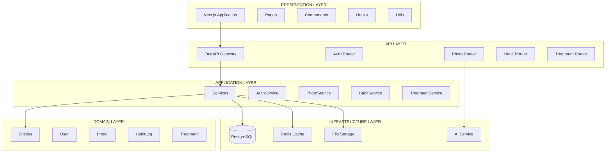
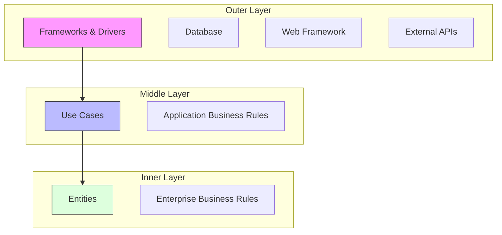
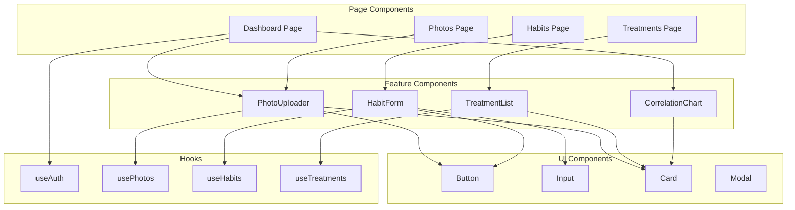
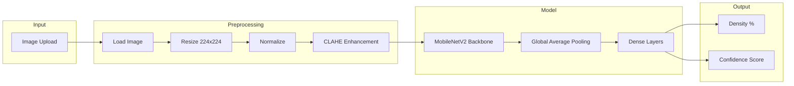
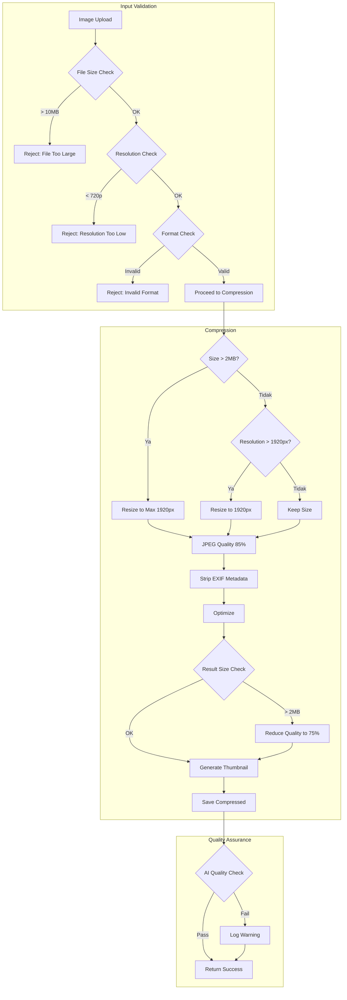
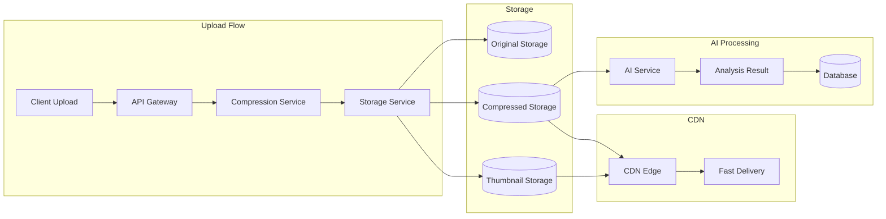
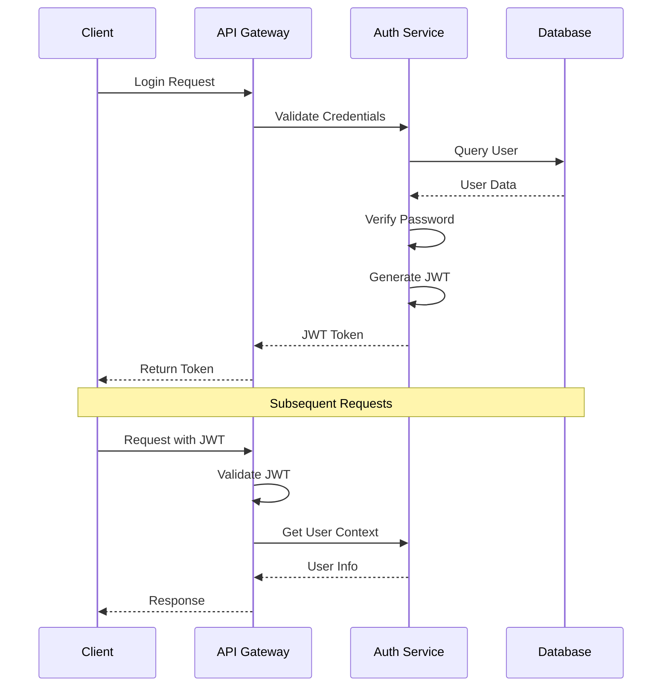
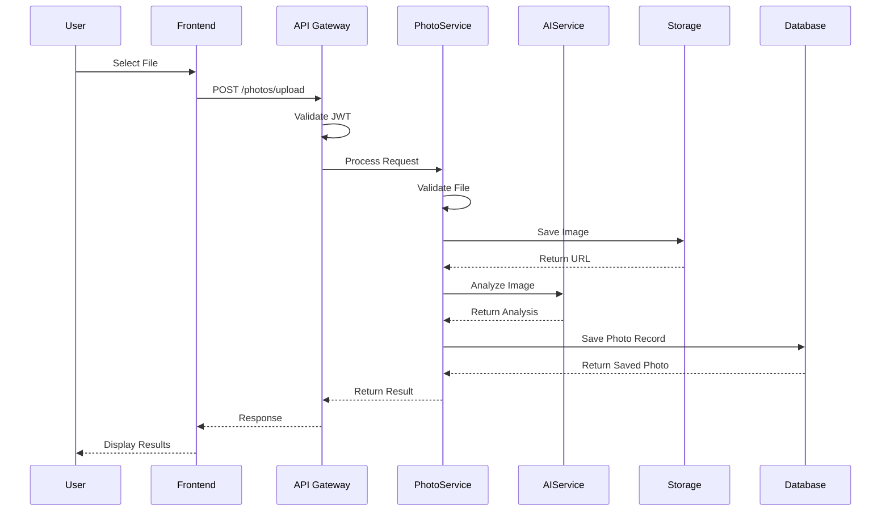
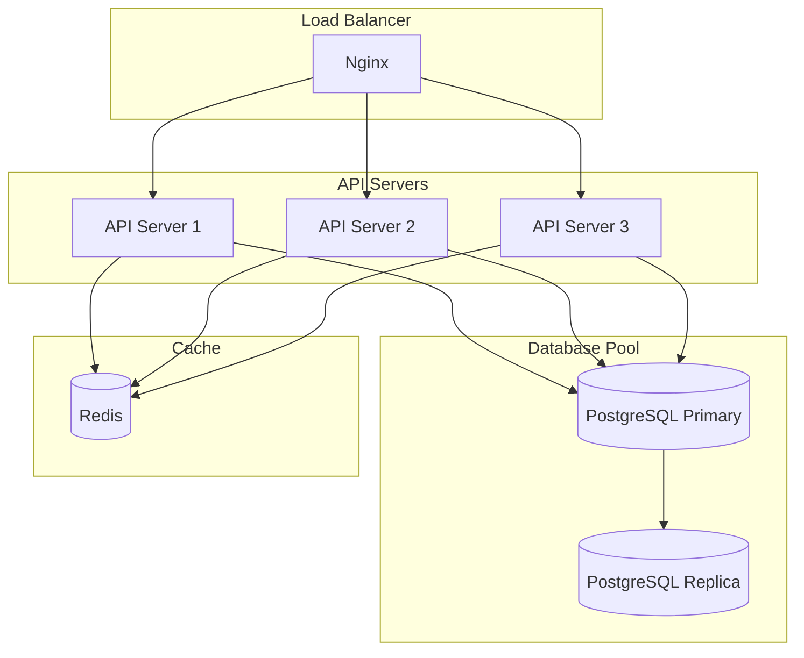

# Arsitektur Sistem

## Informasi Dokumen

| Field | Nilai |
|-------|-------|
| **Proyek** | Scalp Analytics |
| **Versi** | 1.0.0 |
| **Pattern** | Clean Architecture |

---

## 1. Gambaran Umum Arsitektur

### 1.1 Arsitektur High-Level



### 1.2 Dependency Rule

**Aturan dependency menyatakan bahwa source code dependencies hanya boleh menunjuk ke arah dalam.**



### 1.3 Layer Responsibilities

| Layer | Responsibility | Dependencies |
|-------|---------------|--------------|
| **Entities** | Core business logic, domain models | None |
| **Use Cases** | Application-specific business rules | Entities |
| **Interface Adapters** | Convert data between use cases and external | Use Cases |
| **Frameworks** | External tools, databases, UI | Interface Adapters |

---

## 2. Backend Architecture (FastAPI)

### 2.1 Struktur Folder

```
backend/
├── app/
│   ├── __init__.py
│   ├── main.py                    # FastAPI application entry│   ├── config.py                  # Configuration management
│   │
│   ├── domain/                    # Domain Layer (Entities)
│   │   ├── __init__.py
│   │   ├── entities/
│   │   │   ├── __init__.py
│   │   │   ├── user.py
│   │   │   ├── photo.py
│   │   │   ├── habit_log.py
│   │   │   └── treatment.py
│   │   └── value_objects/
│   │       ├── __init__.py
│   │       ├── email.py
│   │       └── photo_angle.py
│   │
│   ├── application/              # Application Layer (Use Cases)
│   │   ├── __init__.py
│   │   ├── services/
│   │   │   ├── __init__.py
│   │   │   ├── auth_service.py
│   │   │   ├── photo_service.py
│   │   │   ├── habit_service.py
│   │   │   └── treatment_service.py
│   │   ├── dto/
│   │   │   ├── __init__.py
│   │   │   └── requests.py
│   │   └── interfaces/
│   │       ├── __init__.py
│   │       └── repositories.py
│   │
│   ├── infrastructure/            # Infrastructure Layer
│   │   ├── __init__.py
│   │
│   └── presentation/             # Presentation Layer (API)
│       ├── __init__.py
│       ├── routers/
│       │   ├── __init__.py
│       │   ├── auth.py
│       │   ├── users.py
│       │   ├── photos.py
│       │   ├── habits.py
│       │   └── treatments.py
│       ├── schemas/
│       │   ├── __init__.py
│       │   ├── auth_schema.py
│       │   ├── user_schema.py
│       │   ├── photo_schema.py
│       │   ├── habit_schema.py
│       │   └── treatment_schema.py
│       └── middleware/
│           ├── __init__.py
│           ├── auth_middleware.py
│           └── error_handler.py
│
├── tests/
│   ├── unit/
│   ├── integration/
│   └── e2e/
│
├── alembic/
│   ├── versions/
│   └── env.py
│
├── requirements.txt
├── Dockerfile
└── docker-compose.yml
```

### 2.2 Domain Layer (Entities)

```python
# app/domain/entities/user.py
from dataclasses import dataclass
from datetime import datetime
from uuid import UUID, uuid4

@dataclass
class User:
    """
    Entity user yang merepresentasikan pengguna terdaftar.
    Berisi core business logic untuk manajemen user.
    """
    id: UUID
    email: str
    hashed_password: str
    full_name: str
    is_active: bool
    created_at: datetime
    updated_at: datetime
    
    @classmethod
    def create(cls, email: str, hashed_password: str, full_name: str) -> "User":
        """Factory method untuk membuat user baru."""
        now = datetime.utcnow()
        return cls(
            id=uuid4(),
            email=email,
            hashed_password=hashed_password,
            full_name=full_name,
            is_active=True,
            created_at=now,
            updated_at=now
        )
    
    def update_profile(self, full_name: str) -> None:
        """Update profil user."""
        self.full_name = full_name
        self.updated_at = datetime.utcnow()
```

### 2.3 Application Layer (Services)

```python
# app/application/services/photo_service.py
from uuid import UUID
from app.domain.entities.photo import Photo, PhotoAngle
from app.application.interfaces.repositories import PhotoRepository

class PhotoService:
    """
    Application service untuk operasi terkait foto.
    Mengorkestrasi domain logic dan infrastructure.
    """
    
    def __init__(
        self,
        photo_repo: PhotoRepository,
        ai_service: "AIService",
        storage_service: "StorageService"
    ):
        self._photo_repo = photo_repo
        self._ai_service = ai_service
        self._storage_service = storage_service
    
    async def upload_and_analyze(
        self,
        user_id: UUID,
        image_data: bytes,
        angle: PhotoAngle
    ) -> Photo:
        """
        Upload foto, simpan, dan jalankan analisis AI.
        
        Single Responsibility: Mengorkestrasi workflow upload foto.
        """
        image_url = await self._storage_service.save(image_data, user_id)
        
        photo = Photo.create(
            user_id=user_id,
            image_url=image_url,
            angle=angle
        )
        
        analysis = await self._ai_service.analyze_hair_density(image_url)
        photo.set_analysis_result(
            density=analysis.density_percentage,
            confidence=analysis.confidence_score
        )
        
        saved_photo = await self._photo_repo.save(photo)
        return saved_photo
```

---

## 3. Frontend Architecture (Next.js)

### 3.1 Struktur Folder

```
frontend/
├── app/                          # Next.js App Router
│   ├── layout.tsx                # Root layout
│   ├── page.tsx                  # Home page
│   ├── (auth)/                   # Auth route group
│   │   ├── login/
│   │   │   └── page.tsx
│   │   ├── register/
│   │   │   └── page.tsx
│   │   └── layout.tsx
│   ├── (dashboard)/              # Dashboard route group
│   │   ├── dashboard/
│   │   │   └── page.tsx
│   │   ├── photos/
│   │   │   ├── page.tsx
│   │   │   └── [id]/
│   │   │       └── page.tsx
│   │   ├── habits/
│   │   │   └── page.tsx
│   │   ├── treatments/
│   │   │   └── page.tsx
│   │   └── layout.tsx
│   └── api/                      # API routes (if needed)
│
├── components/
│   ├── ui/                       # Base UI components
│   │   ├── button.tsx
│   │   ├── input.tsx
│   │   ├── card.tsx
│   │   └── modal.tsx
│   ├── forms/                    # Form components
│   │   ├── login-form.tsx
│   │   ├── register-form.tsx
│   │   └── habit-form.tsx
│   ├── charts/                   # Chart components
│   │   ├── line-chart.tsx
│   │   ├── correlation-chart.tsx
│   │   └── progress-chart.tsx
│   └── layouts/                  # Layout components
│       ├── sidebar.tsx
│       ├── header.tsx
│       └── main-layout.tsx
│
├── hooks/                        # Custom React hooks
│   ├── use-auth.ts
│   ├── use-photos.ts
│   ├── use-habits.ts
│   └── use-treatments.ts
│
├── lib/                         # Utility libraries
│   ├── api-client.ts            # API client
│   ├── auth.ts                  # Auth utilities
│   ├── utils.ts                 # General utilities
│   └── validators.ts            # Form validators
│
├── types/                        # TypeScript types
│   ├── user.ts
│   ├── photo.ts
│   ├── habit.ts
│   └── treatment.ts
│
└── context/                      # React Context providers
│   ├── auth-context.tsx
│   └── theme-context.tsx
```

### 3.2 Component Architecture



---

## 4. AI Service Architecture

### 4.1 Model Pipeline



### 4.2 AI Service Implementation

```python
# app/infrastructure/ai/hair_density_model.py
import cv2
import numpy as np
from tensorflow.keras.models import load_model
from typing import NamedTuple

class AnalysisResult(NamedTuple):
    density_percentage: float
    confidence_score: float
    detected_regions: int

class HairDensityModel:
    """
    AI service untuk analisis kepadatan rambut.
    Menggunakan OpenCV untuk preprocessing dan CNN untuk estimasi densitas.
    """
    
    def __init__(self, model_path: str):
        self.model = load_model(model_path)
        self.input_size = (224, 224)
    
    async def analyze(self, image_path: str) -> AnalysisResult:
        """
        Analisis kepadatan rambut dari gambar.
        
        Steps:
        1. Load dan preprocess gambar
        2. Deteksi region rambut
        3. Hitung persentase densitas
        4. Return hasil analisis
        """
        image = self._load_image(image_path)
        preprocessed = self._preprocess(image)
        prediction = self.model.predict(preprocessed)
        
        return AnalysisResult(
            density_percentage=float(prediction[0][0]),
            confidence_score=float(prediction[0][1]),
            detected_regions=self._count_hair_regions(image)
        )
```

---

## 4.5 Image Compression Service

### 4.5.1 Compression Pipeline



### 4.5.2 Compression Service Implementation

```python
# app/infrastructure/services/image_compression_service.py
from PIL import Image
from io import BytesIO
from typing import Tuple, Optional
import piexif

class ImageCompressionService:
    """
    Service untuk kompresi gambar dengan mempertahankan kualitas AI.
    """
    
    MAX_SIZE = 10 * 1024 * 1024  # 10 MB
    TARGET_SIZE = 2 * 1024 * 1024  # 2 MB
    MAX_DIMENSION = 1920
    JPEG_QUALITY = 85
    THUMBNAIL_SIZE = 300
    THUMBNAIL_QUALITY = 70
    MIN_DIMENSION = 720
    
    async def compress(
        self, 
        image_data: bytes, 
        skip_compression: bool = False
    ) -> Tuple[bytes, bytes, dict]:
        """
        Kompresi gambar untuk storage optimization.
        
        Returns:
            Tuple[compressed_image, thumbnail, metadata]
        """
        # Load image
        image = Image.open(BytesIO(image_data))
        original_format = image.format
        original_size = len(image_data)
        original_width, original_height = image.size
        
        # Validate minimum resolution
        if original_width < self.MIN_DIMENSION or original_height < self.MIN_DIMENSION:
            raise ValueError(f"Resolution too low. Minimum: {self.MIN_DIMENSION}px")
        
        # Convert to RGB if necessary
        if image.mode in ('RGBA', 'P'):
            image = image.convert('RGB')
        
        # Resize if needed
        if original_width > self.MAX_DIMENSION or original_height > self.MAX_DIMENSION:
            image = self._resize_maintain_aspect(image, self.MAX_DIMENSION)
        
        # Compress to JPEG
        compressed_buffer = BytesIO()
        image.save(
            compressed_buffer, 
            format='JPEG', 
            quality=self.JPEG_QUALITY,
            optimize=True,
            progressive=True
        )
        
        # Check size and reduce quality if needed
        if compressed_buffer.tell() > self.TARGET_SIZE:
            compressed_buffer = BytesIO()
            image.save(
                compressed_buffer, 
                format='JPEG', 
                quality=75,
                optimize=True
            )
        
        compressed_size = compressed_buffer.tell()
        
        # Generate thumbnail
        thumbnail = self._generate_thumbnail(image)
        
        # Calculate compression ratio
        compression_ratio = (1 - compressed_size / original_size) * 100
        
        # Prepare metadata
        metadata = {
            'original_size_bytes': original_size,
            'compressed_size_bytes': compressed_size,
            'original_width': original_width,
            'original_height': original_height,
            'compressed_width': image.width,
            'compressed_height': image.height,
            'compression_ratio': round(compression_ratio, 2),
            'original_format': original_format
        }
        
        return compressed_buffer.getvalue(), thumbnail, metadata
    
    def _resize_maintain_aspect(
        self, 
        image: Image, 
        max_dimension: int
    ) -> Image:
        """Resize maintaining aspect ratio."""
        width, height = image.size
        if width > height:
            new_width = max_dimension
            new_height = int(height * max_dimension / width)
        else:
            new_height = max_dimension
            new_width = int(width * max_dimension / height)
        return image.resize((new_width, new_height), Image.Resampling.LANCZOS)
    
    def _generate_thumbnail(self, image: Image) -> bytes:
        """Generate thumbnail for preview."""
        thumbnail = image.copy()
        thumbnail.thumbnail((self.THUMBNAIL_SIZE, self.THUMBNAIL_SIZE))
        buffer = BytesIO()
        thumbnail.save(buffer, format='JPEG', quality=self.THUMBNAIL_QUALITY)
        return buffer.getvalue()
```

### 4.5.3 Storage Architecture



### 4.5.4 Storage Quota Management

```python
# app/infrastructure/services/quota_service.py
from typing import Optional
from uuid import UUID

class StorageQuotaService:
    """
    Service untuk manajemen kuota storage pengguna.
    """
    
    MAX_PHOTOS = 25
    MAX_PHOTOS_PER_ANGLE = 5
    STORAGE_LIMIT_BYTES = 500 * 1024 * 1024  # 500 MB
    
    async def check_quota(self, user_id: UUID) -> dict:
        """Check if user can upload more photos."""
        quota = await self._get_user_quota(user_id)
        
        return {
            'can_upload': (
                quota['total_photos'] < self.MAX_PHOTOS and
                quota['storage_used_bytes'] < self.STORAGE_LIMIT_BYTES
            ),
            'remaining_photos': self.MAX_PHOTOS - quota['total_photos'],
            'remaining_storage_bytes': self.STORAGE_LIMIT_BYTES - quota['storage_used_bytes'],
            'quota': quota
        }
    
    async def update_quota(
        self, 
        user_id: UUID, 
        file_size: int
    ) -> None:
        """Update user's storage quota after upload."""
        # Implementation
        pass
```

---

## 5. Security Architecture

### 5.1 Authentication Flow



### 5.2 Security Layers

| Layer | Implementation |
|-------|----------------|
| **Transport** | TLS 1.3 |
| **Authentication** | JWT dengan RS256 |
| **Authorization** | Role-based access control |
| **Input Validation** | Pydantic schemas |
| **Rate Limiting** | Redis-based rate limiting |
| **Data Encryption** | AES-256 untuk photos at rest |

---

## 6. Data Flow

### 6.1 Photo Upload Flow



---

## 7. Scalability Considerations

### 7.1 Horizontal Scaling



### 7.2 Caching Strategy

| Data Type | Cache Strategy | TTL |
|-----------|---------------|-----|
| User Profile | Redis Cache | 1 hour |
| Photo Analysis | No Cache | N/A |
| Dashboard Stats | Redis Cache | 5 minutes |
| Treatment List | Redis Cache | 10 minutes |

---

## 8. Error Handling

### 8.1 Error Hierarchy

```python
# app/infrastructure/errors.py
from fastapi import HTTPException

class AppError(Exception):
    """Base application error."""
    def __init__(self, message: str, code: str):
        self.message = message
        self.code = code
        super().__init__(message)

class ValidationError(AppError):
    """Validation error."""
    def __init__(self, message: str):
        super().__init__(message, "VALIDATION_ERROR")

class NotFoundError(AppError):
    """Resource not found error."""
    def __init__(self, resource: str):
        super().__init__(f"{resource} not found", "NOT_FOUND")

class AuthenticationError(AppError):
    """Authentication error."""
    def __init__(self, message: str = "Invalid credentials"):
        super().__init__(message, "AUTH_ERROR")

class AuthorizationError(AppError):
    """Authorization error."""
    def __init__(self, message: str = "Access denied"):
        super().__init__(message, "FORBIDDEN")
```

### 8.2 Global Error Handler

```python
# app/presentation/middleware/error_handler.py
from fastapi import Request, status
from fastapi.responses import JSONResponse
from app.infrastructure.errors import AppError

async def app_error_handler(request: Request, exc: AppError):
    return JSONResponse(
        status_code=status.HTTP_400_BAD_REQUEST,
        content={
            "error": {
                "code": exc.code,
                "message": exc.message,
                "detail": str(exc)
            }
        }
    )
```

---

## 9. Logging Architecture

### 9.1 Log Levels

| Level | Usage |
|-------|-------|
| DEBUG | Development debugging |
| INFO | General information |
| WARNING | Potential issues |
| ERROR | Error conditions |
| CRITICAL | System failures |

### 9.2 Log Format

```json
{
  "timestamp": "2026-03-20T10:30:00Z",
  "level": "INFO",
  "service": "photo-service",
  "trace_id": "abc123",
  "user_id": "user-456",
  "message": "Photo uploaded successfully",
  "metadata": {
    "photo_id": "photo-789",
    "angle": "front",
    "size_kb": 1024
  }
}
```