# Skema Database

## Informasi Dokumen

| Field | Nilai |
|-------|-------|
| **Proyek** | Scalp Analytics |
| **Database** | PostgreSQL 15+ |
| **ORM** | SQLAlchemy 2.0+ |

---

## 1. Entity Relationship Diagram (ERD)

```mermaid
erDiagram
    USERS ||--o{ PHOTOS : uploads
    USERS ||--o{ HABIT_LOGS : creates
    USERS ||--o{ TREATMENTS : owns
    USERS ||--o{ MEAL_LOGS : records
    USERS ||--o{ WATER_INTAKES : tracks
    USERS ||--o{ NOTIFICATIONS : receives
    USERS ||--o{ NOTIFICATION_PREFERENCES : has
    USERS ||--o{ DEVICE_TOKENS : registers
    USERS ||--o{ PASSWORD_RESETS : requests
    USERS ||--o{ EMAIL_VERIFICATIONS : verifies
    TREATMENTS ||--o{ TREATMENT_SCHEDULES : has
    TREATMENT_SCHEDULES ||--o{ TREATMENT_LOGS : generates
    MEAL_LOGS ||--o{ MEAL_ITEMS : contains
    FOODS ||--o{ MEAL_ITEMS : used_in
    FOODS ||--o{ FOOD_NUTRIENTS : has
    NUTRIENTS ||--o{ FOOD_NUTRIENTS : measured_in
    USERS ||--o{ REFRESH_TOKENS : has
    
    USERS {
        uuid id PK
        varchar email UK
        varchar hashed_password
        varchar full_name
        varchar avatar_url
        integer height_cm
        integer weight_kg
        integer age
        varchar gender
        varchar activity_level
        boolean is_active
        boolean is_verified
        timestamp created_at
        timestamp updated_at
    }
    
    PHOTOS {
        uuid id PK
        uuid user_id FK
        varchar image_url
        varchar thumbnail_url
        varchar angle
        varchar custom_spot_label
        decimal density_percentage
        decimal confidence_score
        integer detected_regions
        decimal balding_area_size
        varchar severity_stage
        decimal severity_confidence
        timestamp captured_at
        timestamp created_at
    }
    
    HABIT_LOGS {
        uuid id PK
        uuid user_id FK
        date log_date UK
        integer stress_level
        decimal sleep_hours
        text notes
        timestamp created_at
        timestamp updated_at
    }
    
    MEAL_LOGS {
        uuid id PK
        uuid user_id FK
        date log_date
        time log_time
        varchar meal_type
        text notes
        timestamp created_at
        timestamp updated_at
    }
    
    MEAL_ITEMS {
        uuid id PK
        uuid meal_log_id FK
        uuid food_id FK
        decimal quantity
        varchar unit
        decimal serving_multiplier
        timestamp created_at
    }
    
    FOODS {
        uuid id PK
        varchar name
        varchar category
        varchar brand
        decimal default_serving
        varchar default_unit
        boolean is_verified
        timestamp created_at
        timestamp updated_at
    }
    
    FOOD_NUTRIENTS {
        uuid id PK
        uuid food_id FK
        uuid nutrient_id FK
        decimal amount
        varchar unit
        timestamp created_at
    }
    
    NUTRIENTS {
        uuid id PK
        varchar name UK
        varchar display_name
        varchar unit
        decimal daily_value
        varchar category
    }
    
    WATER_INTAKES {
        uuid id PK
        uuid user_id FK
        date log_date UK
        decimal amount_ml
        timestamp created_at
        timestamp updated_at
    }
    
    TREATMENTS {
        uuid id PK
        uuid user_id FK
        varchar name
        varchar dosage
        varchar frequency
        text description
        boolean is_active
        timestamp created_at
        timestamp updated_at
    }
    
    TREATMENT_SCHEDULES {
        uuid id PK
        uuid treatment_id FK
        time scheduled_time
        integerArray days_of_week
        boolean is_active
        timestamp created_at
        timestamp updated_at
    }
    
    TREATMENT_LOGS {
        uuid id PK
        uuid schedule_id FK
        date log_date UK
        time scheduled_time
        boolean completed
        timestamp completed_at
        text notes
        timestamp created_at
    }
    
    REFRESH_TOKENS {
        uuid id PK
        uuid user_id FK
        varchar token_hash UK
        timestamp expires_at
        boolean revoked
        timestamp created_at
    }
    
    NOTIFICATIONS {
        uuid id PK
        uuid user_id FK
        varchar type
        varchar channel
        varchar status
        varchar title
        text message
        jsonb data
        timestamp scheduled_at
        timestamp sent_at
        timestamp read_at
        timestamp created_at
    }
    
    NOTIFICATION_PREFERENCES {
        uuid id PK
        uuid user_id FK
        boolean treatment_reminder
        boolean habit_reminder
        boolean photo_reminder
        boolean streak_warning
        boolean email_marketing
        boolean push_notification
        time quiet_hours_start
        time quiet_hours_end
        timestamp created_at
    }
    
    DEVICE_TOKENS {
        uuid id PK
        uuid user_id FK
        varchar token
        varchar platform
        varchar device_name
        boolean is_active
        timestamp last_used_at
        timestamp created_at
    }
    
    EMAIL_TEMPLATES {
        uuid id PK
        varchar name UK
        varchar subject
        text html_content
        text text_content
        jsonb variables
        boolean is_active
        timestamp created_at
    }
    
    PASSWORD_RESETS {
        uuid id PK
        uuid user_id FK
        varchar token_hash UK
        timestamp expires_at
        boolean used
        timestamp created_at
    }
    
    EMAIL_VERIFICATIONS {
        uuid id PK
        uuid user_id FK
        varchar token_hash UK
        timestamp expires_at
        boolean verified
        timestamp created_at
    }
```



---

## 2. Definisi Tabel

### 2.1 Tabel Users

Menyimpan informasi autentikasi dan profil pengguna.

```sql
CREATE TYPE gender AS ENUM ('male', 'female', 'other');
CREATE TYPE activity_level AS ENUM ('sedentary', 'light', 'moderate', 'active', 'very_active');

CREATE TABLE users (
    id UUID PRIMARY KEY DEFAULT gen_random_uuid(),
    email VARCHAR(255) UNIQUE NOT NULL,
    hashed_password VARCHAR(255) NOT NULL,
    full_name VARCHAR(100) NOT NULL,
    avatar_url VARCHAR(500),
    height_cm INTEGER,
    weight_kg DECIMAL(5,2),
    age INTEGER,
    gender gender,
    activity_level activity_level,
    is_active BOOLEAN DEFAULT true,
    is_verified BOOLEAN DEFAULT false,
    created_at TIMESTAMP WITH TIME ZONE DEFAULT CURRENT_TIMESTAMP,
    updated_at TIMESTAMP WITH TIME ZONE DEFAULT CURRENT_TIMESTAMP,
    
    CONSTRAINT email_format CHECK (email ~* '^[A-Za-z0-9._%+-]+@[A-Za-z0-9.-]+\.[A-Za-z]{2,}$'),
    CONSTRAINT height_range CHECK (height_cm IS NULL OR (height_cm >= 100 AND height_cm <= 250)),
    CONSTRAINT weight_range CHECK (weight_kg IS NULL OR (weight_kg >= 30 AND weight_kg <= 300)),
    CONSTRAINT age_range CHECK (age IS NULL OR (age >= 13 AND age <= 120))
);

CREATE INDEX idx_users_email ON users(email);
CREATE INDEX idx_users_created_at ON users(created_at);

COMMENT ON TABLE users IS 'Akun pengguna Scalp Analytics';
COMMENT ON COLUMN users.id IS 'Identifier unik pengguna';
COMMENT ON COLUMN users.email IS 'Alamat email pengguna (unik)';
COMMENT ON COLUMN users.hashed_password IS 'Password yang dihash dengan bcrypt';
COMMENT ON COLUMN users.is_active IS 'Status akun aktif/tidak aktif';
COMMENT ON COLUMN users.is_verified IS 'Status email terverifikasi';
COMMENT ON COLUMN users.height_cm IS 'Tinggi badan dalam centimeter untuk kalkulasi BMR';
COMMENT ON COLUMN users.weight_kg IS 'Berat badan dalam kilogram untuk kalkulasi BMR';
COMMENT ON COLUMN users.age IS 'Usia pengguna untuk kalkulasi BMR';
COMMENT ON COLUMN users.gender IS 'Jenis kelamin untuk kalkulasi BMR';
COMMENT ON COLUMN users.activity_level IS 'Tingkat aktivitas untuk kalkulasi TDEE';
```

### 2.2 Tabel Photos

Menyimpan unggahan foto kulit kepala dan hasil analisis.

```sql
CREATE TYPE photo_angle AS ENUM ('front', 'top', 'right', 'left', 'custom');

CREATE TYPE severity_stage AS ENUM (
    'stage_0', 'stage_1', 'stage_2', 'stage_3', 
    'stage_4', 'stage_5', 'stage_6', 'stage_7'
);

CREATE TYPE compression_status AS ENUM ('pending', 'processing', 'completed', 'failed');

CREATE TABLE photos (
    id UUID PRIMARY KEY DEFAULT gen_random_uuid(),
    user_id UUID NOT NULL REFERENCES users(id) ON DELETE CASCADE,
    image_url VARCHAR(500) NOT NULL,
    thumbnail_url VARCHAR(500),
    original_url VARCHAR(500),
    angle photo_angle NOT NULL,
    custom_spot_label VARCHAR(100),
    density_percentage DECIMAL(5,2),
    confidence_score DECIMAL(3,2),
    detected_regions INTEGER,
    balding_area_size DECIMAL(10,2),
    severity_stage severity_stage,
    severity_confidence DECIMAL(3,2),
    compression_status compression_status DEFAULT 'completed',
    original_size_bytes BIGINT,
    compressed_size_bytes BIGINT,
    original_width INTEGER,
    original_height INTEGER,
    compressed_width INTEGER,
    compressed_height INTEGER,
    compression_ratio DECIMAL(5,2),
    original_format VARCHAR(10),
    captured_at TIMESTAMP WITH TIME ZONE,
    created_at TIMESTAMP WITH TIME ZONE DEFAULT CURRENT_TIMESTAMP,
    updated_at TIMESTAMP WITH TIME ZONE DEFAULT CURRENT_TIMESTAMP,
    
    CONSTRAINT density_range CHECK (density_percentage >= 0 AND density_percentage <= 100),
    CONSTRAINT confidence_range CHECK (confidence_score >= 0 AND confidence_score <= 1),
    CONSTRAINT severity_confidence_range CHECK (severity_confidence >= 0 AND severity_confidence <= 1),
    CONSTRAINT compression_ratio_check CHECK (compression_ratio >= 0 AND compression_ratio <= 100)
);

CREATE INDEX idx_photos_user_id ON photos(user_id);
CREATE INDEX idx_photos_created_at ON photos(created_at);
CREATE INDEX idx_photos_user_date ON photos(user_id, created_at DESC);
CREATE INDEX idx_photos_severity ON photos(user_id, severity_stage);
CREATE INDEX idx_photos_compression ON photos(compression_status);

COMMENT ON TABLE photos IS 'Foto kulit kepala dengan hasil analisis AI';
COMMENT ON COLUMN photos.angle IS 'Sudut foto: front, top, right, left, custom';
COMMENT ON COLUMN photos.custom_spot_label IS 'Label untuk custom spot (e.g., crown, temple-left, temple-right)';
COMMENT ON COLUMN photos.balding_area_size IS 'Estimasi ukuran area botak dalam cm persegi (untuk custom spot)';
COMMENT ON COLUMN photos.severity_stage IS 'Stage kebotakan berdasarkan Norwood/Ludwig scale';
COMMENT ON COLUMN photos.severity_confidence IS 'Confidence score untuk severity classification';
COMMENT ON COLUMN photos.compression_status IS 'Status kompresi: pending, processing, completed, failed';
COMMENT ON COLUMN photos.original_size_bytes IS 'Ukuran file asli dalam bytes';
COMMENT ON COLUMN photos.compressed_size_bytes IS 'Ukuran file setelah kompresi dalam bytes';
COMMENT ON COLUMN photos.original_width IS 'Lebar gambar asli dalam pixel';
COMMENT ON COLUMN photos.original_height IS 'Tinggi gambar asli dalam pixel';
COMMENT ON COLUMN photos.compressed_width IS 'Lebar gambar setelah kompresi dalam pixel';
COMMENT ON COLUMN photos.compressed_height IS 'Tinggi gambar setelah kompresi dalam pixel';
COMMENT ON COLUMN photos.compression_ratio IS 'Persentase pengurangan ukuran (0-100)';
COMMENT ON COLUMN photos.original_format IS 'Format file asli: JPEG, PNG, WEBP';
```

### 2.2.1 Tabel Photo Upload Quotas

Menyimpan kuota upload foto per pengguna.

```sql
CREATE TABLE photo_upload_quotas (
    id UUID PRIMARY KEY DEFAULT gen_random_uuid(),
    user_id UUID NOT NULL REFERENCES users(id) ON DELETE CASCADE,
    total_photos INTEGER DEFAULT 0,
    photos_this_month INTEGER DEFAULT 0,
    storage_used_bytes BIGINT DEFAULT 0,
    storage_limit_bytes BIGINT DEFAULT 524288000, -- 500 MB default
    max_photos_per_angle INTEGER DEFAULT 5,
    max_photos_total INTEGER DEFAULT 25,
    last_upload_at TIMESTAMP WITH TIME ZONE,
    created_at TIMESTAMP WITH TIME ZONE DEFAULT CURRENT_TIMESTAMP,
    updated_at TIMESTAMP WITH TIME ZONE DEFAULT CURRENT_TIMESTAMP,
    
    CONSTRAINT unique_user_quota UNIQUE (user_id)
);

CREATE INDEX idx_quotas_user_id ON photo_upload_quotas(user_id);

COMMENT ON TABLE photo_upload_quotas IS 'Kuota upload foto per pengguna';
COMMENT ON COLUMN photo_upload_quotas.total_photos IS 'Total foto yang diupload';
COMMENT ON COLUMN photo_upload_quotas.photos_this_month IS 'Foto diupload bulan ini';
COMMENT ON COLUMN photo_upload_quotas.storage_used_bytes IS 'Total storage yang digunakan dalam bytes';
COMMENT ON COLUMN photo_upload_quotas.storage_limit_bytes IS 'Limit storage dalam bytes (default 500MB)';
COMMENT ON COLUMN photo_upload_quotas.max_photos_per_angle IS 'Maksimal foto per sudut (default 5)';
COMMENT ON COLUMN photo_upload_quotas.max_photos_total IS 'Maksimal total foto (default 25)';
```

### 2.3 Tabel Habit Logs

Menyimpan entri pelacakan kebiasaan harian.

```sql
CREATE TABLE habit_logs (
    id UUID PRIMARY KEY DEFAULT gen_random_uuid(),
    user_id UUID NOT NULL REFERENCES users(id) ON DELETE CASCADE,
    log_date DATE NOT NULL,
    stress_level INTEGER NOT NULL,
    sleep_hours DECIMAL(3,1) NOT NULL,
    notes TEXT,
    created_at TIMESTAMP WITH TIME ZONE DEFAULT CURRENT_TIMESTAMP,
    updated_at TIMESTAMP WITH TIME ZONE DEFAULT CURRENT_TIMESTAMP,
    
    CONSTRAINT stress_range CHECK (stress_level >= 1 AND stress_level <= 10),
    CONSTRAINT sleep_range CHECK (sleep_hours >= 0 AND sleep_hours <= 24),
    CONSTRAINT unique_user_date UNIQUE (user_id, log_date)
);

CREATE INDEX idx_habit_logs_user_id ON habit_logs(user_id);
CREATE INDEX idx_habit_logs_date ON habit_logs(log_date);
CREATE INDEX idx_habit_logs_user_date ON habit_logs(user_id, log_date DESC);

COMMENT ON TABLE habit_logs IS 'Entri pelacakan kebiasaan harian';
COMMENT ON COLUMN habit_logs.stress_level IS 'Tingkat stres yang dilaporkan (1-10)';
COMMENT ON COLUMN habit_logs.sleep_hours IS 'Jam tidur (0-24)';
COMMENT ON COLUMN habit_logs.notes IS 'Catatan opsional untuk hari tersebut';
```

### 2.4 Tabel Treatments

Menyimpan definisi perawatan pengguna.

```sql
CREATE TYPE treatment_frequency AS ENUM ('daily', 'weekly', 'custom');

CREATE TABLE treatments (
    id UUID PRIMARY KEY DEFAULT gen_random_uuid(),
    user_id UUID NOT NULL REFERENCES users(id) ON DELETE CASCADE,
    name VARCHAR(100) NOT NULL,
    dosage VARCHAR(50),
    frequency treatment_frequency DEFAULT 'daily',
    description TEXT,
    is_active BOOLEAN DEFAULT true,
    created_at TIMESTAMP WITH TIME ZONE DEFAULT CURRENT_TIMESTAMP,
    updated_at TIMESTAMP WITH TIME ZONE DEFAULT CURRENT_TIMESTAMP
);

CREATE INDEX idx_treatments_user_id ON treatments(user_id);
CREATE INDEX idx_treatments_active ON treatments(is_active);

COMMENT ON TABLE treatments IS 'Definisi perawatan untuk pengguna';
COMMENT ON COLUMN treatments.frequency IS 'Seberapa sering perawatan dilakukan';
```

### 2.5 Tabel Treatment Schedules

Menyimpan konfigurasi jadwal perawatan.

```sql
CREATE TABLE treatment_schedules (
    id UUID PRIMARY KEY DEFAULT gen_random_uuid(),
    treatment_id UUID NOT NULL REFERENCES treatments(id) ON DELETE CASCADE,
    scheduled_time TIME NOT NULL,
    days_of_week INTEGER[] NOT NULL DEFAULT '{0,1,2,3,4,5,6}',
    is_active BOOLEAN DEFAULT true,
    created_at TIMESTAMP WITH TIME ZONE DEFAULT CURRENT_TIMESTAMP,
    updated_at TIMESTAMP WITH TIME ZONE DEFAULT CURRENT_TIMESTAMP,
    
    CONSTRAINT days_valid CHECK (days_of_week <@ ARRAY[0,1,2,3,4,5,6])
);

CREATE INDEX idx_schedules_treatment_id ON treatment_schedules(treatment_id);
CREATE INDEX idx_schedules_active ON treatment_schedules(is_active);

COMMENT ON TABLE treatment_schedules IS 'Konfigurasi jadwal untuk perawatan';
COMMENT ON COLUMN treatment_schedules.days_of_week IS 'Array hari (0=Minggu, 6=Sabtu)';
```

### 2.6 Tabel Treatment Logs

Menyimpan catatan penyelesaian perawatan harian.

```sql
CREATE TABLE treatment_logs (
    id UUID PRIMARY KEY DEFAULT gen_random_uuid(),
    schedule_id UUID NOT NULL REFERENCES treatment_schedules(id) ON DELETE CASCADE,
    log_date DATE NOT NULL,
    scheduled_time TIME NOT NULL,
    completed BOOLEAN DEFAULT false,
    completed_at TIMESTAMP WITH TIME ZONE,
    notes TEXT,
    created_at TIMESTAMP WITH TIME ZONE DEFAULT CURRENT_TIMESTAMP,
    
    CONSTRAINT unique_schedule_date UNIQUE (schedule_id, log_date)
);

CREATE INDEX idx_logs_schedule_id ON treatment_logs(schedule_id);
CREATE INDEX idx_logs_date ON treatment_logs(log_date);
CREATE INDEX idx_logs_completed ON treatment_logs(completed);

COMMENT ON TABLE treatment_logs IS 'Catatan penyelesaian perawatan harian';
COMMENT ON COLUMN treatment_logs.completed IS 'Apakah perawatan sudah dilakukan';
```

### 2.7 Tabel Refresh Tokens

Menyimpan JWT refresh tokens untuk autentikasi.

```sql
CREATE TABLE refresh_tokens (
    id UUID PRIMARY KEY DEFAULT gen_random_uuid(),
    user_id UUID NOT NULL REFERENCES users(id) ON DELETE CASCADE,
    token_hash VARCHAR(255) UNIQUE NOT NULL,
    expires_at TIMESTAMP WITH TIME ZONE NOT NULL,
    revoked BOOLEAN DEFAULT false,
    created_at TIMESTAMP WITH TIME ZONE DEFAULT CURRENT_TIMESTAMP
);

CREATE INDEX idx_refresh_tokens_user_id ON refresh_tokens(user_id);
CREATE INDEX idx_refresh_tokens_expires ON refresh_tokens(expires_at);

COMMENT ON TABLE refresh_tokens IS 'JWT refresh tokens untuk autentikasi';
```

### 2.8 Tabel Nutrients

Menyimpan daftar nutrisi yang dilacak.

```sql
CREATE TABLE nutrients (
    id UUID PRIMARY KEY DEFAULT gen_random_uuid(),
    name VARCHAR(50) UNIQUE NOT NULL,
    display_name VARCHAR(100) NOT NULL,
    unit VARCHAR(20) NOT NULL,
    daily_value DECIMAL(10,2),
    category VARCHAR(50) NOT NULL,
    
    CONSTRAINT category_check CHECK (category IN ('macro', 'micro', 'vitamin', 'mineral'))
);

INSERT INTO nutrients (name, display_name, unit, daily_value, category) VALUES
('protein', 'Protein', 'g', 50, 'macro'),
('carbohydrates', 'Karbohidrat', 'g', 300, 'macro'),
('fat', 'Lemak', 'g', 65, 'macro'),
('fiber', 'Serat', 'g', 25, 'macro'),
('zinc', 'Zinc', 'mg', 11, 'mineral'),
('iron', 'Iron', 'mg', 18, 'mineral'),
('biotin', 'Biotin', 'mcg', 30, 'vitamin'),
('vitamin_d', 'Vitamin D', 'IU', 600, 'vitamin'),
('vitamin_b12', 'Vitamin B12', 'mcg', 2.4, 'vitamin'),
('vitamin_e', 'Vitamin E', 'mg', 15, 'vitamin');

CREATE INDEX idx_nutrients_category ON nutrients(category);

COMMENT ON TABLE nutrients IS 'Daftar nutrisi yang dilacak';
COMMENT ON COLUMN nutrients.daily_value IS 'Recommended Daily Allowance';
```

### 2.9 Tabel Foods

Menyimpan database makanan dengan informasi nutrisi.

```sql
CREATE TYPE food_category AS ENUM (
    'protein', 'vegetable', 'fruit', 'grain', 'dairy', 
    'meat', 'seafood', 'legume', 'nut', 'beverage', 'other'
);

CREATE TABLE foods (
    id UUID PRIMARY KEY DEFAULT gen_random_uuid(),
    name VARCHAR(200) NOT NULL,
    category food_category NOT NULL,
    brand VARCHAR(100),
    default_serving DECIMAL(10,2) NOT NULL DEFAULT 100,
    default_unit VARCHAR(20) NOT NULL DEFAULT 'g',
    is_verified BOOLEAN DEFAULT false,
    created_at TIMESTAMP WITH TIME ZONE DEFAULT CURRENT_TIMESTAMP,
    updated_at TIMESTAMP WITH TIME ZONE DEFAULT CURRENT_TIMESTAMP
);

CREATE INDEX idx_foods_name ON foods USING gin(to_tsvector('simple', name));
CREATE INDEX idx_foods_category ON foods(category);

INSERT INTO foods (name, category, default_serving, default_unit, is_verified) VALUES
('Tempe', 'legume', 100, 'g', true),
('Tahu', 'legume', 100, 'g', true),
('Bayam', 'vegetable', 180, 'g', true),
('Telur', 'protein', 50, 'g', true),
('Salmon', 'seafood', 100, 'g', true),
('Almond', 'nut', 28, 'g', true),
('Buncis', 'legume', 100, 'g', true),
('Ayam', 'meat', 100, 'g', true),
('Nasi', 'grain', 150, 'g', true);

COMMENT ON TABLE foods IS 'Database makanan dengan informasi nutrisi';
COMMENT ON COLUMN foods.default_serving IS 'Ukuran porsi default dalam satuan default_unit';
COMMENT ON COLUMN foods.is_verified IS 'Status verifikasi data nutrisi';
```

### 2.10 Tabel Food Nutrients

Menyimpan informasi nutrisi per makanan.

```sql
CREATE TABLE food_nutrients (
    id UUID PRIMARY KEY DEFAULT gen_random_uuid(),
    food_id UUID NOT NULL REFERENCES foods(id) ON DELETE CASCADE,
    nutrient_id UUID NOT NULL REFERENCES nutrients(id) ON DELETE CASCADE,
    amount DECIMAL(10,3) NOT NULL,
    created_at TIMESTAMP WITH TIME ZONE DEFAULT CURRENT_TIMESTAMP,
    
    CONSTRAINT unique_food_nutrient UNIQUE (food_id, nutrient_id)
);

CREATE INDEX idx_food_nutrients_food_id ON food_nutrients(food_id);
CREATE INDEX idx_food_nutrients_nutrient_id ON food_nutrients(nutrient_id);

-- Contoh data nutrisi untuk Tempe per 100g
INSERT INTO food_nutrients (food_id, nutrient_id, amount)
SELECT f.id, n.id, 
    CASE n.name
        WHEN 'protein' THEN 19.0
        WHEN 'zinc' THEN 1.0
        WHEN 'iron' THEN 2.7
        ELSE 0
    END
FROM foods f, nutrients n
WHERE f.name = 'Tempe';

-- Contoh data nutrisi untuk Bayam per 180g (1 mangkuk)
INSERT INTO food_nutrients (food_id, nutrient_id, amount)
SELECT f.id, n.id,
    CASE n.name
        WHEN 'protein' THEN 3.0
        WHEN 'zinc' THEN 0.5
        WHEN 'iron' THEN 6.4
        ELSE 0
    END
FROM foods f, nutrients n
WHERE f.name = 'Bayam';

-- Contoh data nutrisi untuk Telur per 50g (1 butir)
INSERT INTO food_nutrients (food_id, nutrient_id, amount)
SELECT f.id, n.id,
    CASE n.name
        WHEN 'protein' THEN 6.0
        WHEN 'zinc' THEN 0.5
        WHEN 'iron' THEN 1.0
        WHEN 'biotin' THEN 10.0
        WHEN 'vitamin_d' THEN 41.0
        ELSE 0
    END
FROM foods f, nutrients n
WHERE f.name = 'Telur';

-- Contoh data nutrisi untuk Salmon per 100g
INSERT INTO food_nutrients (food_id, nutrient_id, amount)
SELECT f.id, n.id,
    CASE n.name
        WHEN 'protein' THEN 25.0
        WHEN 'zinc' THEN 0.6
        WHEN 'iron' THEN 0.8
        WHEN 'biotin' THEN 5.0
        WHEN 'vitamin_d' THEN 526.0
        ELSE 0
    END
FROM foods f, nutrients n
WHERE f.name = 'Salmon';

-- Contoh data nutrisi untuk Almond per 28g
INSERT INTO food_nutrients (food_id, nutrient_id, amount)
SELECT f.id, n.id,
    CASE n.name
        WHEN 'protein' THEN 6.0
        WHEN 'zinc' THEN 0.9
        WHEN 'iron' THEN 1.0
        WHEN 'biotin' THEN 1.5
        WHEN 'vitamin_e' THEN 7.3
        ELSE 0
    END
FROM foods f, nutrients n
WHERE f.name = 'Almond';

COMMENT ON TABLE food_nutrients IS 'Informasi nutrisi per makanan';
COMMENT ON COLUMN food_nutrients.amount IS 'Jumlah nutrisi per default_serving';
```

### 2.11 Tabel Meal Logs

Menyimpan log makanan harian.

```sql
CREATE TYPE meal_type AS ENUM ('breakfast', 'lunch', 'dinner', 'snack');

CREATE TABLE meal_logs (
    id UUID PRIMARY KEY DEFAULT gen_random_uuid(),
    user_id UUID NOT NULL REFERENCES users(id) ON DELETE CASCADE,
    log_date DATE NOT NULL,
    log_time TIME NOT NULL DEFAULT CURRENT_TIME,
    meal_type meal_type NOT NULL,
    notes TEXT,
    created_at TIMESTAMP WITH TIME ZONE DEFAULT CURRENT_TIMESTAMP,
    updated_at TIMESTAMP WITH TIME ZONE DEFAULT CURRENT_TIMESTAMP
);

CREATE INDEX idx_meal_logs_user_id ON meal_logs(user_id);
CREATE INDEX idx_meal_logs_date ON meal_logs(log_date);
CREATE INDEX idx_meal_logs_user_date ON meal_logs(user_id, log_date DESC);

COMMENT ON TABLE meal_logs IS 'Log makanan harian per meal';
COMMENT ON COLUMN meal_logs.meal_type IS 'Tipe makanan: breakfast, lunch, dinner, snack';
```

### 2.12 Tabel Meal Items

Menyimpan item makanan dalam setiap meal.

```sql
CREATE TABLE meal_items (
    id UUID PRIMARY KEY DEFAULT gen_random_uuid(),
    meal_log_id UUID NOT NULL REFERENCES meal_logs(id) ON DELETE CASCADE,
    food_id UUID NOT NULL REFERENCES foods(id) ON DELETE RESTRICT,
    quantity DECIMAL(10,2) NOT NULL,
    unit VARCHAR(20) NOT NULL,
    serving_multiplier DECIMAL(5,2) NOT NULL DEFAULT 1.0,
    created_at TIMESTAMP WITH TIME ZONE DEFAULT CURRENT_TIMESTAMP,
    
    CONSTRAINT quantity_positive CHECK (quantity > 0),
    CONSTRAINT serving_positive CHECK (serving_multiplier > 0)
);

CREATE INDEX idx_meal_items_meal_log_id ON meal_items(meal_log_id);
CREATE INDEX idx_meal_items_food_id ON meal_items(food_id);

COMMENT ON TABLE meal_items IS 'Item makanan dalam setiap meal';
COMMENT ON COLUMN meal_items.quantity IS 'Jumlah yang dikonsumsi';
COMMENT ON COLUMN meal_items.unit IS 'Satuan: g, mangkuk, potong, butir, dll';
COMMENT ON COLUMN meal_items.serving_multiplier IS 'Pengali dari default_serving';
```

### 2.13 Tabel Water Intakes

Menyimpan log asupan air harian.

```sql
CREATE TABLE water_intakes (
    id UUID PRIMARY KEY DEFAULT gen_random_uuid(),
    user_id UUID NOT NULL REFERENCES users(id) ON DELETE CASCADE,
    log_date DATE NOT NULL,
    amount_ml DECIMAL(10,0) NOT NULL DEFAULT 0,
    created_at TIMESTAMP WITH TIME ZONE DEFAULT CURRENT_TIMESTAMP,
    updated_at TIMESTAMP WITH TIME ZONE DEFAULT CURRENT_TIMESTAMP,
    
    CONSTRAINT amount_positive CHECK (amount_ml >= 0),
    CONSTRAINT unique_user_water_date UNIQUE (user_id, log_date)
);

CREATE INDEX idx_water_intakes_user_id ON water_intakes(user_id);
CREATE INDEX idx_water_intakes_date ON water_intakes(log_date);

COMMENT ON TABLE water_intakes IS 'Log asupan air harian';
COMMENT ON COLUMN water_intakes.amount_ml IS 'Jumlah air dalam mililiter';
```

### 2.14 Tabel Notification Preferences

Menyimpan preferensi notifikasi pengguna.

```sql
CREATE TABLE notification_preferences (
    id UUID PRIMARY KEY DEFAULT gen_random_uuid(),
    user_id UUID NOT NULL REFERENCES users(id) ON DELETE CASCADE,
    treatment_reminder BOOLEAN DEFAULT true,
    habit_reminder BOOLEAN DEFAULT true,
    photo_reminder BOOLEAN DEFAULT true,
    streak_warning BOOLEAN DEFAULT true,
    insight_alert BOOLEAN DEFAULT true,
    progress_update BOOLEAN DEFAULT true,
    email_marketing BOOLEAN DEFAULT true,
    push_notification BOOLEAN DEFAULT true,
    quiet_hours_start TIME,
    quiet_hours_end TIME,
    reminder_time_morning TIME DEFAULT '09:00:00',
    reminder_time_evening TIME DEFAULT '20:00:00',
    created_at TIMESTAMP WITH TIME ZONE DEFAULT CURRENT_TIMESTAMP,
    updated_at TIMESTAMP WITH TIME ZONE DEFAULT CURRENT_TIMESTAMP,
    
    CONSTRAINT unique_user_notification_prefs UNIQUE (user_id)
);

CREATE INDEX idx_notification_prefs_user_id ON notification_preferences(user_id);

COMMENT ON TABLE notification_preferences IS 'Preferensi notifikasi pengguna';
COMMENT ON COLUMN notification_preferences.quiet_hours_start IS 'Jam mulai quiet hours (no notifications)';
COMMENT ON COLUMN notification_preferences.quiet_hours_end IS 'Jam selesai quiet hours';
```

### 2.15 Tabel Notifications

Menyimpan record notifikasi yang dikirim.

```sql
CREATE TYPE notification_channel AS ENUM ('in_app', 'email', 'push', 'sms');
CREATE TYPE notification_status AS ENUM ('pending', 'sent', 'failed', 'read', 'dismissed');
CREATE TYPE notification_type AS ENUM (
    'treatment_reminder', 'habit_reminder', 'photo_reminder',
    'streak_warning', 'insight_alert', 'progress_update',
    'severity_change', 'goal_milestone', 'welcome', 'verification'
);

CREATE TABLE notifications (
    id UUID PRIMARY KEY DEFAULT gen_random_uuid(),
    user_id UUID NOT NULL REFERENCES users(id) ON DELETE CASCADE,
    type notification_type NOT NULL,
    channel notification_channel NOT NULL,
    status notification_status DEFAULT 'pending',
    title VARCHAR(200) NOT NULL,
    message TEXT NOT NULL,
    data JSONB,
    scheduled_at TIMESTAMP WITH TIME ZONE,
    sent_at TIMESTAMP WITH TIME ZONE,
    read_at TIMESTAMP WITH TIME ZONE,
    dismissed_at TIMESTAMP WITH TIME ZONE,
    created_at TIMESTAMP WITH TIME ZONE DEFAULT CURRENT_TIMESTAMP,
    
    CONSTRAINT valid_status_transition CHECK (
        (status = 'pending' AND sent_at IS NULL) OR
        (status = 'sent' AND sent_at IS NOT NULL) OR
        (status = 'failed') OR
        (status = 'read' AND read_at IS NOT NULL) OR
        (status = 'dismissed' AND dismissed_at IS NOT NULL)
    )
);

CREATE INDEX idx_notifications_user_id ON notifications(user_id);
CREATE INDEX idx_notifications_status ON notifications(status);
CREATE INDEX idx_notifications_type ON notifications(type);
CREATE INDEX idx_notifications_scheduled ON notifications(scheduled_at);
CREATE INDEX idx_notifications_user_status ON notifications(user_id, status);

COMMENT ON TABLE notifications IS 'Record notifikasi yang dikirim ke pengguna';
COMMENT ON COLUMN notifications.data IS 'Data tambahan dalam format JSON (treatment_id, streak_count, dll)';
COMMENT ON COLUMN notifications.scheduled_at IS 'Waktu jadwal pengiriman';
```

### 2.16 Tabel Device Tokens

Menyimpan token perangkat untuk push notification.

```sql
CREATE TYPE device_platform AS ENUM ('ios', 'android', 'web');

CREATE TABLE device_tokens (
    id UUID PRIMARY KEY DEFAULT gen_random_uuid(),
    user_id UUID NOT NULL REFERENCES users(id) ON DELETE CASCADE,
    token VARCHAR(500) NOT NULL,
    platform device_platform NOT NULL,
    device_name VARCHAR(100),
    device_model VARCHAR(100),
    is_active BOOLEAN DEFAULT true,
    last_used_at TIMESTAMP WITH TIME ZONE,
    created_at TIMESTAMP WITH TIME ZONE DEFAULT CURRENT_TIMESTAMP,
    updated_at TIMESTAMP WITH TIME ZONE DEFAULT CURRENT_TIMESTAMP,
    
    CONSTRAINT unique_user_token UNIQUE (user_id, token)
);

CREATE INDEX idx_device_tokens_user_id ON device_tokens(user_id);
CREATE INDEX idx_device_tokens_token ON device_tokens(token);
CREATE INDEX idx_device_tokens_active ON device_tokens(is_active);

COMMENT ON TABLE device_tokens IS 'Token perangkat untuk push notification';
COMMENT ON COLUMN device_tokens.token IS 'FCM token atau APNs token';
COMMENT ON COLUMN device_tokens.platform IS 'Platform perangkat: ios, android, web';
```

### 2.17 Tabel Email Templates

Menyimpan template email untuk notifikasi.

```sql
CREATE TABLE email_templates (
    id UUID PRIMARY KEY DEFAULT gen_random_uuid(),
    name VARCHAR(100) UNIQUE NOT NULL,
    subject VARCHAR(200) NOT NULL,
    html_content TEXT NOT NULL,
    text_content TEXT,
    variables JSONB,
    is_active BOOLEAN DEFAULT true,
    created_at TIMESTAMP WITH TIME ZONE DEFAULT CURRENT_TIMESTAMP,
    updated_at TIMESTAMP WITH TIME ZONE DEFAULT CURRENT_TIMESTAMP
);

CREATE INDEX idx_email_templates_name ON email_templates(name);
CREATE INDEX idx_email_templates_active ON email_templates(is_active);

COMMENT ON TABLE email_templates IS 'Template email untuk berbagai jenis notifikasi';
COMMENT ON COLUMN email_templates.variables IS 'Daftar variabel yang dapat digunakan dalam template';

-- Insert default templates
INSERT INTO email_templates (name, subject, html_content, text_content, variables) VALUES
('welcome', 'Selamat Datang di Scalp Analytics!', '<h1>Selamat Datang!</h1>', 'Selamat Datang!', '["name"]'),
('treatment_reminder', 'Pengingat Treatment: {{treatment_name}}', '<p>Jangan lupa treatment Anda!</p>', 'Jangan lupa treatment!', '["treatment_name", "time"]'),
('habit_reminder', 'Waktunya Log Habit Harian', '<p>Sudahkah Anda log habit hari ini?</p>', 'Sudahkah log habit?', '[]'),
('photo_reminder', 'Waktunya Upload Foto Mingguan', '<p>Sudahkah upload foto minggu ini?</p>', 'Upload foto mingguan!', '[]'),
('streak_warning', 'Streak Anda Terancam Putus!', '<p>Jangan biarkan streak putus!</p>', 'Streak terancam!', '["streak_count"]'),
('progress_update', 'Progress Mingguan Anda', '<p>Berikut progress Anda minggu ini!</p>', 'Progress mingguan', '["growth_percent", "streak"]'),
('severity_change', 'Perubahan Severity Terdeteksi', '<p>Terdapat perubahan pada kondisi rambut Anda.</p>', 'Severity change detected', '["old_stage", "new_stage"]');
```

---

## 3. Views

### 3.1 View Riwayat Foto Pengguna

```sql
CREATE VIEW user_photo_history AS
SELECT 
    p.id AS photo_id,
    p.user_id,
    u.email,
    u.full_name,
    p.angle,
    p.density_percentage,
    p.confidence_score,
    p.captured_at,
    p.created_at,
    LAG(p.density_percentage) OVER (
        PARTITION BY p.user_id, p.angle 
        ORDER BY p.created_at
    ) AS previous_density,
    p.density_percentage - LAG(p.density_percentage) OVER (
        PARTITION BY p.user_id, p.angle 
        ORDER BY p.created_at
    ) AS density_change
FROM photos p
JOIN users u ON p.user_id = u.id
ORDER BY p.user_id, p.created_at DESC;

COMMENT ON VIEW user_photo_history IS 'Riwayat foto dengan perubahan densitas';
```

### 3.2 View Ringkasan Harian

```sql
CREATE VIEW daily_summary AS
SELECT 
    hl.user_id,
    hl.log_date,
    hl.stress_level,
    hl.sleep_hours,
    hl.notes,
    COALESCE(
        (
            SELECT json_agg(json_build_object(
                'name', t.name,
                'completed', tl.completed
            ))
            FROM treatments t
            JOIN treatment_schedules ts ON t.id = ts.treatment_id
            LEFT JOIN treatment_logs tl ON ts.id = tl.schedule_id 
                AND tl.log_date = hl.log_date
            WHERE t.user_id = hl.user_id AND t.is_active = true
        ),
        '[]'::json
    ) AS treatments,
    COALESCE(
        (
            SELECT json_agg(json_build_object(
                'angle', p.angle,
                'density', p.density_percentage
            ))
            FROM photos p
            WHERE p.user_id = hl.user_id 
                AND DATE(p.created_at) = hl.log_date
        ),
        '[]'::json
    ) AS photos,
    COALESCE(
        (
            SELECT json_agg(json_build_object(
                'meal_type', ml.meal_type,
                'items', (
                    SELECT json_agg(json_build_object(
                        'food_name', f.name,
                        'quantity', mi.quantity,
                        'unit', mi.unit
                    ))
                    FROM meal_items mi
                    JOIN foods f ON mi.food_id = f.id
                    WHERE mi.meal_log_id = ml.id
                )
            ))
            FROM meal_logs ml
            WHERE ml.user_id = hl.user_id 
                AND ml.log_date = hl.log_date
        ),
        '[]'::json
    ) AS meals,
    COALESCE(
        (
            SELECT wi.amount_ml
            FROM water_intakes wi
            WHERE wi.user_id = hl.user_id 
                AND wi.log_date = hl.log_date
        ),
        0
    ) AS water_intake_ml
FROM habit_logs hl;

COMMENT ON VIEW daily_summary IS 'Data harian gabungan untuk dashboard';
```

### 3.3 View Nutrisi Harian

```sql
CREATE VIEW daily_nutrition_summary AS
WITH daily_food_items AS (
    SELECT 
        ml.user_id,
        ml.log_date,
        mi.food_id,
        mi.serving_multiplier,
        f.default_serving
    FROM meal_logs ml
    JOIN meal_items mi ON ml.id = mi.meal_log_id
    JOIN foods f ON mi.food_id = f.id
)
SELECT 
    dfi.user_id,
    dfi.log_date,
    n.name AS nutrient_name,
    n.display_name,
    n.unit,
    SUM(fn.amount * dfi.serving_multiplier) AS total_amount,
    n.daily_value,
    ROUND((SUM(fn.amount * dfi.serving_multiplier) / n.daily_value) * 100, 2) AS daily_value_percentage
FROM daily_food_items dfi
JOIN food_nutrients fn ON dfi.food_id = fn.food_id
JOIN nutrients n ON fn.nutrient_id = n.id
GROUP BY dfi.user_id, dfi.log_date, n.name, n.display_name, n.unit, n.daily_value;

COMMENT ON VIEW daily_nutrition_summary IS 'Ringkasan nutrisi harian per user';
```

### 3.4 View Food Search

```sql
CREATE VIEW food_search AS
SELECT 
    f.id,
    f.name,
    f.category,
    f.brand,
    f.default_serving,
    f.default_unit,
    json_agg(json_build_object(
        'nutrient', n.display_name,
        'amount', fn.amount,
        'unit', n.unit
    )) AS nutrients
FROM foods f
LEFT JOIN food_nutrients fn ON f.id = fn.food_id
LEFT JOIN nutrients n ON fn.nutrient_id = n.id
GROUP BY f.id, f.name, f.category, f.brand, f.default_serving, f.default_unit;

COMMENT ON VIEW food_search IS 'View untuk pencarian makanan dengan nutrisi';
```

---

## 4. Fungsi

### 4.1 Fungsi Kalkulasi Korelasi

```sql
CREATE OR REPLACE FUNCTION calculate_correlation(
    p_user_id UUID,
    p_start_date DATE,
    p_end_date DATE
)
RETURNS TABLE (
    metric_name TEXT,
    correlation DECIMAL(5,4),
    p_value DECIMAL(5,4),
    insight TEXT
)
LANGUAGE plpgsql
AS $$
BEGIN
    RETURN QUERY
    WITH density_data AS (
        SELECT 
            DATE(created_at) AS log_date,
            AVG(density_percentage) AS avg_density
        FROM photos
        WHERE user_id = p_user_id
            AND DATE(created_at) BETWEEN p_start_date AND p_end_date
        GROUP BY DATE(created_at)
    ),
    habit_data AS (
        SELECT 
            log_date,
            stress_level,
            sleep_hours
        FROM habit_logs
        WHERE user_id = p_user_id
            AND log_date BETWEEN p_start_date AND p_end_date
    ),
    combined AS (
        SELECT 
            d.log_date,
            d.avg_density,
            h.stress_level,
            h.sleep_hours
        FROM density_data d
        JOIN habit_data h ON d.log_date = h.log_date
    )
    SELECT 
        'stress_density'::TEXT,
        corr(avg_density, stress_level)::DECIMAL(5,4),
        NULL::DECIMAL(5,4),
        CASE 
            WHEN corr(avg_density, stress_level) < -0.7 
                THEN 'Korelasi negatif kuat: Stres tampak mempengaruhi densitas rambut secara negatif'::TEXT
            WHEN corr(avg_density, stress_level) < -0.3 
                THEN 'Korelasi negatif sedang: Stres mungkin mempengaruhi densitas rambut'::TEXT
            WHEN corr(avg_density, stress_level) > 0.7 
                THEN 'Korelasi positif kuat terdeteksi'::TEXT
            ELSE 'Tidak ada korelasi signifikan'::TEXT
        END
    FROM combined;
END;
$$;
```

### 4.2 Fungsi Generate Checklist Harian

```sql
CREATE OR REPLACE FUNCTION generate_daily_checklists()
RETURNS void
LANGUAGE plpgsql
AS $$
DECLARE
    schedule_record RECORD;
    today DATE := CURRENT_DATE;
    current_dow INTEGER := EXTRACT(DOW FROM CURRENT_DATE);
BEGIN
    FOR schedule_record IN
        SELECT ts.id, ts.treatment_id, ts.scheduled_time
        FROM treatment_schedules ts
        JOIN treatments t ON ts.treatment_id = t.id
        WHERE ts.is_active = true 
            AND t.is_active = true
            AND current_dow = ANY(ts.days_of_week)
    LOOP
        INSERT INTO treatment_logs (schedule_id, log_date, scheduled_time)
        VALUES (
            schedule_record.id,
            today,
            schedule_record.scheduled_time
        )
        ON CONFLICT (schedule_id, log_date) DO NOTHING;
    END LOOP;
END;
$$;
```

### 4.3 Fungsi Hitung Nutrisi Makanan

```sql
CREATE OR REPLACE FUNCTION calculate_meal_nutrition(
    p_meal_log_id UUID
)
RETURNS TABLE (
    nutrient_name VARCHAR(50),
    display_name VARCHAR(100),
    unit VARCHAR(20),
    total_amount DECIMAL(10,3),
    daily_value_percentage DECIMAL(5,2)
)
LANGUAGE plpgsql
AS $$
BEGIN
    RETURN QUERY
    SELECT 
        n.name::VARCHAR(50),
        n.display_name::VARCHAR(100),
        n.unit::VARCHAR(20),
        SUM(fn.amount * mi.serving_multiplier)::DECIMAL(10,3),
        ROUND((SUM(fn.amount * mi.serving_multiplier) / NULLIF(n.daily_value, 0)) * 100, 2)::DECIMAL(5,2)
    FROM meal_items mi
    JOIN food_nutrients fn ON mi.food_id = fn.food_id
    JOIN nutrients n ON fn.nutrient_id = n.id
    WHERE mi.meal_log_id = p_meal_log_id
    GROUP BY n.name, n.display_name, n.unit, n.daily_value;
END;
$$;

COMMENT ON FUNCTION calculate_meal_nutrition IS 'Hitung total nutrisi untuk sebuah meal';
```

### 4.4 Fungsi Cari Makanan

```sql
CREATE OR REPLACE FUNCTION search_foods(
    p_query TEXT,
    p_category food_category DEFAULT NULL,
    p_limit INTEGER DEFAULT 20
)
RETURNS TABLE (
    id UUID,
    name VARCHAR(200),
    category food_category,
    protein_amount DECIMAL(10,3),
    zinc_amount DECIMAL(10,3),
    iron_amount DECIMAL(10,3),
    biotin_amount DECIMAL(10,3)
)
LANGUAGE plpgsql
AS $$
BEGIN
    RETURN QUERY
    SELECT 
        f.id,
        f.name,
        f.category,
        COALESCE(fn_protein.amount, 0)::DECIMAL(10,3),
        COALESCE(fn_zinc.amount, 0)::DECIMAL(10,3),
        COALESCE(fn_iron.amount, 0)::DECIMAL(10,3),
        COALESCE(fn_biotin.amount, 0)::DECIMAL(10,3)
    FROM foods f
    LEFT JOIN food_nutrients fn_protein ON f.id = fn_protein.food_id 
        AND fn_protein.nutrient_id = (SELECTid FROM nutrients WHERE name = 'protein')
    LEFT JOIN food_nutrients fn_zinc ON f.id = fn_zinc.food_id 
        AND fn_zinc.nutrient_id = (SELECT id FROM nutrients WHERE name = 'zinc')
    LEFT JOIN food_nutrients fn_iron ON f.id = fn_iron.food_id 
        AND fn_iron.nutrient_id = (SELECT id FROM nutrients WHERE name = 'iron')
    LEFT JOIN food_nutrients fn_biotin ON f.id = fn_biotin.food_id 
        AND fn_biotin.nutrient_id = (SELECT id FROM nutrients WHERE name = 'biotin')
    WHERE 
        (p_query IS NULL OR to_tsvector('simple', f.name) @@ plainto_tsquery('simple', p_query))
        AND (p_category IS NULL OR f.category = p_category)
    ORDER BY 
        CASE WHEN p_query IS NOT NULL 
            THEN ts_rank(to_tsvector('simple', f.name), plainto_tsquery('simple', p_query)) 
            ELSE 0 
        END DESC,
        f.name
    LIMIT p_limit;
END;
$$;

COMMENT ON FUNCTION search_foods IS 'Cari makanan berdasarkan nama dan kategori dengan info nutrisi';
```

---

## 5. Triggers

### 5.1 Trigger Update Timestamp

```sql
CREATE OR REPLACE FUNCTION update_updated_at()
RETURNS TRIGGER
LANGUAGE plpgsql
AS $$
BEGIN
    NEW.updated_at = CURRENT_TIMESTAMP;
    RETURN NEW;
END;
$$;

-- Apply ke semua tabel
CREATE TRIGGER update_users_updated_at
    BEFORE UPDATE ON users
    FOR EACH ROW EXECUTE FUNCTION update_updated_at();

CREATE TRIGGER update_photos_updated_at
    BEFORE UPDATE ON photos
    FOR EACH ROW EXECUTE FUNCTION update_updated_at();

CREATE TRIGGER update_habit_logs_updated_at
    BEFORE UPDATE ON habit_logs
    FOR EACH ROW EXECUTE FUNCTION update_updated_at();

CREATE TRIGGER update_treatments_updated_at
    BEFORE UPDATE ON treatments
    FOR EACH ROW EXECUTE FUNCTION update_updated_at();

CREATE TRIGGER update_schedules_updated_at
    BEFORE UPDATE ON treatment_schedules
    FOR EACH ROW EXECUTE FUNCTION update_updated_at();
```

---

## 6. Ringkasan Indexes

| Tabel | Index Name | Kolom | Tipe |
|-------|------------|-------|------|
| users | idx_users_email | email | B-tree |
| users | idx_users_created_at | created_at | B-tree |
| photos | idx_photos_user_id | user_id | B-tree |
| photos | idx_photos_created_at | created_at | B-tree |
| photos | idx_photos_user_date | user_id, created_at | Composite |
| habit_logs | idx_habit_logs_user_id | user_id | B-tree |
| habit_logs | idx_habit_logs_date | log_date | B-tree |
| habit_logs | idx_habit_logs_user_date | user_id, log_date | Composite |
| treatments | idx_treatments_user_id | user_id | B-tree |
| treatments | idx_treatments_active | is_active | B-tree |
| treatment_schedules | idx_schedules_treatment_id | treatment_id | B-tree |
| treatment_logs | idx_logs_schedule_id | schedule_id | B-tree |
| treatment_logs | idx_logs_date | log_date | B-tree |
| refresh_tokens | idx_refresh_tokens_user_id | user_id | B-tree |
| refresh_tokens | idx_refresh_tokens_expires | expires_at | B-tree |
| nutrients | idx_nutrients_category | category | B-tree |
| foods | idx_foods_name | name | GIN (full-text) |
| foods | idx_foods_category | category | B-tree |
| food_nutrients | idx_food_nutrients_food_id | food_id | B-tree |
| food_nutrients | idx_food_nutrients_nutrient_id | nutrient_id | B-tree |
| meal_logs | idx_meal_logs_user_id | user_id | B-tree |
| meal_logs | idx_meal_logs_date | log_date | B-tree |
| meal_logs | idx_meal_logs_user_date | user_id, log_date | Composite |
| meal_items | idx_meal_items_meal_log_id | meal_log_id | B-tree |
| meal_items | idx_meal_items_food_id | food_id | B-tree |
| water_intakes | idx_water_intakes_user_id | user_id | B-tree |
| water_intakes | idx_water_intakes_date | log_date | B-tree |

---

## 7. Migrasi Alembic

### 7.1 Konfigurasi Alembic

```python
# alembic/env.py
from logging.config import fileConfig
from sqlalchemy import engine_from_config
from sqlalchemy import pool
from alembic import context
from app.infrastructure.database.models import Base

config = context.config
fileConfig(config.config_file_name)
target_metadata = Base.metadata

def run_migrations_online():
    connectable = engine_from_config(
        config.get_section(config.config_ini_section),
        prefix="sqlalchemy.",
        poolclass=pool.NullPool,
    )
    with connectable.connect() as connection:
        context.configure(
            connection=connection,
            target_metadata=target_metadata
        )
        with context.begin_transaction():
            context.run_migrations()
```

### 7.2 Migrasi Inisial

```python
# alembic/versions/001_initial_migration.py
from alembic import op
import sqlalchemy as sa
from sqlalchemy.dialects import postgresql

def upgrade():
    op.execute("CREATE EXTENSION IF NOT EXISTS \"uuid-ossp\"")
    
    op.create_table(
        'users',
        sa.Column('id', postgresql.UUID(as_uuid=True), nullable=False),
        sa.Column('email', sa.String(255), nullable=False),
        sa.Column('hashed_password', sa.String(255), nullable=False),
        sa.Column('full_name', sa.String(100), nullable=False),
        sa.Column('avatar_url', sa.String(500), nullable=True),
        sa.Column('is_active', sa.Boolean, nullable=False, server_default='true'),
        sa.Column('is_verified', sa.Boolean, nullable=False, server_default='false'),
        sa.Column('created_at', sa.DateTime(timezone=True), server_default=sa.func.now()),
        sa.Column('updated_at', sa.DateTime(timezone=True), server_default=sa.func.now()),
        sa.PrimaryKeyConstraint('id'),
        sa.UniqueConstraint('email')
    )
    # Lanjutkan untuk tabel lain...

def downgrade():
    op.drop_table('users')
    # Drop tabel lain dalam urutan terbalik...
```

---

## 8. Backup dan Recovery

### 8.1 Strategi Backup

| Tipe Backup | Frekuensi | Retensi |
|-------------|-----------|-----------|
| Full Backup | Harian | 30 hari |
| Incremental | Per jam | 7 hari |
| WAL Archive | Kontinu | 7 hari |

### 8.2 Perintah Backup

```bash
# Full backup
pg_dump -U postgres -Fc scalpanalytics > backup_$(date +%Y%m%d).dump

# Restore
pg_restore -U postgres -d scalpanalytics backup_20260320.dump
```

---

## 9. Tabel Password Reset dan Email Verification

### 9.1 Tabel Password Resets

Menyimpan token untuk reset password.

```sql
CREATE TABLE password_resets (
    id UUID PRIMARY KEY DEFAULT gen_random_uuid(),
    user_id UUID NOT NULL REFERENCES users(id) ON DELETE CASCADE,
    token_hash VARCHAR(255) UNIQUE NOT NULL,
    expires_at TIMESTAMP WITH TIME ZONE NOT NULL,
    used BOOLEAN DEFAULT false,
    created_at TIMESTAMP WITH TIME ZONE DEFAULT CURRENT_TIMESTAMP,
    
    CONSTRAINT valid_expiry CHECK (expires_at > created_at)
);

CREATE INDEX idx_password_resets_user_id ON password_resets(user_id);
CREATE INDEX idx_password_resets_token_hash ON password_resets(token_hash);
CREATE INDEX idx_password_resets_expires ON password_resets(expires_at);

COMMENT ON TABLE password_resets IS 'Token untuk reset password pengguna';
COMMENT ON COLUMN password_resets.token_hash IS 'Hash dari token reset password';
COMMENT ON COLUMN password_resets.expires_at IS 'Waktu kedaluwarsa token (default: 1 jam)';
COMMENT ON COLUMN password_resets.used IS 'Apakah token sudah digunakan';
```

### 9.2 Tabel Email Verifications

Menyimpan token untuk verifikasi email.

```sql
CREATE TABLE email_verifications (
    id UUID PRIMARY KEY DEFAULT gen_random_uuid(),
    user_id UUID NOT NULL REFERENCES users(id) ON DELETE CASCADE,
    token_hash VARCHAR(255) UNIQUE NOT NULL,
    expires_at TIMESTAMP WITH TIME ZONE NOT NULL,
    verified BOOLEAN DEFAULT false,
    created_at TIMESTAMP WITH TIME ZONE DEFAULT CURRENT_TIMESTAMP,
    
    CONSTRAINT valid_expiry CHECK (expires_at > created_at)
);

CREATE INDEX idx_email_verifications_user_id ON email_verifications(user_id);
CREATE INDEX idx_email_verifications_token_hash ON email_verifications(token_hash);
CREATE INDEX idx_email_verifications_expires ON email_verifications(expires_at);

COMMENT ON TABLE email_verifications IS 'Token untuk verifikasi email pengguna';
COMMENT ON COLUMN email_verifications.token_hash IS 'Hash dari token verifikasi';
COMMENT ON COLUMN email_verifications.expires_at IS 'Waktu kedaluwarsa token (default: 24 jam)';
COMMENT ON COLUMN email_verifications.verified IS 'Apakah email sudah terverifikasi';
```

---

## 10. ORM Patterns dengan SQLAlchemy

### 10.1 Base Model

```python
# app/infrastructure/database/base.py
from datetime import datetime
from uuid import uuid4
from sqlalchemy import Column, DateTime, UUID
from sqlalchemy.orm import DeclarativeBase

class Base(DeclarativeBase):
    """Base class untuk semua models."""
    pass

class BaseModel:
    """Mixin untuk kolom umum."""
    id = Column(UUID(as_uuid=True), primary_key=True, default=uuid4)
    created_at = Column(DateTime(timezone=True), default=datetime.utcnow, nullable=False)
    updated_at = Column(DateTime(timezone=True), default=datetime.utcnow, onupdate=datetime.utcnow, nullable=False)
```

### 10.2 User Model

```python
# app/infrastructure/database/models/user.py
from sqlalchemy import Column, String, Boolean, Integer, Enum, Numeric
from sqlalchemy.orm import relationship
from app.infrastructure.database.base import Base, BaseModel

class Gender(str):
    MALE = 'male'
    FEMALE = 'female'
    OTHER = 'other'

class ActivityLevel(str):
    SEDENTARY = 'sedentary'
    LIGHT = 'light'
    MODERATE = 'moderate'
    ACTIVE = 'active'
    VERY_ACTIVE = 'very_active'

class User(Base, BaseModel):
    __tablename__ = 'users'
    
    email = Column(String(255), unique=True, nullable=False, index=True)
    hashed_password = Column(String(255), nullable=False)
    full_name = Column(String(100), nullable=False)
    avatar_url = Column(String(500), nullable=True)
    height_cm = Column(Integer, nullable=True)
    weight_kg = Column(Numeric(5, 2), nullable=True)
    age = Column(Integer, nullable=True)
    gender = Column(Enum(Gender), nullable=True)
    activity_level = Column(Enum(ActivityLevel), nullable=True)
    is_active = Column(Boolean, default=True, nullable=False)
    is_verified = Column(Boolean, default=False, nullable=False)
    
    # Relationships
    photos = relationship("Photo", back_populates="user", cascade="all, delete-orphan")
    habit_logs = relationship("HabitLog", back_populates="user", cascade="all, delete-orphan")
    treatments = relationship("Treatment", back_populates="user", cascade="all, delete-orphan")
    meal_logs = relationship("MealLog", back_populates="user", cascade="all, delete-orphan")
    water_intakes = relationship("WaterIntake", back_populates="user", cascade="all, delete-orphan")
    notifications = relationship("Notification", back_populates="user", cascade="all, delete-orphan")
    notification_preferences = relationship("NotificationPreferences", back_populates="user", uselist=False)
    device_tokens = relationship("DeviceToken", back_populates="user", cascade="all, delete-orphan")
    refresh_tokens = relationship("RefreshToken", back_populates="user", cascade="all, delete-orphan")
    password_resets = relationship("PasswordReset", back_populates="user", cascade="all, delete-orphan")
    email_verifications = relationship("EmailVerification", back_populates="user", cascade="all, delete-orphan")
    
    def calculate_bmr(self) -> float:
        """Kalkulasi Basal Metabolic Rate berdasarkan profil pengguna."""
        if not all([self.weight_kg, self.height_cm, self.age, self.gender]):
            return None
        
        weight = float(self.weight_kg)
        height = float(self.height_cm)
        age = self.age
        
        if self.gender == Gender.MALE:
            bmr = 88.362 + (13.397 * weight) + (4.799 * height) - (5.677 * age)
        else:
            bmr = 447.593 + (9.247 * weight) + (3.098 * height) - (4.330 * age)
        
        return bmr
    
    def calculate_tdee(self) -> float:
        """Kalkulasi Total Daily Energy Expenditure."""
        bmr = self.calculate_bmr()
        if not bmr:
            return None
        
        activity_multipliers = {
            ActivityLevel.SEDENTARY: 1.2,
            ActivityLevel.LIGHT: 1.375,
            ActivityLevel.MODERATE: 1.55,
            ActivityLevel.ACTIVE: 1.725,
            ActivityLevel.VERY_ACTIVE: 1.9
        }
        
        multiplier = activity_multipliers.get(self.activity_level, 1.2)
        return bmr * multiplier
    
    def calculate_protein_target(self) -> float:
        """Kalkulasi target protein harian untuk kesehatan rambut."""
        if not self.weight_kg:
            return None
        # Target: 1.0g per kg body weight
        return float(self.weight_kg) * 1.0
```

### 10.3 Password Reset Model

```python
# app/infrastructure/database/models/password_reset.py
from datetime import datetime, timedelta
from sqlalchemy import Column, String, Boolean, DateTime, ForeignKey
from sqlalchemy.orm import relationship
from app.infrastructure.database.base import Base, BaseModel

class PasswordReset(Base, BaseModel):
    __tablename__ = 'password_resets'
    
    user_id = Column(UUID(as_uuid=True), ForeignKey('users.id', ondelete='CASCADE'), nullable=False)
    token_hash = Column(String(255), unique=True, nullable=False, index=True)
    expires_at = Column(DateTime(timezone=True), nullable=False)
    used = Column(Boolean, default=False, nullable=False)
    
    # Relationships
    user = relationship("User", back_populates="password_resets")
    
    @classmethod
    def create(cls, user_id: UUID, token_hash: str, expiry_hours: int = 1):
        """Create new password reset token."""
        return cls(
            user_id=user_id,
            token_hash=token_hash,
            expires_at=datetime.utcnow() + timedelta(hours=expiry_hours)
        )
    
    def is_valid(self) -> bool:
        """Check if token is valid."""
        return not self.used and datetime.utcnow() < self.expires_at
    
    def mark_used(self):
        """Mark token as used."""
        self.used = True
```

### 10.4 Email Verification Model

```python
# app/infrastructure/database/models/email_verification.py
from datetime import datetime, timedelta
from sqlalchemy import Column, String, Boolean, DateTime, ForeignKey
from sqlalchemy.orm import relationship
from app.infrastructure.database.base import Base, BaseModel

class EmailVerification(Base, BaseModel):
    __tablename__ = 'email_verifications'
    
    user_id = Column(UUID(as_uuid=True), ForeignKey('users.id', ondelete='CASCADE'), nullable=False)
    token_hash = Column(String(255), unique=True, nullable=False, index=True)
    expires_at = Column(DateTime(timezone=True), nullable=False)
    verified = Column(Boolean, default=False, nullable=False)
    
    # Relationships
    user = relationship("User", back_populates="email_verifications")
    
    @classmethod
    def create(cls, user_id: UUID, token_hash: str, expiry_hours: int = 24):
        """Create new email verification token."""
        return cls(
            user_id=user_id,
            token_hash=token_hash,
            expires_at=datetime.utcnow() + timedelta(hours=expiry_hours)
        )
    
    def is_valid(self) -> bool:
        """Check if token is valid."""
        return not self.verified and datetime.utcnow() < self.expires_at
    
    def mark_verified(self):
        """Mark email as verified."""
        self.verified = True
```

### 10.5 Repository Pattern

```python
# app/infrastructure/database/repositories/base.py
from typing import Generic, TypeVar, Optional, List
from uuid import UUID
from sqlalchemy.orm import Session
from app.infrastructure.database.base import Base

ModelType = TypeVar("ModelType", bound=Base)

class BaseRepository(Generic[ModelType]):
    """Base repository dengan operasi CRUD umum."""
    
    def __init__(self, db: Session, model: type[ModelType]):
        self.db = db
        self.model = model
    
    def get(self, id: UUID) -> Optional[ModelType]:
        """Get entity by ID."""
        return self.db.query(self.model).filter(self.model.id == id).first()
    
    def get_multi(self, skip: int = 0, limit: int = 100) -> List[ModelType]:
        """Get multiple entities."""
        return self.db.query(self.model).offset(skip).limit(limit).all()
    
    def create(self, obj: ModelType) -> ModelType:
        """Create new entity."""
        self.db.add(obj)
        self.db.commit()
        self.db.refresh(obj)
        return obj
    
    def update(self, obj: ModelType) -> ModelType:
        """Update entity."""
        self.db.commit()
        self.db.refresh(obj)
        return obj
    
    def delete(self, id: UUID) -> bool:
        """Delete entity by ID."""
        obj = self.get(id)
        if obj:
            self.db.delete(obj)
            self.db.commit()
            return True
        return False

class UserRepository(BaseRepository[User]):
    """Repository untuk User entity."""
    
    def __init__(self, db: Session):
        super().__init__(db, User)
    
    def get_by_email(self, email: str) -> Optional[User]:
        """Get user by email."""
        return self.db.query(User).filter(User.email == email).first()
    
    def get_active_users(self) -> List[User]:
        """Get all active users."""
        return self.db.query(User).filter(User.is_active == True).all()
    
    def verify_email(self, user_id: UUID) -> bool:
        """Mark user email as verified."""
        user = self.get(user_id)
        if user:
            user.is_verified = True
            self.db.commit()
            return True
        return False
```

---

## 11. Row-Level Security

```sql
-- Enable RLS pada tabel sensitif
ALTER TABLE photos ENABLE ROW LEVEL SECURITY;
ALTER TABLE habit_logs ENABLE ROW LEVEL SECURITY;
ALTER TABLE treatments ENABLE ROW LEVEL SECURITY;

-- Buat policies
CREATE POLICY users_own_photos ON photos
    FOR ALL TO authenticated_user
    USING (user_id = current_setting('app.current_user_id')::UUID);

CREATE POLICY users_own_habits ON habit_logs
    FOR ALL TO authenticated_user
    USING (user_id = current_setting('app.current_user_id')::UUID);

CREATE POLICY users_own_treatments ON treatments
    FOR ALL TO authenticated_user
    USING (user_id = current_setting('app.current_user_id')::UUID);
```