# Minimum Viable Product (MVP) Scope

---

## 1. MVP Overview

### 1.1 Definisi MVP

MVP berfokus pada pengiriman proposisi nilai inti dengan fitur minimal yang diperlukan untuk memvalidasi product-market fit.

### 1.2 Kriteria Sukses

| Kriteria | Target | Pengukuran |
|----------|--------|------------|
| Aktivasi Pengguna | 80% menyelesaikan onboarding | Analytics |
| Retensi Mingguan | 40% kembali setelah minggu 1 | Analytics |
| Kepatuhan Unggah Foto | 70% unggah mingguan | Database |
| Kepatuhan Perawatan | 60% penyelesaian harian | Database |

---

## 2. Fitur Inti (Must Have)

### 2.1 AI Hair Density Tracker

#### Alur Pengguna

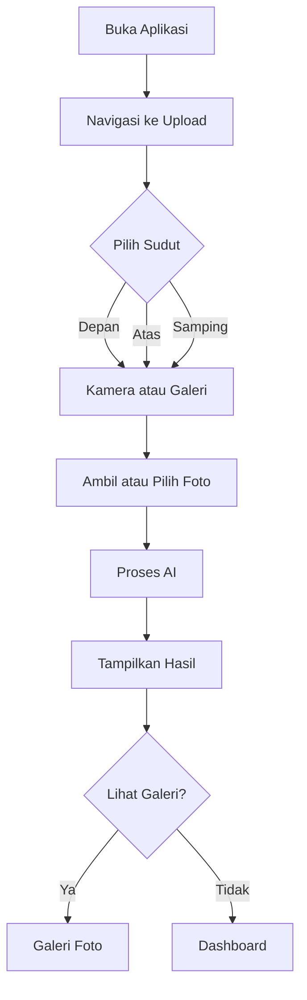

#### Spesifikasi

| Aspek | Spesifikasi |
|-------|-------------|
| Sudut Foto | Depan, Atas, Samping (3 sudut wajib) |
| Format Foto | JPEG, PNG (max 10MB) |
| Resolusi | Minimum 720p |
| Waktu Proses | Kurang dari 30 detik |
| Penyimpanan | Terenkripsi |

---

### 2.2 AI Scalp Type Analyzer

#### Alur Analisis

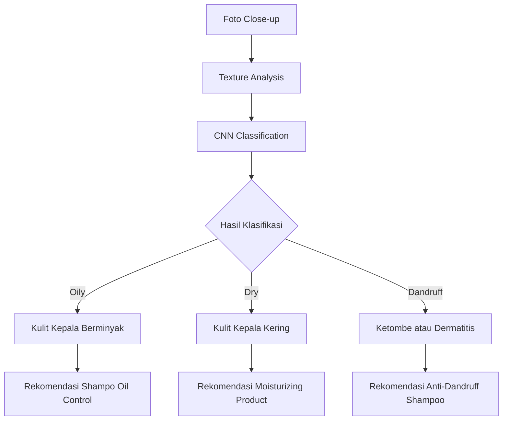

#### Klasifikasi Tipe Kulit Kepala

| Tipe | Karakteristik | Rekomendasi |
|------|---------------|-------------|
| Oily Scalp | Produksi sebum berlebih, kulit mengkilap | Shampo oil control, clay mask |
| Dry Scalp | Kulit kering, gatal, mengelupas | Moisturizing shampoo, hair oil |
| Dandruff | Ketombe, iritasi, kemerahan | Ketoconazole shampoo, anti-dandruff tonic |

#### Manfaat

| Analisis | Insight |
|----------|---------|
| Deteksi kondisi kulit kepala | Identifikasi penyebab kebotakan |
| Rekomendasi personal | Produk yang sesuai kondisi |
| Tracking progress | Pantau perubahan kondisi |

---

### 2.3 Habit Logger

#### Alur Pengguna

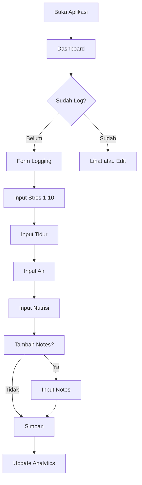

#### Spesifikasi Input

| Faktor | Tipe Input | Rentang | Frekuensi |
|--------|------------|---------|-----------|
| Tingkat Stres | Slider | 1-10 | Harian |
| Durasi Tidur | Number | 0-24 jam | Harian |
| Asupan Air | Number | 0-5 liter | Harian |
| Protein Intake | Number | gram | Harian |
| Zinc Intake | Number | mg | Harian |
| Notes | Text (Optional) | Max 500 karakter | Harian |

---

### 2.4 Correlation Dashboard

#### Arsitektur Visualisasi

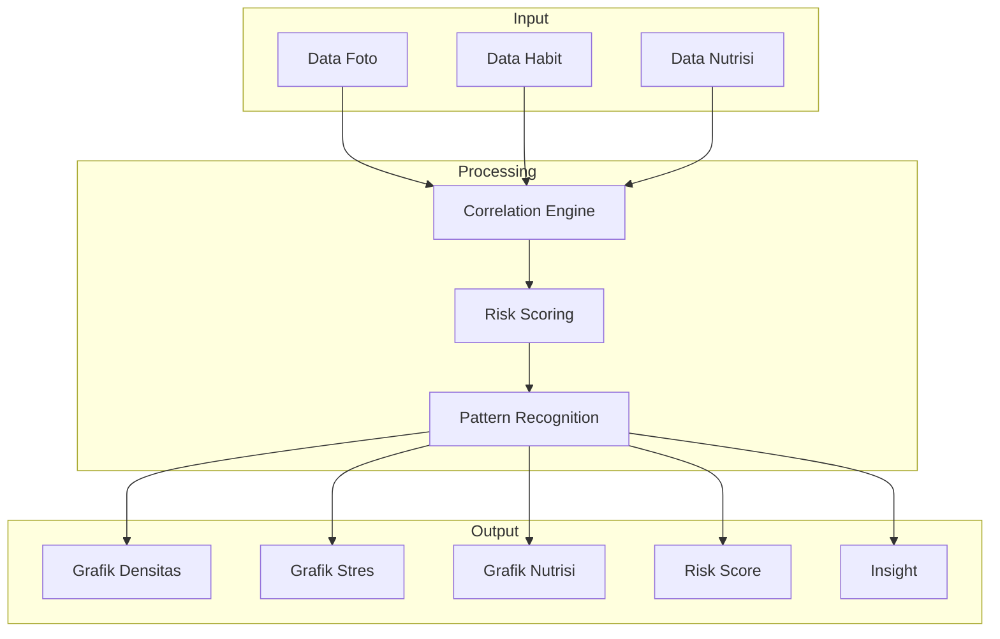

#### Logika Insight

| Analisis | Output |
|----------|--------|
| Stres vs Kepadatan | Korelasi dan rekomendasi stress management |
| Tidur vs Kepadatan | Korelasi dan rekomendasi sleep hygiene |
| Nutrisi vs Kepadatan | Korelasi dan rekomendasi diet |
| Total Risk Score | Prediksi risiko kebotakan |

---

### 2.5 Treatment Scheduler

#### Entity Relationship

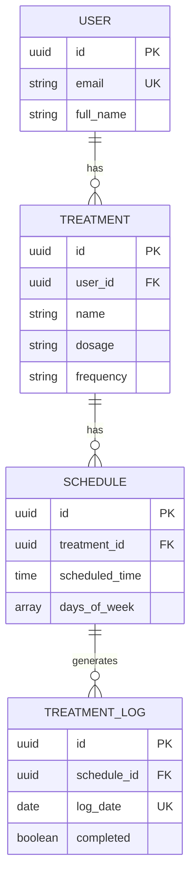

---

### 2.6 Smart Product Recommendation

#### Alur Rekomendasi

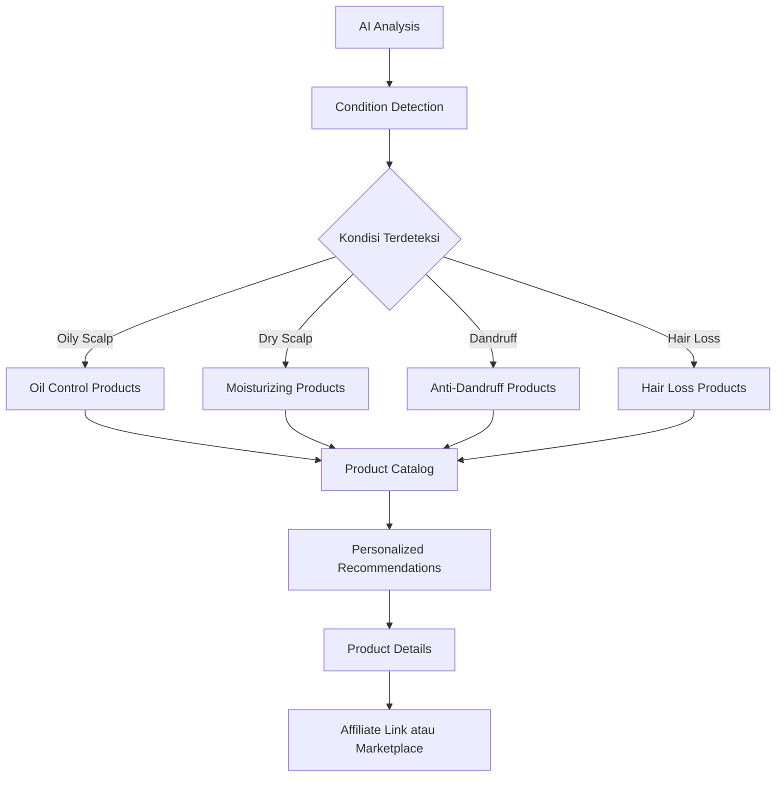

#### Katalog Produk

| Kondisi | Rekomendasi |
|---------|-------------|
| Oily Scalp | Shampo oil control, Clay mask, Toner |
| Dry Scalp | Moisturizing shampoo, Hair oil, Serum |
| Dandruff | Ketoconazole shampoo, Anti-dandruff tonic |
| Hair Loss | Minoxidil, Hair tonic, Biotin supplement |
| General | Hair vitamins, Protein supplements |

---

### 2.7 Content Recommendation

#### Tipe Konten

| Kategori | Contoh Konten | Sumber |
|----------|---------------|--------|
| Video Edukasi | Cara mengatasi kebotakan | YouTube API |
| Motivasi | Success story | Internal DB |
| Stress Management | Teknik relaksasi | YouTube API |
| Jurnal/Artikel | Penelitian rambut | Internal DB |

#### Alur Konten

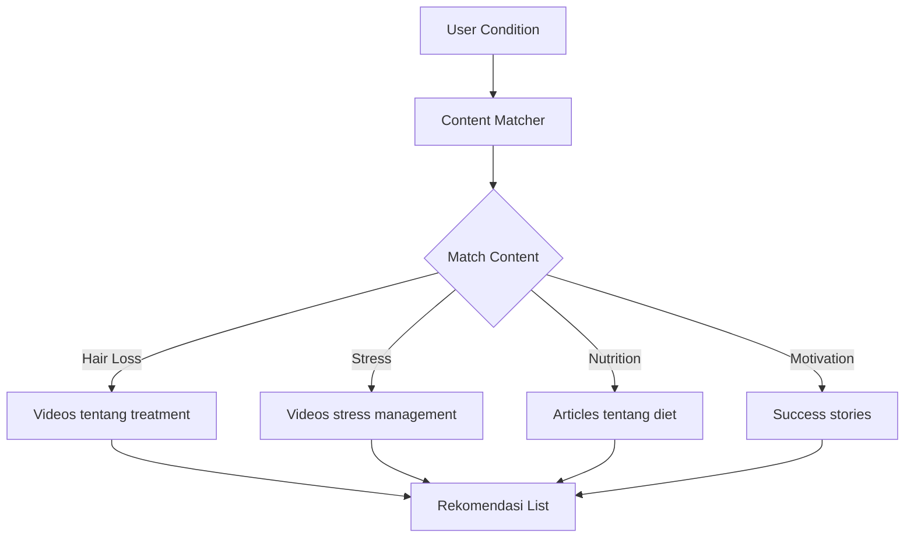

---

## 3. Fitur Lanjutan (Phase 2)

### 3.1 Genetic & Lifestyle Risk Scoring

#### Alur Risk Scoring

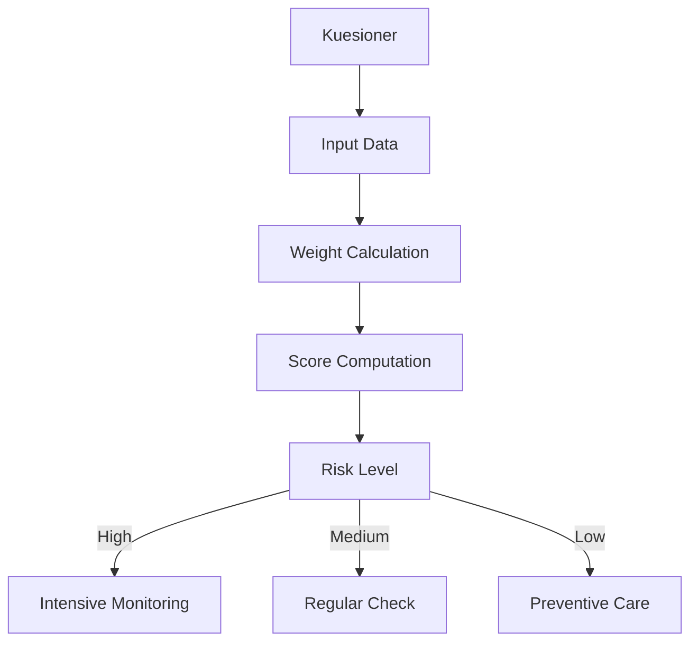

#### Faktor Risk Scoring

| Faktor | Bobot | Kuesioner |
|--------|-------|-----------|
| Riwayat Keluarga | 30% | Apakah ayah/kakek botak? |
| Merokok | 15% | Kebiasaan merokok |
| Diet | 15% | Asupan protein |
| Stress | 20% | Tingkat stres harian |
| Sleep | 10% | Kualitas tidur |
| UV Exposure | 10% | Penggunaan topi/helmet |

### 3.2 Community Progress Sharing

#### Fitur Komunitas

| Fitur | Deskripsi |
|-------|-----------|
| Anonymous Sharing | Upload progres tanpa identitas |
| Progress Gallery | Galeri progres komunitas |
| Tips Exchange | Berbagi tips dan pengalaman |
| Reaction | Dukungan dari komunitas |

---

## 4. Arsitektur Sistem

### 4.1 High-Level

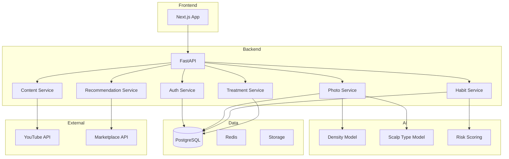

### 4.2 Alur Data

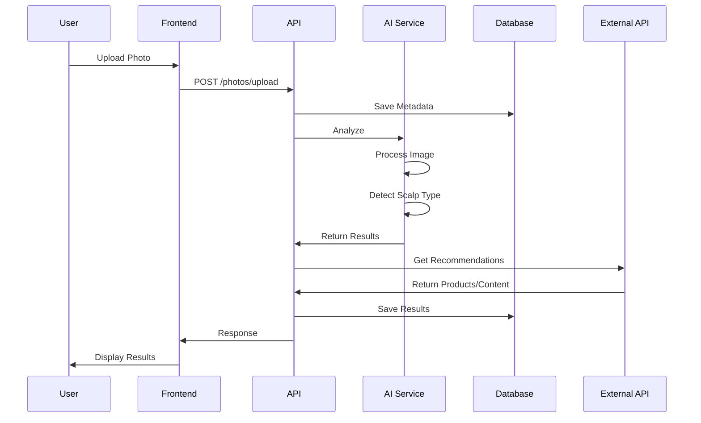

---

## 5. Database Schema

### 5.1 ERD Utama

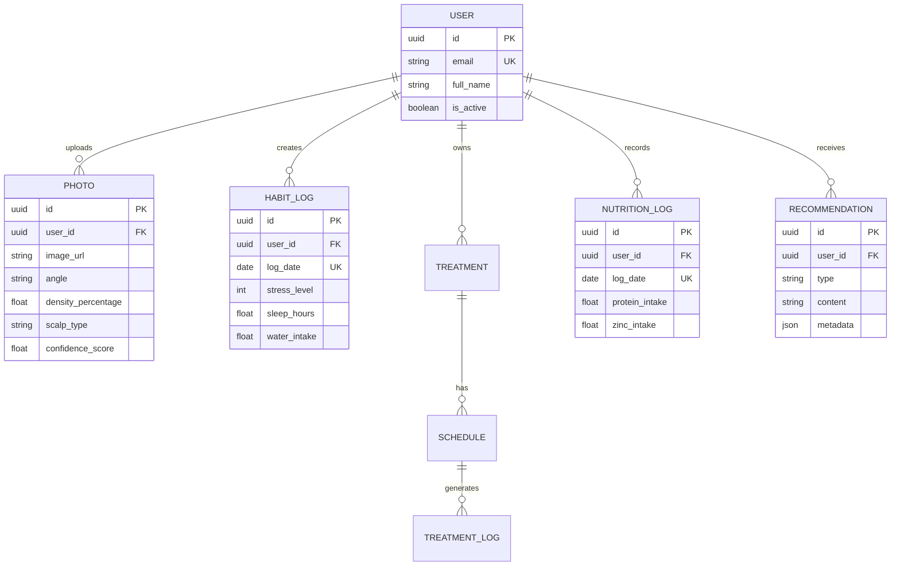

---

## 6. Testing Strategy

### 6.1 Coverage Target

| Komponen | Target |
|----------|--------|
| Services | 80% |
| Utils | 90% |
| Components | 70% |

### 6.2 Test Types

| Tipe | Framework | Lokasi |
|------|-----------|--------|
| Unit | pytest / Vitest | Beside source |
| Integration | pytest-asyncio / Playwright | tests/ folder |
| E2E | Playwright | tests/e2e/ |

---

## 7. Risk Assessment

| Risiko | Probabilitas | Dampak | Mitigasi |
|--------|--------------|--------|----------|
| Akurasi AI Rendah | Sedang | Tinggi | Multiple angles, feedback loop |
| Masalah Kualitas Foto | Tinggi | Sedang | Kompresi, validasi, panduan |
| Kekhawatiran Privasi | Sedang | Tinggi | Enkripsi, kebijakan jelas |
| Engagement Rendah | Sedang | Tinggi | Gamifikasi, komunitas |
| Rekomendasi Tidak Relevan | Sedang | Sedang | Feedback loop, rating |

---

## 8. Success Metrics Dashboard

| Metrik | Tool | Frekuensi |
|--------|------|-----------|
| Daily Active Users | Analytics | Harian |
| Photo Upload Rate | Database | Mingguan |
| Treatment Compliance | Database | Harian |
| User Retention | Analytics | Mingguan |
| Error Rate | Logging | Real-time |
| API Latency | Monitoring | Real-time |
| Recommendation CTR | Analytics | Mingguan |
| Community Engagement | Analytics | Mingguan |