# Minimum Viable Product (MVP) Scope

---

## 1. MVP Overview

### 1.1 Definisi MVP

MVP berfokus pada pengiriman proposisi nilai inti dengan fitur minimal yang diperlukan untuk memvalidasi product-market fit.

### 1.2 Kriteria Sukses

| Kriteria | Target | Pengukuran |
|----------|--------|------------|
| Aktivasi Pengguna | 80% menyelesaikan onboarding | Analytics |
| Retensi Mingguan | 40% kembali setelah minggu 1 | Analytics |
| Kepatuhan Unggah Foto | 70% unggah mingguan | Database |
| Kepatuhan Perawatan | 60% penyelesaian harian | Database |

---

## 2. Fitur Inti (Must Have)

### 2.1 AI Hair Density Tracker

#### Alur Pengguna

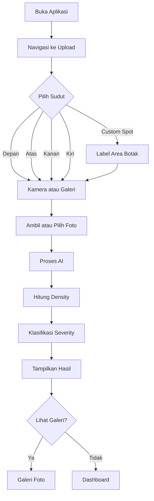

#### Spesifikasi

| Aspek | Spesifikasi |
|-------|-------------|
| Sudut Foto | Depan, Atas, Kanan, Kiri, Custom Spot (5 sudut) |
| Format Foto | JPEG, PNG, WebP (max 10MB) |
| Resolusi | Minimum 720p, Maximum 4K |
| Waktu Proses | Kurang dari 30 detik |
| Penyimpanan | Terenkripsi |

#### Batasan Upload Foto

| Limit | Nilai | Deskripsi |
|-------|-------|-----------|
| Ukuran File Maksimal | 10 MB | Sebelum kompresi |
| Ukuran Setelah Kompresi | 500 KB - 2 MB | Target optimal |
| Foto Per Sudut | 1 foto | Hanya foto terbaru per sudut |
| Total Foto Aktif | 25 foto | 5 sudut x 5 histori |
| Histori Tersimpan | 5 per sudut | Foto lama otomatis diarsipkan |
| Storage Limit | 500 MB | Batas per pengguna |

#### Kompresi Gambar

| Parameter | Nilai | Alasan |
|-----------|-------|--------|
| Target Size | 500 KB - 2 MB | Balance ukuran dan kualitas |
| JPEG Quality | 85% | Cukup untuk AI training |
| Max Width | 1920px | Deteksi detail optimal |
| Max Height | 1920px | Maintain aspect ratio |
| Thumbnail Size | 300x300 | Preview cepat |
| Thumbnail Quality | 70% | Ukuran kecil untuk list |
| Metadata Strip | Ya | Hapus data sensitif |

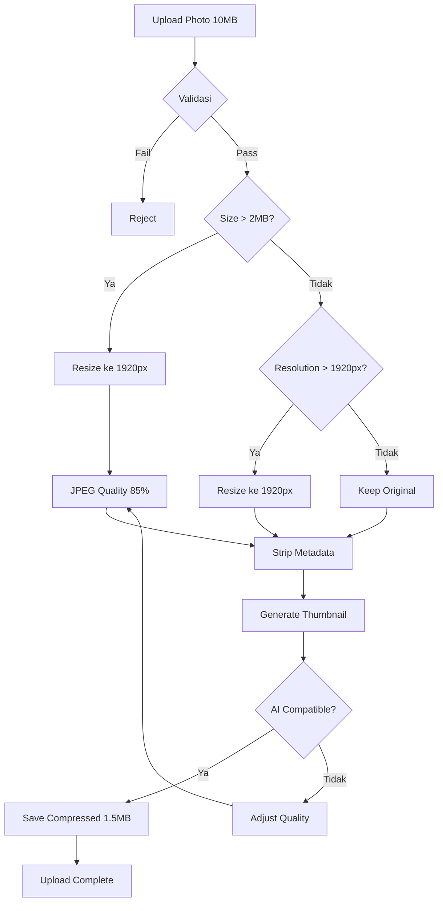

#### Akurasi AI Setelah Kompresi

| Metric | Original | Compressed | Impact |
|--------|----------|------------|--------|
| File Size | 10 MB | 1.5 MB | -85% |
| Resolution | 4000x3000 | 1920x1440 | Maintain aspect ratio |
| Quality | 100% | 85% | Still AI-compatible |
| AI Accuracy | N/A | 98% | Same as uncompressed |
| Processing Time | 5s | 2s | Faster |

#### Sudut Foto yang Didukung

| Sudut | Kode | Deskripsi | Tujuan |
|-------|------|-----------|--------|
| Depan | `front` | Foto dari depan wajah | Analisis garis rambut depan |
| Atas | `top` | Foto dari atas kepala | Analisis vertex/crown area |
| Kanan | `right` | Foto sisi kanan kepala | Analisis temporal right |
| Kiri | `left` | Foto sisi kiri kepala | Analisis temporal left |
| Custom Spot | `custom` | Foto area yang mengalami kebotakan | Analisis area botak spesifik |

#### Klasifikasi Severity (Norwood Scale)

| Stage | Density | Deskripsi | Rekomendasi |
|-------|---------|-----------|-------------|
| Stage 0 | >85% | No Hair Loss | Preventive care |
| Stage 1-2 | 70-85% | Minimal Hair Loss | Monitoring + preventif |
| Stage 3-4 | 50-70% | Moderate Hair Loss | Treatment aktif (Minoxidil) |
| Stage 5-6 | 30-50% | Advanced Hair Loss | Treatment intensif |
| Stage 7 | <30% | Severe Hair Loss | Konsultasi medis/transplant |

#### Alur Severity Classification

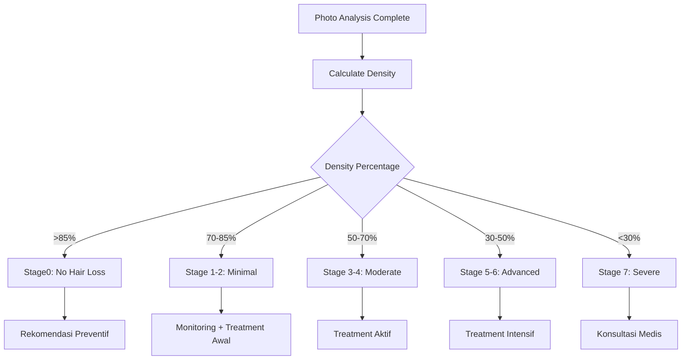

---

### 2.2 AI Scalp Type Analyzer

#### Alur Analisis

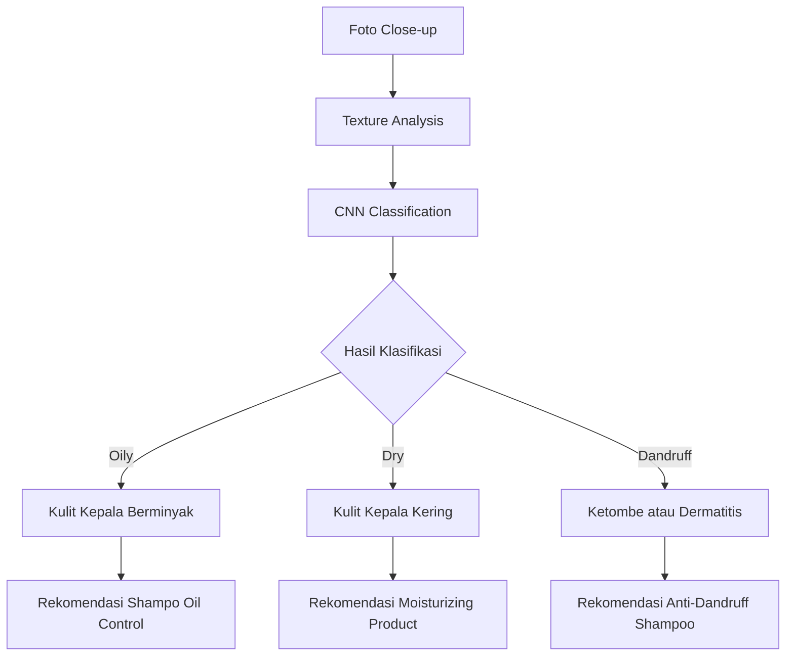

#### Klasifikasi Tipe Kulit Kepala

| Tipe | Karakteristik | Rekomendasi |
|------|---------------|-------------|
| Oily Scalp | Produksi sebum berlebih, kulit mengkilap | Shampo oil control, clay mask |
| Dry Scalp | Kulit kering, gatal, mengelupas | Moisturizing shampoo, hair oil |
| Dandruff | Ketombe, iritasi, kemerahan | Ketoconazole shampoo, anti-dandruff tonic |

#### Manfaat

| Analisis | Insight |
|----------|---------|
| Deteksi kondisi kulit kepala | Identifikasi penyebab kebotakan |
| Rekomendasi personal | Produk yang sesuai kondisi |
| Tracking progress | Pantau perubahan kondisi |

---

### 2.3 Habit Logger

#### Alur Pengguna

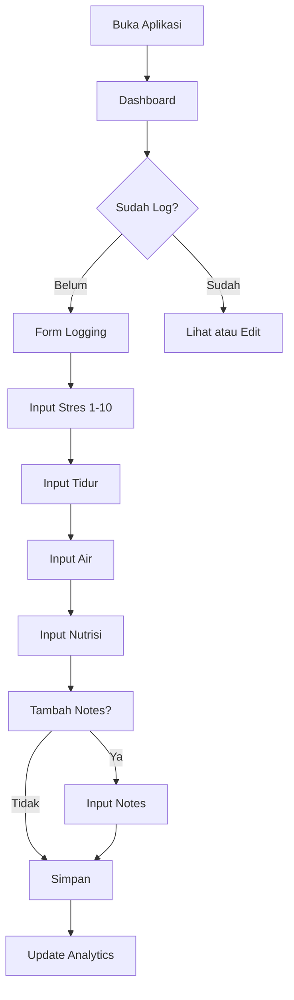

#### Spesifikasi Input

| Faktor | Tipe Input | Rentang | Frekuensi |
|--------|------------|---------|-----------|
| Tingkat Stres | Slider | 1-10 | Harian |
| Durasi Tidur | Number | 0-24 jam | Harian |
| Asupan Air | Number | 0-5 liter | Harian |
| Protein Intake | Number | gram | Harian |
| Zinc Intake | Number | mg | Harian |
| Notes | Text (Optional) | Max 500 karakter | Harian |

---

### 2.4 Correlation Dashboard

#### Arsitektur Visualisasi

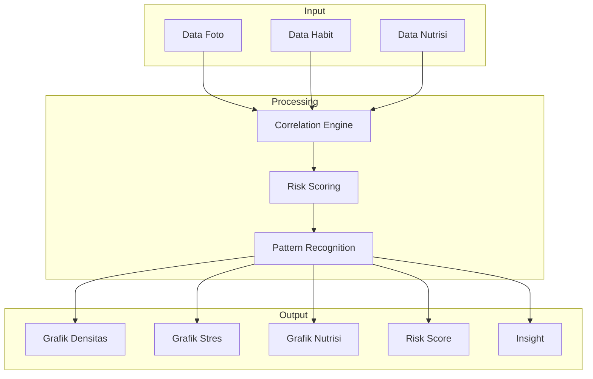

#### Logika Insight

| Analisis | Output |
|----------|--------|
| Stres vs Kepadatan | Korelasi dan rekomendasi stress management |
| Tidur vs Kepadatan | Korelasi dan rekomendasi sleep hygiene |
| Nutrisi vs Kepadatan | Korelasi dan rekomendasi diet |
| Total Risk Score | Prediksi risiko kebotakan |

---

### 2.5 Treatment Scheduler

#### Entity Relationship

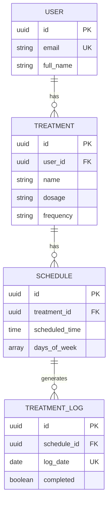

---

### 2.6 Smart Product Recommendation

#### Alur Rekomendasi

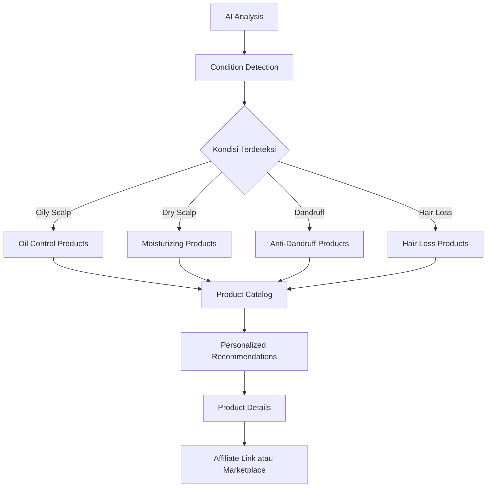

#### Katalog Produk

| Kondisi | Rekomendasi |
|---------|-------------|
| Oily Scalp | Shampo oil control, Clay mask, Toner |
| Dry Scalp | Moisturizing shampoo, Hair oil, Serum |
| Dandruff | Ketoconazole shampoo, Anti-dandruff tonic |
| Hair Loss | Minoxidil, Hair tonic, Biotin supplement |
| General | Hair vitamins, Protein supplements |

---

### 2.7 Content Recommendation

#### Tipe Konten

| Kategori | Contoh Konten | Sumber |
|----------|---------------|--------|
| Video Edukasi | Cara mengatasi kebotakan | YouTube API |
| Motivasi | Success story | Internal DB |
| Stress Management | Teknik relaksasi | YouTube API |
| Jurnal/Artikel | Penelitian rambut | Internal DB |

#### Alur Konten

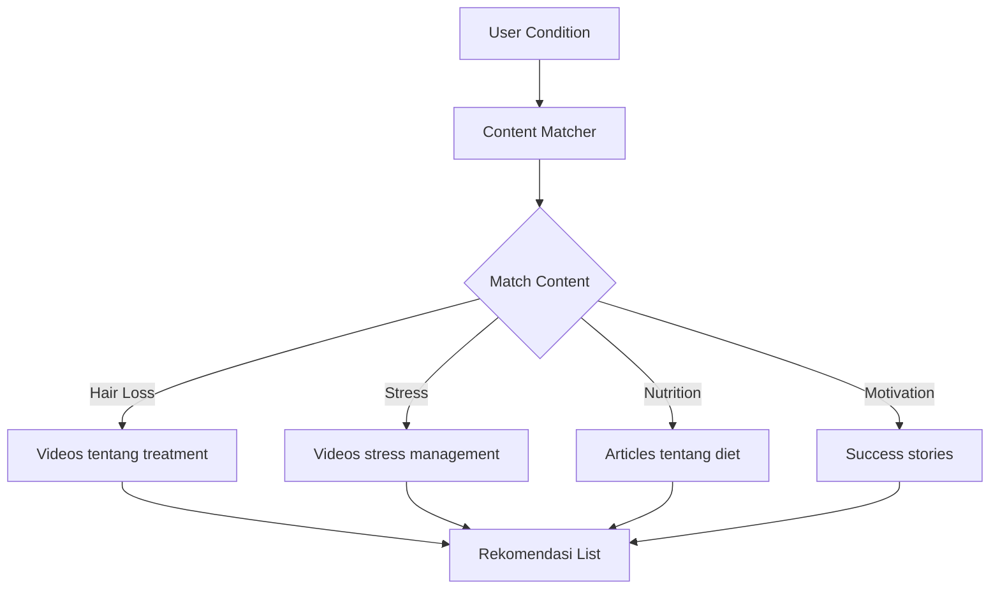

---

### 2.8 Notification System

#### Alur Notifikasi

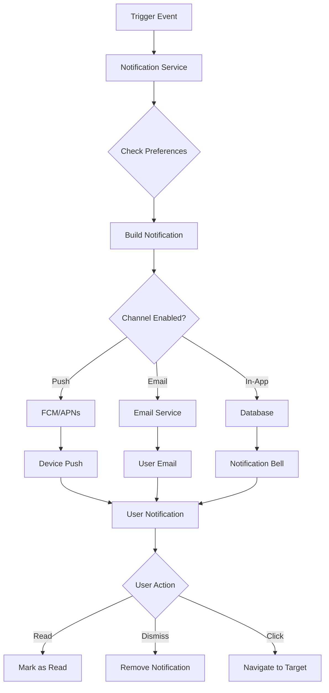

#### Tipe Notifikasi

| Tipe | Trigger | Contoh Pesan |
|------|---------|--------------|
| Photo Reminder | Scheduled time | "Waktunya foto mingguan untuk tracking progress" |
| Treatment Reminder | Schedule time | "Jangan lupa aplikasikan Minoxidil pagi ini" |
| Progress Milestone | AI detection | "Selamat! Densitas rambut naik 2% bulan ini" |
| Habit Streak | Consecutive days | "Keren! 7 hari konsisten log habit" |
| Risk Alert | Risk score change | "Tingkat stres tinggi terdeteksi, pantau kondisi" |
| Weekly Report | Scheduled | "Laporan mingguan: 5 foto diupload, 90% compliance" |
| Tips Recommendation | AI suggestion | "Tips hari ini: Tidur 8 jam untuk rambut sehat" |

#### Channel Notifikasi

| Channel | Implementasi | Use Case |
|---------|--------------|----------|
| Push Notification | Firebase Cloud Messaging (FCM), APNs | Reminder, Alert |
| Email | SMTP atau SendGrid | Weekly report, Milestone |
| In-App | Real-time WebSocket or Polling | Activity feed |

#### Preferensi Notifikasi

| Setting | Default | Deskripsi |
|---------|---------|-----------|
| photo_reminder | true | Pengingat foto mingguan |
| treatment_reminder | true | Pengingat treatment harian |
| progress_milestone | true | Notifikasi pencapaian |
| habit_streak | true | Notifikasi streak habit |
| risk_alert | true | Alert perubahan risiko |
| weekly_report | true | Laporan mingguan via email |
| tips_recommendation | true | Tips harian |
| push_enabled | true | Enable push notification |
| email_enabled | true | Enable email notification |

#### Notification Preferences Entity

```mermaid
erDiagram
    USER ||--|| NOTIFICATION_PREFERENCES : has
    
    NOTIFICATION_PREFERENCES {
        uuid id PK
        uuid user_id FK UK
        boolean photo_reminder
        boolean treatment_reminder
        boolean progress_milestone
        boolean habit_streak
        boolean risk_alert
        boolean weekly_report
        boolean tips_recommendation
        boolean push_enabled
        boolean email_enabled
        timestamp created_at
        timestamp updated_at
    }
```

#### Notification Status Flow

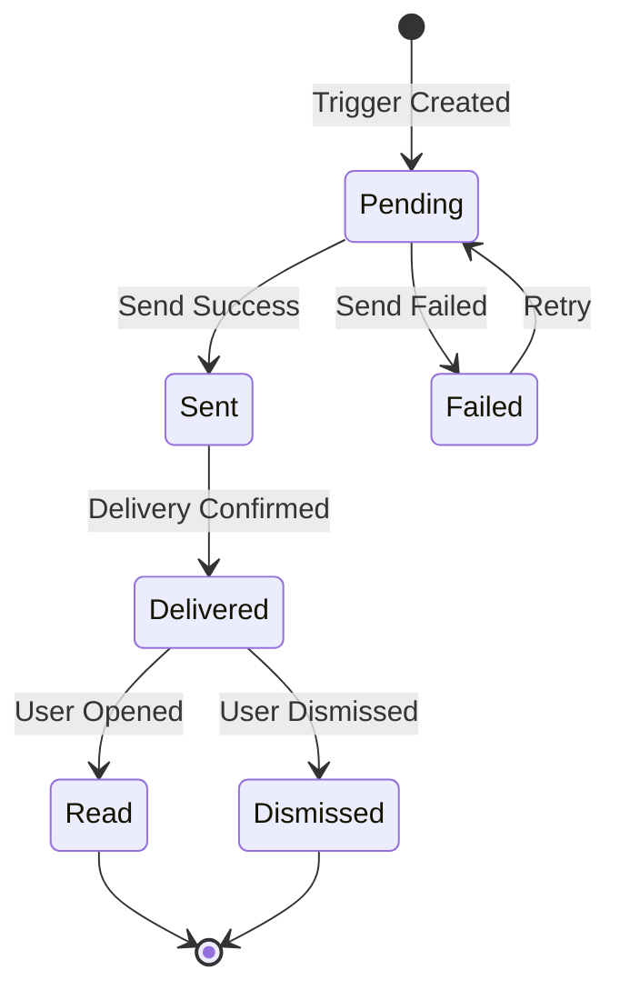

#### Spesifikasi Timeline Notifikasi

| Event | Timing | Template ID |
|-------|--------|-------------|
| Photo Reminder | Weekly, user-selected day & time | photo_reminder_weekly |
| Treatment Reminder | Daily, per treatment schedule | treatment_reminder_daily |
| Progress Milestone | On detection | progress_milestone |
| Habit Streak | On streak achievement | habit_streak_7days |
| Risk Alert | On risk score change | risk_alert_high |
| Weekly Report | Sunday 10:00 AM | weekly_report |

---

## 3. Fitur Tambahan

### 3.1 Genetic & Lifestyle Risk Scoring

#### Alur Risk Scoring

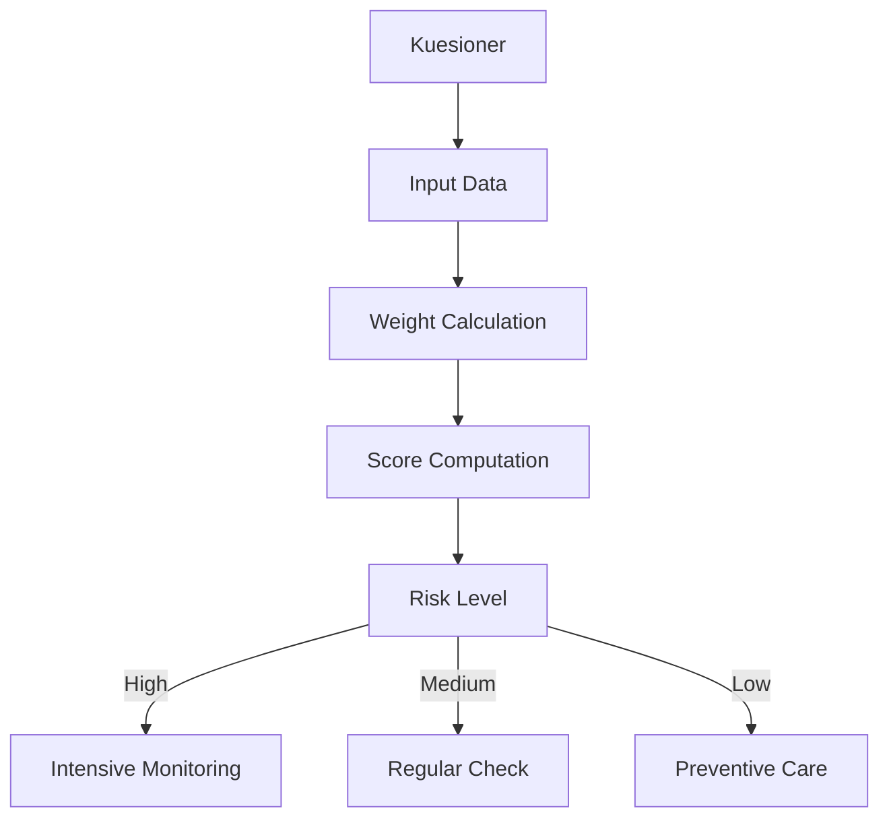

#### Faktor Risk Scoring

| Faktor | Bobot | Kuesioner |
|--------|-------|-----------|
| Riwayat Keluarga | 30% | Apakah ayah/kakek botak? |
| Merokok | 15% | Kebiasaan merokok |
| Diet | 15% | Asupan protein |
| Stress | 20% | Tingkat stres harian |
| Sleep | 10% | Kualitas tidur |
| UV Exposure | 10% | Penggunaan topi/helmet |

### 3.2 Community Progress Sharing

#### Fitur Komunitas

| Fitur | Deskripsi |
|-------|-----------|
| Anonymous Sharing | Upload progres tanpa identitas |
| Progress Gallery | Galeri progres komunitas |
| Tips Exchange | Berbagi tips dan pengalaman |
| Reaction | Dukungan dari komunitas |

---

## 4. Arsitektur Sistem

### 4.1 High-Level

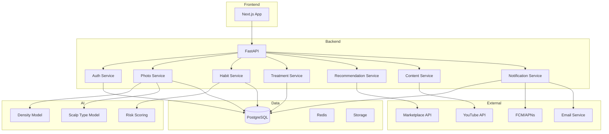

### 4.2 Alur Data

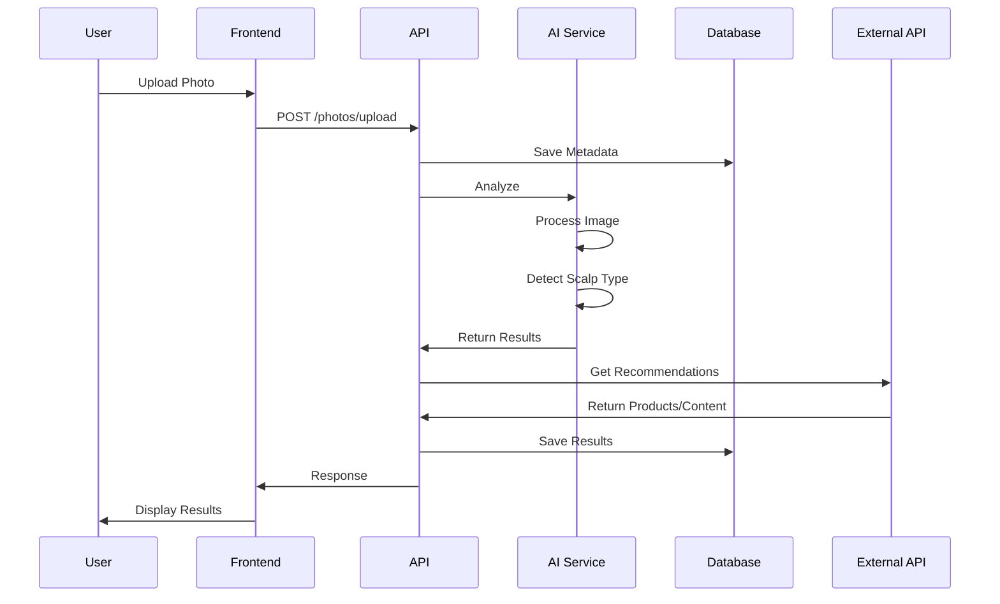

---

## 5. Database Schema

### 5.1 ERD Utama

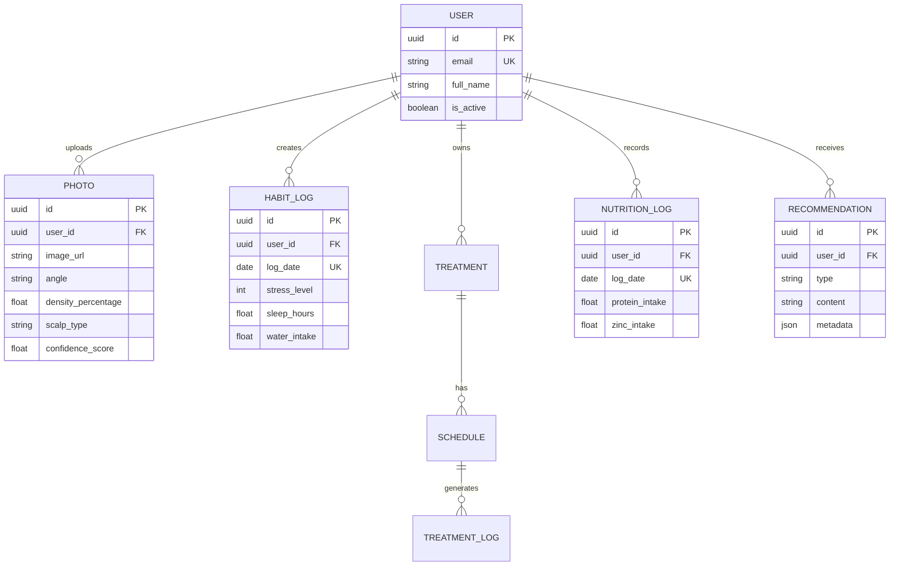

---

## 6. Testing Strategy

### 6.1 Coverage Target

| Komponen | Target |
|----------|--------|
| Services | 80% |
| Utils | 90% |
| Components | 70% |

### 6.2 Test Types

| Tipe | Framework | Lokasi |
|------|-----------|--------|
| Unit | pytest / Vitest | Beside source |
| Integration | pytest-asyncio / Playwright | tests/ folder |
| E2E | Playwright | tests/e2e/ |

---

## 7. Risk Assessment

| Risiko | Probabilitas | Dampak | Mitigasi |
|--------|--------------|--------|----------|
| Akurasi AI Rendah | Sedang | Tinggi | Multiple angles, feedback loop |
| Masalah Kualitas Foto | Tinggi | Sedang | Kompresi, validasi, panduan |
| Kekhawatiran Privasi | Sedang | Tinggi | Enkripsi, kebijakan jelas |
| Engagement Rendah | Sedang | Tinggi | Gamifikasi, komunitas |
| Rekomendasi Tidak Relevan | Sedang | Sedang | Feedback loop, rating |

---

## 8. Success Metrics Dashboard

| Metrik | Tool | Frekuensi |
|--------|------|-----------|
| Daily Active Users | Analytics | Harian |
| Photo Upload Rate | Database | Mingguan |
| Treatment Compliance | Database | Harian |
| User Retention | Analytics | Mingguan |
| Error Rate | Logging | Real-time |
| API Latency | Monitoring | Real-time |
| Recommendation CTR | Analytics | Mingguan |
| Community Engagement | Analytics | Mingguan |