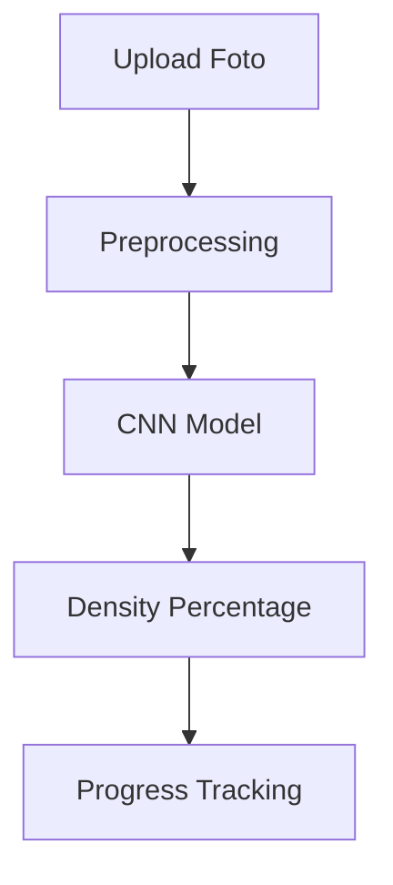
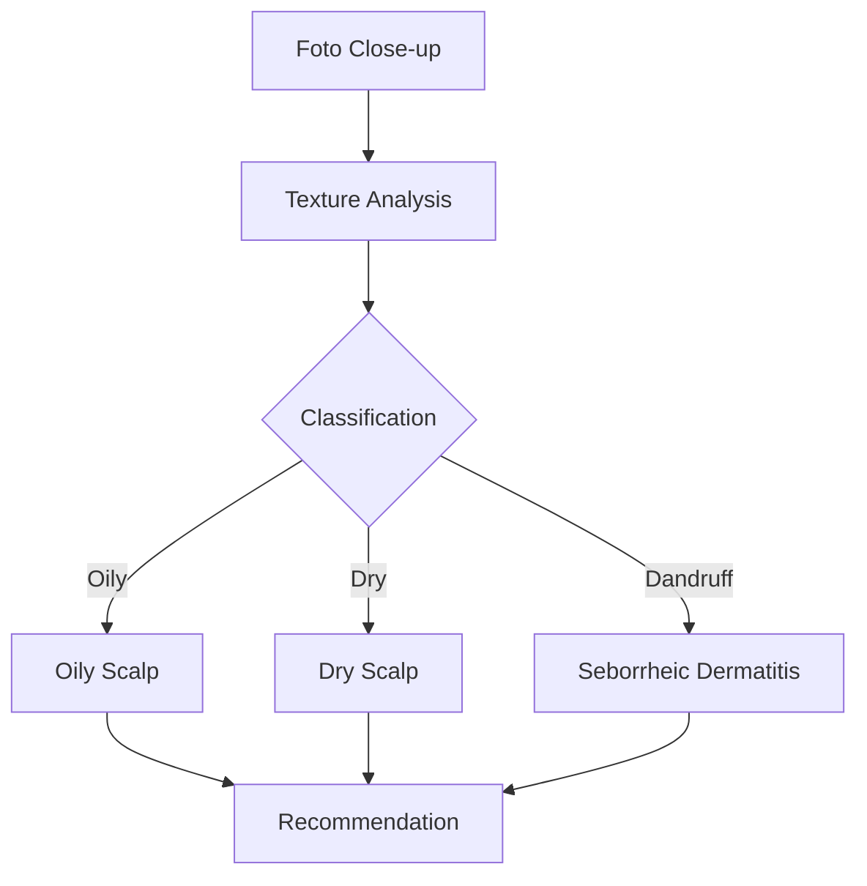
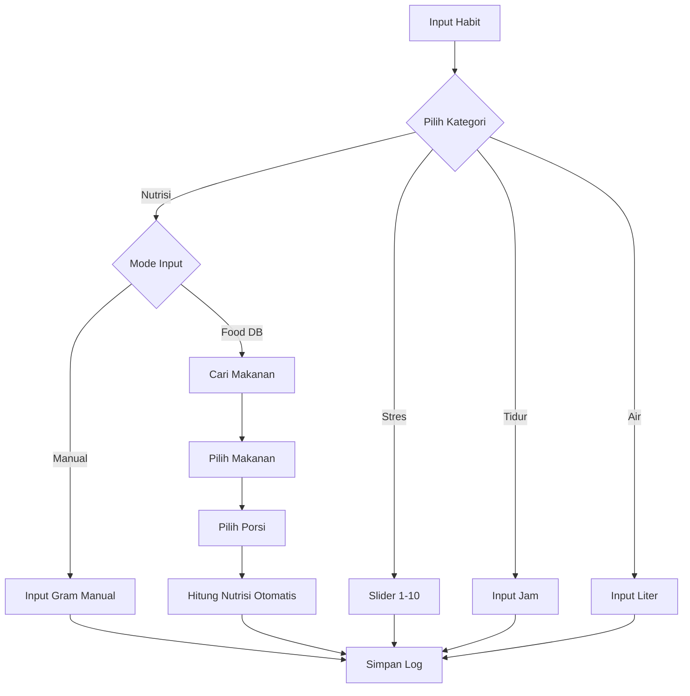
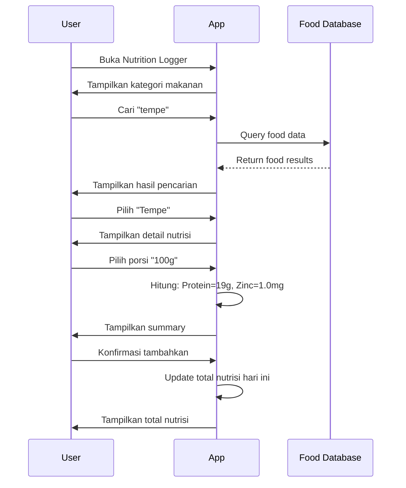
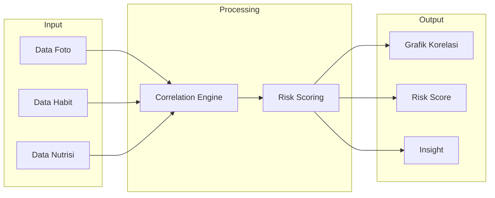
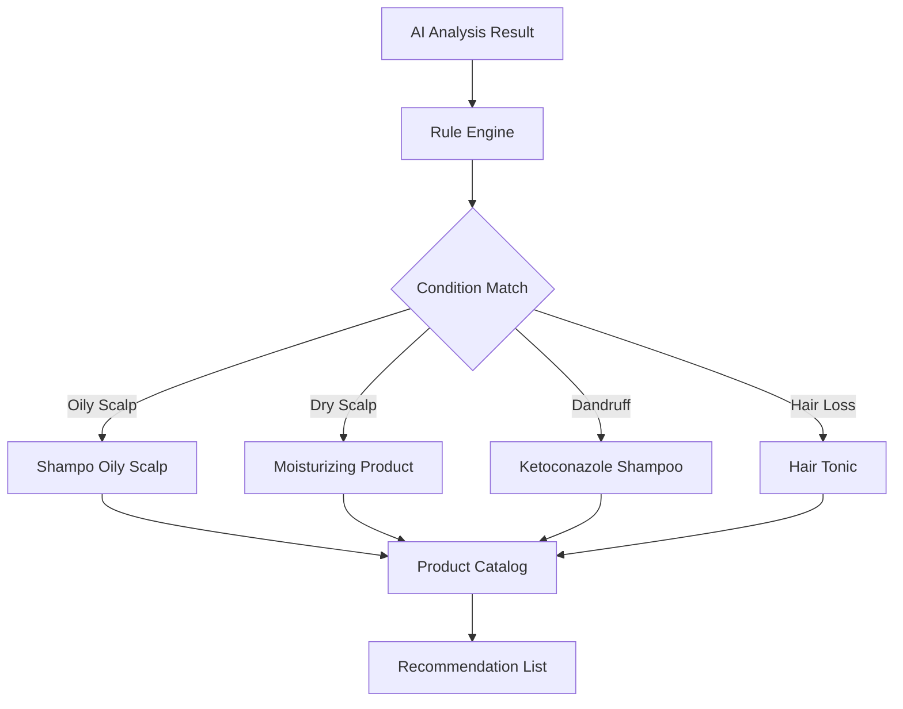
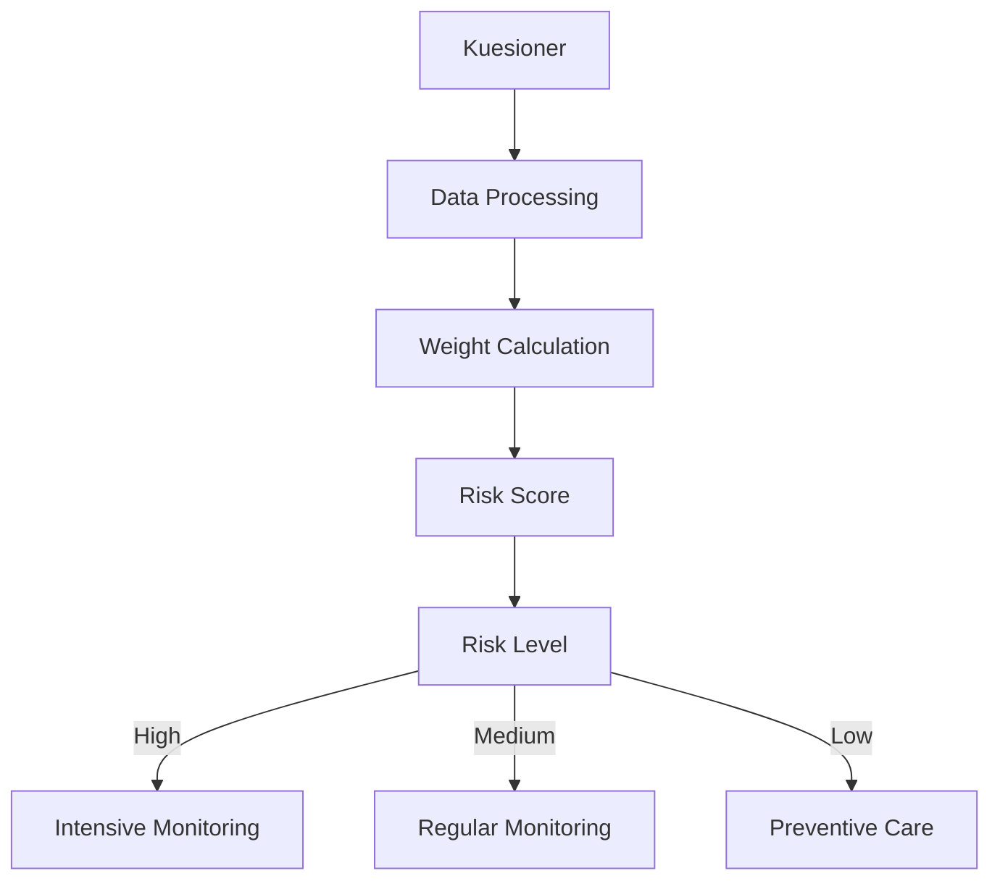
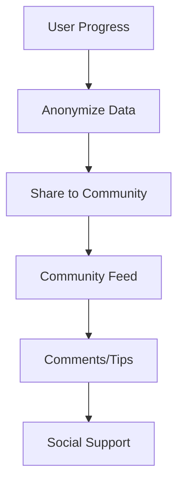
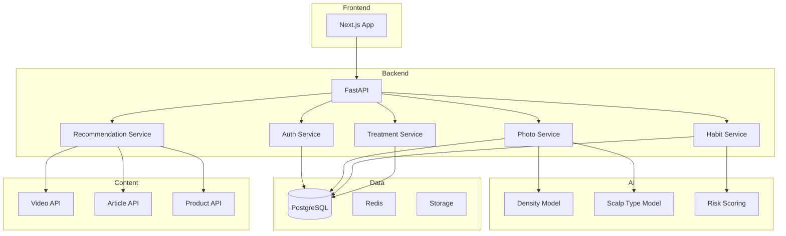

# Product Requirements Document (PRD)

## Informasi Produk

| Field | Nilai |
|-------|-------|
| Nama Produk | Scalp Analytics |
| Status | Active |

---

## 1. Ringkasan Eksekutif

### 1.1 Gambaran Produk

Scalp Analytics adalah sistem manajemen kesehatan rambut berbasis AI yang memungkinkan pengguna memantau progres kebotakan secara objektif melalui analisis foto, mengidentifikasi korelasi antara gaya hidup dan kesehatan rambut, serta menjaga disiplin perawatan.

### 1.2 Pernyataan Masalah

| Masalah | Dampak |
|---------|--------|
| Pengguna tidak dapat menilai secara objektif kondisi rambut | Ketidakpastian dalam perawatan |
| Tidak ada keterkaitan gaya hidup dengan progres kerontokan | Sulit mengidentifikasi penyebab |
| Kesulitan menjaga konsistensi perawatan | Kepatuhan rendah |
| Konsultasi medis kurang data historis | Diagnosis kurang akurat |
| Tidak ada rekomendasi produk yang tepat | Pembelian produk tidak efektif |
| Kurang dukungan psikologis | Motivasi menurun |

### 1.3 Solusi

| Fitur | Manfaat |
|-------|---------|
| Analisis foto kulit kepala berbasis AI | Pengukuran objektif |
| Deteksi tipe kulit kepala | Identifikasi penyebab kebotakan |
| Pelacakan gaya hidup | Identifikasi korelasi |
| Penjadwalan perawatan | Peningkatan kepatuhan |
| Dashboard visual | Data untuk konsultasi medis |
| Rekomendasi produk | Solusi nyata |
| Komunitas anonim | Dukungan psikologis |

---

## 2. Tujuan dan Sasaran

### 2.1 Tujuan Utama

| Tujuan | Deskripsi | Kriteria Sukses |
|--------|-----------|-----------------|
| Objektivitas | Menghilangkan penilaian subjektif | Pengguna mendapat metrik persentase |
| Analisis Korelasi | Identifikasi hubungan statistik | Pengguna menemukan insight actionable |
| Kepatuhan Perawatan | Pastikan konsistensi pengobatan | Tingkat penyelesaian harian |
| Rekomendasi | Solusi produk yang tepat | Relevansi rekomendasi |

### 2.2 Non-Goals

- Analisis kulit kepala real-time via video
- Integrasi rekam medis elektronik
- Fitur konsultasi telemedisin
- Sistem pembayaran/subscription

---

## 3. Fitur Produk

### 3.1 Core Features (MVP)

#### AI Hair Density Tracker



| Aspek | Spesifikasi |
|-------|-------------|
| Sudut Foto | Depan, Atas, Samping |
| Output | Persentase kepadatan rambut |
| Accuracy | Confidence score |

#### AI Scalp Type Analyzer



| Kondisi | Deskripsi | Rekomendasi |
|---------|-----------|-------------|
| Oily Scalp | Kulit kepala berminyak | Shampo khusus oily |
| Dry Scalp | Kulit kepala kering | Moisturizing treatment |
| Dandruff | Ketombe/dermatitis | Ketoconazole shampoo |

#### Habit Logger



| Faktor | Tipe Input | Rentang | Frekuensi |
|--------|------------|---------|-----------|
| Tingkat Stres | Slider | 1-10 | Harian |
| Durasi Tidur | Number | 0-24 jam | Harian |
| Asupan Air | Number |0-5 liter | Harian |

#### Nutrition Tracker dengan Food Database

```mermaid
flowchart LR
    subgraph Input
        A[Cari Makanan]
        B[Pilih Porsi]
    end
    
    subgraphDatabase
        C[USDA Food Data]
        D[Indonesian Food]
        E[Custom Foods]
    end
    
    subgraph Calculation
        F[Protein]
        G[Zinc]
        H[Iron]
        I[Biotin]
        J[Vitamin D]
    end
    
    A --> C
    A --> D
    A --> E
    B --> F
    B --> G
    B --> H
    B --> I
    B --> J
```

| Fitur | Deskripsi |
|-------|-----------|
| Food Database | Database makanan dengan informasi nutrisi lengkap |
| Pencarian | Search berdasarkan nama makanan |
| Porsi Fleksibel | Pilih ukuran porsi (gram, mangkuk, potong, dll) |
| Kalkulasi Otomatis | Hitung protein, zinc, iron, biotin, vitamin dari makanan |
| Kategori Makanan | Filter berdasarkan kategori (protein, sayuran, buah, dll) |
| Custom Food | Tambah makanan custom jika tidak ada di database |

**Contoh Data Makanan:**

| Makanan | Porsi | Protein | Zinc | Iron | Biotin | Vitamin D |
|---------|-------|---------|------|------|--------|------------|
| Tempe | 100g | 19g | 1.0mg | 2.7mg | 0mcg | 0IU |
| Bayam | 1 mangkuk | 3g | 0.5mg | 6.4mg | 0mcg | 0IU |
| Telur | 1 butir | 6g | 0.5mg | 1mg | 10mcg | 41IU |
| Salmon | 100g | 25g | 0.6mg | 0.8mg | 5mcg | 526IU |
| Almond | 28g| 6g | 0.9mg | 1mg | 1.5mcg | 0IU |
| Buncis | 100g | 9g | 1.5mg | 3mg | 0mcg | 0IU |

**Flow Pencatatan Nutrisi:**



#### Correlation Dashboard



#### Treatment Scheduler

| Fitur | Deskripsi |
|-------|-----------|
| CRUD Treatment | Buat, edit, hapus jadwal perawatan |
| Daily Checklist | Tandai selesai/belum |
| Streak Tracking | Lacak konsistensi |
| Reminder | Notifikasi pengingat |

#### Smart Product Recommendation



| Kondisi | Rekomendasi Produk |
|---------|-------------------|
| Oily Scalp | Shampo oil control, Clay mask |
| Dry Scalp | Moisturizing shampoo, Hair oil |
| Dandruff | Ketoconazole shampoo, Anti-dandruff tonic |
| Hair Loss | Minoxidil, Hair tonic, Biotin supplement |

#### Content Recommendation

| Tipe Konten | Contoh |
|-------------|--------|
| Video Edukasi | Cara mengatasi kebotakan |
| Motivasi | Success story, tips |
| Stress Management | Teknik relaksasi, meditasi |
| Jurnal/Artikel | Penelitian tentang rambut |

---

### 3.2 Advanced Features (Phase 2)

#### Genetic & Lifestyle Risk Scoring



| Faktor | Bobot | Kuesioner |
|--------|-------|-----------|
| Riwayat Keluarga | 30% | Apakah ayah/kakek botak? |
| Merokok | 15% | Kebiasaan merokok |
| Diet | 15% | Asupan protein |
| Stress | 20% | Tingkat stres harian |
| Sleep | 10% | Kualitas tidur |
| Paparan UV | 10% | Penggunaan topi/helmet |

#### Community Progress Sharing



| Fitur | Deskripsi |
|-------|-----------|
| Anonymous Sharing | Upload progress tanpa identitas |
| Progress Gallery | Galeri progres komunitas |
| Tips Exchange | Berbagi tips dan pengalaman |
| Motivation | Dukungan dari komunitas |

---

## 4. Target Audiens

### 4.1 Persona Pengguna

| Persona | Deskripsi | Kebutuhan Utama |
|---------|-----------|-----------------|
| Kerontokan Tahap Awal | Usia 25-40, menyadari penipisan | Lacak progres, pahami penyebab |
| Perawatan Aktif | Menggunakan minoxidil/finasteride | Pastikan konsistensi, ukur efektivitas |
| Pasca-Transplant | Memantau pemulihan transplant | Dokumentasi penyembuhan |

### 4.2 Demografis

| Aspek | Keterangan |
|-------|-------------|
| Usia | 25-55 tahun |
| Gender | Semua gender |
| Literasi Teknologi | Sedang hingga tinggi |
| Geografis | Indonesia |

---

## 5. User Stories

### 5.1 Must Have (MVP)

| ID | User Story | Kriteria Penerimaan |
|----|------------|---------------------|
| US-001 | Upload foto dari berbagai sudut | Upload dari sudut depan, atas, samping |
| US-002 | Menerima analisis AI | Lihat persentase kepadatan |
| US-003 | Melihat riwayat foto | Galeri terurut tanggal |
| US-004 | Mencatat tingkat stres harian | Input skala 1-10 |
| US-005 | Mencatat durasi tidur | Input jam tidur |
| US-006 | Mencatat asupan air | Input liter per hari |
| US-007 | Melihat korelasi data | Grafik gabungan, koefisien korelasi |
| US-008 | Membuat jadwal perawatan | Tambah nama obat, dosis, waktu |
| US-009 | Checklist harian | Tandai selesai/tunda, streak |
| US-010 | Deteksi tipe kulit kepala | Klasifikasi oily/dry/dandruff |
| US-011 | Rekomendasi produk | Daftar produk sesuai kondisi |
| US-012 | Mencatat makanan yang dikonsumsi | Pilih dari food database |
| US-013 | Melihat nutrisi dari makanan | Lihat protein, zinc, iron, biotin, vitamin D |
| US-014 | Hitung total nutrisi harian | Summary protein, zinc, iron, biotin harian |
| US-015 | Pilih ukuran porsi makanan | Pilih gram, mangkuk, potong, dll |
| US-016 | Cari makanan di database | Search berdasarkan nama makanan |
| US-017 | Tambah makanan custom | Input nutrisi manual jika tidak ada di database |

### 5.2 Nice to Have (Phase 2)

| ID | User Story | Prioritas |
|----|------------|-----------|
| US-012 | Risk scoring berdasarkan genetik | P1 |
| US-013 | Komunitas anonim | P2 |
| US-014 | Video edukasi | P2 |
| US-015 | Jurnal/artikel | P2 |
| US-016 | Integrasi marketplace | P3 |

---

## 6. Persyaratan Fungsional

### 6.1 Photo Analysis

| ID | Persyaratan | Prioritas |
|----|-------------|-----------|
| FR-PHOTO-001 | Upload foto dari perangkat | P0 |
| FR-PHOTO-002 | Analisis kepadatan rambut | P0 |
| FR-PHOTO-003 | Deteksi tipe kulit kepala | P0 |
| FR-PHOTO-004 | Galeri foto historis | P0 |
| FR-PHOTO-005 | Perbandingan side-by-side | P1 |

### 6.2 Habit Tracking

| ID | Persyaratan | Prioritas |
|----|-------------|-----------|
| FR-HABIT-001 | Logging stres harian | P0 |
| FR-HABIT-002 | Logging tidur harian | P0 |
| FR-HABIT-003 | Logging asupan air | P0 |
| FR-HABIT-004 | Logging nutrisi | P1 |
| FR-HABIT-005 | Melihat log historis | P0 |
| FR-HABIT-006 | Pencarian makanan di database | P0 |
| FR-HABIT-007 | Kalkulasi nutrisi otomatis | P0 |
| FR-HABIT-008 | Pilihan porsi fleksibel | P1 |
| FR-HABIT-009 | Tambah makanan custom | P2 |
| FR-HABIT-010 | Kategori makanan | P1 |
| FR-HABIT-011 | Total nutrisi harian | P0 |

### 6.3 Analytics

| ID | Persyaratan | Prioritas |
|----|-------------|-----------|
| FR-ANALYTICS-001 | Grafik korelasi | P0 |
| FR-ANALYTICS-002 | Risk scoring | P1 |
| FR-ANALYTICS-003 | Insight mingguan | P0 |
| FR-ANALYTICS-004 | Rekomendasi personal | P0 |

### 6.4 Treatment

| ID | Persyaratan | Prioritas |
|----|-------------|-----------|
| FR-TREAT-001 | CRUD jadwal perawatan | P0 |
| FR-TREAT-002 | Checklist harian | P0 |
| FR-TREAT-003 | Pelacakan streak | P1 |
| FR-TREAT-004 | Notifikasi push | P1 |

### 6.5 Recommendation

| ID | Persyaratan | Prioritas |
|----|-------------|-----------|
| FR-REC-001 | Rekomendasi produk | P0 |
| FR-REC-002 | Rekomendasi video | P1 |
| FR-REC-003 | Rekomendasi artikel | P1 |

---

## 7. Persyaratan Non-Fungsional

### 7.1 Performa

| Metrik | Target |
|--------|--------|
| Waktu Load Halaman | Kurang dari 3 detik |
| Waktu Respons API | Kurang dari 500 ms (p95) |
| Waktu Analisis Foto | Kurang dari 30 detik |
| Pengguna Konkuren | 100+ |

### 7.2 Keamanan

| Aspek | Implementasi |
|-------|--------------|
| Enkripsi Data | AES-256 untuk foto |
| Keamanan Transit | HTTPS (TLS 1.3) |
| Autentikasi | JWT dengan expiry |
| Password | bcrypt dengan salt |

### 7.3 Skalabilitas

| Aspek | Target |
|-------|--------|
| Basis Pengguna | 10.000+ |
| Penyimpanan Foto | 100+ GB |
| Database | PostgreSQL dengan pooling |

---

## 8. Arsitektur Sistem



---

## 9. Dependensi

### 9.1 Teknologi

| Dependensi | Tujuan |
|------------|--------|
| OpenCV | Pemrosesan gambar |
| TensorFlow | Model CNN |
| FastAPI | Framework backend |
| Next.js | Framework frontend |
| PostgreSQL | Database utama |

### 9.2 Risiko

| Dependensi | Risiko | Mitigasi |
|------------|--------|----------|
| Akurasi AI | Bervariasi berdasarkan kualitas foto | Multiple angles, validasi |
| Storage | Eskalasi biaya | Kompresi, cleanup policy |

---

## 10. Di Luar Cakupan

| Fitur | Alasan |
|-------|--------|
| Analisis video | Kompleksitas tinggi |
| Integrasi wearable | Memerlukan partnership |
| Sistem pembayaran | Non-essential untuk MVP |
| Telemedisin | Memerlukan regulasi medis |

---

## 11. Glosarium

| Istilah | Definisi |
|---------|----------|
| Kepadatan Rambut | Jumlah folikel per sentimeter persegi |
| Analisis Kulit Kepala | Pemrosesan gambar AI untuk identifikasi tipe |
| Koefisien Korelasi | Ukuran statistik kekuatan hubungan |
| Risk Score | Prediksi risiko berdasarkan faktor genetik dan gaya hidup |