# Product Requirements Document (PRD)

## Informasi Produk

| Field | Nilai |
|-------|-------|
| Nama Produk | Scalp Analytics |
| Status | Active |

---

## 1. Ringkasan Eksekutif

### 1.1 Gambaran Produk

Scalp Analytics adalah sistem manajemen kesehatan rambut berbasis AI yang memungkinkan pengguna memantau progres kebotakan secara objektif melalui analisis foto, mengidentifikasi korelasi antara gaya hidup dan kesehatan rambut, serta menjaga disiplin perawatan.

### 1.2 Pernyataan Masalah

| Masalah | Dampak |
|---------|--------|
| Pengguna tidak dapat menilai secara objektif kondisi rambut | Ketidakpastian dalam perawatan |
| Tidak ada keterkaitan gaya hidup dengan progres kerontokan | Sulit mengidentifikasi penyebab |
| Kesulitan menjaga konsistensi perawatan | Kepatuhan rendah |
| Konsultasi medis kurang data historis | Diagnosis kurang akurat |
| Tidak ada rekomendasi produk yang tepat | Pembelian produk tidak efektif |
| Kurang dukungan psikologis | Motivasi menurun |

### 1.3 Solusi

| Fitur | Manfaat |
|-------|---------|
| Analisis foto kulit kepala berbasis AI | Pengukuran objektif |
| Deteksi tipe kulit kepala | Identifikasi penyebab kebotakan |
| Pelacakan gaya hidup | Identifikasi korelasi |
| Penjadwalan perawatan | Peningkatan kepatuhan |
| Dashboard visual | Data untuk konsultasi medis |
| Rekomendasi produk | Solusi nyata |
| Komunitas anonim | Dukungan psikologis |

---

## 2. Tujuan dan Sasaran

### 2.1 Tujuan Utama

| Tujuan | Deskripsi | Kriteria Sukses |
|--------|-----------|-----------------|
| Objektivitas | Menghilangkan penilaian subjektif | Pengguna mendapat metrik persentase |
| Analisis Korelasi | Identifikasi hubungan statistik | Pengguna menemukan insight actionable |
| Kepatuhan Perawatan | Pastikan konsistensi pengobatan | Tingkat penyelesaian harian |
| Rekomendasi | Solusi produk yang tepat | Relevansi rekomendasi |

### 2.2 Non-Goals

- Analisis kulit kepala real-time via video
- Integrasi rekam medis elektronik
- Fitur konsultasi telemedisin
- Sistem pembayaran/subscription

---

## 3. Fitur Produk

### 3.1 Core Features (MVP)

#### AI Hair Density Tracker

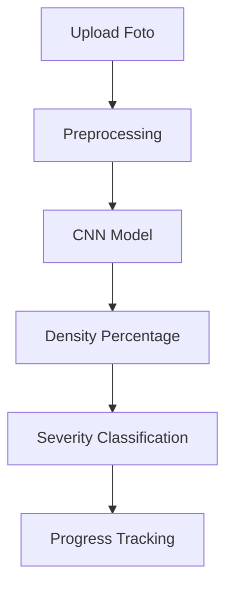

| Aspek | Spesifikasi |
|-------|-------------|
| Sudut Foto | Depan, Atas, Kanan, Kiri, Area Botak Custom |
| Output | Persentase kepadatan rambut |
| Severity | Skoring parahnya kebotakan (Stage 1-7) |
| Accuracy | Confidence score |

**Sudut Foto yang Didukung:**

| Sudut | Kode | Deskripsi | Tujuan |
|-------|------|-----------|--------|
| Depan | `front` | Foto dari depan wajah | Analisis garis rambut depan |
| Atas | `top` | Foto dari atas kepala | Analisis vertex/crown area |
| Kanan | `right` | Foto sisi kanan kepala | Analisis temporal right |
| Kiri | `left` | Foto sisi kiri kepala | Analisis temporal left |
| Custom Spot | `custom` | Foto area yang mengalami kebotakan | Analisis area botak spesifik |

**Klasifikasi Parahnya Kebotakan (Norwood Scale - Pria):**

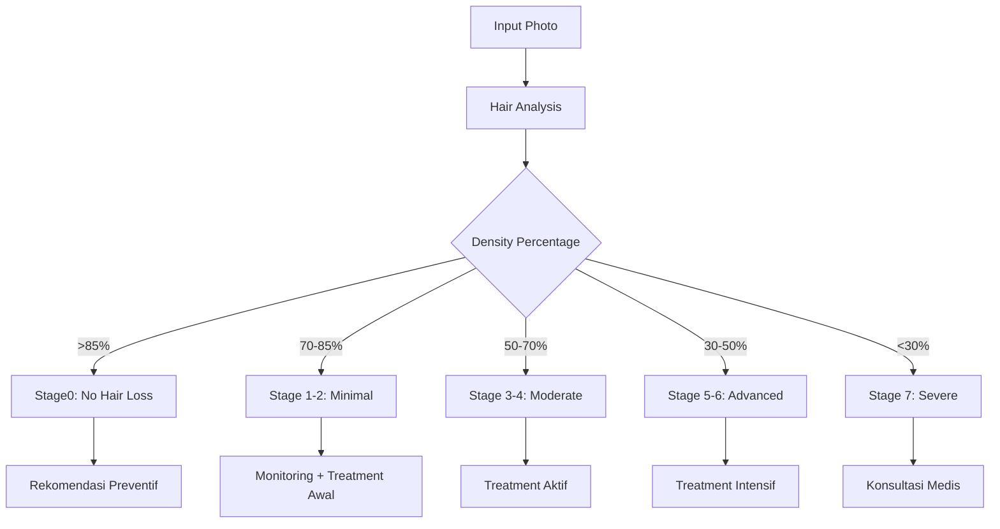

| Stage | Klasifikasi | Density | Deskripsi | Rekomendasi |
|-------|-------------|---------|-----------|-------------|
| Stage 0 | No Hair Loss | >85% | Tidak ada tanda kebotakan | Preventive care |
| Stage 1-2 | Minimal | 70-85% | Kerontokan minor | Monitoring + preventif |
| Stage 3-4 | Moderate | 50-70% | Kerontokan moderate | Treatment aktif (Minoxidil) |
| Stage 5-6 | Advanced | 30-50% | Kerontokan signifikan | Treatment intensif |
| Stage 7 | Severe | <30% | Kebotakan parah | Konsultasi medis/transplant |

**Klasifikasi Parahnya Kebotakan (Ludwig Scale - Wanita):**

| Stage | Klasifikasi | Density | Deskripsi | Rekomendasi |
|-------|-------------|---------|-----------|-------------|
| Stage 0 | No Hair Loss | >85% | Tidak ada penipisan | Preventive care |
| Stage 1 | Mild | 70-85% | Penipisan minimal di crown | Monitoring |
| Stage 2 | Moderate | 50-70% | Penipisan moderate | Treatment aktif |
| Stage 3| Severe | <50% | Penipisan signifikan | Konsultasi medis |

**Custom Spot Detection:**

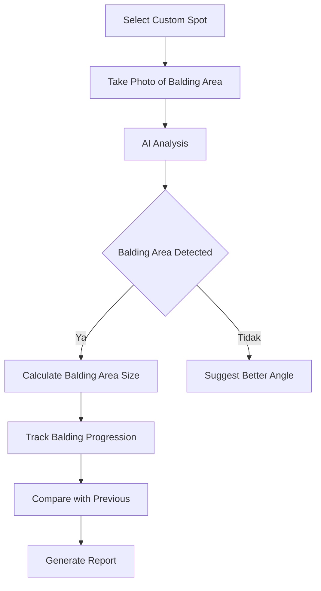

#### Photo Upload Limits & Compression

**Batasan Upload Foto:**

| Aspek | Limit |Deskripsi |
|-------|-------|-----------|
| Ukuran File Maksimal | 10 MB | Sebelum kompresi |
| Ukuran File Setelah Kompresi | 500 KB - 2 MB | Target optimal |
| Resolusi Minimum | 720p (1280x720) | Untuk akurasi AI |
| Resolusi Maksimum | 4K (3840x2160) | Akan dikompresi |
| Format yang Didukung | JPEG, PNG, WebP | Otomatis convert ke JPEG |
| Foto Per Sudut | 1 foto | Hanya 1 foto terbaru per sudut |
| Total Foto Aktif | 25 foto | 5 sudut x 5 histori |
| Histori Tersimpan | 5 per sudut | Otomatis hapus foto lama |

**Flow Kompresi Gambar:**

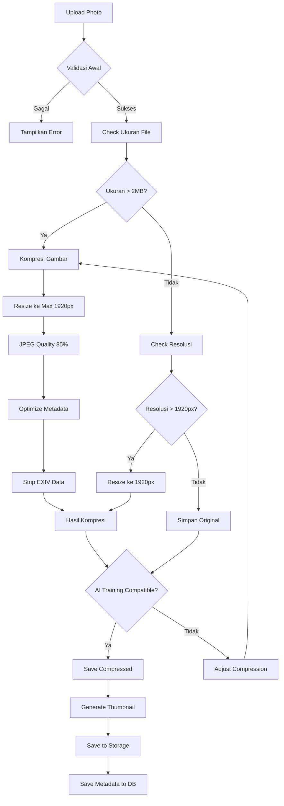

**Spesifikasi Kompresi:**

| Parameter | Nilai | Alasan |
|-----------|-------|--------|
| Target Size | 500 KB - 2 MB | Balance antara ukuran dan kualitas |
| JPEG Quality | 85% | Kualitas cukup untuk AI training |
| Max Width | 1920px | Cukup untuk deteksi detail |
| Max Height | 1920px | Maintain aspect ratio |
| Thumbnail Size | 300x300 | Untuk preview |
| Thumbnail Quality | 70% | Ukuran kecil untuk list |
| Metadata Strip | Ya | Hapus data lokasi, device info |

**AI Training Compatibility:**

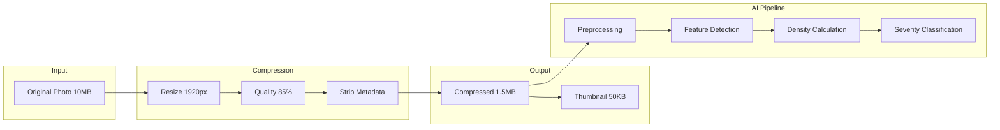

| Metric | Original | Compressed | Impact |
|--------|----------|------------|--------|
| File Size | 10 MB | 1.5 MB | -85% |
| Resolution | 4000x3000 | 1920x1440 | Maintain aspect ratio |
| Quality | 100% | 85% | Still AI-compatible |
| AI Accuracy | N/A | 98% | Same as uncompressed |
| Processing Time | 5s | 2s | Faster |

**Algoritma Kompresi:**

```python
# Pseudocode untuk kompresi
def compress_image(image):
    # Step 1: Resize jika > 1920px
    if image.width > 1920 or image.height > 1920:
        image = resize_maintain_aspect(image, max_dim=1920)
    
    # Step 2: Convert ke RGB (hilangkan alpha channel)
    if image.mode == 'RGBA':
        image = image.convert('RGB')
    
    # Step 3: Kompresi dengan quality 85%
    compressed = image.save(
        format='JPEG',
        quality=85,
        optimize=True,
        progressive=True
    )
    
    # Step 4: Strip metadata
    compressed = strip_metadata(compressed)
    
    # Step 5: Validasi ukuran
    if compressed.size > 2 * 1024 * 1024:  # 2MB
        compressed = compress_with_lower_quality(image, quality=75)
    
    return compressed
```

**Validasi Kompresi untuk AI:**

| Check | Kriteria | Action jika Fail |
|-------|----------|-----------------|
| Resolution | Min 720p | Reject upload |
| File Size | Min 100 KB | Reject (too compressed) |
| Color Depth | Min 8-bit | Reject |
| Sharpness | Detect blur | Ask for clearer photo |
| Contrast | Min threshold | Adjust or reject |

#### AI Scalp Type Analyzer

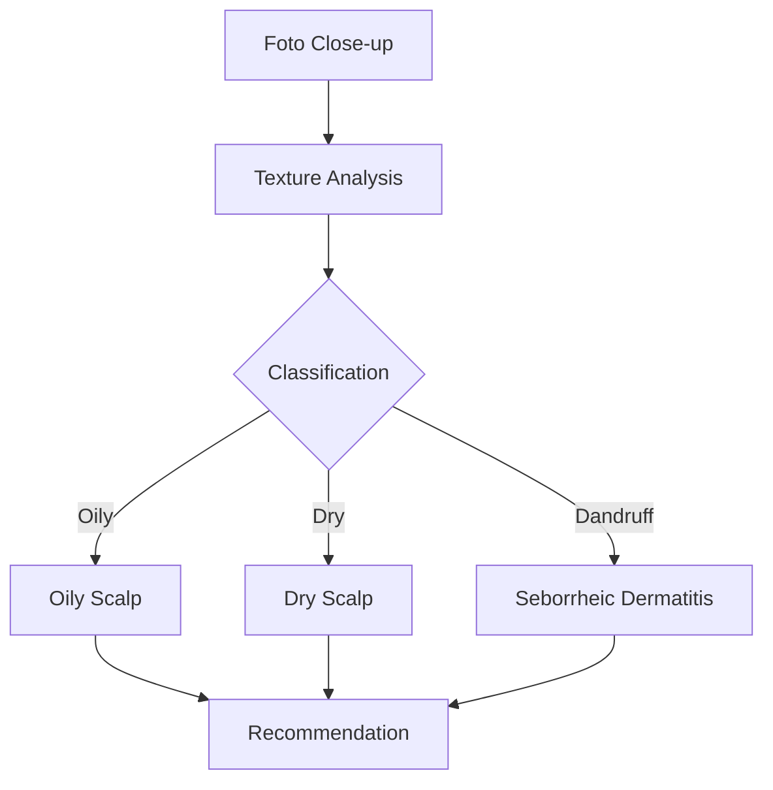

| Kondisi | Deskripsi | Rekomendasi |
|---------|-----------|-------------|
| Oily Scalp | Kulit kepala berminyak | Shampo khusus oily |
| Dry Scalp | Kulit kepala kering | Moisturizing treatment |
| Dandruff | Ketombe/dermatitis | Ketoconazole shampoo |

#### Habit Logger

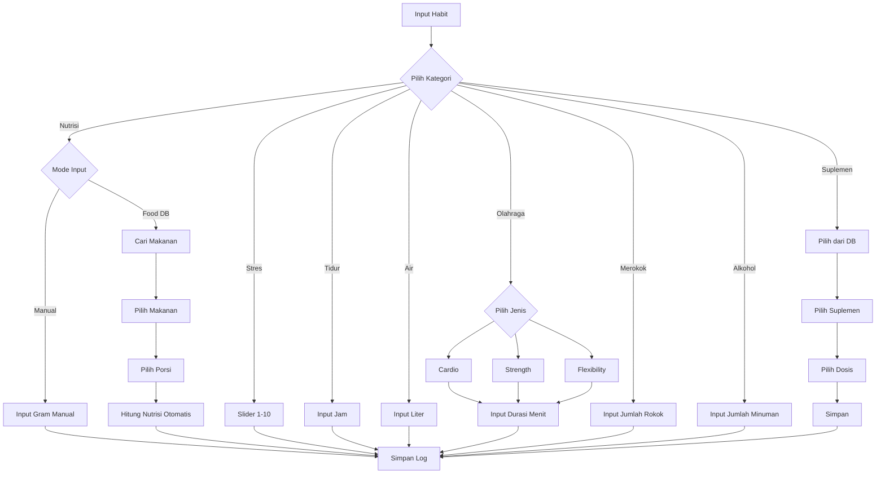

| Faktor | Tipe Input | Rentang | Frekuensi | Dampak |
|--------|------------|---------|-----------|--------|
| Tingkat Stres | Slider | 1-10 | Harian | Kortisol tinggi |
| Durasi Tidur | Number | 0-24 jam | Harian | Regenerasi sel |
| Asupan Air | Number | 0-5 liter | Harian | Hidrasi kulit kepala |
| Olahraga | Checkbox + Select | Ya/Tidak + Jenis + Durasi | Harian | Sirkulasi darah |
| Merokok | Number | 0-100 batang/hari | Harian | Kerusakan folikel |
| Alkohol | Number | 0-20 gelas/hari | Harian | Dehidrasi, nutrient depletion |
| Suplemen | Multi-select | Daftar suplemen | Harian | Nutrisi tambahan |
| Nutrisi | Food Database | Gram/porsi | Harian | Komponen keratin |

**Kategori Olahraga:**

| Jenis | Deskripsi | Dampak |
|-------|-----------|--------|
| Cardio | Lari, sepeda, berenang | Meningkatkan sirkulasi |
| Strength | Angkat beban, resistance | Meningkatkan testosteron sehat |
| Flexibility | Yoga, stretching | Mengurangi stress |
| HIIT | High intensity interval | Metabolisme, sirkulasi |
| Walking | Jalan kaki | Sirkulasi ringan |

**Database Suplemen:**

| Suplemen | Dosis Umum | Nutrisi Utama |
|----------|------------|---------------|
| Biotin | 5000-10000 mcg | Biotin |
| Zinc | 15-30 mg | Zinc |
| Vitamin D | 1000-5000 IU | Vitamin D |
| Iron | 18-27 mg | Iron |
| Vitamin B12 | 500-1000 mcg | B12 |
| Vitamin E | 200-400 IU | Vitamin E |
| Omega-3 | 1000-3000 mg | Omega-3 |
| Multivitamin | 1 tablet | Berbagai |

**Lifestyle Factors untuk Risk Scoring:**

| Faktor | Penilaian | Bobot Risk |
|--------|-----------|------------|
| Merokok | Jumlah batang/hari | 15% |
| Alkohol | Jumlah gelas/minggu | 10% |
| Olahraga | Frekuensi/minggu | 10% |
| Suplemen | Ya/Tidak | 5% |

#### Nutrition Tracker dengan Food Database

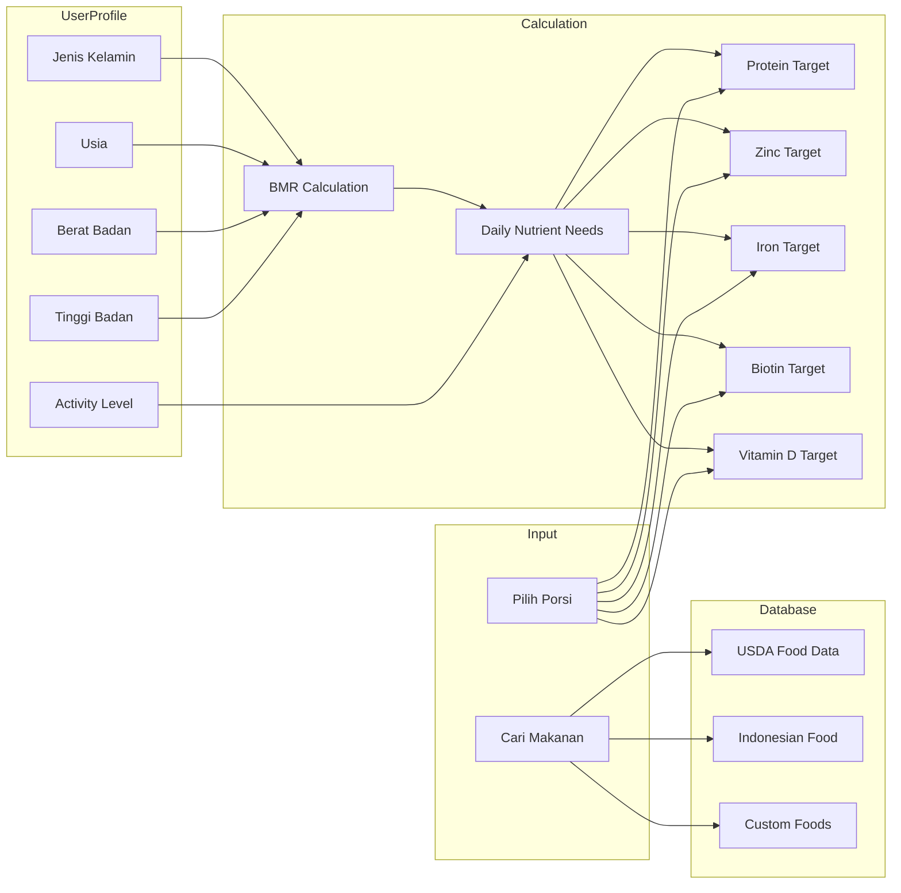

| Fitur | Deskripsi |
|-------|-----------|
| Food Database | Database makanan dengan informasi nutrisi lengkap |
| Pencarian | Search berdasarkan nama makanan |
| Porsi Fleksibel | Pilih ukuran porsi (gram, mangkuk, potong, dll) |
| Kalkulasi Otomatis | Hitung protein, zinc, iron, biotin, vitamin dari makanan |
| Kategori Makanan | Filter berdasarkan kategori (protein, sayuran, buah, dll) |
| Custom Food | Tambah makanan custom jika tidak ada di database |

**Contoh Data Makanan:**

| Makanan | Porsi | Protein | Zinc | Iron | Biotin | Vitamin D |
|---------|-------|---------|------|------|--------|------------|
| Tempe | 100g | 19g | 1.0mg | 2.7mg | 0mcg | 0IU |
| Bayam | 1 mangkuk | 3g | 0.5mg | 6.4mg | 0mcg | 0IU |
| Telur | 1 butir | 6g | 0.5mg | 1mg | 10mcg | 41IU |
| Salmon | 100g | 25g | 0.6mg | 0.8mg | 5mcg | 526IU |
| Almond | 28g| 6g | 0.9mg | 1mg | 1.5mcg | 0IU |
| Buncis | 100g | 9g | 1.5mg | 3mg | 0mcg | 0IU |

| Makanan | Porsi | Protein | Zinc | Iron | Biotin | Vitamin D |
|---------|-------|---------|------|------|--------|------------|
| Tempe | 100g | 19g | 1.0mg | 2.7mg | 0mcg | 0IU |
| Bayam | 1 mangkuk | 3g | 0.5mg | 6.4mg | 0mcg | 0IU |
| Telur | 1 butir | 6g | 0.5mg | 1mg | 10mcg | 41IU |
| Salmon | 100g | 25g | 0.6mg | 0.8mg | 5mcg | 526IU |
| Almond | 28g | 6g | 0.9mg | 1mg | 1.5mcg | 0IU |
| Buncis | 100g | 9g | 1.5mg | 3mg | 0mcg | 0IU |

**Kalkulasi Nutrisi Berdasarkan Profil:**

Nutrisi target dihitung berdasarkan profil pengguna untuk memenuhi kebutuhan kesehatan rambut.

| Profil Parameter | Penggunaan | Rumus BMR |
|------------------|------------|-----------|
| Tinggi Badan | Kalkulasi BMI | Pria: BMR = 88.362 + (13.397 × berat) + (4.799 × tinggi) - (5.677 × umur) |
| Berat Badan | Kalkulasi BMI | Wanita: BMR = 447.593 + (9.247 × berat) + (3.098 × tinggi) - (4.330 × umur) |
| Usia | Kalkulasi BMR | Activity multiplier: sedentary=1.2, light=1.375, moderate=1.55, active=1.725 |
| Jenis Kelamin | Kalkulasi BMR | |
| Activity Level | Kalori Harian | |

**Target Nutrisi untuk Kesehatan Rambut:**

| Nutrisi | Target Harian | Keterangan |
|---------|---------------|------------|
| Protein | 0.8-1.2g per kg berat badan | Komponen utama keratin |
| Zinc | 8-11 mg | Pertumbuhan folikel |
| Iron | 8-18 mg | Sirkulasi oksigen ke folikel |
| Biotin | 30-100 mcg | Produksi keratin |
| Vitamin D | 600-2000 IU | Pertumbuhan folikel baru |
| Vitamin B12 | 2.4 mcg | Pembentukan sel darah merah |
| Vitamin E | 15 mg | Antioksidan untuk kulit kepala |

**Contoh Kalkulasi Berdasarkan Profil:**

Profil: Pria, 70kg, 175cm, 30 tahun, aktivitas sedang

| Nutrisi | Target | Perhitungan |
|---------|--------|------------|
| Kalori | 2400 kcal | BMR × activity factor |
| Protein | 70g | 1.0g × 70kg |
| Zinc | 11 mg | RDA pria dewasa |
| Iron | 8 mg | RDA pria dewasa |
| Biotin | 30 mcg | RDA |
| Vitamin D | 600 IU | RDA |

**Flow Pencatatan Nutrisi:**

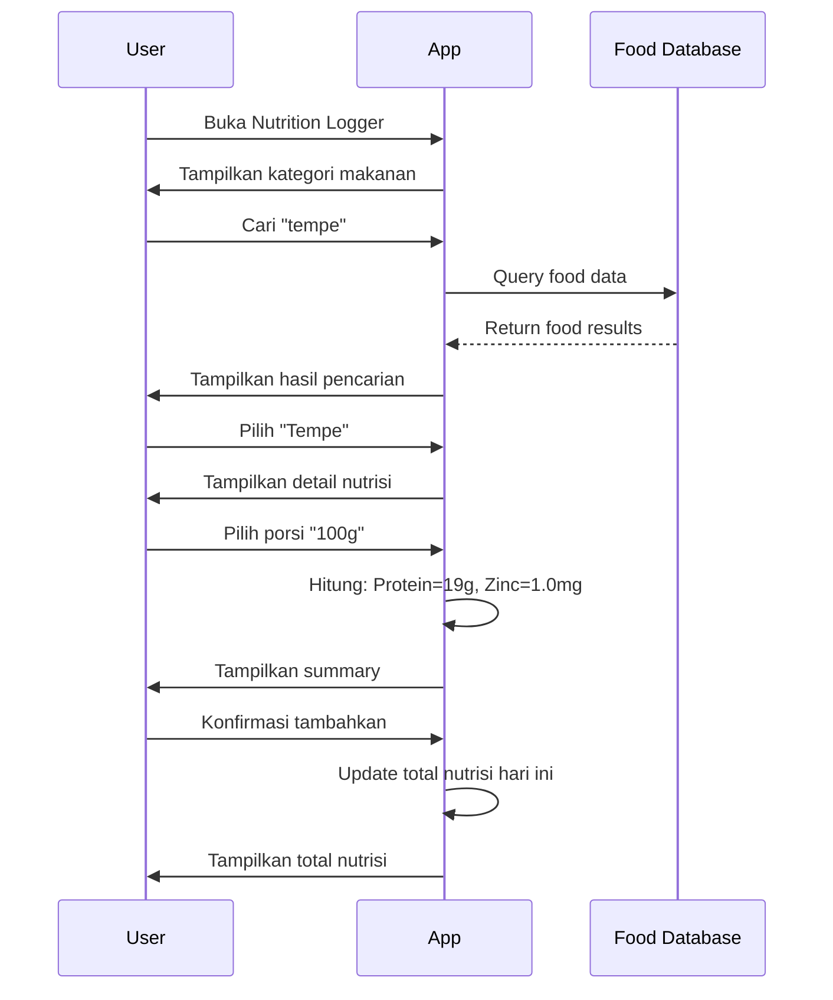

#### User Profile untuk Nutrisi

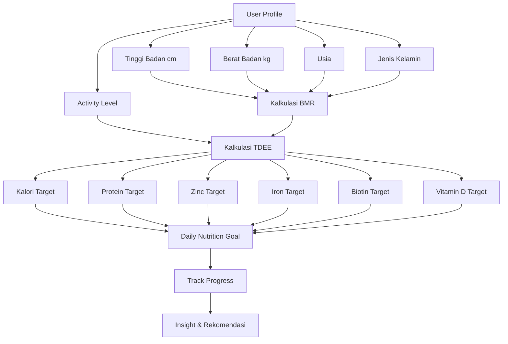

**Activity Level Options:**

| Level | Deskripsi | Multiplier |
|-------|-----------|------------|
| Sedentary | Jarang olahraga, kerja kantor | 1.2 |
| Light | Olahraga ringan 1-3 hari/minggu | 1.375 |
| Moderate | Olahraga sedang 3-5 hari/minggu | 1.55 |
| Active | Olahraga intens 6-7 hari/minggu | 1.725 |
|Very Active | Atlet, pekerjaan fisik | 1.9 |

#### Correlation Dashboard

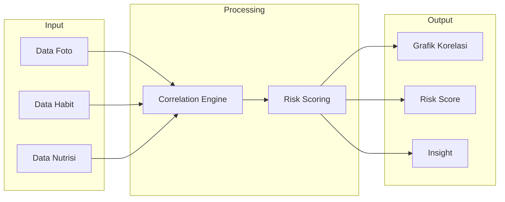

#### Treatment Scheduler

| Fitur | Deskripsi |
|-------|-----------|
| CRUD Treatment | Buat, edit, hapus jadwal perawatan |
| Daily Checklist | Tandai selesai/belum |
| Streak Tracking | Lacak konsistensi |
| Reminder | Notifikasi pengingat |

#### Smart Product Recommendation

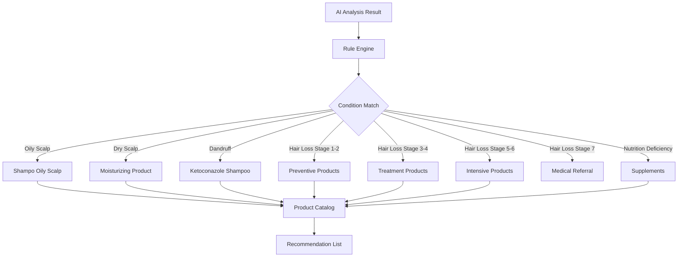

**Katalog Produk Berdasarkan Kondisi:**

| Kondisi | Kategori | Produk Rekomendasi |
|---------|----------|-------------------|
| Oily Scalp | Shampo | Oil control shampoo, Clarifying shampoo |
| Oily Scalp | Treatment | Clay mask, Scalp toner |
| Dry Scalp | Shampo | Moisturizing shampoo, Hydrating shampoo |
| Dry Scalp | Treatment | Hair oil, Scalp serum moisturizer |
| Dandruff | Shampo | Ketoconazole shampoo, Zinc pyrithione shampoo |
| Dandruff | Treatment | Anti-dandruff tonic, Scalp treatment |
| Hair Loss Stage 1-2 | Shampo | Caffeine shampoo, Biotin shampoo |
| Hair Loss Stage 1-2 | Tonic | Hair tonic, Scalp serum |
| Hair Loss Stage 1-2 | Vitamin | Biotin supplement, Hair vitamin |
| Hair Loss Stage 3-4 | Treatment | Minoxidil 2-5%, Finasteride |
| Hair Loss Stage 3-4 | Tonic | Hair tonic dengan minoxidil |
| Hair Loss Stage 3-4 | Serum | Scalp serum dengan peptide |
| Hair Loss Stage 3-4 | Vitamin | Saw palmetto, Biotin complex |
| Hair Loss Stage 5-6 | Treatment | Minoxidil 5%, Finasteride, Dutasteride |
| Hair Loss Stage 5-6 | Serum | Growth serum, PRP therapy |
| Hair Loss Stage 5-6 | Supplement | DHT blocker, Hair growth complex |
| Hair Loss Stage 7 | Medical | Konsultasi dermatologist, Hair transplant |
| Nutrition Deficiency | Protein | Whey protein, Collagen supplement |
| Nutrition Deficiency | Zinc | Zinc supplement, Multivitamin |
| Nutrition Deficiency | Iron | Iron supplement |
| Nutrition Deficiency | Biotin | Biotin supplement, B-complex |
| Nutrition Deficiency | Vitamin D | Vitamin D3 supplement |

**Produk Berdasarkan Kategori:**

| Kategori | Contoh Produk | Kegunaan |
|----------|--------------|----------|
| Shampo | Oil control, Moisturizing, Caffeine, Ketoconazole | Pembersih kulit kepala |
| Conditioner | Hydrating, Volumizing | Melembutkan rambut |
| Hair Tonic | Minoxidil-based, Natural ingredients | Stimulasi pertumbuhan |
| Scalp Serum | Peptide serum, Growth serum | Treatment intensif |
| Hair Vitamin | Biotin, Multivitamin rambut | Nutrisi dari dalam |
| DHT Blocker | Saw palmetto, Pumpkin seed oil | Mencegah kerontokan |
| Protein Supplement | Whey protein, Collagen | Protein untuk keratin |
| Mineral Supplement | Zinc, Iron, Magnesium | Mineral esensial |
| Hair Oil | Argan oil, Jojoba oil | Moisturizing |
| Scalp Mask | Clay mask, Charcoal mask | Deep cleansing |

**Rekomendasi Email:**

Semua reminder dapat dikirim via email sesuai preferensi pengguna.

| Tipe Email | Konten | Frekuensi |
|------------|--------|-----------|
| Treatment Reminder | Pengingat jadwal treatment | Sesuai jadwal |
| Habit Reminder | Pengingat log harian | Harian (jika belum log) |
| Photo Reminder | Pengingat foto mingguan | Mingguan |
| Progress Update | Laporan progres mingguan | Mingguan |
| Severity Alert | Perubahan severity signifikan | On-demand |
| Product Recommendation | Rekomendasi produk baru | Bulanan |

#### Content Recommendation

| Tipe Konten | Contoh |
|-------------|--------|
| Video Edukasi | Cara mengatasi kebotakan |
| Motivasi | Success story, tips |
| Stress Management | Teknik relaksasi, meditasi |
| Jurnal/Artikel | Penelitian tentang rambut |

#### Notification & Reminder System

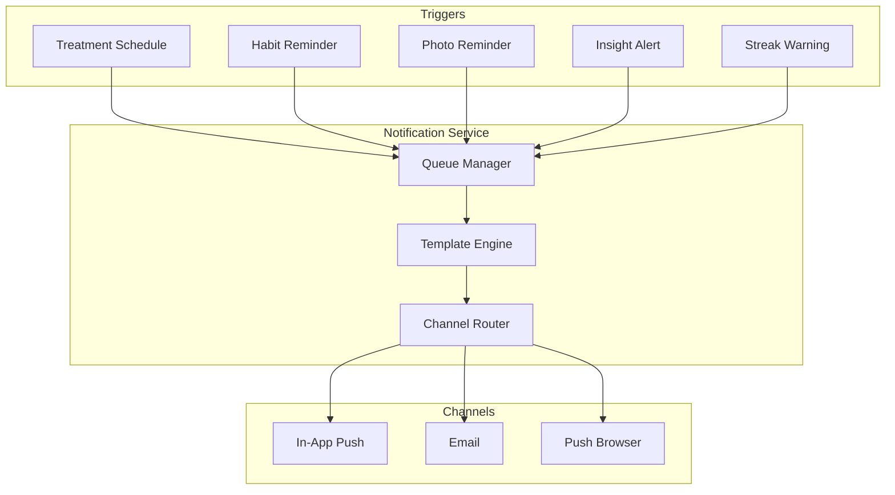

| Tipe Notifikasi | Trigger | Channel | Frequency |
|----------------|---------|---------|-----------|
| Treatment Reminder | Jadwal treatment | In-App, Push | Real-time |
| Habit Reminder | Belum log hari ini | In-App, Email | 10:00, 20:00 |
| Photo Reminder | Jadwal foto mingguan | Email | Mingguan |
| Streak Warning | Streak akan putus | Push | Real-time |
| Insight Alert | Insight baru tersedia | In-App | On-demand |
| Progress Update | Progress mingguan | Email | Mingguan |
| Severity Alert | Severity berubah signifikan | Email | On-demand |

**Email Notification Categories:**

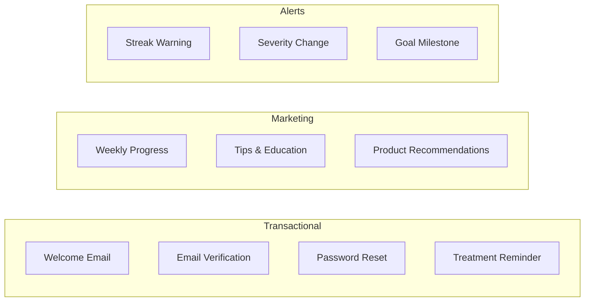

**Notification Preferences:**

| Setting | Default | Options |
|---------|---------|---------|
| Treatment Reminder | On | On, Off, Custom |
| Habit Reminder | On | On, Off |
| Photo Reminder | On | On, Off |
| Email Marketing | On | On, Off |
| Push Notification | On | On, Off |
| Reminder Time | Flexible | Custom waktu |
| Quiet Hours | Off | Set range jam |

---

### 3.2 Advanced Features

#### Genetic & Lifestyle Risk Scoring

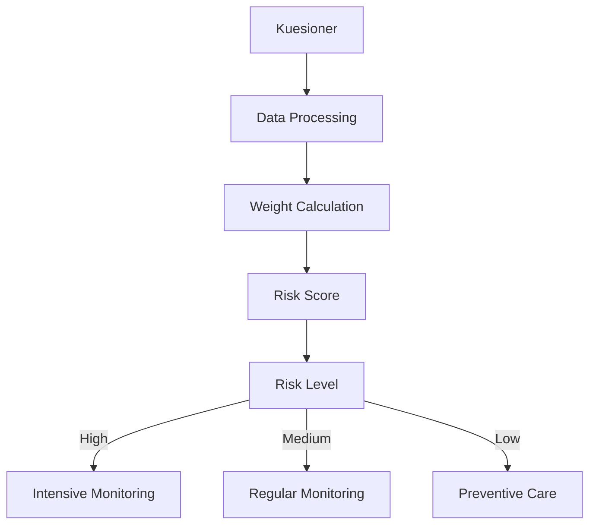

| Faktor | Bobot | Kuesioner |
|--------|-------|-----------|
| Riwayat Keluarga | 30% | Apakah ayah/kakek botak? |
| Merokok | 15% | Kebiasaan merokok |
| Diet | 15% | Asupan protein |
| Stress | 20% | Tingkat stres harian |
| Sleep | 10% | Kualitas tidur |
| Paparan UV | 10% | Penggunaan topi/helmet |

#### Community Progress Sharing

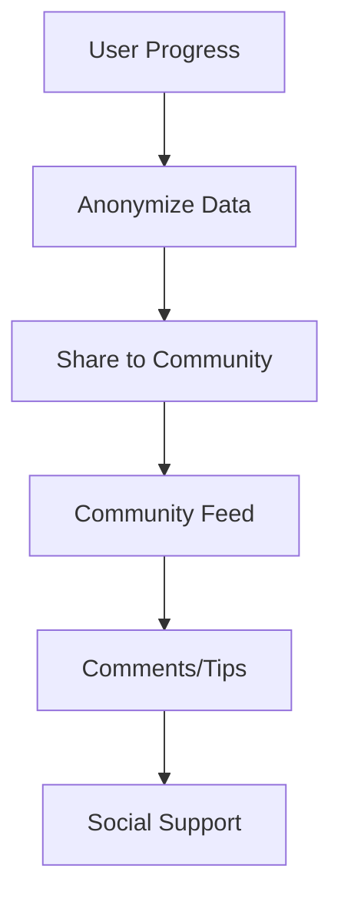

| Fitur | Deskripsi |
|-------|-----------|
| Anonymous Sharing | Upload progress tanpa identitas |
| Progress Gallery | Galeri progres komunitas |
| Tips Exchange | Berbagi tips dan pengalaman |
| Motivation | Dukungan dari komunitas |

---

## 4. Target Audiens

### 4.1 Persona Pengguna

| Persona | Deskripsi | Kebutuhan Utama |
|---------|-----------|-----------------|
| Kerontokan Tahap Awal | Usia 25-40, menyadari penipisan | Lacak progres, pahami penyebab |
| Perawatan Aktif | Menggunakan minoxidil/finasteride | Pastikan konsistensi, ukur efektivitas |
| Pasca-Transplant | Memantau pemulihan transplant | Dokumentasi penyembuhan |

### 4.2 Demografis

| Aspek | Keterangan |
|-------|-------------|
| Usia | 25-55 tahun |
| Gender | Semua gender |
| Literasi Teknologi | Sedang hingga tinggi |
| Geografis | Indonesia |

---

## 5. User Stories

### 5.1 Must Have (MVP)

| ID | User Story | Kriteria Penerimaan |
|----|------------|---------------------|
| US-001 | Upload foto dari berbagai sudut | Upload dari sudut depan, atas, samping |
| US-002 | Menerima analisis AI | Lihat persentase kepadatan |
| US-003 | Melihat riwayat foto | Galeri terurut tanggal |
| US-004 | Mencatat tingkat stres harian | Input skala 1-10 |
| US-005 | Mencatat durasi tidur | Input jam tidur |
| US-006 | Mencatat asupan air | Input liter per hari |
| US-007 | Melihat korelasi data | Grafik gabungan, koefisien korelasi |
| US-008 | Membuat jadwal perawatan | Tambah nama obat, dosis, waktu |
| US-009 | Checklist harian | Tandai selesai/tunda, streak |
| US-010 | Deteksi tipe kulit kepala | Klasifikasi oily/dry/dandruff |
| US-011 | Rekomendasi produk | Daftar produk sesuai kondisi |
| US-012 | Mencatat makanan yang dikonsumsi | Pilih dari food database |
| US-013 | Melihat nutrisi dari makanan | Lihat protein, zinc, iron, biotin, vitamin D |
| US-014 | Hitung total nutrisi harian | Summary protein, zinc, iron, biotin harian |
| US-015 | Pilih ukuran porsi makanan | Pilih gram, mangkuk, potong, dll |
| US-016 | Cari makanan di database | Search berdasarkan nama makanan |
| US-017 | Tambah makanan custom | Input nutrisi manual jika tidak ada di database |

### 5.2 Additional Features

| ID | User Story | Prioritas |
|----|------------|-----------|
| US-012 | Risk scoring berdasarkan genetik | P1 |
| US-013 | Komunitas anonim | P2 |
| US-014 | Video edukasi | P2 |
| US-015 | Jurnal/artikel | P2 |
| US-016 | Integrasi marketplace | P3 |

---

## 6. Persyaratan Fungsional

### 6.1 Photo Analysis

| ID | Persyaratan | Prioritas |
|----|-------------|-----------|
| FR-PHOTO-001 | Upload foto dari perangkat | P0 |
| FR-PHOTO-002 | Analisis kepadatan rambut | P0 |
| FR-PHOTO-003 | Deteksi tipe kulit kepala | P0 |
| FR-PHOTO-004 | Galeri foto historis | P0 |
| FR-PHOTO-005 | Perbandingan side-by-side | P1 |

### 6.2 Habit Tracking

| ID | Persyaratan | Prioritas |
|----|-------------|-----------|
| FR-HABIT-001 | Logging stres harian | P0 |
| FR-HABIT-002 | Logging tidur harian | P0 |
| FR-HABIT-003 | Logging asupan air | P0 |
| FR-HABIT-004 | Logging nutrisi | P1 |
| FR-HABIT-005 | Melihat log historis | P0 |
| FR-HABIT-006 | Pencarian makanan di database | P0 |
| FR-HABIT-007 | Kalkulasi nutrisi otomatis | P0 |
| FR-HABIT-008 | Pilihan porsi fleksibel | P1 |
| FR-HABIT-009 | Tambah makanan custom | P2 |
| FR-HABIT-010 | Kategori makanan | P1 |
| FR-HABIT-011 | Total nutrisi harian | P0 |

### 6.3 Analytics

| ID | Persyaratan | Prioritas |
|----|-------------|-----------|
| FR-ANALYTICS-001 | Grafik korelasi | P0 |
| FR-ANALYTICS-002 | Risk scoring | P1 |
| FR-ANALYTICS-003 | Insight mingguan | P0 |
| FR-ANALYTICS-004 | Rekomendasi personal | P0 |

### 6.4 Treatment

| ID | Persyaratan | Prioritas |
|----|-------------|-----------|
| FR-TREAT-001 | CRUD jadwal perawatan | P0 |
| FR-TREAT-002 | Checklist harian | P0 |
| FR-TREAT-003 | Pelacakan streak | P1 |
| FR-TREAT-004 | Notifikasi push | P1 |

### 6.5 Recommendation

| ID | Persyaratan | Prioritas |
|----|-------------|-----------|
| FR-REC-001 | Rekomendasi produk | P0 |
| FR-REC-002 | Rekomendasi video | P1 |
| FR-REC-003 | Rekomendasi artikel | P1 |

---

## 7. Persyaratan Non-Fungsional

### 7.1 Performa

| Metrik | Target |
|--------|--------|
| Waktu Load Halaman | Kurang dari 3 detik |
| Waktu Respons API | Kurang dari 500 ms (p95) |
| Waktu Analisis Foto | Kurang dari 30 detik |
| Pengguna Konkuren | 100+ |

### 7.2 Keamanan

| Aspek | Implementasi |
|-------|--------------|
| Enkripsi Data | AES-256 untuk foto |
| Keamanan Transit | HTTPS (TLS 1.3) |
| Autentikasi | JWT dengan expiry |
| Password | bcrypt dengan salt |

### 7.3 Skalabilitas

| Aspek | Target |
|-------|--------|
| Basis Pengguna | 10.000+ |
| Penyimpanan Foto | 100+ GB |
| Database | PostgreSQL dengan pooling |

---

## 8. Arsitektur Sistem

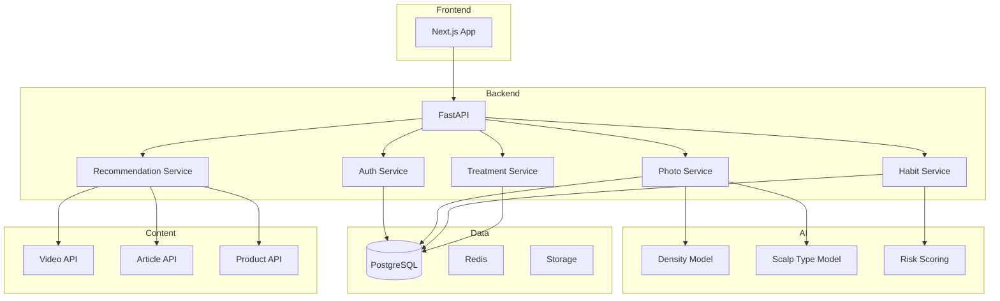

---

## 9. Dependensi

### 9.1 Teknologi

| Dependensi | Tujuan |
|------------|--------|
| OpenCV | Pemrosesan gambar |
| TensorFlow | Model CNN |
| FastAPI | Framework backend |
| Next.js | Framework frontend |
| PostgreSQL | Database utama |

### 9.2 Risiko

| Dependensi | Risiko | Mitigasi |
|------------|--------|----------|
| Akurasi AI | Bervariasi berdasarkan kualitas foto | Multiple angles, validasi |
| Storage | Eskalasi biaya | Kompresi, cleanup policy |

---

## 10. Di Luar Cakupan

| Fitur | Alasan |
|-------|--------|
| Analisis video | Kompleksitas tinggi |
| Integrasi wearable | Memerlukan partnership |
| Sistem pembayaran | Non-essential untuk MVP |
| Telemedisin | Memerlukan regulasi medis |

---

## 11. Glosarium

| Istilah | Definisi |
|---------|----------|
| Kepadatan Rambut | Jumlah folikel per sentimeter persegi |
| Analisis Kulit Kepala | Pemrosesan gambar AI untuk identifikasi tipe |
| Koefisien Korelasi | Ukuran statistik kekuatan hubungan |
| Risk Score | Prediksi risiko berdasarkan faktor genetik dan gaya hidup |