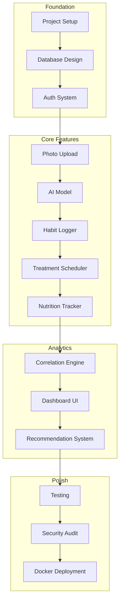
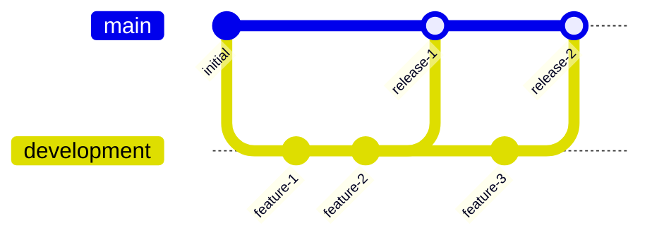
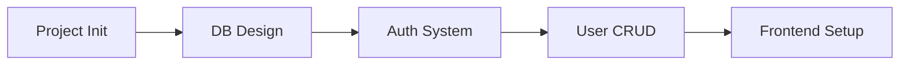
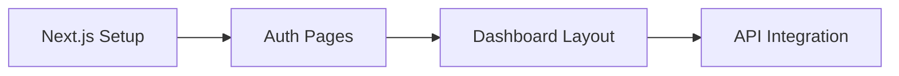
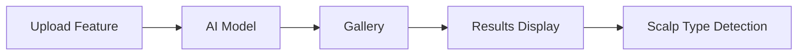
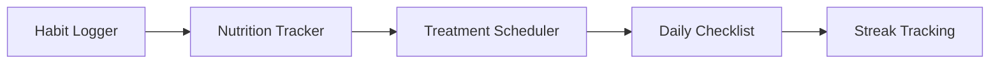
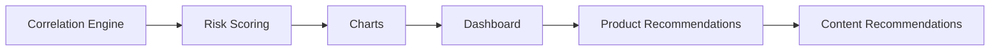
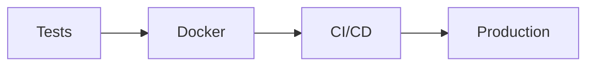
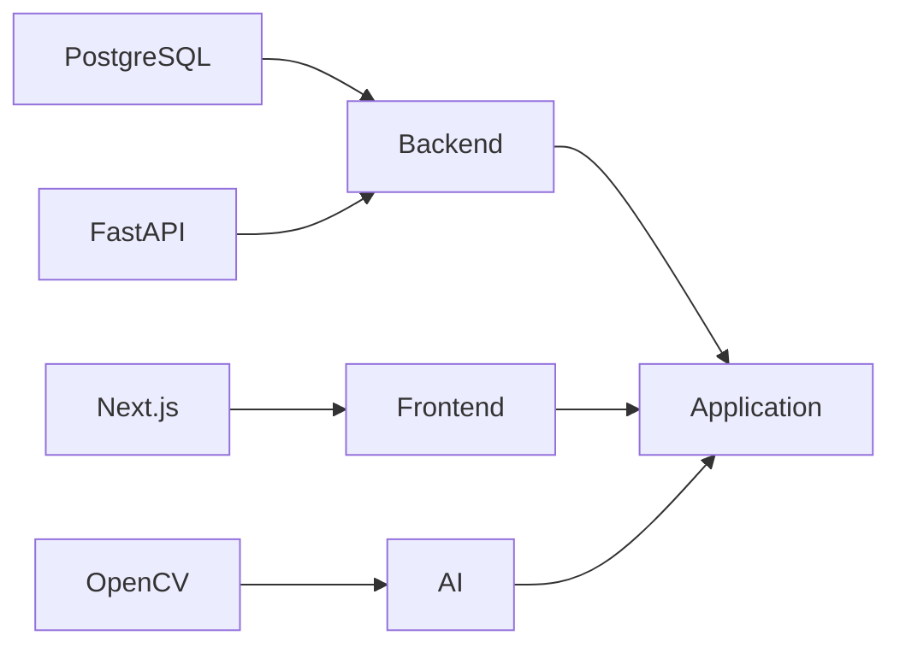

# Roadmap Pengembangan

---

## 1. Gambaran Umum

---

## 2. Branch Strategy

| Branch | Keterangan |
|--------|------------|
| main | Production-ready code |
| development | Active development |

---

## 3. Sprint Breakdown

### Sprint 1: Fondasi

#### Deliverables

| Komponen | Status |
|----------|--------|
| Project Structure | Pending |
| Database Schema | Pending |
| Auth Endpoints | Pending |
| User Management | Pending |
| Frontend Setup | Pending |

---

### Sprint 2: Frontend Foundation

#### Deliverables

| Komponen | Status |
|----------|--------|
| Auth Flow | Pending |
| Protected Routes | Pending |
| Dashboard Layout | Pending |
| API Client | Pending |

---

### Sprint 3: Photo dan AI

#### Deliverables

| Komponen | Status |
|----------|--------|
| Photo Upload | Pending |
| Density Model | Pending |
| Scalp Type Model | Pending |
| Photo Gallery | Pending |
| Analysis Display | Pending |

---

### Sprint 4: Habit dan Treatment

#### Deliverables

| Komponen | Status |
|----------|--------|
| Habit CRUD | Pending |
| Nutrition CRUD | Pending |
| Treatment CRUD | Pending |
| Checklist Logic | Pending |
| Streak System | Pending |

---

### Sprint 5: Analytics dan Recommendation

#### Deliverables

| Komponen | Status |
|----------|--------|
| Correlation Logic | Pending |
| Risk Scoring | Pending |
| Chart Components | Pending |
| Dashboard Integration | Pending |
| Recommendation Engine | Pending |

---

### Sprint 6: Polish dan Deploy

#### Deliverables

| Komponen | Status |
|----------|--------|
| Unit Tests | Pending |
| Integration Tests | Pending |
| Docker Setup | Pending |
| CI/CD Pipeline | Pending |

---

## 4. Milestones

```mermaid
graph LR
    subgraph M1[Milestone 1: Auth Ready]
        A1[User Registration]
        A2[Email Verification]
        A3[Login/Logout]
        A4[Profile Management]
    end
    
    subgraph M2[Milestone 2: AI Ready]
        B1[Upload Photos]
        B2[Density Analysis]
        B3[Scalp Type Detection]
        B4[Photo Gallery]
    end
    
    subgraph M3[Milestone 3: Core Ready]
        C1[Habit Logging]
        C2[Nutrition Tracking]
        C3[Treatment Scheduler]
        C4[Correlation Dashboard]
    end
    
    subgraph M4[Milestone 4: MVP Ready]
        D1[All Features]
        D2[Product Recommendations]
        D3[Content Recommendations]
        D4[Tests Passing]
    end
    
    M1 --> M2 --> M3 --> M4
```

---

## 5. Definition of Done

Task dianggap selesai ketika:

- Code mengikuti style guide
- Unit tests ditulis dan passing
- Code review selesai
- Dokumentasi diupdate
- Tidak ada critical bugs
- Acceptance criteria terpenuhi

---

## 6. Dependencies

---

## 7. Risk Mitigation

| Risiko | Mitigasi |
|--------|----------|
| Security issues | Security audit, penetration testing |
| AI accuracy low | Multiple validation datasets |
| Photo quality issues | Validation, compression, guidelines |
| Performance bottlenecks | Load testing, query optimization |
| Recommendation relevance | Feedback loop, user ratings |