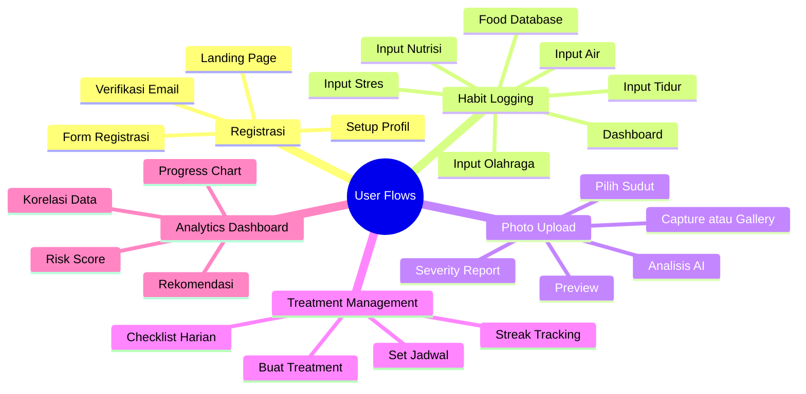
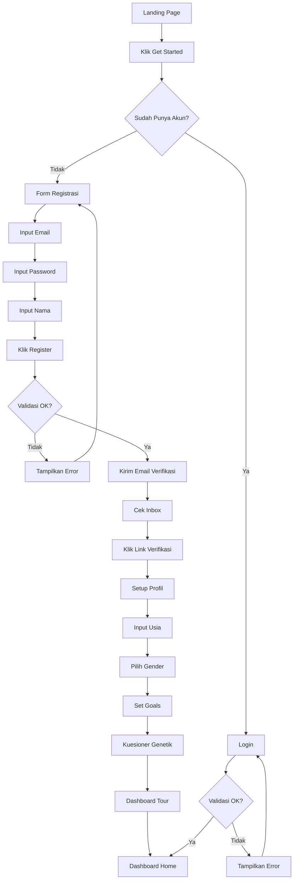
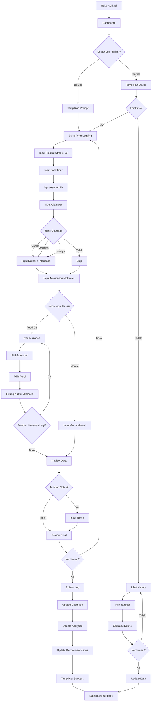
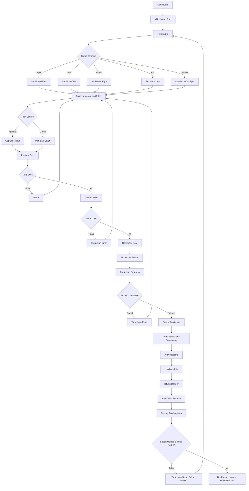
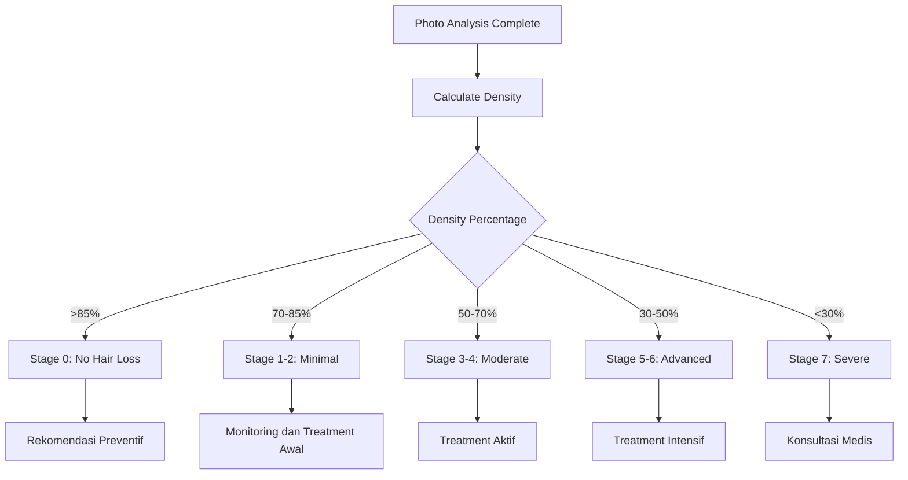
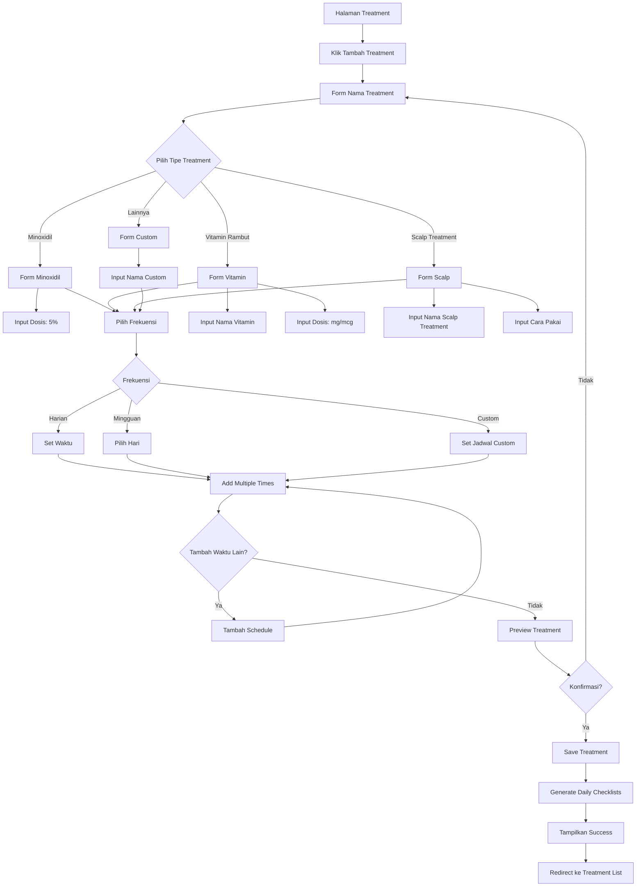
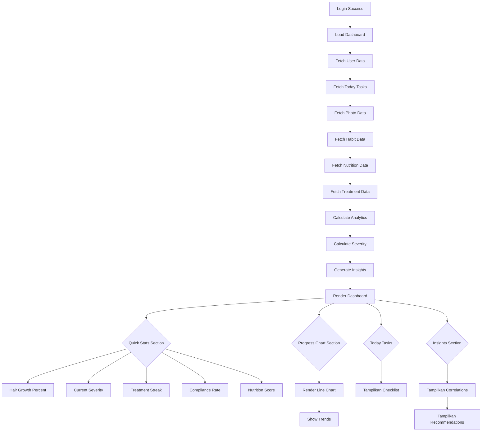
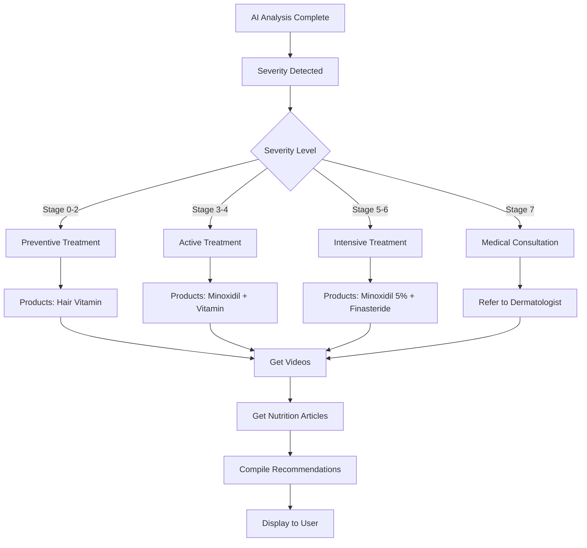
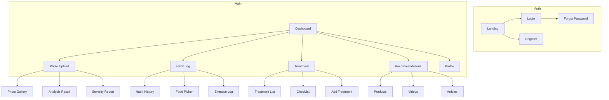

# User Flow Document

---

## 1. Gambaran Umum

### 1.1 Persona Pengguna

| Persona | Deskripsi | Tujuan Utama |
|---------|-----------|--------------|
| Pengguna Baru | Pengguna pertama kali | Pahami value, onboarding cepat |
| Pengguna Aktif | Pengguna rutin tracking | Logging harian, foto mingguan |
| Pengguna Analitik | Mencari insight | Lihat korelasi, tren data |
| Pengguna Perawatan | Dengan regimen perawatan | Lacak kepatuhan, streak |

### 1.2 Core User Flows



---

## 2. Flow Registrasi dan Onboarding

### 2.1 Flow Registrasi



### 2.2 Wireframe Registrasi

#### Layar Registrasi

```
+------------------------------------------------------------+
|  LOGO                                          [Masuk]     |
+------------------------------------------------------------+
|                                                            |
|                    BUAT AKUN BARU                          |
|                                                            |
|  Email                                                     |
|  +------------------------------------------------------+  |
|  | user@example.com                                     |  |
|  +------------------------------------------------------+  |
|                                                            |
|  Password                                                  |
|  +------------------------------------------------------+  |
|  | •••••••••••••                                         |  |
|  +------------------------------------------------------+  |
|                                                            |
|  Nama Lengkap                                              |
|  +------------------------------------------------------+  |
|  | John Doe                                              |  |
|  +------------------------------------------------------+  |
|                                                            |
|  +------------------------------------------------------+  |
|  |                    BUAT AKUN                         |  |
|  +------------------------------------------------------+  |
|                                                            |
|  Sudah punya akun? [Masuk di sini]                        |
|                                                            |
+------------------------------------------------------------+
```

#### Layar Setup Profil

| Field | Tipe | Options |
|-------|------|---------|
| Usia | dropdown | 18-65 |
| Gender | radio button | Pria, Wanita |
| Tipe Rambut | radio button | Lurus, Keriting, Bergelombang |
| Tujuan | checkbox | Cegah kebotakan, Tingkatkan pertumbuhan, Pertahankan kondisi |

---

## 3. Flow Habit Logging

### 3.1 Flow Logging Harian



### 3.2 Wireframe Form Habit

#### Layar Utama Log Habit

```
+------------------------------------------------------------+
|  LOG HABIT HARIAN                              [Tanggal]   |
+------------------------------------------------------------+
|                                                            |
|  BAGAIMANA TINGKAT STRES ANDA HARI INI?                    |
|                                                            |
|  +------+------+------+------+------+                      |
|  |  1   |  2   |  3   |  4   |  5   |                      |
|  +------+------+------+------+------+                      |
|  +------+------+------+------+------+                      |
|  |  6   |  7   |  8   |  9   |  10  |                      |
|  +------+------+------+------+------+                      |
|                                                            |
+------------------------------------------------------------+
|  BERAPA JAM TIDUR ANDA?                                    |
|  +------------------------------------------------------+  |
|  | 7.5 jam                                         ◀▶  |  |
|  +------------------------------------------------------+  |
|                                                            |
+------------------------------------------------------------+
|  BERAPA LITER AIR YANG ANDA MINUM?                         |
|  +------------------------------------------------------+  |
|  | 2.5 liter                                       ◀▶  |  |
|  +------------------------------------------------------+  |
|                                                            |
+------------------------------------------------------------+
|  APAKAH ANDA OLAHRAGA HARI INI?                            |
|                                                            |
|  [✓] Ya, saya olahraga    [ ] Tidak                       |
|                                                            |
|  Jenis Olahraga:                                          |
|  +------------------------------------------------------+  |
|  | [Cardio] [Strength] [Yoga] [Lainnya]                  |  |
|  +------------------------------------------------------+  |
|                                                            |
|  Durasi:                                                   |
|  +------------------------------------------------------+  |
|  | 30 menit                                        ◀▶  |  |
|  +------------------------------------------------------+  |
|                                                            |
|  Intensitas:                                               |
|  +------------------------------------------------------+  |
|  | [Ringan] [Sedang] [Berat]                             |  |
|  +------------------------------------------------------+  |
|                                                            |
+------------------------------------------------------------+
|  NUTRISI MAKANAN                                           |
|                                                            |
|  +------------------------------------------------------+  |
|  |              + Tambah Makanan +                       |  |
|  +------------------------------------------------------+  |
|                                                            |
|  Makanan Hari Ini:                                         |
|  +------------------------------------------------------+  |
|  | Tempe 100g           Protein: 19g    [Hapus]        |  |
|  | Bayam 1 mangkuk      Protein: 3g     [Hapus]        |  |
|  | Telur 1 butir        Protein: 6g     [Hapus]        |  |
|  +------------------------------------------------------+  |
|                                                            |
|  Total Nutrisi:                                            |
|  Protein: 28g | Zinc: 1.5mg | Iron: 7.1mg | Biotin: 10mcg|
|                                                            |
+------------------------------------------------------------+
|                                                            |
|  +------------------------------------------------------+  |
|  |                    SIMPAN LOG                         |  |
|  +------------------------------------------------------+  |
|                                                            |
+------------------------------------------------------------+
```

### 3.3 Kategori Habit untuk Kesehatan Rambut

| Kategori | Faktor | Tipe Input | Rentang | Frekuensi | Dampak |
|----------|--------|------------|---------|-----------|--------|
| Mental | Tingkat Stres | Slider | 1-10 | Harian | Stress tinggi kortisol mengganggu pertumbuhan rambut |
| Tidur | Jam Tidur | Number | 0-24 jam | Harian | Tidur cukup penting untuk regenerasi sel |
| Hidrasi | Asupan Air | Number | 0-5 liter | Harian | Hidrasi baik untuk sirkulasi kulit kepala |
| Olahraga | Jenis Cardio | Checkbox | - | Harian | Meningkatkan sirkulasi darah ke folikel |
| Olahraga | Jenis Strength | Checkbox | - | Harian | Meningkatkan testosteron (perlu diatur) |
| Olahraga | Durasi | Number | 0-180 menit | Harian | Durasi optimal untuk kesehatan |
| Olahraga | Intensitas | Radio | Ringan/Sedang/Berat | Harian | Intensitas mempengaruhi hormon |
| Nutrisi | Protein | Food DB | gram | Harian | Komponen utama keratin |
| Nutrisi | Zinc | Food DB | mg | Harian | Penting untuk pertumbuhan rambut |
| Nutrisi | Iron | Food DB | mg | Harian | Penting untuk oksigenasi folikel |
| Nutrisi | Biotin | Food DB | mcg | Harian | Vitamin B untuk rambut |
| Nutrisi | Vitamin D | Food DB | IU | Harian | Penting untuk siklus rambut |
| Nutrisi | Vitamin E | Food DB | mg | Harian | Antioksidan untuk kulit kepala |
| Nutrisi | Vitamin B12 | Food DB | mcg | Harian | Penting untuk pertumbuhan sel |

### 3.4 Wireframe Food Database Picker

```
+------------------------------------------------------------+
|  TAMBAH MAKANAN                                    [Tutup]  |
+------------------------------------------------------------+
|                                                            |
|  +------------------------------------------------------+  |
|  | 🔍 Cari makanan...                                    |  |
|  +------------------------------------------------------+  |
|                                                            |
|  KATEGORI:                                                 |
|  [Protein] [Sayuran] [Buah] [Biji-bijian]                 |
|  [Daging] [Seafood] [Kacangan] [Susu] [Lainnya]           |
|                                                            |
+------------------------------------------------------------+
|  HASIL PENCARIAN:                                         |
|                                                            |
|  +------------------------------------------------------+  |
|  | Tempe                        100g                    |  |
|  | Protein: 19g | Zinc: 1.0mg | Iron: 2.7mg            |  |
|  | Biotin: 0mcg | Vit D: 0IU                            |  |
|  |                                           [+ Tambah]  |  |
|  +------------------------------------------------------+  |
|                                                            |
|  +------------------------------------------------------+  |
|  | Tahu                         100g                    |  |
|  | Protein: 8g | Zinc: 0.8mg | Iron: 5.4mg            |  |
|  | Biotin: 0mcg | Vit D: 0IU                            |  |
|  |                                           [+ Tambah]  |  |
|  +------------------------------------------------------+  |
|                                                            |
|  +------------------------------------------------------+  |
|  | Telur                        1 butir (50g)           |  |
|  | Protein: 6g | Zinc: 0.5mg | Iron: 1mg              |  |
|  | Biotin: 10mcg | Vit D: 41IU                          |  |
|  |                                           [+ Tambah]  |  |
|  +------------------------------------------------------+  |
|                                                            |
+------------------------------------------------------------+
|  MAKANAN DIPILIH:                                          |
|                                                            |
|  +------------------------------------------------------+  |
|  | Tempe 100g × 1        Protein: 19g      [Hapus]     |  |
|  +------------------------------------------------------+  |
|                                                            |
|  +------------------------------------------------------+  |
|  |                    KONFIRMASI                         |  |
|  +------------------------------------------------------+  |
|                                                            |
+------------------------------------------------------------+
```

### 3.5 Contoh Data Makanan Lengkap

| Makanan | Porsi | Protein | Zinc | Iron | Biotin | Vit D | Vit E | Vit B12 | Fiber |
|---------|-------|---------|------|------|--------|-------|-------|---------|-------|
| Tempe | 100g | 19g | 1.0mg | 2.7mg | 0mcg | 0IU | 0mg | 0mcg | 0mg |
| Tahu | 100g | 8g | 0.8mg | 5.4mg | 0mcg | 0IU | 0mg | 0mcg | 0mg |
| Bayam | 180g | 3g | 0.5mg | 6.4mg | 0mcg | 0IU | 2mg | 0mcg | 4g |
| Telur | 50g | 6g | 0.5mg | 1mg | 10mcg | 41IU | 0.5mg | 0.5mcg | 0mg |
| Salmon | 100g | 25g | 0.6mg | 0.8mg | 5mcg | 526IU | 2mg | 3mcg | 0mg |
| Almond | 28g | 6g | 0.9mg | 1mg | 1.5mcg | 0IU | 7mg | 0mcg | 3.5g |
| Buncis | 100g | 9g | 1.5mg | 3mg | 0mcg | 0IU | 0mg | 0mcg | 8g |
| Ayam | 100g | 31g | 1.0mg | 1mg | 0mcg | 0IU | 0mg | 0.3mcg | 0mg |
| Daging Sapi | 100g | 26g | 4.8mg | 2.5mg | 2mcg | 0IU | 0mg | 2.5mcg | 0mg |
| Ubi | 100g | 2g | 0.3mg | 0.6mg | 0mcg | 0IU | 0mg | 0mcg | 3g |
| Oatmeal | 100g | 13g | 2.3mg | 4.7mg | 0mcg | 0IU | 0mg | 0mcg | 10g |
| Brokoli | 100g | 3g | 0.4mg | 0.7mg | 0mcg | 0IU | 0.8mg | 0mcg | 2.6g |
| Kacang Tanah | 100g | 25g | 3.3mg | 2mg | 0mcg | 0IU | 4mg | 0mcg | 8.5g |
| Lobster | 100g | 19g | 3.4mg | 0.6mg | 0mcg | 0IU | 2mg | 1mcg | 0mg |

---

## 4. Flow Photo Upload dan Analisis

### 4.1 Flow Upload Foto



### 4.2 Batasan Upload Foto

| Limit | Nilai | Deskripsi |
|-------|-------|-----------|
| Ukuran File Maksimal | 10MB | Sebelum kompresi |
| Ukuran Setelah Kompresi | 500 KB - 2 MB | Target optimal |
| Resolusi Minimum | 720p (1280x720) | Untuk akurasi AI |
| Resolusi Maksimum | 4K (3840x2160) | Akan dikompresi |
| Format Didukung | JPEG, PNG, WebP | Otomatis convert ke JPEG |
| Foto Per Sudut | 1 foto | Hanya foto terbaru per sudut |
| Total Foto Aktif | 25 foto | 5 sudut x 5 histori |
| Histori Tersimpan | 5 per sudut | Foto lama otomatis diarsipkan |
| Storage Limit | 500 MB | Batas per pengguna |

### 4.3 Flow Severity Classification



### 4.3 Wireframe Hasil Analisis

#### Layar Hasil Analisis Foto

```
+------------------------------------------------------------+
|  HASIL ANALISIS                                  [Tutup]   |
+------------------------------------------------------------+
|                                                            |
|  +------------------------------------------------------+  |
|  |                                                      |  |
|  |              [Thumbnail Foto]                        |  |
|  |                                                      |  |
|  |                   62.5%                              |  |
|  |           Kepadatan Rambut                           |  |
|  |                                                      |  |
|  |   Severity: Stage 3-4 (Moderate Hair Loss)         |  |
|  |   Confidence: 88%                                    |  |
|  |   Confidence Severity: 85%                           |  |
|  |                                                      |  |
|  +------------------------------------------------------+  |
|                                                            |
|  +------------------------------------------------------+  |
|  |              REKOMENDASI PRODUK                      |  |
|  |                                                      |  |
|  |  1. Minoxidil 5% Solution                           |  |
|  |  2. Hair Vitamin (Biotin + Zinc)                    |  |
|  |  3. Scalp Serum dengan Niacin                       |  |
|  |                                                      |  |
|  |  [Lihat Detail Produk]                              |  |
|  +------------------------------------------------------+  |
|                                                            |
|  +------------------------------------------------------+  |
|  |              PERBANDINGAN                            |  |
|  |                                                      |  |
|  |  Sebelum: 65.0% (2 minggu lalu)                      |  |
|  |  Sekarang: 62.5% (hari ini)                          |  |
|  |  Perubahan: -2.5%                                    |  |
|  |                                                      |  |
|  +------------------------------------------------------+  |
|                                                            |
|  +------------------------------------------------------+  |
|  |          Lihat Grafik Progress                       |  |
|  +------------------------------------------------------+  |
|                                                            |
|  +------------------------------------------------------+  |
|  |          Upload Foto Lainnya                         |  |
|  +------------------------------------------------------+  |
|                                                            |
+------------------------------------------------------------+
```

#### Layar Pilih Sudut Foto

```
+------------------------------------------------------------+
|  PILIH SUDUT FOTO                                          |
+------------------------------------------------------------+
|                                                            |
|  Pilih sudut foto untuk diupload:                          |
|                                                            |
|  +------------+  +------------+  +------------+           |
|  |   DEPAN    |  |    ATAS    |  |   KANAN    |           |
|  |            |  |            |  |            |           |
|  |   Front    |  |    Top     |  |   Right    |           |
|  |   ✓ Done   |  |   ✓ Done   |  |   ✓ Done   |           |
|  +------------+  +------------+  +------------+           |
|                                                            |
|  +------------+  +------------+                           |
|  |    KIRI    |  |   CUSTOM   |                           |
|  |            |  |            |                           |
|  |   Left     |  |  Area Botak|                           |
|  |   ✓ Done   |  |   Pending  |                           |
|  +------------+  +------------+                           |
|                                                            |
+------------------------------------------------------------+
|  STATUS UPLOAD:                                            |
|                                                            |
|  ✓ Depan (75.2%) - 3 hari lalu                            |
|  ✓ Atas (58.3%) - 3 hari lalu                            |
|  ✓ Kanan (68.1%) - 3 hari lalu                           |
|  ✓ Kiri (70.5%) - 3 hari lalu                            |
|  ○ Custom - Belum                                          |
|                                                            |
|  Progress: 4/5 sudut (80%)                                 |
|                                                            |
+------------------------------------------------------------+
```

#### Layar Severity Report

```
+------------------------------------------------------------+
|                 LAPORAN SEVERITY                          |
+------------------------------------------------------------+
|                                                            |
|  STAGE SAAT INI: Stage 3-4 (Moderate Hair Loss)           |
|                                                            |
|  Density Total: 62.5%                                      |
|                                                            |
+------------------------------------------------------------+
|  ANALISIS PER SUDUT:                                       |
|                                                            |
|  | Sudut    | Density | Stage   | Trend      |           |
|  |----------|---------|---------|------------|           |
|  | Depan    | 75.2%   | Stage 2 | Stabil    |           |
|  | Atas     | 58.3%   | Stage 4 | Menurun   |           |
|  | Kanan    | 68.1%   | Stage 3 | Stabil    |           |
|  | Kiri     | 70.5%   | Stage 2 | Membaik   |           |
|  | Custom   | 45.0%   | Stage 5 | Menurun   |           |
|                                                            |
+------------------------------------------------------------+
|  REKOMENDASI:                                              |
|                                                            |
|  1. [Prioritas Tinggi] Area crown memerlukan perhatian    |
|  2. [Prioritas Sedang] Monitor area temporal kiri/kanan  |
|  3. Lanjutkan treatment minoxidil                        |
|  4. Upload foto setiap 2 minggu                           |
|                                                            |
|  [Lihat Detail Rekomendasi]                               |
|                                                            |
+------------------------------------------------------------+
```

---

## 5. Flow Treatment Management

### 5.1 Flow Buat Treatment



### 5.2 Tipe Treatment

| Tipe | Deskripsi | Contoh Produk |
|------|-----------|---------------|
| Minoxidil | Topical solution untuk stimulasi folikel | Minoxidil 2%, Minoxidil 5%, Minoxidil Foam |
| Finasteride | Oral medication untuk blok DHT | Finasteride 1mg |
| Hair Vitamin | Suplemen untuk nutrisi rambut | Biotin, Zinc, Vitamin D, Multivitamin Rambut |
| Scalp Serum | Serum untuk kulit kepala | Niacinamide serum, Peptide serum, Rosemary oil |
| Scalp Shampoo | Shampo khusus kulit kepala | Ketoconazole, Oil control, Anti-dandruff |
| Scalp Massage | Terapi pijat kulit kepala | Derma roller, Scalp massager |
| PRP Treatment | Platelet-rich plasma therapy | PRP injection (medical procedure) |
| Low-Level Laser | Laser therapy untuk rambut | Laser comb, Laser cap |
| Custom | Treatment lainnya | Sesuai kebutuhan pengguna |

### 5.3 Wireframe Checklist Treatment

```
+------------------------------------------------------------+
|              CHECKLIST HARIAN                               |
+------------------------------------------------------------+
|                                                            |
|  +------------------------------------------------------+  |
|  | ☑ MINOXIDIL 5% SOLUTION - PAGI                       |  |
|  |   08:00     ✓ Selesai 08:05                          |  |
|  |   1ml applied to crown and temples                   |  |
|  +------------------------------------------------------+  |
|                                                            |
|  +------------------------------------------------------+  |
|  | ○ MINOXIDIL 5% SOLUTION - MALAM                      |  |
|  |   20:00     Belum                                     |  |
|  |   1ml applied to crown and temples                   |  |
|  |   +----------------------------------------------+    |  |
|  |   |            Tandai Selesai                     |    |  |
|  |   +----------------------------------------------+    |  |
|  +------------------------------------------------------+  |
|                                                            |
|  +------------------------------------------------------+  |
|  | ☑ HAIR VITAMIN (BIOTIN + ZINC)                       |  |
|  |   09:00     ✓ Selesai 09:15                          |  |
|  |   1 tablet setelah makan                              |  |
|  +------------------------------------------------------+  |
|                                                            |
|  +------------------------------------------------------+  |
|  | ○ SCALP SERUM                                        |  |
|  |   21:00     Belum                                     |  |
|  |   Apply to scalp after minoxidil dries               |  |
|  |   +----------------------------------------------+    |  |
|  |   |            Tandai Selesai                     |    |  |
|  |   +----------------------------------------------+    |  |
|  +------------------------------------------------------+  |
|                                                            |
+------------------------------------------------------------+
|  STATISTIK HARIAN:                                         |
|                                                            |
|  Penyelesaian: 2/4 (50%)                                   |
|  Streak Saat Ini: 7 hari                                   |
|  Kepatuhan Minggu Ini: 85%                                 |
|                                                            |
+------------------------------------------------------------+
```

### 5.4 Wireframe Tambah Treatment

```
+------------------------------------------------------------+
|            TAMBAH TREATMENT BARU                            |
+------------------------------------------------------------+
|                                                            |
|  TIPE TREATMENT:                                           |
|                                                            |
|  [Minoxidil] [Finasteride] [Vitamin] [Scalp Serum]         |
|  [Shampoo] [Massage] [Laser] [Custom]                      |
|                                                            |
+------------------------------------------------------------+
|  DETAIL TREATMENT:                                         |
|                                                            |
|  Nama Treatment:                                           |
|  +------------------------------------------------------+  |
|  | Minoxidil 5% Solution                                |  |
|  +------------------------------------------------------+  |
|                                                            |
|  Dosis:                                                    |
|  +------------------------------------------------------+  |
|  | 1 ml                                                 |  |
|  +------------------------------------------------------+  |
|                                                            |
|  Frekuensi:                                                |
|  +------------------------------------------------------+  |
|  | [Harian] [Mingguan] [Custom]                         |  |
|  +------------------------------------------------------+  |
|                                                            |
|  Jadwal:                                                   |
|  +------------------------------------------------------+  |
|  | [✓Sen] [✓Sel] [✓Rab] [✓Kam] [✓Jum] [✓Sab] [✓Min]    |  |
|  +------------------------------------------------------+  |
|                                                            |
|  Waktu:                                                    |
|  +------------------------------------------------------+  |
|  | 08:00 dan 20:00                                 [+Tambah Waktu] |  |
|  +------------------------------------------------------+  |
|                                                            |
|  Cara Pakai / Notes:                                       |
|  +------------------------------------------------------+  |
|  | Apply 1ml to scalp, focusing on thinning areas.     |  |
|  | Massage gently for 1-2 minutes. Wait 4 hours before  |  |
|  | washing hair.                                        |  |
|  +------------------------------------------------------+  |
|                                                            |
|  +------------------------------------------------------+  |
|  |                    SIMPAN                             |  |
|  +------------------------------------------------------+  |
|                                                            |
+------------------------------------------------------------+
```

---

## 6. Flow Dashboard dan Analytics

### 6.1 Flow Dashboard



### 6.2 Wireframe Dashboard

```
+------------------------------------------------------------------------+
|  DASHBOARD HOME                              [Profil] [Settings]       |
+------------------------------------------------------------------------+
|  Selamat datang, John!                                                  |
+------------------------------------------------------------------------+
|                        STATISTIK CEPAT                                 |
|                                                                        |
|  +--------------+ +--------------+ +--------------+ +--------------+    |
|  | PERTUMBUHAN  | | SEVERITY     | | STREAK       | | KEPATUHAN   |    |
|  | -2.5%        | | Stage 3-4    | | 7 hari       | | 85%          |    |
|  | ↓ 2 minggu   | | Moderate     | | Active       | | Minggu Ini   |    |
|  +--------------+ +--------------+ +--------------+ +--------------+    |
+------------------------------------------------------------------------+
|                    TREND KEPADATAN RAMBUT                              |
|                                                                        |
|   80% ┤                     ●●●                                       |
|   70% ┤               ●●●●                                           |
|   60% ┤         ●●●●                                                 |
|   50% ┤   ●●●●                                                        |
|       └───────┬───────┬───────┬───────                               |
|              W1      W2      W3      W4                                |
+------------------------------------------------------------------------+
|                    SEVERITY PER SUDUT                                  |
|                                                                        |
|  | Sudut | Density | Stage   | Status   |                             |
|  |-------|---------|---------|----------|                             |
|  | Depan | 75.2%   | Stage 2 | Stabil   |                             |
|  | Atas  | 58.3%   | Stage 4 | Menurun  |                             |
|  | Kanan | 68.1%   | Stage 3 | Stabil   |                             |
|  | Kiri  | 70.5%   | Stage 2 | Membaik  |                             |
+------------------------------------------------------------------------+
|                    NUTRISI HARIAN                                       |
|                                                                        |
|  | Nutrisi  | Aktual | Target | Status  |                             |
|  |----------|--------|--------|---------|                             |
|  | Protein  | 28g    | 50g    | 56%     |                             |
|  | Zinc     | 1.5mg  | 11mg   | 14%     |                             |
|  | Iron     | 7.1mg  | 18mg   | 39%     |                             |
|  | Biotin   | 10mcg  | 30mcg  | 33%     |                             |
|  | Vit D    | 41IU   | 600IU  | 7%      |                             |
+------------------------------------------------------------------------+
|                    TASK HARI INI                                        |
|                                                                        |
|  □ Log habit (stres, tidur, air, nutrisi, olahraga)                   |
|  □ Selesaikan treatment malam (Minoxidil + Scalp Serum)                |
|  □ Upload foto mingguan                                                |
|  ☑ Treatment pagi selesai (Minoxidil + Vitamin)                       |
+------------------------------------------------------------------------+
|                    INSIGHT                                              |
|                                                                        |
|  Kepadatan rambut Anda menurun 2.5% dalam 2 minggu                     |
|  Area crown memerlukan perhatian lebih                                                  |
|  Asupan Zinc dan Biotin masih di bawah target                          |
|  Intensitas olahraga tinggi dapat meningkatkan DHT                     |
+------------------------------------------------------------------------+
|                    REKOMENDASI                                          |
|                                                                        |
|  Minoxidil 5% Solution                                                |
|  Hair Vitamin (Biotin + Zinc + Iron)                                   |
|  Scalp Serum dengan Niacinamide                                        |
|  Ketoconazole Shampoo (untuk oily scalp)                              |
|                                                                        |
|  [Lihat Semua Produk]                                                   |
+------------------------------------------------------------------------+
```

---

## 7. Flow Konten dan Rekomendasi

### 7.1 Flow Rekomendasi



### 7.2 Kategorisasi Konten

| Trigger | Product Category | Video Category | Article Category |
|---------|------------------|----------------|------------------|
| Stage 0-2 | Hair Vitamin | Prevention tips | Hair care routine |
| Stage 3-4 | Minoxidil + Vitamin | Treatment tutorials | Hair loss causes |
| Stage 5-6 | Minoxidil 5% + Finasteride | Advanced treatment | Treatment options |
| Stage 7 | PRP, Transplant | Medical procedures | Surgical options |
| Oily Scalp | Oil control shampoo | Scalp care | Sebum management |
| Dry Scalp | Moisturizing products | Hydration tips | Scalp nourishment |
| High Stress | Relaxation products | Stress management | Mental health |
| Low Nutrition | Supplements | Diet tips | Nutrition guide |

---

## 8. Error States

### 8.1 Error Handling

| Error Code | Message | Action |
|------------|---------|--------|
| 400 | Bad Request | Tampilkan validation error |
| 401 | Unauthorized | Redirect ke login |
| 403 | Forbidden | Tampilkan access denied |
| 404 | Not Found | Tampilkan empty state |
| 500 | Server Error | Tampilkan retry button |
| NETWORK | Connection Failed | Tampilkan offline mode |

### 8.2 Empty State

| Condition | Message | CTA |
|-----------|---------|-----|
| No Photos | Belum ada foto yang diupload | Upload Foto |
| No Treatments | Belum ada treatment | Tambah Treatment |
| No Logs | Belum ada log hari ini | Log Habit |
| No History | Belum ada history | Start Tracking |

### 8.3 Loading State

| Loading | Progress | Message |
|---------|----------|---------|
| Photo Upload | 0-100% | Mengupload foto... |
| AI Analysis | Indeterminate | Menganalisis foto... |
| Data Sync | Indeterminate | Menyinkronkan data... |
| Dashboard Load | Indeterminate | Memuat dashboard... |

---

## 9. Navigation Structure

### 9.1 Bottom Navigation

| Tab | Icon | Label | Description |
|-----|------|-------|-------------|
| Home | Bar Chart | Dashboard | Statistik, task, insight |
| Photo | Camera | Upload | Upload dan analisis foto |
| Treatment | Pill | Treatment | Checklist dan jadwal |
| Profile | User | Profile | Pengaturan akun |

### 9.2 Screen Hierarchy



### 9.3 Header Navigation

| Page | Back Button | Actions |
|------|-------------|---------|
| Dashboard | No | Notification, Settings |
| Photo Upload | Yes | Gallery |
| Treatment | Yes | Add Treatment |
| Profile | No | Edit, Logout |
| Settings | Yes | Save |

---

## 10. Key Success Metrics

| Metrik | Target | Pengukuran |
|--------|--------|-------------|
| Penyelesaian Hari 1 | 80% | Complete onboarding |
| Retensi Minggu 1 | 60% | Return after 7 days |
| Kepatuhan Foto | 70% | Weekly photo uploads (5 angles) |
| Kepatuhan Treatment | 70% | Daily completion |
| Kepatuhan Nutrisi | 60% | Daily food logging |
| Engagement Insight | 50% | View correlation data |
| Click Rate Rekomendasi | 30% | Click on products/videos |

---

## 11. Food Database Specification

### 11.1 Data Source

| Source | Coverage | Update Frequency |
|--------|----------|-------------------|
| USDA Food Database | Global | Monthly |
| Indonesian Food Data | Local Indonesian foods | Quarterly |
| User Submissions | Community | Real-time (after verification) |

### 11.2 Nutrient Categories

| Kategori | Nutrisi | Satuan | Daily Value |
|----------|---------|--------|-------------|
| Macro | Protein | gram | 50g |
| Macro | Karbohidrat | gram | 300g |
| Macro | Lemak | gram | 65g |
| Macro | Serat | gram | 25g |
| Micro | Zinc | mg | 11mg |
| Micro | Iron | mg | 18mg |
| Vitamin | Biotin | mcg | 30mcg |
| Vitamin | Vitamin D | IU | 600IU |
| Vitamin | Vitamin B12 | mcg | 2.4mcg |
| Vitamin | Vitamin E | mg | 15mg |
| Mineral | Selenium | mcg | 55mcg |
| Mineral | Magnesium | mg | 400mg |

### 11.3 Portion Sizes

| Makanan | Porsi Standar | Gram |
|---------|---------------|------|
| Tempe | 1 potong | 100g |
| Tahu | 1 potong | 100g |
| Bayam | 1 mangkuk | 180g |
| Telur | 1 butir | 50g |
| Nasi | 1 centong | 150g |
| Ayam | 1 potong | 100g |
| Ikan | 1 potong | 100g |
| Daging | 1 potong | 100g |
| Buah | 1 buah | variabel |
| Sayur | 1 mangkuk | 100-200g |