# User Flow Document

## 1. Gambaran Umum

### 1.1 Persona Pengguna

| Persona | Deskripsi | Tujuan Utama |
|---------|-----------|--------------|
| Pengguna Baru | Pengguna pertama kali | Pahami value, onboarding cepat |
| Pengguna Aktif | Pengguna rutin tracking | Logging harian, foto mingguan |
| Pengguna Analitik | Mencari insight | Lihat korelasi, tren data |
| Pengguna Perawatan | Dengan regimen perawatan | Lacak kepatuhan, streak |

### 1.2 Core User Flows

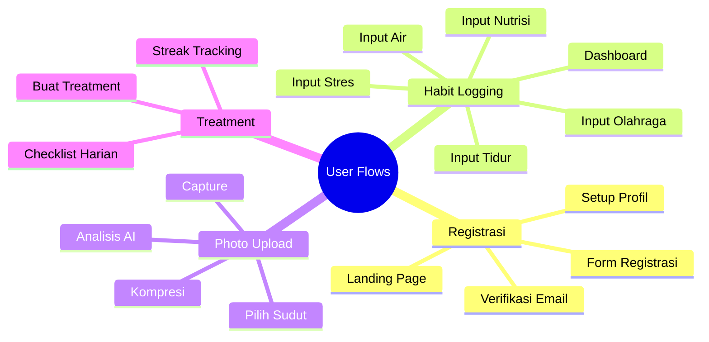

---

## 2. Flow Registrasi

### 2.1 Flow Diagram

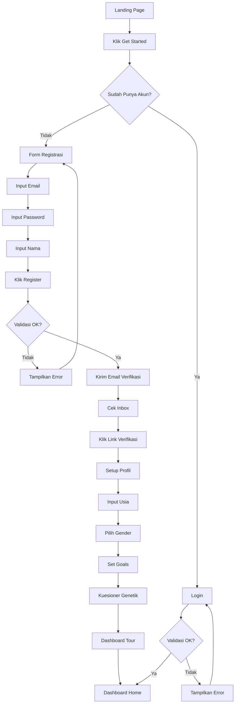

### 2.2 Wireframe Registrasi

| Section | Component | Type | Placeholder |
|---------|-----------|------|-------------|
| Header | Logo + Title | Image + Text | Scalp Analytics |
| Form | Email | Input | user@example.com |
| Form | Password | Password | ••••••••••• |
| Form | Nama Lengkap | Input | John Doe |
| Action | Register | Button Primary | BUAT AKUN |
| Footer | Link | Text Link | Sudah punya akun? Masuk |

**Layout:**
```
┌─────────────────────────┐
│      REGISTRASI         │
├─────────────────────────┤
│ Email                   │
│ [___________________]   │
│                         │
│ Password                │
│ [___________________]   │
│                         │
│ Nama Lengkap            │
│ [___________________]   │
│                         │
│ [    BUAT AKUN    ]     │
│                         │
│ Sudah punya akun? Masuk │
└─────────────────────────┘
```

### 2.3 Komponen Form

| Field | Tipe | Placeholder | Validasi |
|-------|------|-------------|----------|
| Email | email | user@example.com | Format email valid |
| Password | password | ••••••••••• | Min 8 karakter |
| Nama Lengkap | text | John Doe | Min 3 karakter |

---

## 2.5 Flow Forgot Password

### 2.5.1 Flow Diagram

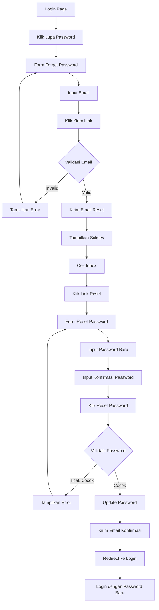

### 2.5.2 Wireframe Forgot Password

| Section | Component | Type | Placeholder |
|---------|-----------|------|-------------|
| Header | Logo + Title | Image + Text | Scalp Analytics |
| Form | Email | Input | user@example.com |
| Action | Submit | Button Primary | KIRIM LINK RESET |
| Footer | Link | Text Link | Kembali ke Login |

**Layout:**
```
┌─────────────────────────┐
│   LUPA PASSWORD         │
├─────────────────────────┤
│ Masukkan email Anda     │
│ untuk reset password    │
│                         │
│ Email                   │
│ [___________________]   │
│                         │
│ [  KIRIM LINK RESET  ]  │
│                         │
│ Kembali ke Login        │
└─────────────────────────┘
```

### 2.5.3 Wireframe Reset Password

| Section | Component | Type | Placeholder |
|---------|-----------|------|-------------|
| Header | Logo + Title | Image + Text | Scalp Analytics |
| Form | Password Baru | Password | ••••••••••• |
| Form | Konfirmasi Password | Password | ••••••••••• |
| Action | Submit | Button Primary | RESET PASSWORD |
| Footer | Link | Text Link | Kembali ke Login |

**Layout:**
```
┌─────────────────────────┐
│   RESET PASSWORD        │
├─────────────────────────┤
│ Password Baru           │
│ [___________________]   │
│                         │
│ Konfirmasi Password     │
│ [___________________]   │
│                         │
│ [   RESET PASSWORD  ]   │
│                         │
│ Kembali ke Login        │
└─────────────────────────┘
```

---

## 2.6 Flow Email Verification

### 2.6.1 Flow Diagram

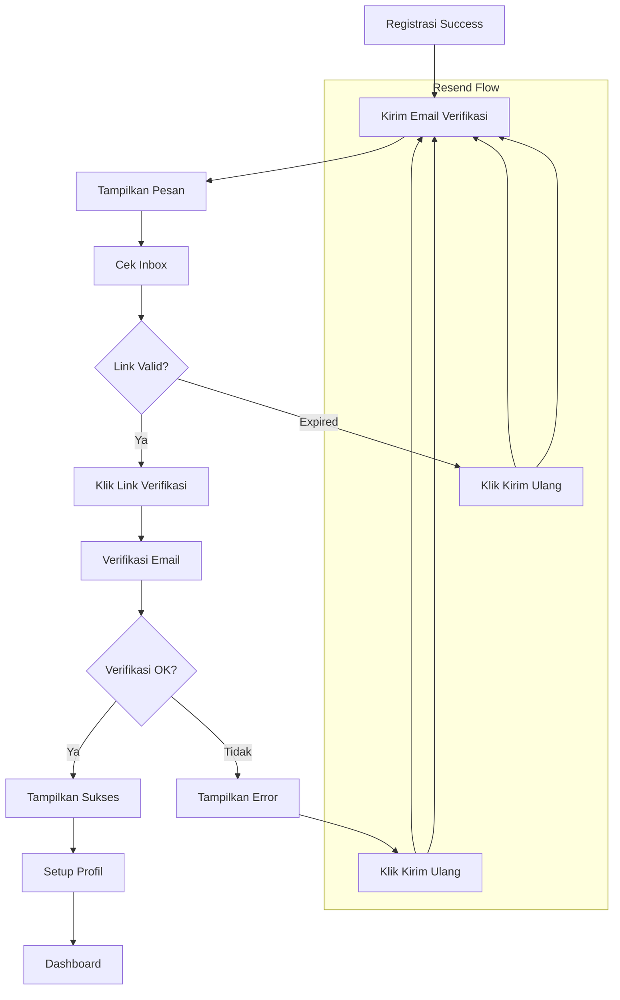

### 2.6.2 Wireframe Verification Pending

| Section | Component | Type | Placeholder |
|---------|-----------|------|-------------|
| Header | Logo + Title | Image + Text | Scalp Analytics |
| Icon | Email Icon | Icon | Envelope |
| Message | Verify Message | Text | Cek email Anda |
| Action | Resend | Button Secondary | KIRIM ULANG EMAIL |
| Footer | Support Link | Text Link | Butuh bantuan? |

**Layout:**
```
┌─────────────────────────┐
│   VERIFY YOUR EMAIL     │
├─────────────────────────┤
│         ✉️              │
│                         │
│ Kami telah mengirim     │
│ email verifikasi ke:   │
│                         │
│ user@example.com       │
│                         │
│ Silakan klik link      │
│ dalam email untuk       │
│ mengaktifkan akun.     │
│                         │
│ [KIRIM ULANG EMAIL]    │
│                         │
│ Link kedaluwarsa       │
│ dalam 24 jam           │
│                         │
│ Butuh bantuan?         │
└─────────────────────────┘
```

### 2.6.3 Wireframe Verification Success

**Layout:**
```
┌─────────────────────────┐
│   VERIFICATION SUCCESS │
├─────────────────────────┤
│         ✓              │
│                         │
│ Email Anda telah       │
│ diverifikasi!          │
│                         │
│ Mari lanjutkan setup   │
│ profil Anda.            │
│                         │
│ [    LANJUTKAN    ]     │
└─────────────────────────┘
```

---

## 2.7 Flow Landing Page (Company Profile)

### 2.7.1 Flow Diagram

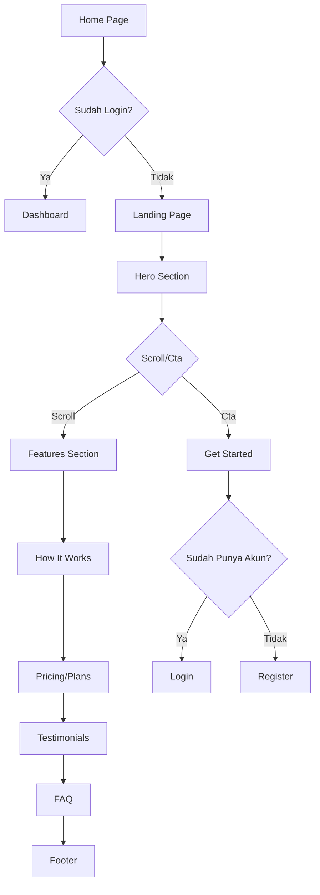

### 2.7.2 Wireframe Landing Page

| Section | Component | Type |
|---------|-----------|------|
| Navbar | Logo + Links + CTA | Navigation |
| Hero | Title + Subtitle + CTA | Hero Section |
| Features | Features Grid | Feature Cards |
| How It Works | Steps | Step Cards |
| Pricing | Pricing Cards | Pricing Table |
| Testimonials | Reviews | Carousel |
| FAQ | Accordion | FAQ List |
| Footer | Links + Contact | Footer |

**Layout Hero:**
```
┌─────────────────────────────────────────────────────────┐
│  [Logo]   Features  Pricing  About  [Login] [Get Started]│
├─────────────────────────────────────────────────────────┤
│                                                         │
│                    TRACK YOUR                          │
│                    HAIR HEALTH                         │
│                                                         │
│         AI-powered hair health management system       │
│         Monitor progress, track habits, get insights   │
│                                                         │
│                [Get Started Free]                      │
│         [Watch Demo]                                   │
│                                                         │
│                    [Hero Image/Video]                  │
│                                                         │
└─────────────────────────────────────────────────────────┘
```

**Layout Features:**
```
┌─────────────────────────────────────────────────────────┐
│                    WHY SCALP ANALYTICS                  │
├─────────────────────────────────────────────────────────┤
│                                                         │
│  ┌─────────┐  ┌─────────┐  ┌─────────┐  ┌─────────┐   │
│  │ AI      │  │ Habit   │  │ Product │  │ Dashboard│   │
│  │ Analysis│  │ Tracker │  │ Recs    │  │ Analytics│   │
│  │         │  │         │  │         │  │         │   │
│  │ Track   │  │ Monitor │  │ Get     │  │ View    │   │
│  │ hair    │  │ daily   │  │ product │  │ insights│   │
│  │ density │  │ habits  │  │ tips    │  │ and data│   │
│  └─────────┘  └─────────┘  └─────────┘  └─────────┘   │
│                                                         │
│             [Learn More About Features]                 │
└─────────────────────────────────────────────────────────┘
```

**Layout How It Works:**
```
┌─────────────────────────────────────────────────────────┐
│                    HOW IT WORKS                         │
├─────────────────────────────────────────────────────────┤
│                                                         │
│      1                   2                   3           │
│  ┌─────────┐      ┌─────────┐       ┌─────────┐      │
│  │ Upload  │      │ Track   │       │ Get     │      │
│  │ Photos  │ ───> │ Habits  │ ───>  │ Insights│      │
│  │         │      │         │       │         │      │
│  └─────────┘      └─────────┘       └─────────┘      │
│                                                         │
│   Weekly photos    Daily logging    AI analysis       │
│   from 5 angles    habits & food    & recommendations  │
│                                                         │
└─────────────────────────────────────────────────────────┘
```

**Layout Pricing:**
```
┌─────────────────────────────────────────────────────────┐
│                      PRICING                            │
├─────────────────────────────────────────────────────────┤
│                                                         │
│     ┌───────────┐  ┌───────────┐  ┌───────────┐      │
│     │  FREE     │  │  PRO      │  │  PREMIUM  │      │
│     │           │  │  ★        │  │           │      │
│     │  IDR 0    │  │  IDR 99K  │  │  IDR 199K │      │
│     │  /month   │  │  /month   │  │  /month   │      │
│     │           │  │           │  │           │      │
│     │ • 5 photos│  │ • 25 photos│  │ • Unlimited│   │
│     │ • Basic AI│  │ • Advanced AI│  │ • Priority AI│ │
│     │ • Habit log│  │ • Nutrition │  │ • Nutrition   │ │
│     │           │  │ • Dashboard│  │ • Dashboard     │ │
│     │ [Start]   │  │ [Subscribe] │  │ [Subscribe]    │ │
│     └───────────┘  └───────────┘  └───────────┘      │
│                                                         │
└─────────────────────────────────────────────────────────┘
```

### 2.7.3 Public Pages

| Page | Route | Deskripsi |
|------|-------|-----------|
| Home | `/` | Landing page dengan hero, features, pricing |
| Features | `/features` | Detail fitur aplikasi |
| Pricing | `/pricing` | Plan dan harga |
| About | `/about` | Tentang perusahaan |
| Contact | `/contact` | Form kontak |
| Privacy | `/privacy` | Kebijakan privasi |
| Terms | `/terms` | Syarat dan ketentuan |
| FAQ | `/faq` | Pertanyaan umum |

---

## 3. Flow Habit Logging

### 3.1 Flow Diagram

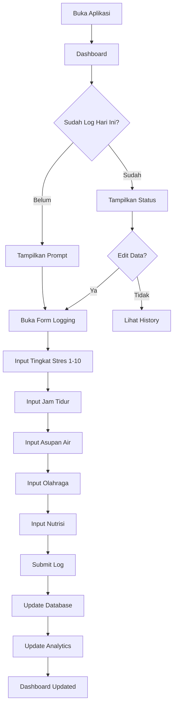

### 3.2 Wireframe Habit Logger

| Section | Component | Type | Options |
|---------|-----------|------|---------|
| Header | Title + Date | Text + Dropdown | LOG HABIT HARIAN |
| Stress | Stress Level | Slider 1-10 | 1 (Low) - 10 (High) |
| Sleep | Sleep Hours | Number Input | 0-24 jam |
| Water | Water Intake | Number Input | 0-5 liter |
| Exercise | Exercise | Checkbox + Select | Ya/Tidak, Type, Duration |
| Nutrition | Food Log | Multi-select | Food database |
| Action | Submit | Button Primary | SIMPAN LOG |

**Layout:**
```
┌─────────────────────────┐
│ LOG HABIT HARIAN        │
│ [Tanggal: ▼]            │
├─────────────────────────┤
│ TINGKAT STRES           │
│ [1] [2] [3] [4] [5]     │
│ [6] [7] [8] [9] [10]    │
├─────────────────────────┤
│ JAM TIDUR               │
│ [7.5 jam        ]       │
├─────────────────────────┤
│ ASUPAN AIR              │
│ [2.5 liter      ]       │
├─────────────────────────┤
│ OLAHRAGA                │
│ [✓] Ya, saya olahraga   │
│ [ ] Tidak               │
│ Jenis: [Cardio▼]        │
│ Durasi: 30 menit        │
├─────────────────────────┤
│ NUTRISI MAKANAN         │
│ [+ Tambah Makanan]      │
│ Tempe 100g  Protein 19g │
│ Bayam 1mgk  Protein 3g  │
│ Telur 1btr  Protein 6g  │
│ Total: P:28g Zn:1.5mg   │
├─────────────────────────┤
│ [   SIMPAN LOG   ]      │
└─────────────────────────┘
```

### 3.3 Kategori Habit

| Kategori | Faktor | Tipe Input | Rentang | Dampak |
|----------|--------|------------|---------|--------|
| Mental | Tingkat Stres | Slider | 1-10 | Stress tinggi kortisol |
| Tidur | Jam Tidur | Number | 0-24 jam | Regenerasi sel |
| Hidrasi | Asupan Air | Number | 0-5 liter | Sirkulasi kulit kepala |
| Olahraga | Jenis + Durasi | Checkbox + Number | 0-180 min | Sirkulasi darah |
| Nutrisi | Makanan | Food Database | gram/mg/mcg | Komponen keratin |

### 3.4 Contoh Data Makanan

| Makanan | Porsi | Protein | Zinc | Iron | Biotin | Vit D |
|---------|-------|---------|------|------|--------|-------|
| Tempe | 100g | 19g | 1.0mg | 2.7mg | 0mcg | 0IU |
| Bayam | 180g | 3g | 0.5mg | 6.4mg | 0mcg | 0IU |
| Telur | 50g | 6g | 0.5mg | 1mg | 10mcg | 41IU |
| Salmon | 100g | 25g | 0.6mg | 0.8mg | 5mcg | 526IU |
| Almond | 28g | 6g | 0.9mg | 1mg | 1.5mcg | 0IU |

---

## 4. Flow Photo Upload

### 4.1 Flow Diagram

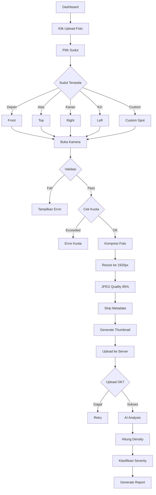

### 4.2 Spesifikasi Upload

| Parameter | Nilai | Deskripsi |
|-----------|-------|-----------|
| Max File Size | 10 MB | Sebelum kompresi |
| Target Size | 500 KB - 2 MB | Setelah kompresi |
| Max Resolution | 1920px | Width/Height max |
| Min Resolution | 720p | Min untuk AI |
| Format | JPEG, PNG, WebP | Auto-convert ke JPEG |
| Quality | 85% | JPEG quality |

### 4.3 Wireframe Pilih Sudut

| Section | Component | Type |
|---------|-----------|------|
| Header | Title + Quota | Text |
| Grid | Sudut Kartu | Card Grid |
| Card | Depan/Front | Card with Photo |
| Card | Atas/Top | Card with Photo |
| Card | Kanan/Right | Card with Photo |
| Card | Kiri/Left | Card with Photo |
| Card | Custom | Card with Photo |
| Footer | Progress | Text + Percentage |

**Layout:**
```
┌─────────────────────────┐
│ PILIH SUDUT FOTO        │
├─────────────────────────┤
│ Kuota: 12/25            │
│ Storage: 18MB/500MB     │
├─────────────────────────┤
│ Pilih sudut foto:       │
│                         │
│ ┌────────┐ ┌────────┐   │
│ │ DEPAN  │ │ ATAS   │   │
│ │        │ │        │   │
│ │ Front  │ │ Top    │   │
│ │✓ Done  │ │✓ Done  │   │
│ │ 75.2%  │ │ 58.3%  │   │
│ └────────┘ └────────┘   │
│                         │
│ ┌────────┐ ┌────────┐   │
│ │ KANAN  │ │ KIRI   │   │
│ │        │ │        │   │
│ │ Right  │ │ Left   │   │
│ │✓ Done  │ │✓ Done  │   │
│ │ 68.1%  │ │ 70.5%  │   │
│ └────────┘ └────────┘   │
│                         │
│ ┌────────┐             │
│ │ CUSTOM │             │
│ │        │             │
│ │ Area   │             │
│ │ Botak  │             │
│ │✓ Done  │             │
│ │ 45.0%  │             │
│ └────────┘             │
├─────────────────────────┤
│ Progress: 5/5 (100%)   │
│ Sisa: 13 foto | 482MB  │
└─────────────────────────┘
```

### 4.4 Wireframe Hasil Analisis

| Section | Component | Type |
|---------|-----------|------|
| Header | Title | Text |
| Photo | Thumbnail | Image |
| Result | Density % | Number |
| Result | Severity | Badge |
| Result | Confidence | Number |
| Info | Kompresi | Card |
| Info | Rekomendasi | List |
| Info | Perbandingan | Card |
| Action | Buttons | Button Group |

**Layout:**
```
┌─────────────────────────┐
│ HASIL ANALISIS          │
├─────────────────────────┤
│ [THUMBNAIL FOTO]        │
│                         │
│ 62.5%                   │
│ Kepadatan Rambut        │
│                         │
│ Severity: Stage 3-4     │
│ Confidence: 88%         │
├─────────────────────────┤
│ INFO KOMPRESI           │
│ Asli: 8.0 MB            │
│ Kompresi: 1.5 MB        │
│ Hemat: 81%              │
│ Resolusi: 1920x1440     │
├─────────────────────────┤
│ REKOMENDASI             │
│ 1. Minoxidil 5%         │
│ 2. Hair Vitamin         │
│ 3. Scalp Serum          │
│ [Lihat Detail]          │
├─────────────────────────┤
│ PERBANDINGAN            │
│ Sebelum: 65.0%          │
│ Sekarang: 62.5%         │
│ Perubahan: -2.5%        │
├─────────────────────────┤
│ [Grafik] [Upload Lain] │
└─────────────────────────┘
```

---

## 5. Flow Treatment

### 5.1 Flow Diagram

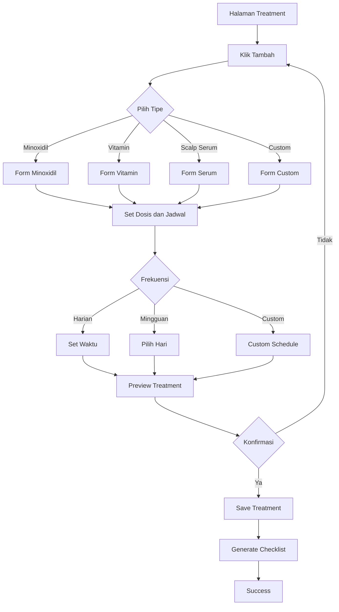

### 5.2 Tipe Treatment

| Tipe | Deskripsi | Contoh Produk |
|------|-----------|---------------|
| Minoxidil | Topical solution | Minoxidil 2%, 5% |
| Finasteride | Oral medication | Finasteride 1mg |
| Hair Vitamin | Suplemen | Biotin, Zinc, Vitamin D |
| Scalp Serum | Topical serum | Niacinamide, Peptide |
| Scalp Shampoo | Shampo khusus | Ketoconazole, Oil control |
| Scalp Massage | Terapi pijat | Derma roller |
| Custom | Lainnya | Sesuai kebutuhan |

### 5.3 Wireframe Checklist Treatment

| Section | Component | Type |
|---------|-----------|------|
| Header | Title + Date | Text + Dropdown |
| Item | Treatment Card | Card with Checkbox |
| Item | Status | Badge |
| Item | Time | Text |
| Item | Notes | Text |
| Item | Action Button | Button |
| Footer | Statistics | Text |

**Layout:**
```
┌─────────────────────────┐
│ CHECKLIST HARIAN        │
│ [Tanggal: ▼]            │
├─────────────────────────┤
│ [✓] MINOXIDIL 5% PAGI  │
│ 08:00                  │
│ ✓ Selesai 08:05         │
│ 1ml applied             │
├─────────────────────────┤
│ [ ] MINOXIDIL 5% MALAM  │
│ 20:00                  │
│ Belum                   │
│ 1ml applied             │
│ [Tandai Selesai]        │
├─────────────────────────┤
│ [✓] HAIR VITAMIN        │
│ 09:00                  │
│ ✓ Selesai 09:15         │
│ 1 tablet                │
├─────────────────────────┤
│ [ ] SCALP SERUM         │
│ 21:00                  │
│ Belum                   │
│ Apply after minoxidil   │
│ [Tandai Selesai]        │
├─────────────────────────┤
│ STATISTIK               │
│ Penyelesaian: 2/4 (50%)│
│ Streak: 7 hari          │
│ Kepatuhan: 85%          │
└─────────────────────────┘
```

---

## 6. Flow Dashboard

### 6.1 Flow Diagram

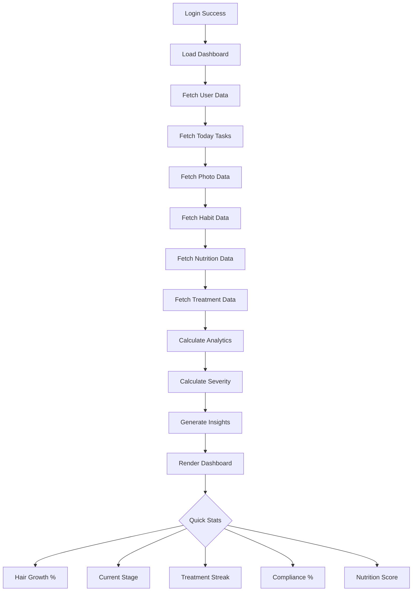

### 6.2 Wireframe Dashboard

| Section | Component | Type |
|---------|-----------|------|
| Header | Welcome + Profile | Text + Avatar |
| Stats | Growth Card | Card |
| Stats | Severity Card | Card |
| Stats | Streak Card | Card |
| Stats | Compliance Card | Card |
| Chart | Trend Chart | Line Chart |
| Table | Nutrition Table | Table |
| List | Task List | Checkbox List |
| List | Insights | Bullet List |

**Layout:**
```
┌─────────────────────────┐
│ DASHBOARD HOME   🔔 👤  │
├─────────────────────────┤
│ Selamat datang, John!   │
├─────────────────────────┤
│ STATISTIK CEPAT         │
│ ┌─────┐┌─────┐┌─────┐  │
│ │Growth││Stage││Streak│  │
│ │-2.5%││3-4  ││7hari│  │
│ └─────┘└─────┘└─────┘  │
│ ┌─────┐                │
│ │Compliance│            │
│ │ 85%   │                │
│ └─────┘                │
├─────────────────────────┤
│ TREND KEPADATAN         │
│ [LINE CHART]            │
│ W1 W2 W3 W4 W5          │
├─────────────────────────┤
│ NUTRISI HARIAN          │
│ Nutrisi | Akt | Tgt |%  │
│ Protein | 28 | 50 | 56  │
│ Zinc    |1.5 | 11 | 14  │
│ Iron    |7.1 | 18 | 39  │
│ Biotin  | 10 | 30 | 33  │
├─────────────────────────┤
│ TASK HARI INI           │
│ [ ] Log habit           │
│ [ ] Treatment malam     │
│ [ ] Upload foto         │
│ [✓] Treatment pagi      │
├─────────────────────────┤
│ INSIGHT                 │
│ • Kepadatan -2.5%       │
│ • Area crown perlu      │
│ • Zinc masih kurang     │
└─────────────────────────┘
```

---

## 7. Flow Rekomendasi

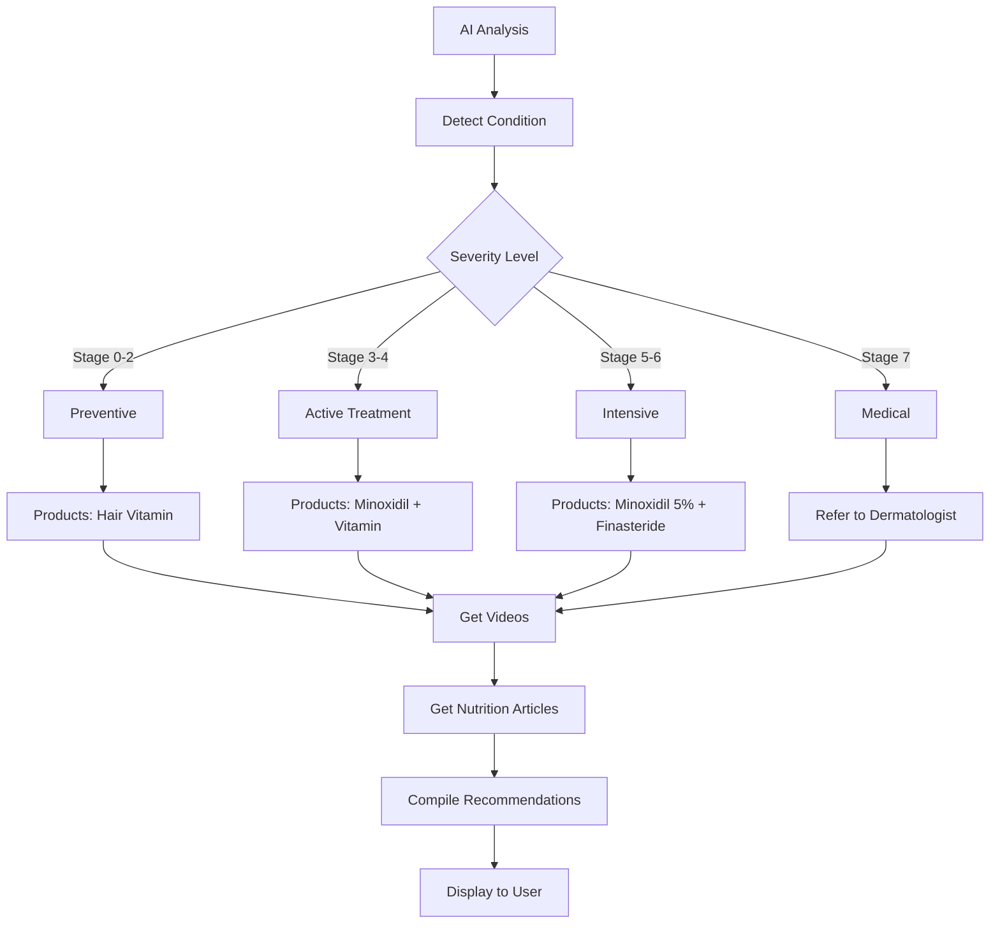

---

## 8. Error States

### 8.1 Wireframe Error

| Section | Component | Type |
|---------|-----------|------|
| Center | Error Icon | Icon |
| Center | Error Message | Text |
| Center | Retry Button | Button |

**Layout:**
```
┌─────────────────────────┐
│ ERROR KONEKSI           │
├─────────────────────────┤
│                         │
│        ⚠️              │
│        Error            │
│                         │
│ Tidak dapat terhubung   │
│ ke server.              │
│ Periksa koneksi Anda.   │
│                         │
│ [   COBA LAGI   ]       │
│                         │
└─────────────────────────┘
```

### 8.2 Error Codes

| Code | Status | Message |
|------|--------|---------|
| 400 | Bad Request | Invalid input data |
| 401 | Unauthorized | Missing/invalid token |
| 403 | Forbidden | Insufficient permissions |
| 404 | Not Found | Resource not found |
| 429 | Quota Exceeded | Upload limit reached |
| 500 | Server Error | Internal error |

---

## 9. Navigation

### 9.1 Wireframe Bottom Navigation

| Position | Icon | Label |
|----------|------|-------|
| 1 | 📊 | Home |
| 2 | 📷 | Photo |
| 3 | 💊 | Treatment |
| 4 | 👤 | Profile |

**Layout:**
```
┌─────────────────────────┐
│ BOTTOM NAVIGATION       │
├─────────────────────────┤
│ [📊] [📷] [💊] [👤]    │
│ HOME PHOTO TREAT PROFILE│
└─────────────────────────┘
```

### 9.2 Screen Hierarchy

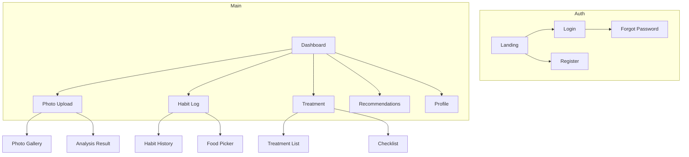

---

## 10. Flow Notification

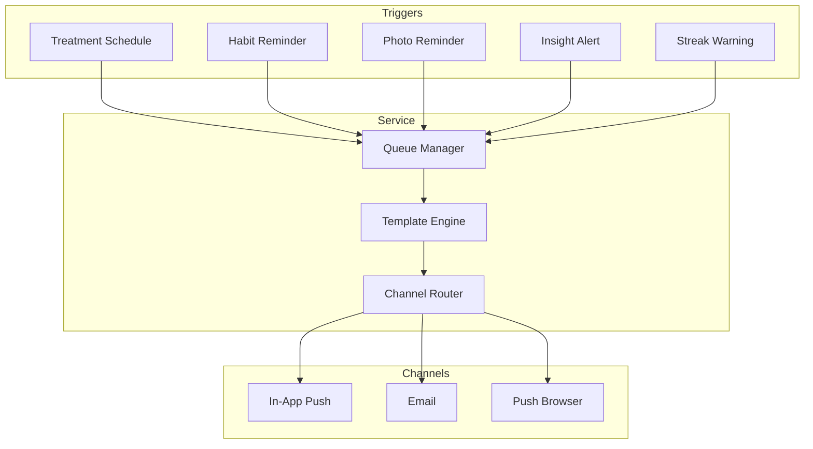

### 10.1 Wireframe Notification List

| Section | Component | Type |
|---------|-----------|------|
| Header | Title + Action | Text + Button |
| Group | Today | Section Header |
| Item | Treatment Reminder | Notification Card |
| Item | Habit Reminder | Notification Card |
| Item | Streak Warning | Notification Card |
| Group | Yesterday | Section Header |
| Item | Progress Update | Notification Card |

**Layout:**
```
┌─────────────────────────┐
│ NOTIFICATIONS           │
│ [Tandai Semua Dibaca]  │
├─────────────────────────┤
│ Hari Ini                │
├─────────────────────────┤
│ 💊 TREATMENT REMINDER   │
│ 08:00                  │
│ Waktunya Minoxidil 5%   │
│ Jangan lupa treatment!  │
│ [Selesai] [Dismiss]    │
├─────────────────────────┤
│ 📊 HABIT REMINDER       │
│ 10:00                  │
│ Sudahkah Anda log?     │
│ [Log] [Nanti]           │
├─────────────────────────┤
│ 🔥 STREAK WARNING       │
│ 19:00                  │
│ Streak Anda terancam!   │
│ Saat ini: 7 hari        │
│ [Log Habit] [Dismiss]  │
├─────────────────────────┤
│ Kemarin                 │
├─────────────────────────┤
│ 📈 PROGRESS UPDATE      │
│ Minggu                  │
│ Progress mingguan Anda  │
│ ✓ Dibaca                │
└─────────────────────────┘
```

### 10.2 Wireframe Notification Preferences

| Section | Component | Type |
|---------|-----------|------|
| Treatment Reminder | Toggle + Time | Switch + Time Picker |
| Habit Reminder | Toggle + Time | Switch + Time Picker |
| Photo Reminder | Toggle + Day Time | Switch + Dropdown |
| Quiet Hours | Toggle + Time Range | Switch + Time Pickers |
| Channel | Toggle Group | Checkboxes |

**Layout:**
```
┌─────────────────────────┐
│ PENGATURAN NOTIFIKASI   │
├─────────────────────────┤
│ TREATMENT REMINDER      │
│ [✓] Aktif              │
│ Waktu: [08:00 ▼]        │
├─────────────────────────┤
│ HABIT REMINDER          │
│ [✓] Aktif              │
│ Pagi: [09:00 ▼]         │
│ Malam: [20:00 ▼]        │
├─────────────────────────┤
│ PHOTO REMINDER          │
│ [✓] Aktif              │
│ Hari: [Minggu ▼]        │
│ Waktu: [10:00 ▼]        │
├─────────────────────────┤
│ QUIET HOURS             │
│ [✓] Aktif              │
│ Dari: [22:00 ▼]         │
│ Sampai: [07:00 ▼]       │
├─────────────────────────┤
│ CHANNEL                 │
│ [✓] In-App Push         │
│ [✓] Email               │
│ [✓] Push Browser        │
│ [ ] SMS (Coming Soon)   │
├─────────────────────────┤
│ [SIMPAN PENGATURAN]     │
└─────────────────────────┘
```

### 10.3 Tipe Notifikasi

| Tipe | Trigger | Channel | Frekuensi |
|------|---------|---------|-----------|
| Treatment Reminder | Jadwal treatment | In-App, Push | Real-time |
| Habit Reminder | Belum log hari ini | In-App, Email | 10:00, 20:00 |
| Photo Reminder | Jadwal foto mingguan | Email | Mingguan |
| Streak Warning | Streak akan putus | Push | Real-time |
| Insight Alert | Insight baru tersedia | In-App | On-demand |
| Progress Update | Progress mingguan | Email | Mingguan |
| Severity Alert | Severity berubah signifikan | Email | On-demand |

---

## 11. Key Success Metrics

| Metrik | Target | Pengukuran |
|--------|--------|-------------|
| Penyelesaian Hari 1 | 80% | Complete onboarding |
| Retensi Minggu 1 | 60% | Return after 7 days |
| Kepatuhan Foto | 70% | Weekly photo uploads |
| Kepatuhan Treatment | 70% | Daily completion |
| Kepatuhan Nutrisi | 60% | Daily food logging |
| Engagement Insight | 50% | View correlation data |
| Click Rate Rekomendasi | 30% | Click on products/videos |

---

## 12. Email Templates

### Treatment Reminder Email

```
Subject: Pengingat Treatment: Minoxidil 5%

═════════════════════════════
SCALP ANALYTICS
═════════════════════════════

Hai John,

Ini adalah pengingat untuk treatment Anda:

Treatment: Minoxidil 5%
Waktu: 08:00
Dosis: 1 ml

Jangan lupa untuk mengaplikasikan treatment
Anda sesuai jadwal!

[Mark as Done]  [Snooze]

═════════════════════════════
Streak Anda saat ini: 7 hari
Pertahankan streak Anda!

Dashboard: https://app.scalpanalytics.com/dashboard
═════════════════════════════
```

### Streak Warning Email

```
Subject: 🔥 Streak Anda Terancam Putus!

═════════════════════════════
SCALP ANALYTICS
═════════════════════════════

Hai John,

Streak treatment Anda terancam putus!

Streak saat ini: 7 hari
Berakhir jika: Tidak ada aktivitas dalam 24 jam

Jangan biarkan streak Anda hilang!
Logging harian adalah kunci keberhasilan treatment.

[Log Sekarang]

═════════════════════════════
Tips: Log habit Anda sebelum tidur untuk
mempertahankan streak!

Dashboard: https://app.scalpanalytics.com/dashboard
═════════════════════════════
```