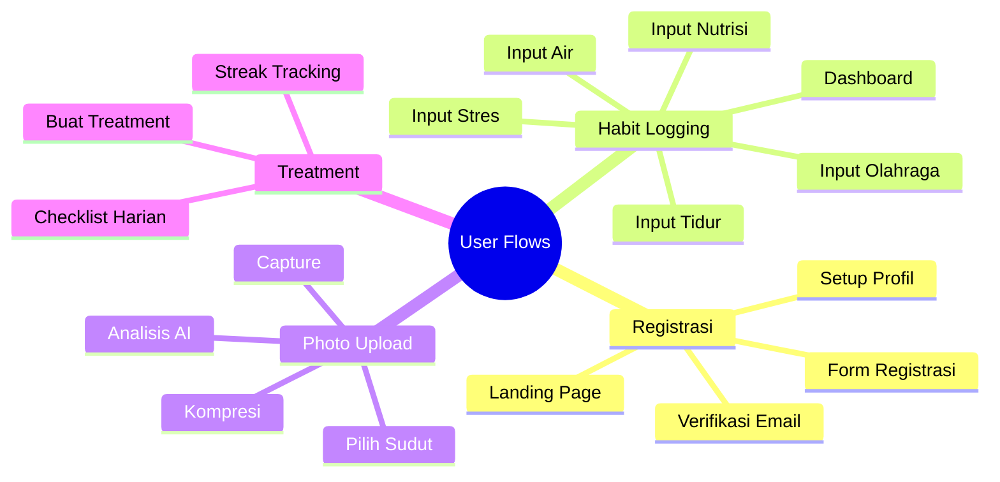
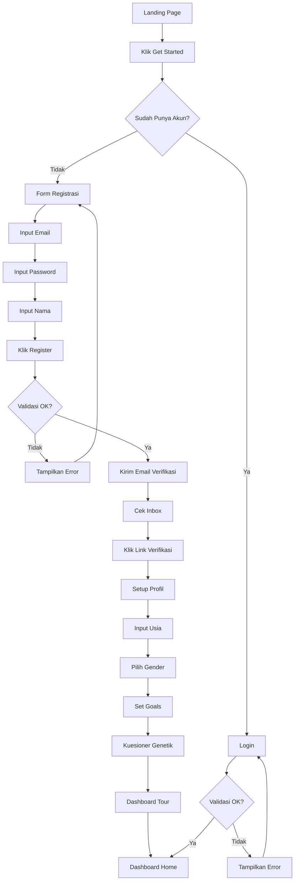
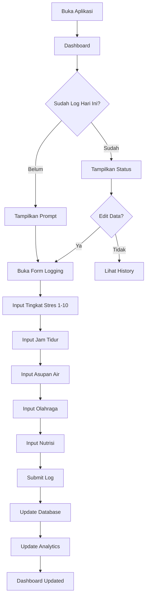
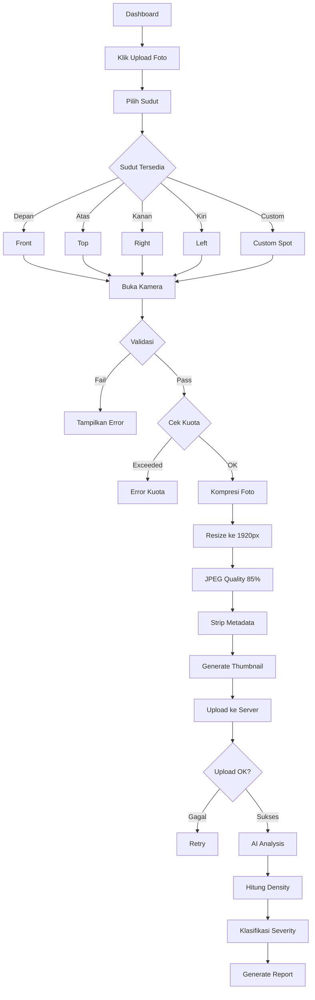
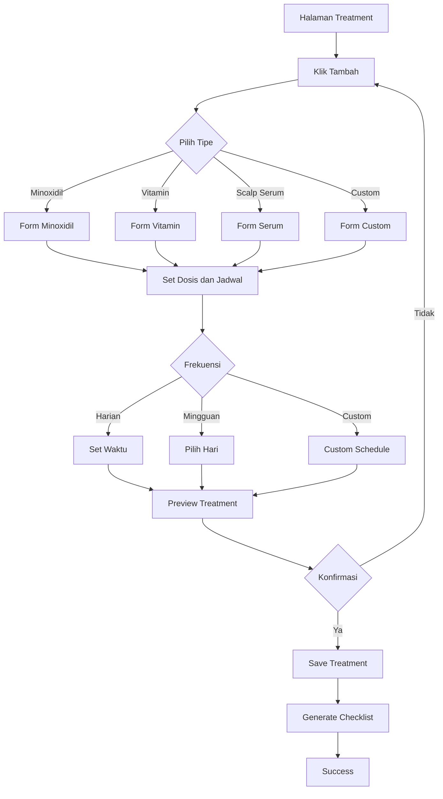
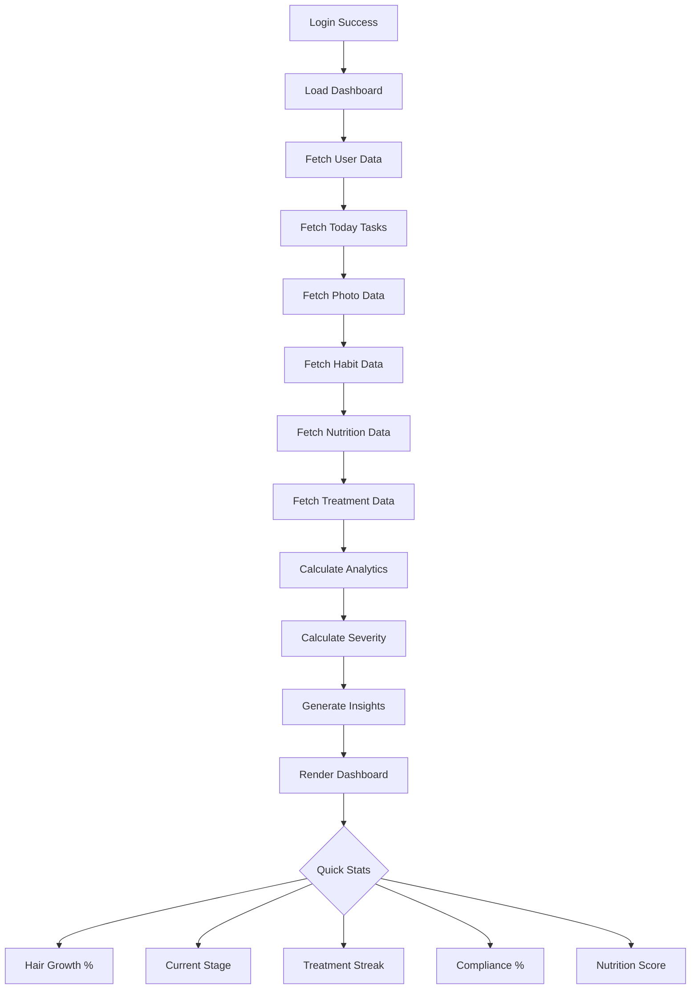
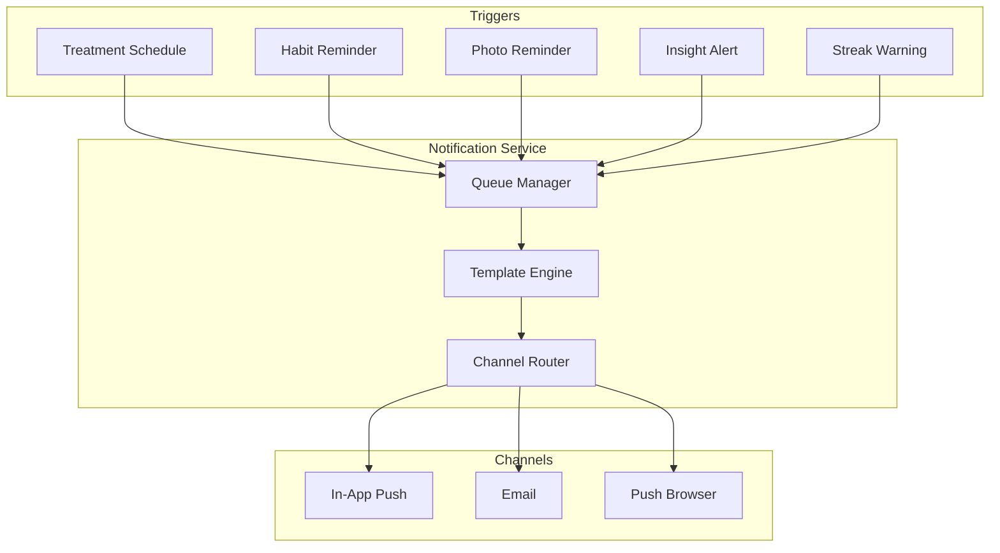

# User Flow Document

---

## Wireframe Registrasi

```
┌────────────────────────────────────┐
│             REGISTRASI             │
├────────────────────────────────────┤
│                                    │
│  Email                             │
│  ┌──────────────────────────────┐  │
│  │ user@example.com             │  │
│  └──────────────────────────────┘  │
│                                    │
│  Password                          │
│  ┌──────────────────────────────┐  │
│  │ •••••••••••                  │  │
│  └──────────────────────────────┘  │
│                                    │
│  Nama Lengkap                      │
│  ┌──────────────────────────────┐  │
│  │ John Doe                     │  │
│  └──────────────────────────────┘  │
│                                    │
│  ┌──────────────────────────────┐  │
│  │          BUAT AKUN           │  │
│  └──────────────────────────────┘  │
│                                    │
│  Sudah punya akun? Masuk           │
└────────────────────────────────────┘
```

---

## Wireframe Habit Logger

```
┌────────────────────────────────────┐
│           LOG HABIT HARIAN         │
│             [Tanggal: ▼]           │
├────────────────────────────────────┤
│                                    │
│  TINGKAT STRES                     │
│                                    │
│  ┌────┐ ┌────┐ ┌────┐ ┌────┐ ┌───┐ │
│  │ 1  │ │ 2  │ │ 3  │ │ 4  │ │ 5 │ │
│  └────┘ └────┘ └────┘ └────┘ └───┘ │
│  ┌────┐ ┌────┐ ┌────┐ ┌────┐ ┌───┐ │
│  │ 6  │ │ 7  │ │ 8  │ │ 9  │ │10 │ │
│  └────┘ └────┘ └────┘ └────┘ └───┘ │
│                                    │
├────────────────────────────────────┤
│  JAM TIDUR                         │
│                                    │
│  ┌──────────────────────────────┐  │
│  │ 7.5 jam                      │  │
│  └──────────────────────────────┘  │
│                                    │
├────────────────────────────────────┤
│  ASUPAN AIR                        │
│                                    │
│  ┌──────────────────────────────┐  │
│  │ 2.5 liter                    │  │
│  └──────────────────────────────┘  │
│                                    │
├────────────────────────────────────┤
│  OLAHRAGA                          │
│                                    │
│  [✓] Ya, saya olahraga             │
│  [ ] Tidak                         │
│                                    │
│  Jenis: [Cardio] [Strength]        │
│  Durasi: 30 menit                  │
│                                    │
├────────────────────────────────────┤
│  NUTRISI MAKANAN                   │
│                                    │
│  ┌──────────────────────────────┐  │
│  │      [+] Tambah Makanan      │  │
│  └──────────────────────────────┘  │
│                                    │
│  Makanan Hari Ini:                 │
│  ┌──────────────────────────────┐  │
│  │ Tempe 100g  Protein: 19g  [×]│  │
│  │ Bayam 1 mgk Protein: 3g   [×]│  │
│  │ Telur 1 btr Protein: 6g   [×]│  │
│  └──────────────────────────────┘  │
│                                    │
│  Total: Protein 28g | Zinc 1.5mg   │
│                                    │
├────────────────────────────────────┤
│  ┌──────────────────────────────┐  │
│  │        SIMPAN LOG            │  │
│  └──────────────────────────────┘  │
│                                    │
└────────────────────────────────────┘
```

---

## Wireframe Pilih Sudut Foto

```
┌────────────────────────────────────┐
│         PILIH SUDUT FOTO           │
├────────────────────────────────────┤
│                                    │
│  Kuota: 12/25 | Storage: 18MB      │
│                                    │
├────────────────────────────────────┤
│                                    │
│  Pilih sudut foto:                 │
│                                    │
│  ┌─────────┐  ┌─────────┐          │
│  │  DEPAN  │  │  ATAS   │          │
│  │         │  │         │          │
│  │  Front  │  │  Top    │          │
│  │ ✓ Done  │  │ ✓ Done  │          │
│  │  75.2%  │  │  58.3%  │          │
│  └─────────┘  └─────────┘          │
│                                    │
│  ┌─────────┐  ┌─────────┐          │
│  │  KANAN  │  │  KIRI   │          │
│  │         │  │         │          │
│  │  Right  │  │  Left   │          │
│  │ ✓ Done  │  │ ✓ Done  │          │
│  │  68.1%  │  │  70.5%  │          │
│  └─────────┘  └─────────┘          │
│                                    │
│  ┌─────────┐                       │
│  │ CUSTOM  │                       │
│  │         │                       │
│  │ Area    │                       │
│  │ Botak   │                       │
│  │ ✓ Done  │                       │
│  │  45.0%  │                       │
│  └─────────┘                       │
│                                    │
├────────────────────────────────────┤
│  Progress: 5/5 sudut (100%)        │
│  Sisa: 13 foto | 482MB storage     │
│                                    │
└────────────────────────────────────┘
```

---

## Wireframe Hasil Analisis

```
┌────────────────────────────────────┐
│           HASIL ANALISIS           │
├────────────────────────────────────┤
│                                    │
│  ┌──────────────────────────────┐  │
│  │                              │  │
│  │     [Thumbnail Foto]         │  │
│  │                              │  │
│  │            62.5%             │  │
│  │      Kepadatan Rambut        │  │
│  │                              │  │
│  │     Severity: Stage 3-4      │  │
│  │       Confidence: 88%        │  │
│  │                              │  │
│  └──────────────────────────────┘  │
│                                    │
│  ┌──────────────────────────────┐  │
│  │ INFO KOMPRESI                │  │
│  │                              │  │
│  │  Ukuran Asli: 8.0 MB         │  │
│  │  Ukuran Kompresi: 1.5 MB     │  │
│  │  Penghematan: 81%            │  │
│  │  Resolusi: 1920 x 1440       │  │
│  └──────────────────────────────┘  │
│                                    │
│  ┌──────────────────────────────┐  │
│  │ REKOMENDASI                  │  │
│  │                              │  │
│  │  1. Minoxidil 5% Solution    │  │
│  │  2. Hair Vitamin             │  │
│  │  3. Scalp Serum              │  │
│  │                              │  │
│  │  [Lihat Detail Produk]       │  │
│  └──────────────────────────────┘  │
│                                    │
│  ┌──────────────────────────────┐  │
│  │ PERBANDINGAN                 │  │
│  │                              │  │
│  │  Sebelum: 65.0%              │  │
│  │  Sekarang: 62.5%             │  │
│  │  Perubahan: -2.5%            │  │
│  └──────────────────────────────┘  │
│                                    │
│  ┌───────────┐ ┌───────────┐       │
│  │ Grafik    │ │ Upload    │       │
│  │ Progress  │ │ Lainya    │       │
│  └───────────┘ └───────────┘       │
│                                    │
└────────────────────────────────────┘
```

---

## Wireframe Checklist Treatment

```
┌────────────────────────────────────┐
│           CHECKLIST HARIAN         │
│             [Tanggal: ▼]           │
├────────────────────────────────────┤
│                                    │
│  ┌──────────────────────────────┐  │
│  │ ☑ MINOXIDIL 5% - PAGI        │  │
│  │   08:00  ✓ Selesai 08:05     │  │
│  │   1ml applied to temples     │  │
│  └──────────────────────────────┘  │
│                                    │
│  ┌──────────────────────────────┐  │
│  │ ○ MINOXIDIL 5% - MALAM       │  │
│  │   20:00  Belum               │  │
│  │   1ml applied to temples     │  │
│  │   ┌────────────────────┐     │  │
│  │   │  Tandai Selesai    │     │  │
│  │   └────────────────────┘     │  │
│  └──────────────────────────────┘  │
│                                    │
│  ┌──────────────────────────────┐  │
│  │ ☑ HAIR VITAMIN               │  │
│  │   09:00  ✓ Selesai 09:15     │  │
│  │   1 tablet setelah makan     │  │
│  └──────────────────────────────┘  │
│                                    │
│  ┌──────────────────────────────┐  │
│  │ ○ SCALP SERUM                │  │
│  │   21:00  Belum               │  │
│  │   Apply after minoxidil      │  │
│  │   ┌────────────────────┐     │  │
│  │   │  Tandai Selesai    │     │  │
│  │   └────────────────────┘     │  │
│  └──────────────────────────────┘  │
│                                    │
├────────────────────────────────────┤
│  STATISTIK HARIAN                  │
│                                    │
│  Penyelesaian: 2/4 (50%)           │
│  Streak: 7 hari                    │
│  Kepatuhan Minggu: 85%             │
│                                    │
└────────────────────────────────────┘
```

---

## Wireframe Dashboard

```
┌────────────────────────────────────┐
│ DASHBOARD HOME   🔔  [Profil ▼]    │
├────────────────────────────────────┤
│                                    │
│  Selamat datang, John!             │
│                                    │
├────────────────────────────────────┤
│        STATISTIK CEPAT             │
│                                    │
│  ┌───────┐ ┌───────┐ ┌───────┐     │
│  │PERTU  │ │SEVERI │ │STREAK │     │
│  │-2.5%  │ │Stage3 │ │ 7hari │     │
│  └───────┘ └───────┘ └───────┘     │
│                                    │
│  ┌───────┐ ┌────────┐              │
│  │KEPATU │ │ MINGGU │              │
│  │ 85%   │ │        │              │
│  └───────┘ └────────┘              │
│                                    │
├────────────────────────────────────┤
│      TREND KEPADATAN RAMBUT        │
│                                    │
│  80% │        ●───●───●            │
│  70% │    ●───●                    │
│  60% │●───●                        │
│  50% │●●                           │
│      └─────────────────            │
│       W1  W2  W3  W4  W5           │
│                                    │
├────────────────────────────────────┤
│          NUTRISI HARIAN            │
│                                    │
│  Nutrisi  Aktual  Target  Status   │
│  ────────────────────────────────  │
│  Protein   28g     50g     56%     │
│  Zinc     1.5mg    11mg    14%     │
│  Iron     7.1mg    18mg    39%     │
│  Biotin   10mcg    30mcg   33%     │
│                                    │
├────────────────────────────────────┤
│          TASK HARI INI             │
│                                    │
│  □ Log habit (stres, tidur)        │
│  □ Selesaikan treatment malam      │
│  □ Upload foto mingguan            │
│  ☑ Treatment pagi selesai          │
│                                    │
├────────────────────────────────────┤
│            INSIGHT                 │
│                                    │
│  • Kepadatan menurun 2.5%          │
│    dalam 2 minggu                  │
│  • Area crown perlu perhatian      │
│  • Asupan Zinc masih               │
│    di bawah target                 │
│                                    │
└────────────────────────────────────┘
```

---

## Wireframe Error States

```
┌────────────────────────────────────┐
│            ERROR KONEKSI           │
├────────────────────────────────────┤
│                                    │
│           ┌──────────┐             │
│           │    ⚠️    │             │
│           │  Error   │             │
│           └──────────┘             │
│                                    │
│  Tidak dapat terhubung ke server.  │
│  Silakan periksa koneksi Anda.     │
│                                    │
│  ┌────────────────────────────┐    │
│  │       COBA LAGI            │    │
│  └────────────────────────────┘    │
│                                    │
└────────────────────────────────────┘
```

---

## Wireframe Bottom Navigation

```
┌────────────────────────────────────┐
│          BOTTOM NAVIGATION         │
├────────────────────────────────────┤
│                                    │
│  ┌───────┐ ┌───────┐ ┌────────┐    │
│  │   📊  │ │   📷   │ │   💊   │    │
│  │  HOME │ │ PHOTO │ │ TREAT  │    │
│  └───────┘ └───────┘ └────────┘    │
│                                    │
│  ┌────────┐                        │
│  │   👤   │                        │
│  │PROFILE │                        │
│  └────────┘                        │
│                                    │
│  Dashboard  Upload  Treat  Account │
│                                    │
└────────────────────────────────────┘
```

---

## Wireframe In-App Notification

```
┌────────────────────────────────────┐
│            NOTIFICATIONS           │
│        [Tandai Semua Dibaca]       │
├────────────────────────────────────┤
│                                    │
│  Hari Ini                          │
│                                    │
│  ┌──────────────────────────────┐  │
│  │ 💊 TREATMENT REMINDER  08:00 │  │
│  │                              │  │
│  │ Waktunya Minoxidil 5%        │  │
│  │ Jangan lupa treatment!       │  │
│  │                              │  │
│  │ [Selesai]  [Dismiss]         │  │
│  └──────────────────────────────┘  │
│                                    │
│  ┌──────────────────────────────┐  │
│  │ 📊 HABIT REMINDER    10:00   │  │
│  │                              │  │
│  │ Sudahkah Anda log hari ini?  │  │
│  │ Jangan lupa catat stres!     │  │
│  │                              │  │
│  │ [Log]  [Nanti]               │  │
│  └──────────────────────────────┘  │
│                                    │
│  ┌──────────────────────────────┐  │
│  │ 🔥 STREAK WARNING    19:00   │  │
│  │                              │  │
│  │ Streak Anda terancam putus!  │  │
│  │ Saat ini: 7 hari. Log!       │  │
│  │                              │  │
│  │ [Log Habit]  [Dismiss]       │  │
│  └──────────────────────────────┘  │
│                                    │
│  Kemarin                           │
│                                    │
│  ┌──────────────────────────────┐  │
│  │ 📈 PROGRESS UPDATE  Minggu   │  │
│  │                              │  │
│  │ Progress mingguan tersedia!  │  │
│  │ Kepadatan: -2.5%, Streak:7   │  │
│  │                              │  │
│  │ [Lihat]  ✓ Dibaca            │  │
│  └──────────────────────────────┘  │
│                                    │
└────────────────────────────────────┘
```

---

## Wireframe Notification Preferences

```
┌────────────────────────────────────┐
│       PENGATURAN NOTIFIKASI        │
├────────────────────────────────────┤
│                                    │
│  TREATMENT REMINDER                │
│  ┌──────────────────────────────┐  │
│  │ [✓] Aktif                    │  │
│  │ Waktu: [08:00 ▼]             │  │
│  └──────────────────────────────┘  │
│                                    │
│  HABIT REMINDER                    │
│  ┌──────────────────────────────┐  │
│  │ [✓] Aktif                    │  │
│  │ Waktu pagi: [09:00 ▼]        │  │
│  │ Waktu malam: [20:00 ▼]       │  │
│  └──────────────────────────────┘  │
│                                    │
│  PHOTO REMINDER                    │
│  ┌──────────────────────────────┐  │
│  │ [✓] Aktif                    │  │
│  │ Hari: [Minggu ▼]             │  │
│  │ Waktu: [10:00 ▼]             │  │
│  └──────────────────────────────┘  │
│                                    │
│  QUIET HOURS                       │
│  ┌──────────────────────────────┐  │
│  │ [✓] Aktif                    │  │
│  │ Dari jam: [22:00 ▼]          │  │
│  │ Sampai jam: [07:00 ▼]        │  │
│  └──────────────────────────────┘  │
│                                    │
│  CHANNEL                           │
│  ┌──────────────────────────────┐  │
│  │ [✓] In-App Push              │  │
│  │ [✓] Email                    │  │
│  │ [✓] Push Browser             │  │
│  │ [ ] SMS (Coming Soon)        │  │
│  └──────────────────────────────┘  │
│                                    │
│  ┌──────────────────────────────┐  │
│  │       SIMPAN PENGATURAN      │  │
│  └──────────────────────────────┘  │
│                                    │
└────────────────────────────────────┘
```

---

## 1. Gambaran Umum

### 1.1 Persona Pengguna

| Persona | Deskripsi | Tujuan Utama |
|---------|-----------|--------------|
| Pengguna Baru | Pengguna pertama kali | Pahami value, onboarding cepat |
| Pengguna Aktif | Pengguna rutin tracking | Logging harian, foto mingguan |
| Pengguna Analitik | Mencari insight | Lihat korelasi, tren data |
| Pengguna Perawatan | Dengan regimen perawatan | Lacak kepatuhan, streak |

### 1.2 Core User Flows



---

## 2. Flow Registrasi



---

## 3. Flow Habit Logging



---

## 4. Flow Photo Upload



---

## 5. Flow Treatment



---

## 6. Flow Dashboard



---

## 7. Flow Notification



---

## 8. Tabel Data

### Tipe Treatment

| Tipe | Deskripsi | Contoh Produk |
|------|-----------|---------------|
| Minoxidil | Topical solution | Minoxidil 2%, 5% |
| Finasteride | Oral medication | Finasteride 1mg |
| Hair Vitamin | Suplemen | Biotin, Zinc, Vitamin D |
| Scalp Serum | Topical serum | Niacinamide, Peptide |
| Scalp Shampoo | Shampo khusus | Ketoconazole, Oil control |
| Scalp Massage | Terapi pijat | Derma roller |
| Custom | Lainnya | Sesuai kebutuhan |

### Tipe Notifikasi

| Tipe | Trigger | Channel | Frekuensi |
|------|---------|---------|-----------|
| Treatment Reminder | Jadwal treatment | In-App, Push | Real-time |
| Habit Reminder | Belum log hari ini | In-App, Email | 10:00, 20:00 |
| Photo Reminder | Jadwal foto mingguan | Email | Mingguan |
| Streak Warning | Streak akan putus | Push | Real-time |
| Insight Alert | Insight baru tersedia | In-App | On-demand |
| Progress Update | Progress mingguan | Email | Mingguan |
| Severity Alert | Severity berubah signifikan | Email | On-demand |

### Key Success Metrics

| Metrik | Target | Pengukuran |
|--------|--------|-------------|
| Penyelesaian Hari 1 | 80% | Complete onboarding |
| Retensi Minggu 1 | 60% | Return after 7 days |
| Kepatuhan Foto | 70% | Weekly photo uploads |
| Kepatuhan Treatment | 70% | Daily completion |
| Kepatuhan Nutrisi | 60% | Daily food logging |
| Engagement Insight | 50% | View correlation data |
| Click Rate Rekomendasi | 30% | Click on products/videos |