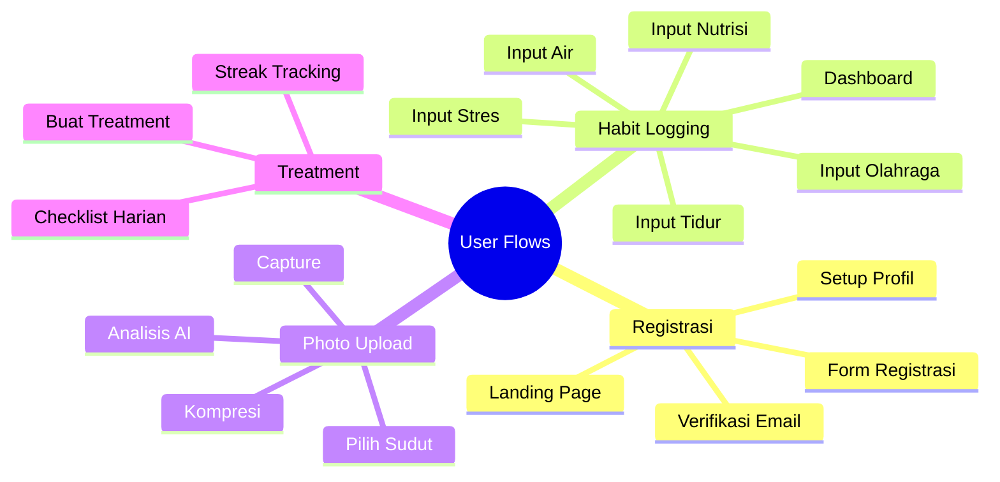
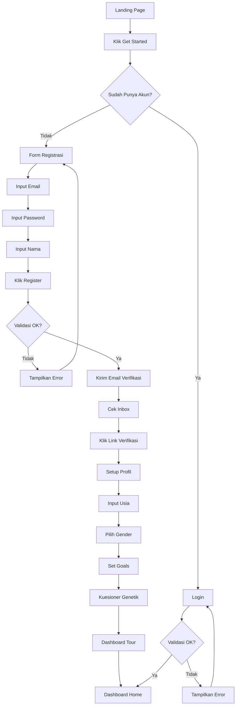
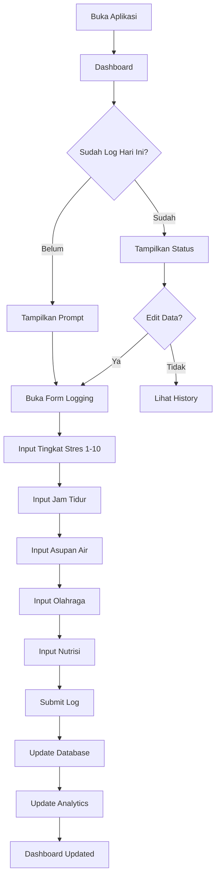
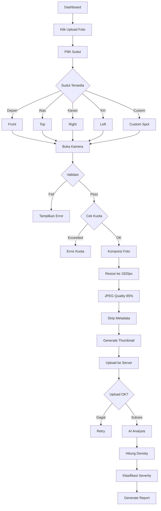
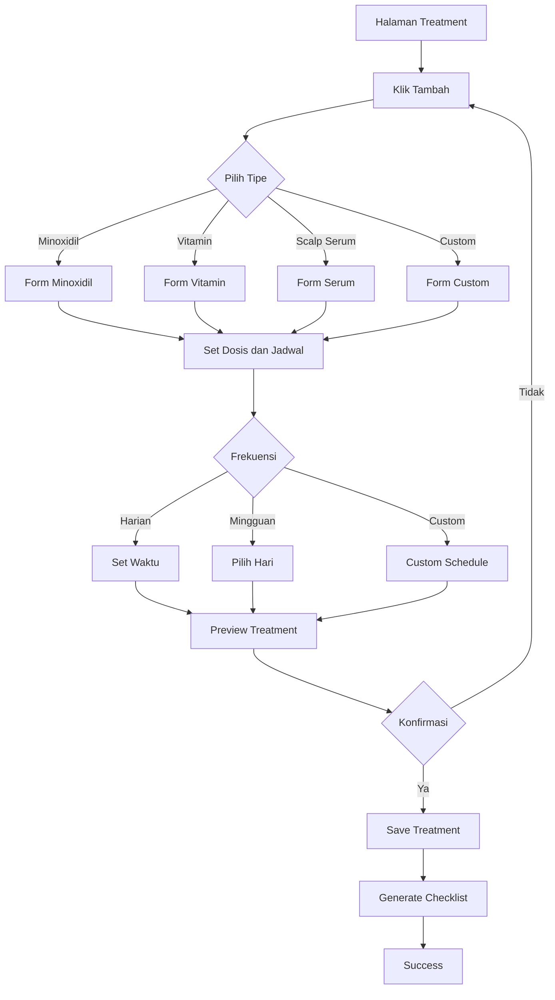
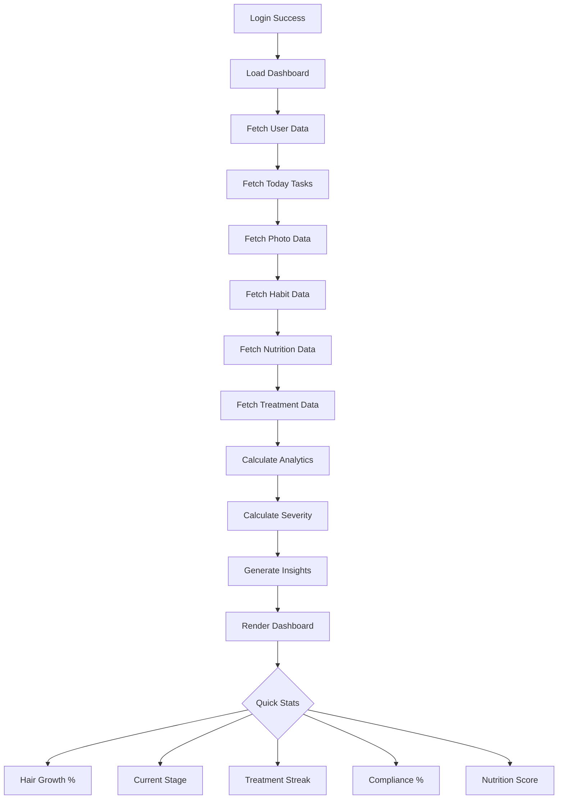
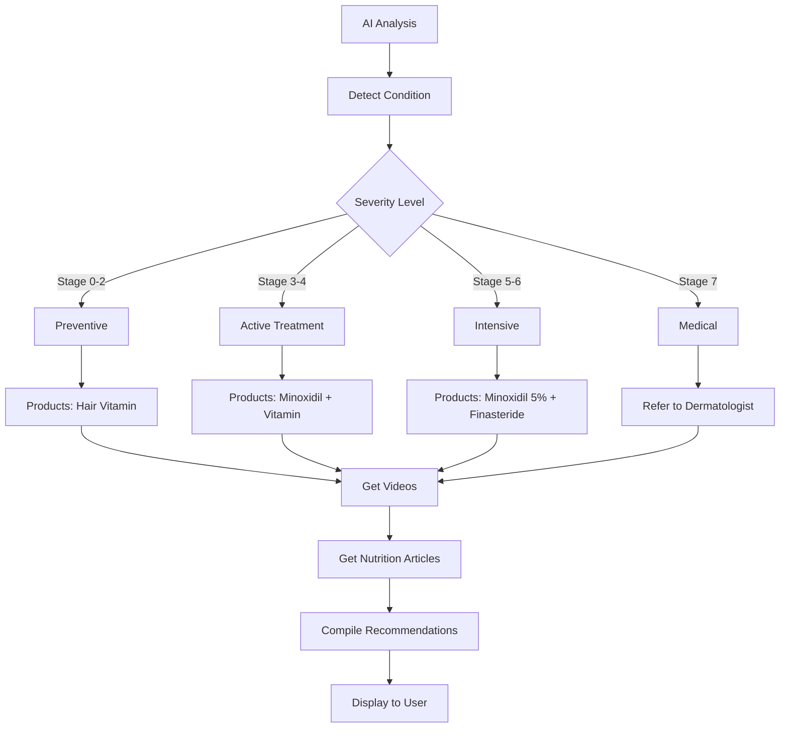
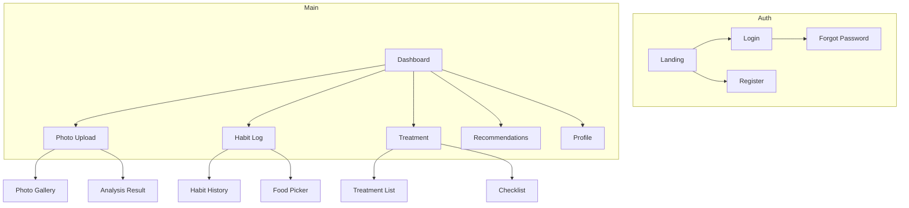
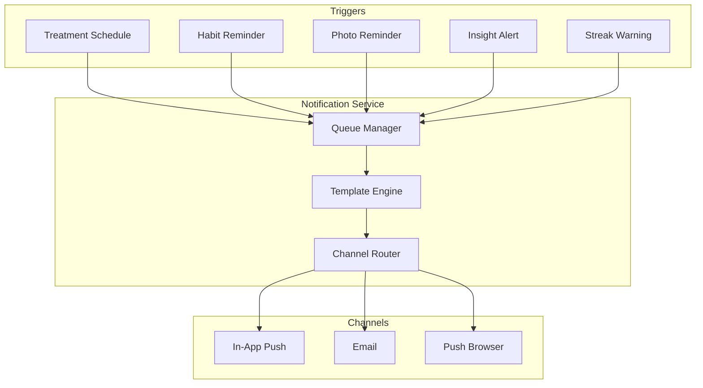

# User Flow Document

## 1. Gambaran Umum

### 1.1 Persona Pengguna

| Persona | Deskripsi | Tujuan Utama |
|---------|-----------|--------------|
| Pengguna Baru | Pengguna pertama kali | Pahami value, onboarding cepat |
| Pengguna Aktif | Pengguna rutin tracking | Logging harian, foto mingguan |
| Pengguna Analitik | Mencari insight | Lihat korelasi, tren data |
| Pengguna Perawatan | Dengan regimen perawatan | Lacak kepatuhan, streak |

### 1.2 Core User Flows



---

## 2. Flow Registrasi dan Onboarding

### 2.1 Flow Registrasi



### 2.2 Wireframe Registrasi

```text
┌─────────────────────────────────────────────────────────────┐
│                    REGISTRASI                                │
├─────────────────────────────────────────────────────────────┤
│                                                             │
│    Email                                                     │
│    ┌─────────────────────────────────────────────────────┐  │
│    │ user@example.com                                    │  │
│    └─────────────────────────────────────────────────────┘  │
│                                                             │
│    Password                                                  │
│    ┌─────────────────────────────────────────────────────┐  │
│    │ ••••••••••••                                         │  │
│    └─────────────────────────────────────────────────────┘  │
│                                                             │
│    Nama Lengkap                                              │
│    ┌─────────────────────────────────────────────────────┐  │
│    │ John Doe                                             │  │
│    └─────────────────────────────────────────────────────┘  │
│                                                             │
│    ┌─────────────────────────────────────────────────────┐  │
│    │                    BUAT AKUN                        │  │
│    └─────────────────────────────────────────────────────┘  │
│                                                             │
│    Sudah punya akun? Masuk                                   │
└─────────────────────────────────────────────────────────────┘
```

### 2.3 Komponen Form

| Field | Tipe | Placeholder | Validasi |
|-------|------|-------------|----------|
| Email | email | user@example.com | Format email valid |
| Password | password | ••••••••••• | Min 8 karakter |
| Nama Lengkap | text | John Doe | Min 3 karakter |

---

## 3. Flow Habit Logging

### 3.1 Flow Logging Harian



### 3.2 Wireframe Habit Logger

```text
┌─────────────────────────────────────────────────────────────┐
│                  LOG HABIT HARIAN                           │
│                                              [Tanggal: ▼]   │
├─────────────────────────────────────────────────────────────┤
│                                                             │
│  TINGKAT STRES                                               │
│  ┌───┐ ┌───┐ ┌───┐ ┌───┐ ┌───┐                            │
│  │ 1 │ │ 2 │ │ 3 │ │ 4 │ │ 5 │  ◄── Slider ─►            │
│  └───┘ └───┘ └───┘ └───┘ └───┘                            │
│  ┌───┐ ┌───┐ ┌───┐ ┌───┐ ┌───┐                            │
│  │ 6 │ │ 7 │ │ 8 │ │ 9 │ │10│                            │
│  └───┘ └───┘ └───┘ └───┘ └───┘                            │
│                                                             │
├─────────────────────────────────────────────────────────────┤
│  JAM TIDUR                                                   │
│  ┌─────────────────────────────────────────────────────┐    │
│  │ 7.5 jam                                         ◀▶ │    │
│  └─────────────────────────────────────────────────────┘    │
│                                                             │
├─────────────────────────────────────────────────────────────┤
│  ASUPAN AIR                                                  │
│  ┌─────────────────────────────────────────────────────┐    │
│  │ 2.5 liter                                       ◀▶ │    │
│  └─────────────────────────────────────────────────────┘    │
│                                                             │
├─────────────────────────────────────────────────────────────┤
│  OLAHRAGA                                                    │
│  [✓] Ya, saya olahraga    [ ] Tidak                         │
│                                                             │
│  Jenis: [Cardio] [Strength] [Yoga] [Lainnya]               │
│  Durasi: 30 menit ◀▶   Intensitas: [Ringan] [Sedang] [Berat]│
│                                                             │
├─────────────────────────────────────────────────────────────┤
│  NUTRISI MAKANAN                                            │
│  ┌─────────────────────────────────────────────────────┐    │
│  │           [+] Tambah Makanan                        │    │
│  └─────────────────────────────────────────────────────┘    │
│                                                             │
│  Makanan Hari Ini:                                          │
│  ┌─────────────────────────────────────────────────────┐    │
│  │ Tempe 100g          Protein: 19g      [×]           │    │
│  │ Bayam 1 mangkuk     Protein: 3g       [×]           │    │
│  │ Telur 1 butir       Protein: 6g       [×]           │    │
│  └─────────────────────────────────────────────────────┘    │
│                                                             │
│  Total: Protein 28g | Zinc 1.5mg | Iron 7.1mg              │
│                                                             │
├─────────────────────────────────────────────────────────────┤
│  ┌─────────────────────────────────────────────────────┐    │
│  │                    SIMPAN LOG                        │    │
│  └─────────────────────────────────────────────────────┘    │
└─────────────────────────────────────────────────────────────┘
```

### 3.3 Kategori Habit

| Kategori | Faktor | Tipe Input | Rentang | Dampak |
|----------|--------|------------|---------|--------|
| Mental | Tingkat Stres | Slider | 1-10 | Stress tinggi kortisol |
| Tidur | Jam Tidur | Number | 0-24 jam | Regenerasi sel |
| Hidrasi | Asupan Air | Number | 0-5 liter | Sirkulasi kulit kepala |
| Olahraga | Jenis + Durasi | Checkbox + Number | 0-180 min | Sirkulasi darah |
| Nutrisi | Makanan | Food Database | gram/mg/mcg | Komponen keratin |

### 3.4 Contoh Data Makanan

| Makanan | Porsi | Protein | Zinc | Iron | Biotin | Vit D |
|---------|-------|---------|------|------|--------|-------|
| Tempe | 100g | 19g | 1.0mg | 2.7mg | 0mcg | 0IU |
| Bayam | 180g | 3g | 0.5mg | 6.4mg | 0mcg | 0IU |
| Telur | 50g | 6g | 0.5mg | 1mg | 10mcg | 41IU |
| Salmon | 100g | 25g | 0.6mg | 0.8mg | 5mcg | 526IU |
| Almond | 28g | 6g | 0.9mg | 1mg | 1.5mcg | 0IU |

---

## 4. Flow Photo Upload dan Analisis

### 4.1 Flow Upload dengan Kompresi



### 4.2 Spesifikasi Upload

| Parameter | Nilai | Deskripsi |
|-----------|-------|-----------|
| Max File Size | 10 MB | Sebelum kompresi |
| Target Size | 500 KB - 2 MB | Setelah kompresi |
| Max Resolution | 1920px | Width/Height max |
| Min Resolution | 720p | Min untuk AI |
| Format | JPEG, PNG, WebP | Auto-convert ke JPEG |
| Quality | 85% | JPEG quality |

### 4.3 Wireframe Pilih Sudut

```text
┌─────────────────────────────────────────────────────────────┐
│                    PILIH SUDUT FOTO                         │
├─────────────────────────────────────────────────────────────┤
│                                                             │
│  Kuota: 12/25 foto | Storage: 18MB/500MB                  │
│                                                             │
├─────────────────────────────────────────────────────────────┤
│                                                             │
│  Pilih sudut foto untuk diupload:                           │
│                                                             │
│  ┌─────────────┐  ┌─────────────┐  ┌─────────────┐        │
│  │   DEPAN     │  │    ATAS     │  │   KANAN     │        │
│  │             │  │             │  │             │        │
│  │    Front    │  │     Top     │  │    Right    │        │
│  │   ✓ Done    │  │   ✓ Done    │  │   ✓ Done    │        │
│  │  75.2%      │  │  58.3%      │  │  68.1%      │        │
│  └─────────────┘  └─────────────┘  └─────────────┘        │
│                                                             │
│  ┌─────────────┐  ┌─────────────┐                          │
│  │    KIRI     │  │   CUSTOM    │                          │
│  │             │  │             │                          │
│  │    Left     │  │ Area Botak  │                          │
│  │   ✓ Done    │  │   ✓ Done    │                          │
│  │  70.5%      │  │  45.0%      │                          │
│  └─────────────┘  └─────────────┘                          │
│                                                             │
├─────────────────────────────────────────────────────────────┤
│  Progress: 5/5 sudut (100%)                                  │
│  Sisa kuota: 13 foto | 482MB storage                       │
└─────────────────────────────────────────────────────────────┘
```

### 4.4 Wireframe Hasil Analisis

```text
┌─────────────────────────────────────────────────────────────┐
│                    HASIL ANALISIS                          │
├─────────────────────────────────────────────────────────────┤
│                                                             │
│  ┌─────────────────────────────────────────────────────┐   │
│  │                                                     │   │
│  │              [Thumbnail Foto]                       │   │
│  │                                                     │   │
│  │                  62.5%                              │   │
│  │          Kepadatan Rambut                           │   │
│  │                                                     │   │
│  │   Severity: Stage 3-4 (Moderate)                    │   │
│  │   Confidence: 88%                                   │   │
│  │                                                     │   │
│  └─────────────────────────────────────────────────────┘   │
│                                                             │
│  ┌─────────────────────────────────────────────────────┐   │
│  │ INFO KOMPRESI                                        │   │
│  │                                                      │   │
│  │ Ukuran Asli: 8.0 MB                                  │   │
│  │ Ukuran Kompresi: 1.5 MB                              │   │
│  │ Penghematan: 81%                                     │   │
│  │ Resolusi: 1920 x 1440                               │   │
│  └─────────────────────────────────────────────────────┘   │
│                                                             │
│  ┌─────────────────────────────────────────────────────┐   │
│  │ REKOMENDASI                                          │   │
│  │                                                      │   │
│  │ 1. Minoxidil 5% Solution                            │   │
│  │ 2. Hair Vitamin (Biotin + Zinc)                     │   │
│  │ 3. Scalp Serum dengan Niacin                       │   │
│  │                                                      │   │
│  │ [Lihat Detail Produk]                               │   │
│  └─────────────────────────────────────────────────────┘   │
│                                                             │
│  ┌─────────────────────────────────────────────────────┐   │
│  │ PERBANDINGAN                                         │   │
│  │                                                      │   │
│  │ Sebelum: 65.0% (2 minggu lalu)                      │   │
│  │ Sekarang: 62.5% (hari ini)                          │   │
│  │ Perubahan: -2.5% ▼                                   │   │
│  └─────────────────────────────────────────────────────┘   │
│                                                             │
│  ┌──────────────────────────────────┐  ┌────────────────┐  │
│  │   Lihat Grafik Progress          │  │ Upload Lainnya │  │
│  └──────────────────────────────────┘  └────────────────┘  │
└─────────────────────────────────────────────────────────────┘
```

---

## 5. Flow Treatment Management

### 5.1 Flow Buat Treatment



### 5.2 Tipe Treatment

| Tipe | Deskripsi | Contoh Produk |
|------|-----------|---------------|
| Minoxidil | Topical solution | Minoxidil 2%, 5% |
| Finasteride | Oral medication | Finasteride 1mg |
| Hair Vitamin | Suplemen | Biotin, Zinc, Vitamin D |
| Scalp Serum | Topical serum | Niacinamide, Peptide |
| Scalp Shampoo | Shampo khusus | Ketoconazole, Oil control |
| Scalp Massage | Terapi pijat | Derma roller |
| Custom | Lainnya | Sesuai kebutuhan |

### 5.3 Wireframe Checklist Treatment

```text
┌─────────────────────────────────────────────────────────────┐
│                   CHECKLIST HARIAN                           │
│                                              [Tanggal: ▼]   │
├─────────────────────────────────────────────────────────────┤
│                                                             │
│  ┌─────────────────────────────────────────────────────┐   │
│  │ ☑ MINOXIDIL 5% - PAGI                               │   │
│  │   08:00     ✓ Selesai 08:05                          │   │
│  │   1ml applied to crown and temples                  │   │
│  └─────────────────────────────────────────────────────┘   │
│                                                             │
│  ┌─────────────────────────────────────────────────────┐   │
│  │ ○ MINOXIDIL 5% - MALAM                               │   │
│  │   20:00     Belum                                    │   │
│  │   1ml applied to crown and temples                  │   │
│  │   ┌─────────────────────────────────────────────┐   │   │
│  │   │              Tandai Selesai                 │   │   │
│  │   └─────────────────────────────────────────────┘   │   │
│  └─────────────────────────────────────────────────────┘   │
│                                                             │
│  ┌─────────────────────────────────────────────────────┐   │
│  │ ☑ HAIR VITAMIN (BIOTIN + ZINC)                      │   │
│  │   09:00     ✓ Selesai 09:15                          │   │
│  │   1 tablet setelah makan                              │   │
│  └─────────────────────────────────────────────────────┘   │
│                                                             │
│  ┌─────────────────────────────────────────────────────┐   │
│  │ ○ SCALP SERUM                                        │   │
│  │   21:00     Belum                                    │   │
│  │   Apply to scalp after minoxidil                    │   │
│  │   ┌─────────────────────────────────────────────┐   │   │
│  │   │              Tandai Selesai                 │   │   │
│  │   └─────────────────────────────────────────────┘   │   │
│  └─────────────────────────────────────────────────────┘   │
│                                                             │
├─────────────────────────────────────────────────────────────┤
│  STATISTIK HARIAN                                           │
│                                                             │
│  Penyelesaian: 2/4 (50%)     Streak: 7 hari                │
│  Kepatuhan Minggu: 85%                                       │
└─────────────────────────────────────────────────────────────┘
```

---

## 6. Flow Dashboard

### 6.1 Flow Dashboard



### 6.2 Wireframe Dashboard

```text
┌─────────────────────────────────────────────────────────────┐
│  DASHBOARD HOME                        [🔔] [Profil ▼]      │
├─────────────────────────────────────────────────────────────┤
│                                                             │
│  Selamat datang, John!                                      │
│                                                             │
├─────────────────────────────────────────────────────────────┤
│                    STATISTIK CEPAT                          │
│                                                             │
│  ┌───────────┐  ┌───────────┐  ┌───────────┐  ┌─────────┐ │
│  │ PERTUMBUH│  │ SEVERITY  │  │ STREAK    │  │ KEPATUH│ │
│  │   -2.5%   │  │ Stage 3-4 │  │  7 hari   │  │   85%   │ │
│  │  ▼ 2 mgg │  │  Moderate │  │  🔥 Aktif  │  │  Minggu  │ │
│  └───────────┘  └───────────┘  └───────────┘  └─────────┘ │
│                                                             │
├─────────────────────────────────────────────────────────────┤
│                  TREND KEPADATAN RAMBUT                     │
│                                                             │
│   80% │              ●───●───●                              │
│   70% │         ●───●                                      │
│   60% │    ●───●                                           │
│   50% │ ●──●                                               │
│       └──────────────────────────────────────────          │
│         W1    W2    W3    W4    W5                         │
│                                                             │
├─────────────────────────────────────────────────────────────┤
│                    NUTRISI HARIAN                           │
│                                                             │
│  | Nutrisi  |Aktual|Target| Status  |                       │
│  |----------|------|------|--------|                        │
│  | Protein  | 28g  | 50g  |  56%   |                        │
│  | Zinc     | 1.5mg| 11mg |  14%   |                        │
│  | Iron     | 7.1mg| 18mg |  39%   |                        │
│  | Biotin   |10mcg |30mcg |  33%   |                        │
│                                                             │
├─────────────────────────────────────────────────────────────┤
│                    TASK HARI INI                            │
│                                                             │
│  □ Log habit (stres, tidur, air, nutrisi, olahraga)        │
│  □ Selesaikan treatment malam                                │
│  □ Upload foto mingguan                                     │
│  ☑ Treatment pagi selesai                                   │
│                                                             │
├─────────────────────────────────────────────────────────────┤
│                    INSIGHT                                  │
│                                                             │
│  • Kepadatan rambut menurun 2.5% dalam 2 minggu            │
│  • Area crown memerlukan perhatian lebih                    │
│  • Asupan Zinc dan Biotin masih di bawah target             │
│                                                             │
└─────────────────────────────────────────────────────────────┘
```

---

## 7. Kategori Konten dan Rekomendasi

### 7.1 Flow Rekomendasi



### 7.2 Kategorisasi Konten

| Trigger | Product Category | Video Category | Article Category |
|---------|------------------|----------------|------------------|
| Stage 0-2 | Hair Vitamin | Prevention tips | Hair care routine |
| Stage 3-4 | Minoxidil + Vitamin | Treatment tutorials | Hair loss causes |
| Stage 5-6 | Minoxidil 5% + Finasteride | Advanced treatment | Treatment options |
| Stage 7 | PRP, Transplant | Medical procedures | Surgical options |
| Oily Scalp | Oil control shampoo | Scalp care | Sebum management |
| Dry Scalp | Moisturizing products | Hydration tips | Scalp nourishment |

---

## 8. Error States

### 8.1 Wireframe Error States

```text
┌─────────────────────────────────────────────────────────────┐
│                  ERROR KONEKSI                              │
├─────────────────────────────────────────────────────────────┤
│                                                             │
│                       ┌───────────┐                        │
│                       │    ⚠️     │                        │
│                       │   Error   │                        │
│                       └───────────┘                        │
│                                                             │
│         Tidak dapat terhubung ke server.                   │
│         Silakan periksa koneksi Anda.                      │
│                                                             │
│         ┌─────────────────────────────────────┐            │
│         │           COBA LAGI                  │            │
│         └─────────────────────────────────────┘            │
│                                                             │
└─────────────────────────────────────────────────────────────┘
```

### 8.2 Error Codes

| Code | Status | Message |
|------|--------|---------|
| 400 | Bad Request | Invalid input data |
| 401 | Unauthorized | Missing/invalid token |
| 403 | Forbidden | Insufficient permissions |
| 404 | Not Found | Resource not found |
| 429 | Quota Exceeded | Upload limit reached |
| 500 | Server Error | Internal error |

---

## 9. Navigation Structure

### 9.1 Bottom Navigation

```text
┌─────────────────────────────────────────────────────────────┐
│                      BOTTOM NAVIGATION                      │
├─────────────────────────────────────────────────────────────┤
│                                                             │
│   ┌─────────┐  ┌─────────┐  ┌─────────┐  ┌─────────┐       │
│   │    📊   │  │    📷   │  │    💊   │  │    👤   │       │
│   │  HOME   │  │  PHOTO  │  │ TREAT   │  │ PROFILE │       │
│   └─────────┘  └─────────┘  └─────────┘  └─────────┘       │
│                                                             │
│   Dashboard    Upload       Treatment    Account            │
└─────────────────────────────────────────────────────────────┘
```

### 9.2 Screen Hierarchy



---

## 9. Flow Notification dan Reminder

### 9.1 Flow Notification



### 9.2 Tipe Notifikasi

| Tipe | Trigger | Channel | Frekuensi |
|------|---------|---------|-----------|
| Treatment Reminder | Jadwal treatment | In-App, Push | Real-time |
| Habit Reminder | Belum log hari ini | In-App, Email | 10:00, 20:00 |
| Photo Reminder | Jadwal foto mingguan | Email | Mingguan |
| Streak Warning | Streak akan putus | Push | Real-time |
| Insight Alert | Insight baru tersedia | In-App | On-demand |
| Progress Update | Progress mingguan | Email | Mingguan |
| Severity Alert | Severity berubah signifikan | Email | On-demand |

### 9.3 Wireframe In-App Notification

```text
┌─────────────────────────────────────────────────────────────┐
│                    NOTIFICATIONS                          │
│                                                 [Tandai Semua Dibaca] │
├─────────────────────────────────────────────────────────────┤
│                                                             │
│  Hari Ini                                                    │
│                                                             │
│  ┌─────────────────────────────────────────────────────┐   │
│  │ 💊 TREATMENT REMINDER                    08:00      │   │
│  │                                                      │   │
│  │ Waktunya Minoxidil 5% - Pagi                       │   │
│  │ Jangan lupa treatment Anda!                         │   │
│  │                                                      │   │
│  │ [Tandai Selesai]  [Dismiss]                        │   │
│  └─────────────────────────────────────────────────────┘   │
│                                                             │
│  ┌─────────────────────────────────────────────────────┐   │
│  │ 📊 HABIT REMINDER                        10:00      │   │
│  │                                                      │   │
│  │ Sudahkah Anda log habit hari ini?                  │   │
│  │ Jangan lupa catat stres, tidur, dan nutrisi!      │   │
│  │                                                      │   │
│  │ [Log Sekarang]  [Nanti]                            │   │
│  └─────────────────────────────────────────────────────┘   │
│                                                             │
│  ┌─────────────────────────────────────────────────────┐   │
│  │ 🔥 STREAK WARNING                        19:00      │   │
│  │                                                      │   │
│  │ Streak Anda terancam putus!                        │   │
│  │ Saat ini: 7 hari. Log sekarang untuk pertahankan! │   │
│  │                                                      │   │
│  │ [Log Habit]  [Dismiss]                              │   │
│  └─────────────────────────────────────────────────────┘   │
│                                                             │
│  Kemarin                                                    │
│                                                             │
│  ┌─────────────────────────────────────────────────────┐   │
│  │ 📈 PROGRESS UPDATE                      Minggu      │   │
│  │                                                      │   │
│  │ Progress mingguan Anda tersedia!                   │   │
│  │ Kepadatan: -2.5%, Streak: 7 hari                   │   │
│  │                                                      │   │
│  │ [Lihat Progress]  ✓ Dibaca                        │   │
│  └─────────────────────────────────────────────────────┘   │
│                                                             │
└─────────────────────────────────────────────────────────────┘
```

### 9.4 Wireframe Notification Preferences

```text
┌─────────────────────────────────────────────────────────────┐
│                 PENGATURAN NOTIFIKASI                       │
├─────────────────────────────────────────────────────────────┤
│                                                             │
│  TREATMENT REMINDER                                          │
│  ┌─────────────────────────────────────────────────────┐    │
│  │ [✓] Aktif                                          │    │
│  │ Waktu pengingat: [08:00 ▼]                        │    │
│  └─────────────────────────────────────────────────────┘    │
│                                                             │
│  HABIT REMINDER                                              │
│  ┌─────────────────────────────────────────────────────┐    │
│  │ [✓] Aktif                                          │    │
│  │ Waktu pagi: [09:00 ▼]                              │    │
│  │ Waktu malam: [20:00 ▼]                             │    │
│  └─────────────────────────────────────────────────────┘    │
│                                                             │
│  PHOTO REMINDER                                              │
│  ┌─────────────────────────────────────────────────────┐    │
│  │ [✓] Aktif                                          │    │
│  │ Hari: [Minggu ▼]                                   │    │
│  │ Waktu: [10:00 ▼]                                   │    │
│  └─────────────────────────────────────────────────────┘    │
│                                                             │
│  QUIET HOURS                                                 │
│  ┌─────────────────────────────────────────────────────┐    │
│  │ [✓] Aktif                                          │    │
│  │ Dari jam: [22:00 ▼]                                │    │
│  │ Sampai jam: [07:00 ▼]                              │    │
│  └─────────────────────────────────────────────────────┘    │
│                                                             │
│  CHANNEL                                                     │
│  ┌─────────────────────────────────────────────────────┐    │
│  │ [✓] In-App Push                                    │    │
│  │ [✓] Email                                          │    │
│  │ [✓] Push Browser                                   │    │
│  │ [ ] SMS (Coming Soon)                              │    │
│  └─────────────────────────────────────────────────────┘    │
│                                                             │
│  ┌─────────────────────────────────────────────────────┐    │
│  │              SIMPAN PENGATURAN                       │    │
│  └─────────────────────────────────────────────────────┘    │
│                                                             │
└─────────────────────────────────────────────────────────────┘
```

### 9.5 Email Template Examples

#### Treatment Reminder Email

```text
Subject: Pengingat Treatment: Minoxidil 5%

━━━━━━━━━━━━━━━━━━━━━━━━━━━━━━━━━━━━━━━━
SCALP ANALYTICS
━━━━━━━━━━━━━━━━━━━━━━━━━━━━━━━━━━━━━━━━

Hai John,

Ini adalah pengingat untuk treatment Anda:

Treatment: Minoxidil 5%
Waktu: 08:00
Dosis: 1 ml

Jangan lupa untuk mengaplikasikan treatment Anda sesuai jadwal!

[Mark as Done]  [Snooze]

━━━━━━━━━━━━━━━━━━━━━━━━━━━━━━━━━━━━━━━━
Streak Anda saat ini: 7 hari
Pertahankan streak Anda!

Lihat Dashboard: https://app.scalpanalytics.com/dashboard
━━━━━━━━━━━━━━━━━━━━━━━━━━━━━━━━━━━━━━━━

Jika Anda tidak ingin menerima notifikasi ini, ubah di:
https://app.scalpanalytics.com/settings/notifications
```

#### Streak Warning Email

```text
Subject: 🔥 Streak Anda Terancam Putus!

━━━━━━━━━━━━━━━━━━━━━━━━━━━━━━━━━━━━━━━━
SCALP ANALYTICS
━━━━━━━━━━━━━━━━━━━━━━━━━━━━━━━━━━━━━━━━

Hai John,

Streak treatment Anda terancam putus!

Streak saat ini: 7 hari
Berakhir jika: Tidak ada aktivitas dalam 24 jam

Jangan biarkan streak Anda hilang!
Logging harian adalah kunci keberhasilan treatment.

[Log Sekarang]

━━━━━━━━━━━━━━━━━━━━━━━━━━━━━━━━━━━━━━━━
Tips: Log habit Anda sebelum tidur untuk mempertahankan streak!

Lihat Dashboard: https://app.scalpanalytics.com/dashboard
━━━━━━━━━━━━━━━━━━━━━━━━━━━━━━━━━━━━━━━━
```

---

## 10. Key Success Metrics

| Metrik | Target | Pengukuran |
|--------|--------|-------------|
| Penyelesaian Hari 1 | 80% | Complete onboarding |
| Retensi Minggu 1 | 60% | Return after 7 days |
| Kepatuhan Foto | 70% | Weekly photo uploads |
| Kepatuhan Treatment | 70% | Daily completion |
| Kepatuhan Nutrisi | 60% | Daily food logging |
| Engagement Insight | 50% | View correlation data |
| Click Rate Rekomendasi | 30% | Click on products/videos |