# User Flow Document

---

## 1. Gambaran Umum

### 1.1 Persona Pengguna

| Persona | Deskripsi | Tujuan Utama |
|---------|-----------|--------------|
| Pengguna Baru | Pengguna pertama kali | Pahami value, onboarding cepat |
| Pengguna Aktif | Pengguna rutin tracking | Logging harian, foto mingguan |
| Pengguna Analitik | Mencari insight | Lihat korelasi, tren data |
| Pengguna Perawatan | Dengan regimen perawatan | Lacak kepatuhan, streak |

### 1.2 Core User Flows

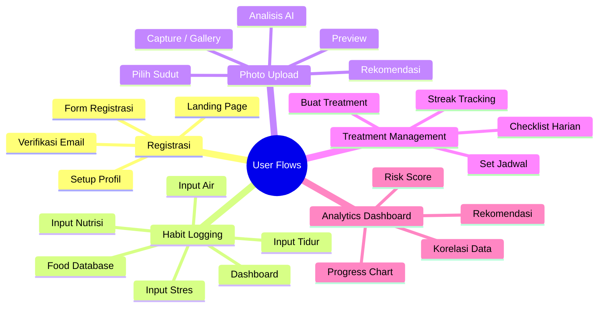

---

## 2. Flow Registrasi dan Onboarding

### 2.1 Flow Registrasi

### 2.2 Wireframe Registrasi

#### Layar Registrasi

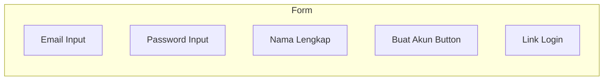

| Field | Tipe | Placeholder | Validasi |
|-------|------|-------------|----------|
| Email | email | user@example.com | Format email valid |
| Password | password | ••••••••••| Min 8 karakter |
| Nama Lengkap | text | John Doe | Min 3 karakter |

#### Layar Setup Profil

| Field | Tipe | Options |
|-------|------|---------|
| Usia | dropdown | 18-65 |
| Tipe Rambut | radio button | Lurus, Keriting, Bergelombang |
| Tujuan | checkbox | Cegah kebotakan, Tingkatkan pertumbuhan, Pertahankan kondisi |

---

## 3. Flow Habit Logging

### 3.1 Flow Logging Harian

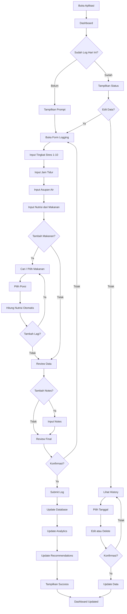

### 3.2 Flow Nutrisi Tracking

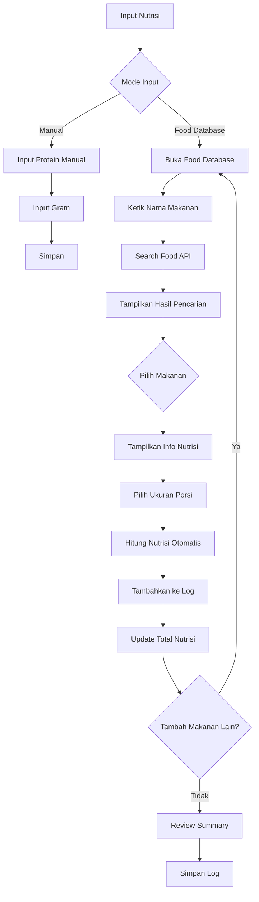

### 3.3 Wireframe Form Habit

#### Layar Utama Log Habit

| Section | Komponen | Tipe |
|---------|----------|------|
| Header | Title + Date | Text |
| Stres | Rating Scale | Radio/Slider |
| Tidur | Slider | Range 0-24 |
| Air | Slider | Range 0-5L |
| Nutrisi | Food Picker | Button + List |
| Notes | Textarea | Text |
| Action | Submit Button | Button |

#### Layar Food Database Picker

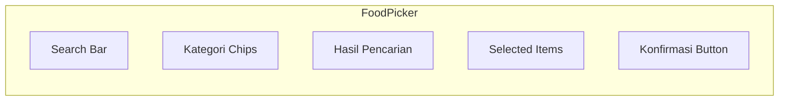

| Komponen | Deskripsi |
|----------|-----------|
| Search Bar | Input untuk cari makanan |
| Kategori Chips | Filter: Protein, Sayuran, Buah, dll |
| Hasil Pencarian | List makanan dengan nutrisi info |
| Selected Items | Daftar makanan yang dipilih |
| Konfirmasi | Button untuk menambahkan ke log |

#### Contoh Data Makanan

| Makanan | Porsi | Protein | Zinc | Iron | Biotin | Vitamin D |
|---------|-------|---------|------|------|--------|------------|
| Tempe | 100g | 19g | 1.0mg | 2.7mg | 0mcg | 0IU |
| Bayam | 1 mangkuk | 3g | 0.5mg | 6.4mg | 0mcg | 0IU |
| Telur | 1 butir | 6g | 0.5mg | 1mg | 10mcg | 41IU |
| Salmon | 100g | 25g | 0.6mg | 0.8mg | 5mcg | 526IU |
| Almond | 28g | 6g | 0.9mg | 1mg | 1.5mcg | 0IU |
| Buncis | 100g | 9g | 1.5mg | 3mg | 0mcg | 0IU |

---

## 4. Flow Photo Upload dan Analisis

### 4.1 Flow Upload Foto

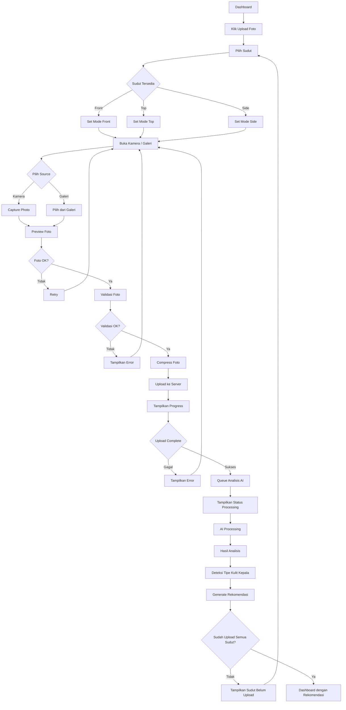

### 4.2 Wireframe Hasil Analisis

#### Layar Hasil Analisis

| Komponen | Data | Deskripsi |
|----------|------|-----------|
| Thumbnail | Image | Preview foto yang diupload |
| Hair Density | Percentage | Kepadatan rambut (0-100%) |
| Scalp Type | Label | Tipe kulit kepala |
| Confidence | Percentage | Akurasi prediksi AI |
| Recommendations | List | Produk yang disarankan |
| Comparison | Diff | Perbandingan dengan foto sebelumnya |

#### Layar Pilih Sudut Foto

| Sudut | Status | Preview |
|-------|--------|---------|
| Front | Belum/Sudah | Thumbnail jika sudah |
| Top | Belum/Sudah | Thumbnail jika sudah |
| Side | Belum/Sudah | Thumbnail jika sudah |

---

## 5. Flow Treatment Management

### 5.1 Flow Buat Treatment

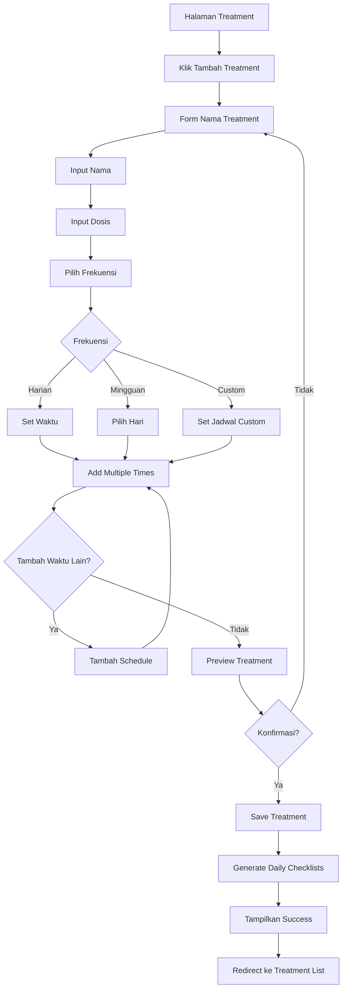

### 5.2 Flow Checklist Harian

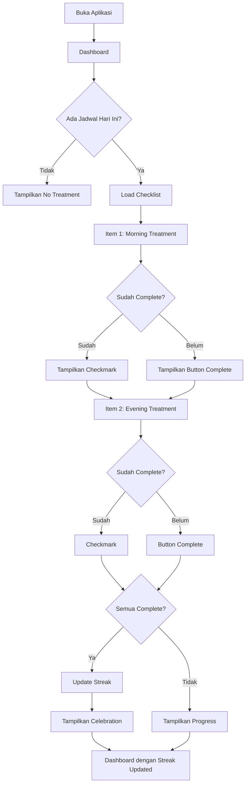

### 5.3 Wireframe Checklist Treatment

#### Layar Checklist

| Komponen | Tipe | Deskripsi |
|----------|------|-----------|
| Treatment Name | Text | Nama treatment |
| Schedule Time | Time | Waktu jadwal |
| Status | Checkbox | Selesai/belum |
| Complete Button | Button | Tandai selesai |
| Progress Bar | Visual | Persentase penyelesaian |
| Streak Badge | Badge | Hari berturut-turut |

#### Layar Tambah Treatment

| Field | Tipe | Options |
|-------|------|---------|
| Nama Treatment | text | Minoxidil 5% |
| Dosis | text | 1 ml |
| Frekuensi | radio | Harian, Mingguan, Custom |
| Jadwal | checkbox | Sen-Sen |
| Waktu | time picker | 08:00 |

---

## 6. Flow Dashboard dan Analytics

### 6.1 Flow Dashboard

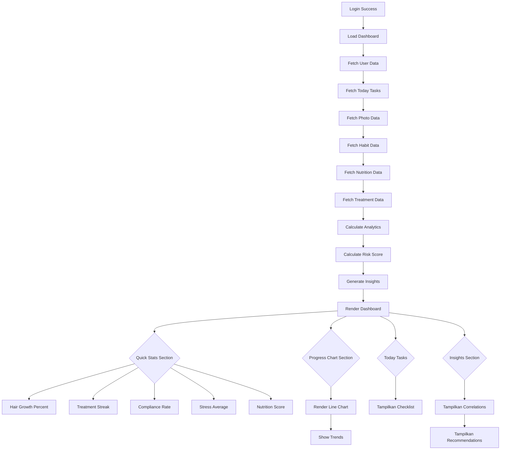

### 6.2 Wireframe Dashboard

#### Layar Dashboard Utama

| Section | Komponen | Data |
|---------|----------|------|
| Header | Welcome + Avatar | Nama pengguna |
| Quick Stats | 4 Cards | Growth, Streak, Compliance, Risk |
| Progress Chart | Line Chart | Trend kepadatan |
| Today Tasks | Checklist | Task harian |
| Insights | Cards | AI insights |
| Recommendations | List | Produk, video, artikel |

#### Layar Statistik Detail

| Tab | Content |
|-----|---------|
| Minggu | Data 7 hari terakhir |
| Bulan | Data 30 hari terakhir |
| 3 Bulan | Data 90 hari terakhir |
| 6 Bulan | Data 180 hari terakhir |

| Chart | Data Source |
|-------|-------------|
| Hair Density | Photo analysis results |
| Stress Correlation | Habit logs |
| Nutrition Intake | Food logs |
| Risk Score Breakdown | Genetic + Lifestyle |

---

## 7. Flow Konten dan Rekomendasi

### 7.1 Flow Rekomendasi

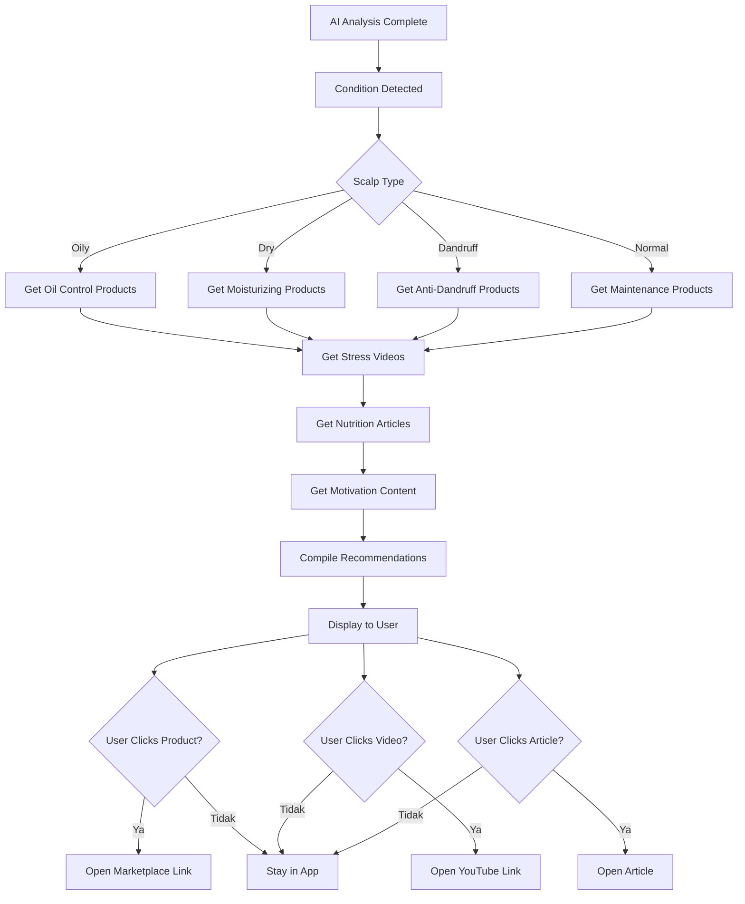

### 7.2 Kategorisasi Konten

| Trigger | Product Category | Video Category | Article Category |
|---------|------------------|----------------|------------------|
| Hair Loss | Minoxidil, Supplements | Treatment tutorials | Hair care tips |
| Oily Scalp | Oil control shampoo | Scalp care videos | Sebum management |
| Dry Scalp | Moisturizing products | Hydration tips | Scalp nourishment |
| High Stress | Relaxation products | Stress management | Mental health |
| Low Nutrition | Supplements | Diet tips | Nutrition guide |

---

## 8. Flow Komunitas (Phase 2)

### 8.1 Flow Sharing

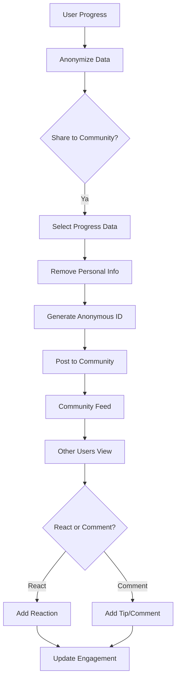

---

## 9. Error States

### 9.1 Error Handling

| Error Code | Message | Action |
|------------|---------|--------|
| 400 | Bad Request | Tampilkan validation error |
| 401 | Unauthorized | Redirect ke login |
| 403 | Forbidden | Tampilkan access denied |
| 404 | Not Found | Tampilkan empty state |
| 500 | Server Error | Tampilkan retry button |
| NETWORK | Connection Failed | Tampilkan offline mode |

### 9.2 Empty State

| Condition | Message | CTA |
|-----------|---------|-----|
| No Photos | Belum ada foto yang diupload | Upload Foto |
| No Treatments | Belum ada treatment | Tambah Treatment |
| No Logs | Belum ada log hari ini | Log Habit |
| No History | Belum ada history | Start Tracking |

### 9.3 Loading State

| Loading | Progress | Message |
|---------|----------|---------|
| Photo Upload | 0-100% | Mengupload foto... |
| AI Analysis | Indeterminate | Menganalisis foto... |
| Data Sync | Indeterminate | Menyinkronkan data... |
| Dashboard Load | Indeterminate | Memuat dashboard... |

---

## 10. Navigation Structure

### 10.1 Bottom Navigation

| Tab | Icon | Label | Description |
|-----|------|-------|-------------|
| Home | Bar Chart | Dashboard | Statistik, task, insight |
| Photo | Camera | Upload | Upload dan analisis foto |
| Treatment | Pill | Treatment | Checklist dan jadwal |
| Profile | User | Profile | Pengaturan akun |

### 10.2 Screen Hierarchy

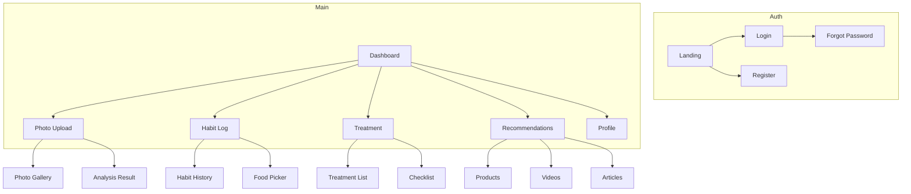

### 10.3 Header Navigation

| Page | Back Button | Actions |
|------|-------------|---------|
| Dashboard | No | Notification, Settings |
| Photo Upload | Yes | Gallery |
| Treatment | Yes | Add Treatment |
| Profile | No | Edit, Logout |
| Settings | Yes | Save |

---

## 11. Key Success Metrics

| Metrik | Target | Pengukuran |
|--------|--------|-------------|
| Penyelesaian Hari 1 | 80% | Complete onboarding |
| Retensi Minggu 1 | 60% | Return after 7 days |
| Kepatuhan Foto | 70% | Weekly photo uploads |
| Kepatuhan Treatment | 70% | Daily completion |
| Engagement Insight | 50% | View correlation data |
| Click Rate Rekomendasi | 30% | Click on products/videos |
| Nutrition Logging | 60% | Daily food logging |

---

## 12. Food Database Specification

### 12.1 Data Source

| Source | Coverage | Update Frequency |
|--------|----------|-------------------|
| USDA Food Database | Global | Monthly |
| Indonesian Food Data | Local | Quarterly |
| User Submissions | Community | Real-time |

### 12.2 Nutrient Categories

| Kategori | Nutrisi | Satuan |
|----------|---------|--------|
| Macro | Protein | gram |
| Macro | Karbohidrat | gram |
| Macro | Lemak | gram |
| Micro | Zinc | mg |
| Micro | Iron | mg |
| Micro | Biotin | mcg |
| Micro | Vitamin D | IU |
| Micro | Vitamin B12 | mcg |
| Micro | Vitamin E | mg |
| Hydration | Water | ml |

### 12.3 Portion Sizes

| Makanan | Porsi Standar | Gram |
|---------|---------------|------|
| Tempe | 1 potong | 100g |
| Bayam | 1 mangkuk | 180g |
| Telur | 1 butir | 50g |
| Nasi | 1 centong | 150g |
| Ayam | 1 potong | 100g |
| Ikan | 1 potong | 100g |

---

## 13. Future Enhancements

### 13.1 Phase 2 Features

| Feature | Description | Priority |
|---------|-------------|----------|
| Community Sharing | Share progress anonymously | High |
| Nutrition AI | Smart food recognition from photo | Medium |
| Wearable Integration | Sync with fitness trackers | Medium |
| Teleconsultation | Chat with dermatologist | Low |

### 13.2 Phase 3 Features

| Feature | Description | Priority |
|---------|-------------|----------|
| Genetic Test Integration | Import DNA test results | High |
| Marketplace | Buy recommended products | Medium |
| Gamification | Points and achievements | Medium |
| Family Profiles | Multiple user profiles | Low |